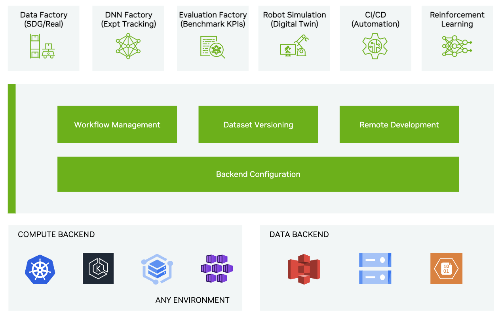

<!--
SPDX-FileCopyrightText: Copyright (c) 2025 NVIDIA CORPORATION & AFFILIATES. All rights reserved.

Licensed under the Apache License, Version 2.0 (the "License");
you may not use this file except in compliance with the License.
You may obtain a copy of the License at

http://www.apache.org/licenses/LICENSE-2.0

Unless required by applicable law or agreed to in writing, software
distributed under the License is distributed on an "AS IS" BASIS,
WITHOUT WARRANTIES OR CONDITIONS OF ANY KIND, either express or implied.
See the License for the specific language governing permissions and
limitations under the License.

SPDX-License-Identifier: Apache-2.0
-->

# Welcome to NVIDIA OSMO

OSMO is an open framework for end-to-end robotics development scaled across heterogenous compute​ nodes.

OSMO enables robotics developers to scale the AI development seamlessly from PC or workstations to large sized compute clusters in the cloud

## What's new​

* Available Now as Open-Source on Github​
* Run OSMO locally before scaling to the cloud​
​
## Key benefits​

* Unify simultaneous execution across diverse compute nodes specialized for AI model training, simulation or physical AI runtime.​
* Simple zero-code YAML based workflow configuration scalable with custom build systems or AI agents​
* Connect any Kubernetes compute backend ​
* Integrate with to your existing services with open standards - identity provider, container registries and storage ​
* Deploy in air-gapped environments

## Try OSMO

Deploy OSMO on your laptop or any workstation with a [Quick Start Guide](QUICK_START.md).

## Deploy on Cloud

Follow these steps for cloud deployment

* Create required resources in the cloud for hosting OSMO using Terraform

  * [AWS](deployments/terraform/aws/example/README.md)
  * [Azure](deployments/terraform/azure/example/README.md)

* Deploy and configure OSMO using our [Deployment Guide](https://nvidia.github.io/OSMO/deployment_guide)

## Documentation

If you are an AI / ML /robotics developer, follow our [User Guide](https://nvidia.github.io/OSMO/user_guide) to run OSMO workflows

## Roadmap
### Short term (Q1 2026)

- **Overhaul authn/authz**
  - Remove keycloak and allow OSMO to talk to Oauth 2.0 providers directly
  - Verify OSMO works with many populat Oauth 2.0 providers (Azure AD, etc.)
  - Allow OSMO to manage groups, group-role mapping and group-user mapping (ie `osmo group ...` CLIs)
  - Allow credentials to be managed at the `pool` level instead of at the `user` level.
  - Simplify Cookies used by OSMO in the login process

- **Easy cloud deployment**
  - Support easy deployment of OSMO in Azure with a Microsoft Marketplace App
  - Support easy deployment of OSMO in AWS with an AWS Marketplace App

- **Cloud provider integration**
  - Integrate with IAM for Azure/AWS
  - Don't require users to provide registry/data credentials when running in the same cloud

### Long term (2026+)

- Python based workflows
- Transparent, cluster-local data caching
- Hierarchical pools/teams for more robust resource management
- Support dataset storage in filesystems (Lustre, NFS, etc) as well as object storage
- Multi-backend scheduling: Allow OSMO to automatically select a pool/backend to run workflows on based on usage.
- Time based fair-share scheduling
- Allow groups of running workflows to be dynamically increases/decreased in size while it runs

## 🤝 Support

For support and questions:

* Review our documentation at the links above
* Create issues on Github for support
