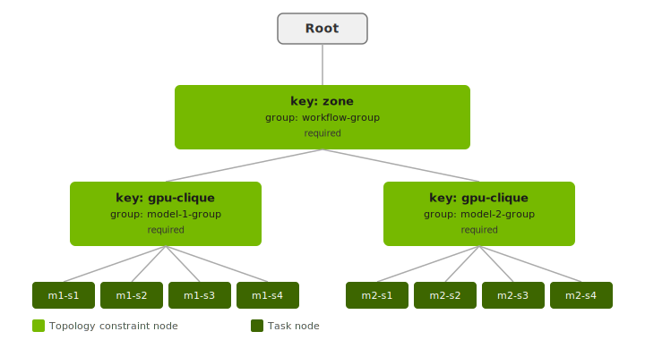
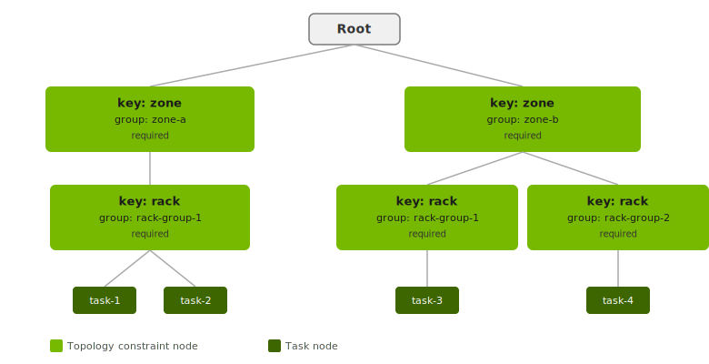

..
  SPDX-FileCopyrightText: Copyright (c) 2026 NVIDIA CORPORATION & AFFILIATES. All rights reserved.

  Licensed under the Apache License, Version 2.0 (the "License");
  you may not use this file except in compliance with the License.
  You may obtain a copy of the License at

  http://www.apache.org/licenses/LICENSE-2.0

  Unless required by applicable law or agreed to in writing, software
  distributed under the License is distributed on an "AS IS" BASIS,
  WITHOUT WARRANTIES OR CONDITIONS OF ANY KIND, either express or implied.
  See the License for the specific language governing permissions and
  limitations under the License.

  SPDX-License-Identifier: Apache-2.0

.. _concepts_topology:

===========================
Topology-Aware Scheduling
===========================

Overview
--------

Topology-aware scheduling ensures that tasks requiring high-bandwidth or low-latency
communication are placed on nodes that are physically co-located—such as the same NVLink
rack, spine switch, or availability zone.

This is critical for performance-sensitive workloads like multi-node NVLink training, where
all shards of a model must communicate with each other at full NVLink bandwidth. Without
topology-aware scheduling, the scheduler may place tasks on nodes in different racks, causing
a drop in cross-node communication performance as NCCL reverts to a slower protocol.

.. note::

  Topology-aware scheduling is only available on pools with topology keys configured.
  Contact your OSMO administrator to confirm which topology keys are available for your pool.

Topology Requirements
---------------------

Each entry in the ``topology`` list of a resource spec has three fields:

.. list-table::
  :header-rows: 1
  :widths: 35 15 150

  * - **Field**
    - **Default**
    - **Description**
  * - ``key``
    - *(required)*
    - The topology level to constrain. Must match one of the keys configured in the pool
      (e.g., ``rack``, ``zone``, ``gpu-clique``). Keys represent levels of physical hierarchy
      in the cluster, ordered from coarsest to finest
      (e.g., ``zone`` → ``spine`` → ``rack`` → ``gpu-clique``).
  * - ``group``
    - ``default``
    - A name that groups tasks which must share the same physical location at the given
      topology level. Tasks sharing the same ``key`` and ``group`` will be co-located.
      Tasks with different ``group`` values for the same ``key`` may land on separate
      physical units (e.g., separate racks).
  * - ``requirementType``
    - ``required``
    - Controls whether the constraint is hard or soft. ``required`` means the workflow will
      not be scheduled unless the constraint can be satisfied. ``preferred`` means OSMO will
      attempt to satisfy the constraint but will still schedule the workflow if it cannot.

.. important::

  All tasks in a workflow that specify topology requirements must use the **same set of
  keys**. Mixing different key sets across tasks (e.g., one task with ``zone`` + ``rack``
  and another with only ``zone``) is not allowed and will be rejected at submission time.

How They Work Together
~~~~~~~~~~~~~~~~~~~~~~

The three fields combine to form a constraint tree. Each task is a leaf node. Middle nodes
represent co-location constraints at a given topology level—tasks in the same subtree must
land on the same physical unit at that level. Coarser constraints sit higher in the tree;
finer constraints are lower.

The following example uses two topology levels (``zone`` and ``gpu-clique``). The two model
instances each have their own ``gpu-clique`` group, but both share a single ``zone`` group,
so the whole workflow lands in one zone while the two model instances can sit on separate
racks.

.. code-block:: yaml

  resources:
    model-1:
      topology:
      - key: zone
        group: workflow-group
      - key: gpu-clique
        group: model-1-group
    model-2:
      topology:
      - key: zone
        group: workflow-group
      - key: gpu-clique
        group: model-2-group

.. figure:: topology_tree.svg
  :align: center
  :width: 90%
  :class: transparent-bg no-scaled-link
  :alt: Topology constraint tree showing zone and gpu-clique levels with task leaf nodes

.. seealso::

  To add topology requirements to your workflow spec, see :ref:`workflow_spec_resources`.

Examples
--------

The following examples assume a pool with ``zone``, ``spine``, ``rack``, and ``gpu-clique``
topology keys configured by the administrator.

Single NVL72 Rack
~~~~~~~~~~~~~~~~~

A 4-task tensor-parallel training workflow where all shards must communicate via NVLink and
must therefore be scheduled on the same ``gpu-clique``.

.. note::

  To properly use multi-node NVLink, confirm with your OSMO admin that the pool is
  configured to enable NVLink.

.. code-block:: yaml

  workflow:
    name: single-nvl72-rack
    groups:
    - name: group1
      tasks:
      - name: model1-shard1
        lead: true
        image: nvcr.io/nvidia/pytorch:24.03-py3
        ...
      - name: model1-shard2
        image: nvcr.io/nvidia/pytorch:24.03-py3
        ...
      - name: model1-shard3
        image: nvcr.io/nvidia/pytorch:24.03-py3
        ...
      - name: model1-shard4
        image: nvcr.io/nvidia/pytorch:24.03-py3
        ...
  resources:
    default:
      gpu: 8
      topology:
      - key: gpu-clique

.. figure:: topology_tree_uc1.svg
  :align: center
  :width: 75%
  :class: transparent-bg no-scaled-link
  :alt: Topology constraint tree for single NVL72 rack use case

Because all tasks share the same resource spec and ``group`` defaults to ``default``, they
will all be required to land on the same ``gpu-clique``.

Multiple NVL72 Racks
~~~~~~~~~~~~~~~~~~~~

An 8-task workflow with 2× data parallel × 4× tensor parallel. Each model instance's shards
must share a ``gpu-clique``, but the two model instances can be placed on separate racks.

.. code-block:: yaml

  workflow:
    name: multiple-nvl72-racks
    groups:
    - name: group1
      tasks:
      - name: model1-shard1
        resource: model-1
        lead: true
        image: nvcr.io/nvidia/pytorch:24.03-py3
        ...
      - name: model1-shard2
        resource: model-1
        image: nvcr.io/nvidia/pytorch:24.03-py3
        ...
      - name: model1-shard3
        resource: model-1
        image: nvcr.io/nvidia/pytorch:24.03-py3
        ...
      - name: model1-shard4
        resource: model-1
        image: nvcr.io/nvidia/pytorch:24.03-py3
        ...
      - name: model2-shard1
        resource: model-2
        image: nvcr.io/nvidia/pytorch:24.03-py3
        ...
      - name: model2-shard2
        resource: model-2
        image: nvcr.io/nvidia/pytorch:24.03-py3
        ...
      - name: model2-shard3
        resource: model-2
        image: nvcr.io/nvidia/pytorch:24.03-py3
        ...
      - name: model2-shard4
        resource: model-2
        image: nvcr.io/nvidia/pytorch:24.03-py3
        ...
  resources:
    model-1:
      gpu: 8
      topology:
      - key: gpu-clique
        group: model-1-group
    model-2:
      gpu: 8
      topology:
      - key: gpu-clique
        group: model-2-group

.. figure:: topology_tree_uc2.svg
  :align: center
  :width: 95%
  :class: transparent-bg no-scaled-link
  :alt: Topology constraint tree for multiple NVL72 racks use case

By assigning different ``group`` names (``model-1-group`` and ``model-2-group``), the
scheduler co-locates each model instance's shards on one ``gpu-clique`` while allowing the
two model instances to land on different racks.

Multiple NVL72 Racks in Same Zone
~~~~~~~~~~~~~~~~~~~~~~~~~~~~~~~~~~

Extends the previous example by additionally requiring the entire workflow to land in the
same availability zone, for example when cross-zone latency would degrade data-parallel
communication between model instances.

.. code-block:: yaml

  workflow:
    name: multiple-nvl72-same-zone
    groups:
    - name: group1
      tasks:
      - name: model1-shard1
        resource: model-1
        lead: true
        image: nvcr.io/nvidia/pytorch:24.03-py3
        ...
      - name: model1-shard2
        resource: model-1
        image: nvcr.io/nvidia/pytorch:24.03-py3
        ...
      - name: model1-shard3
        resource: model-1
        image: nvcr.io/nvidia/pytorch:24.03-py3
        ...
      - name: model1-shard4
        resource: model-1
        image: nvcr.io/nvidia/pytorch:24.03-py3
        ...
      - name: model2-shard1
        resource: model-2
        image: nvcr.io/nvidia/pytorch:24.03-py3
        ...
      - name: model2-shard2
        resource: model-2
        image: nvcr.io/nvidia/pytorch:24.03-py3
        ...
      - name: model2-shard3
        resource: model-2
        image: nvcr.io/nvidia/pytorch:24.03-py3
        ...
      - name: model2-shard4
        resource: model-2
        image: nvcr.io/nvidia/pytorch:24.03-py3
        ...
  resources:
    model-1:
      gpu: 8
      topology:
      - key: gpu-clique
        group: model-1-group
      - key: zone
        group: workflow-group
    model-2:
      gpu: 8
      topology:
      - key: gpu-clique
        group: model-2-group
      - key: zone
        group: workflow-group

The ``gpu-clique`` requirements keep each model instance's shards on the same rack. The
shared ``zone`` requirement with ``group: workflow-group`` ensures both model instances are
placed in the same availability zone.

Best-Effort Topology
~~~~~~~~~~~~~~~~~~~~

An 8-task workflow on a cluster with InfiniBand but without NVLink. Co-locating tasks on
the same rack or spine still improves performance, but the workflow should run even if the
constraints cannot be met.

.. code-block:: yaml

  workflow:
    name: best-effort-topology
    groups:
    - name: group1
      tasks:
      - name: model1-shard1
        resource: model-1
        lead: true
        image: nvcr.io/nvidia/pytorch:24.03-py3
        ...
      - name: model1-shard2
        resource: model-1
        image: nvcr.io/nvidia/pytorch:24.03-py3
        ...
      - name: model1-shard3
        resource: model-1
        image: nvcr.io/nvidia/pytorch:24.03-py3
        ...
      - name: model1-shard4
        resource: model-1
        image: nvcr.io/nvidia/pytorch:24.03-py3
        ...
      - name: model2-shard1
        resource: model-2
        image: nvcr.io/nvidia/pytorch:24.03-py3
        ...
      - name: model2-shard2
        resource: model-2
        image: nvcr.io/nvidia/pytorch:24.03-py3
        ...
      - name: model2-shard3
        resource: model-2
        image: nvcr.io/nvidia/pytorch:24.03-py3
        ...
      - name: model2-shard4
        resource: model-2
        image: nvcr.io/nvidia/pytorch:24.03-py3
        ...
  resources:
    model-1:
      gpu: 8
      topology:
      - key: rack
        group: model-1-group
        requirementType: preferred
      - key: spine
        group: workflow-group
        requirementType: preferred
    model-2:
      gpu: 8
      topology:
      - key: rack
        group: model-2-group
        requirementType: preferred
      - key: spine
        group: workflow-group
        requirementType: preferred

.. figure:: topology_tree_uc4.svg
  :align: center
  :width: 95%
  :class: transparent-bg no-scaled-link
  :alt: Topology constraint tree for best-effort topology use case

Using ``requirementType: preferred`` tells the scheduler to attempt co-location but not
block scheduling if the constraints cannot be satisfied.

Reused Group Names Do Not Imply Co-location
~~~~~~~~~~~~~~~~~~~~~~~~~~~~~~~~~~~~~~~~~~~~

This example demonstrates that sharing a ``group`` name at a finer topology level does not
guarantee co-location when the tasks belong to different groups at a coarser level.

Four tasks are split across two zones. Within ``zone-a``, both ``task-1`` and ``task-2``
must share the same rack (``rack-group-1``). Within ``zone-b``, ``task-3`` is placed on a
rack also named ``rack-group-1``, while ``task-4`` is placed on ``rack-group-2``.

.. code-block:: yaml

  workflow:
    name: scoped-group-example
    groups:
    - name: group1
      tasks:
      - name: task-1
        resource: rack-a
        lead: true
        image: nvcr.io/nvidia/pytorch:24.03-py3
        ...
      - name: task-2
        resource: rack-a
        image: nvcr.io/nvidia/pytorch:24.03-py3
        ...
      - name: task-3
        resource: rack-b1
        image: nvcr.io/nvidia/pytorch:24.03-py3
        ...
      - name: task-4
        resource: rack-b2
        image: nvcr.io/nvidia/pytorch:24.03-py3
        ...
  resources:
    rack-a:
      gpu: 8
      topology:
      - key: zone
        group: zone-a
      - key: rack
        group: rack-group-1
    rack-b1:
      gpu: 8
      topology:
      - key: zone
        group: zone-b
      - key: rack
        group: rack-group-1
    rack-b2:
      gpu: 8
      topology:
      - key: zone
        group: zone-b
      - key: rack
        group: rack-group-2

Although task-1, task-2, and task-3 all specify ``group: rack-group-1`` for their ``rack``
constraint, task-3 will **not** be placed on the same physical rack as task-1 and task-2.
Because their ``zone`` groups differ (``zone-a`` vs. ``zone-b``), the two ``rack-group-1``
nodes sit in separate branches of the constraint tree and are resolved independently by the
scheduler.

.. important::

  Group names are scoped by their position in the constraint tree. Tasks sharing the same
  ``group`` name at a given ``key`` level are only guaranteed to be co-located if they also
  share all ancestor group memberships at every coarser constraint level above them.
