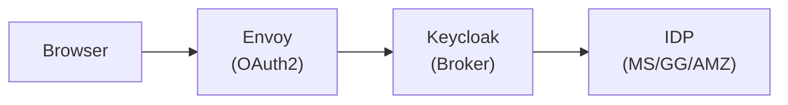
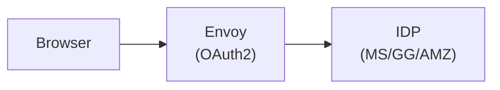

<!--
SPDX-FileCopyrightText: Copyright (c) 2025 NVIDIA CORPORATION & AFFILIATES. All rights reserved.

Licensed under the Apache License, Version 2.0 (the "License");
you may not use this file except in compliance with the License.
You may obtain a copy of the License at

http://www.apache.org/licenses/LICENSE-2.0

Unless required by applicable law or agreed to in writing, software
distributed under the License is distributed on an "AS IS" BASIS,
WITHOUT WARRANTIES OR CONDITIONS OF ANY KIND, either express or implied.
See the License for the specific language governing permissions and
limitations under the License.

SPDX-License-Identifier: Apache-2.0
-->

# Direct IDP Integration: Removing Keycloak

**Author**: @RyaliNvidia<br>
**PIC**: @RyaliNvidia<br>
**Proposal Issue**: [#148](https://github.com/NVIDIA/OSMO/issues/148)

## Overview

This document describes how to configure Envoy to authenticate users directly with external
identity providers (Microsoft Entra ID, Google, and Amazon Cognito) without using Keycloak as
an intermediary. It also covers the new Role Management APIs for assigning and removing users from roles.

### Motivation

- **Reduce complexity** — Eliminate Keycloak as a dependency, reducing deployment and maintenance overhead
- **Direct integration** — Use organization's existing identity provider directly for SSO
- **Simplified architecture** — Fewer moving parts means easier debugging and operations
- **Cost reduction** — One less service to deploy, scale, and maintain

### Problem

Using Keycloak as an identity broker introduces several issues that complicate the authentication and authorization flow:

1. **Duplicated Role Management** — Roles must be defined in two places:
   - In Keycloak (clients, realm roles, group mappings)
   - In OSMO's database (role policies, user-role assignments)

   This duplication leads to synchronization challenges and inconsistent state when roles are updated in one system but not the other.

2. **Complex Role Mapping** — Keycloak requires roles to be created in both `osmo-browser-flow` and `osmo-device` clients, then mapped to groups, then groups assigned to users. A single role assignment requires:
   - Create role in `osmo-browser-flow` client
   - Create same role in `osmo-device` client
   - Create a group
   - Assign both roles to the group
   - Add user to the group
   - Create matching role policy in OSMO database

3. **Opaque Token Claims** — Keycloak transforms and relays claims from the upstream IDP, making it difficult to:
   - Debug authentication issues (which system rejected the token?)
   - Understand what claims are available from the original IDP
   - Leverage IDP-specific features (Azure AD groups, Google Workspace domains, Cognito custom attributes)

4. **Operational Overhead** — Keycloak adds significant operational burden:
   - Separate database (PostgreSQL) for Keycloak state
   - Realm configuration management and backup
   - Version upgrades and security patches
   - Additional monitoring and alerting
   - Troubleshooting authentication flows across three systems (IDP → Keycloak → OSMO)

5. **User Experience Friction** — The extra hop through Keycloak adds:
   - Additional redirect latency during login
   - Potential for session mismatches between Keycloak and OSMO
   - Confusing logout behavior (must log out of both systems)

**By removing Keycloak and connecting Envoy directly to the IDP**, we achieve:

- **Single source of truth** for role assignments (OSMO database only)
- **Simplified role management** via REST APIs
- **Direct access** to IDP claims without transformation
- **Reduced latency** in authentication flow
- **Easier debugging** with fewer components in the chain
- **Lower operational costs** with one less service to maintain

### Architecture Comparison

**Before (with Keycloak):**


**After (Direct IDP):**


---

## Table of Contents

1. [Prerequisites](#prerequisites)
2. [Microsoft Entra ID (Azure AD)](#microsoft-entra-id-azure-ad)
3. [Google OAuth2](#google-oauth2)
4. [AWS IAM Identity Center (AWS SSO)](#aws-iam-identity-center-aws-sso)
5. [Envoy Configuration](#envoy-configuration)
6. [Role Management APIs](#role-management-apis)
7. [Verification Steps](#verification-steps)
8. [Migration from Keycloak](#migration-from-keycloak)
9. [Troubleshooting](#troubleshooting)

---

### Common Values

Throughout this guide, replace these placeholders:

| Placeholder | Description | Example |
|-------------|-------------|---------|
| `<your-domain>` | Your OSMO service hostname | `osmo.example.com` |
| `<tenant-id>` | Microsoft tenant ID | `12345678-1234-1234-1234-123456789abc` |
| `<client-id>` | OAuth2 client/application ID | `abcd1234-...` |
| `<client-secret>` | OAuth2 client secret | `xxx...` |
| `<instance-id>` | AWS Identity Center instance ID | `ssoins-abc123def456` |
| `<region>` | AWS region | `us-east-1`, `us-west-2` |

---

## Microsoft Entra ID (Azure AD)

### Step 1: Register an Application

1. Go to [Azure Portal](https://portal.azure.com) → **Microsoft Entra ID** → **App registrations**
2. Click **New registration**
3. Configure the application:
   - **Name**: `OSMO Service`
   - **Supported account types**: Select based on your requirements
     - Single tenant: Only accounts in your organization
     - Multi-tenant: Accounts in any organization
   - **Redirect URI**:
     - Platform: **Web**
     - URI: `https://<your-domain>/api/auth/getAToken`
4. Click **Register**
5. Note the **Application (client) ID** and **Directory (tenant) ID**

### Step 2: Create Client Secret

1. In your app registration, go to **Certificates & secrets**
2. Click **New client secret**
3. Add a description (e.g., `OSMO OAuth Secret`)
4. Set expiration (recommended: 24 months)
5. Click **Add**
6. **Copy the secret value immediately** (you won't be able to see it again)

### Step 3: Configure API Permissions

1. Go to **API permissions**
2. Click **Add a permission** → **Microsoft Graph**
3. Select **Delegated permissions**
4. Add these permissions:
   - `openid`
   - `profile`
   - `email`
   - `User.Read`
5. Click **Add permissions**
6. If you're an admin, click **Grant admin consent**

### Step 4: Configure Token Claims (Optional)

To include group/role information in tokens:

1. Go to **Token configuration**
2. Click **Add groups claim**
3. Select **Security groups** (or **Groups assigned to the application**)
4. Under **ID** and **Access** tokens, select **Group ID**
5. Click **Add**

### Step 5: Gather Endpoint URLs

| Endpoint | URL |
|----------|-----|
| Token Endpoint | `https://login.microsoftonline.com/<tenant-id>/oauth2/v2.0/token` |
| Authorization Endpoint | `https://login.microsoftonline.com/<tenant-id>/oauth2/v2.0/authorize` |
| JWKS URI | `https://login.microsoftonline.com/<tenant-id>/discovery/v2.0/keys` |
| Issuer | `https://login.microsoftonline.com/<tenant-id>/v2.0` |

### Microsoft Entra Values Configuration

```yaml
sidecars:
  envoy:
    enabled: true

    service:
      hostname: <your-domain>

    # OAuth2 filter for browser-based authentication
    oauth2Filter:
      enabled: true
      tokenEndpoint: https://login.microsoftonline.com/<tenant-id>/oauth2/v2.0/token
      authEndpoint: https://login.microsoftonline.com/<tenant-id>/oauth2/v2.0/authorize
      clientId: <client-id>
      redirectPath: api/auth/getAToken
      logoutPath: logout
      forwardBearerToken: true
      secretName: oidc-secrets
      clientSecretKey: client_secret
      hmacSecretKey: hmac_secret

    # JWT validation for API authentication
    jwt:
      user_header: x-osmo-user
      providers:
      # For browser-based authentication (uses v2.0 endpoint)
      - issuer: https://login.microsoftonline.com/<tenant-id>/v2.0
        audience: <client-id>
        jwks_uri: https://login.microsoftonline.com/<tenant-id>/discovery/v2.0/keys
        user_claim: preferred_username
        cluster: oauth
      # For service-to-service / device authentication (if using v1.0 tokens)
      - issuer: https://sts.windows.net/<tenant-id>/
        audience: <client-id>
        jwks_uri: https://login.microsoftonline.com/<tenant-id>/discovery/v2.0/keys
        user_claim: unique_name
        cluster: oauth
```

---

## Google OAuth2

### Step 1: Create OAuth 2.0 Credentials

1. Go to [Google Cloud Console](https://console.cloud.google.com)
2. Select or create a project
3. Navigate to **APIs & Services** → **Credentials**
4. Click **Create Credentials** → **OAuth client ID**

### Step 2: Configure OAuth Consent Screen

If prompted, configure the OAuth consent screen first:

1. Go to **OAuth consent screen**
2. Select **Internal** (for G Suite/Workspace) or **External** (for any Google account)
3. Fill in the required fields:
   - **App name**: `OSMO Service`
   - **User support email**: Your email
   - **Developer contact information**: Your email
4. Click **Save and Continue**
5. Add scopes:
   - `openid`
   - `email`
   - `profile`
6. Click **Save and Continue**

### Step 3: Create OAuth Client ID

1. Return to **Credentials** → **Create Credentials** → **OAuth client ID**
2. Select **Web application**
3. Configure:
   - **Name**: `OSMO Web Client`
   - **Authorized JavaScript origins**: `https://<your-domain>`
   - **Authorized redirect URIs**: `https://<your-domain>/api/auth/getAToken`
4. Click **Create**
5. **Copy the Client ID and Client Secret**

### Step 4: Gather Endpoint URLs

| Endpoint | URL |
|----------|-----|
| Token Endpoint | `https://oauth2.googleapis.com/token` |
| Authorization Endpoint | `https://accounts.google.com/o/oauth2/v2/auth` |
| JWKS URI | `https://www.googleapis.com/oauth2/v3/certs` |
| Issuer | `https://accounts.google.com` |

### Google OAuth2 Values Configuration

```yaml
sidecars:
  envoy:
    enabled: true

    service:
      hostname: <your-domain>

    # OAuth2 filter for browser-based authentication
    oauth2Filter:
      enabled: true
      tokenEndpoint: https://oauth2.googleapis.com/token
      authEndpoint: https://accounts.google.com/o/oauth2/v2/auth
      clientId: <client-id>.apps.googleusercontent.com
      redirectPath: api/auth/getAToken
      logoutPath: logout
      forwardBearerToken: true
      secretName: oidc-secrets
      clientSecretKey: client_secret
      hmacSecretKey: hmac_secret

    # JWT validation for API authentication
    jwt:
      user_header: x-osmo-user
      providers:
      - issuer: https://accounts.google.com
        audience: <client-id>.apps.googleusercontent.com
        jwks_uri: https://www.googleapis.com/oauth2/v3/certs
        user_claim: email
        cluster: oauth
```

### Important Notes for Google OAuth2

1. **User Claim**: Google uses `email` as the user identifier (not `preferred_username`)
2. **Audience**: Must include the full client ID with `.apps.googleusercontent.com` suffix
3. **Domain Restriction**: For Workspace/G Suite, you can restrict to your domain in the OAuth consent screen

---

## AWS IAM Identity Center (AWS SSO)

AWS IAM Identity Center (formerly AWS SSO) is AWS's centralized identity management service. It differs from Amazon Cognito in that it's designed as an enterprise identity broker that integrates with your corporate identity provider (Microsoft Entra ID, Okta, Google Workspace, etc.) rather than a standalone user directory.

### Key Differences from Cognito

| Aspect | Amazon Cognito | AWS IAM Identity Center |
|--------|---------------|-------------------------|
| Primary Use Case | Customer-facing apps, mobile apps | Enterprise workforce access |
| User Directory | Managed user pool | Federated from corporate IdP |
| OIDC Support | Native | Customer managed applications |
| Typical Users | End customers | Employees, contractors |

### Step 1: Enable AWS IAM Identity Center

1. Go to [AWS IAM Identity Center Console](https://console.aws.amazon.com/singlesignon)
2. Click **Enable** if not already enabled
3. Choose your **Identity source**:
   - **Identity Center directory**: Create and manage users directly in AWS
   - **Active Directory**: Connect to on-premises or AWS Managed Microsoft AD
   - **External identity provider**: Federate with Okta, Microsoft Entra ID, Google Workspace, etc.
4. Note your **Identity Center instance ARN** (format: `arn:aws:sso:::instance/ssoins-<instance-id>`)
5. Note your **Access Portal URL** (format: `https://<instance-id>.awsapps.com/start`)

### Step 2: Configure External Identity Provider (If Using Federation)

If federating with an external IdP:

1. Go to **Settings** → **Identity source** → **Actions** → **Change identity source**
2. Select **External identity provider**
3. Download the **IAM Identity Center SAML metadata** file
4. In your external IdP (e.g., Okta, Microsoft Entra ID):
   - Create a new SAML 2.0 application
   - Upload the IAM Identity Center metadata
   - Configure attribute mappings:
     - `email` → user email
     - `firstName` → given name
     - `lastName` → family name
5. Download the IdP metadata and upload it to IAM Identity Center
6. Optionally, enable **Automatic provisioning (SCIM)** for user/group sync

### Step 3: Create a Customer Managed Application

1. In IAM Identity Center, go to **Applications** → **Customer managed**
2. Click **Add application**
3. Select **I have an application I want to set up** → **OAuth 2.0**
4. Configure the application:
   - **Display name**: `OSMO Service`
   - **Description**: OSMO workflow orchestration platform
   - **Application URL**: `https://<your-domain>`
5. Under **OAuth 2.0 configuration**:
   - **Redirect URIs**: `https://<your-domain>/api/auth/getAToken`
   - **Grant types**: Authorization code
   - **Scopes**: `openid`, `email`, `profile`
6. Click **Submit**
7. Note the **Application ARN** and **Client ID**
8. Generate and save the **Client secret**

### Step 4: Assign Users and Groups

1. In your application settings, go to **Assigned users and groups**
2. Click **Assign users and groups**
3. Select the users or groups who should have access to OSMO
4. Click **Assign**

### Step 5: Gather Endpoint URLs

| Endpoint | URL |
|----------|-----|
| Token Endpoint | `https://oidc.<region>.amazonaws.com/token` |
| Authorization Endpoint | `https://<instance-id>.awsapps.com/start/authorize` |
| JWKS URI | `https://oidc.<region>.amazonaws.com/keys` |
| Issuer | `https://identitycenter.<region>.amazonaws.com/ssoins-<instance-id>` |
| OpenID Configuration | `https://identitycenter.<region>.amazonaws.com/ssoins-<instance-id>/.well-known/openid-configuration` |

> **Note**: Replace `<region>` with your AWS region (e.g., `us-east-1`) and `<instance-id>` with your Identity Center instance ID.

### AWS IAM Identity Center Values Configuration

```yaml
sidecars:
  envoy:
    enabled: true

    service:
      hostname: <your-domain>

    # OAuth2 filter for browser-based authentication
    oauth2Filter:
      enabled: true
      tokenEndpoint: https://oidc.<region>.amazonaws.com/token
      authEndpoint: https://<instance-id>.awsapps.com/start/authorize
      clientId: <client-id>
      redirectPath: api/auth/getAToken
      logoutPath: logout
      forwardBearerToken: true
      secretName: oidc-secrets
      clientSecretKey: client_secret
      hmacSecretKey: hmac_secret

    # JWT validation for API authentication
    jwt:
      user_header: x-osmo-user
      providers:
      - issuer: https://identitycenter.<region>.amazonaws.com/ssoins-<instance-id>
        audience: <client-id>
        jwks_uri: https://oidc.<region>.amazonaws.com/keys
        user_claim: email
        cluster: oauth
```

### Important Notes for AWS IAM Identity Center

1. **User Claim**: Identity Center uses `email` or `sub` as user identifiers
2. **Federation**: Most enterprises use Identity Center as a broker to their corporate IdP (Okta, Microsoft Entra ID, etc.)
3. **Access Portal**: Users can access `https://<instance-id>.awsapps.com/start` to see all assigned applications
4. **Groups**: Groups synced from your corporate IdP are available for RBAC
5. **SCIM Provisioning**: Enable automatic user/group provisioning from your corporate IdP for seamless user lifecycle management
6. **Region-Specific**: Unlike Cognito, Identity Center endpoints are region-specific

### Migrating from Cognito to Identity Center

If you're migrating from Amazon Cognito:

1. **User Migration**: Export Cognito users and import them to your corporate IdP or Identity Center directory
2. **Update Envoy Configuration**: Replace Cognito endpoints with Identity Center endpoints
3. **Update Redirect URIs**: Ensure the new Identity Center application has the correct callback URLs
4. **Test Federation**: Verify that users from your corporate IdP can authenticate successfully

---

## Envoy Configuration

### Create Kubernetes Secrets

Before deploying, create the required secrets:

```bash
# Generate a random HMAC secret (256 bits / 32 bytes)
HMAC_SECRET=$(openssl rand -base64 32)

# Create the secret
kubectl create secret generic oidc-secrets \
  --namespace <your-namespace> \
  --from-literal=client_secret='<your-client-secret>' \
  --from-literal=hmac_secret="${HMAC_SECRET}"
```

### Complete Envoy Sidecar Configuration

Here's the full configuration structure in your Helm values:

```yaml
sidecars:
  envoy:
    enabled: true
    useKubernetesSecrets: true

    image: envoyproxy/envoy:v1.29.0
    imagePullPolicy: IfNotPresent

    # Paths that skip authentication
    skipAuthPaths:
    - /health
    - /api/router/version
    - /api/version

    # Listener configuration
    listenerPort: 8080
    maxHeadersSizeKb: 128
    logLevel: info

    # Service configuration
    service:
      port: 8000
      hostname: <your-domain>
      address: 127.0.0.1

    # OAuth2 filter configuration (browser flow)
    oauth2Filter:
      enabled: true
      tokenEndpoint: <see-provider-specific-section>
      authEndpoint: <see-provider-specific-section>
      clientId: <your-client-id>
      redirectPath: api/auth/getAToken
      logoutPath: logout
      forwardBearerToken: true
      secretName: oidc-secrets
      clientSecretKey: client_secret
      hmacSecretKey: hmac_secret

    # JWT validation configuration
    jwt:
      user_header: x-osmo-user
      providers:
      - issuer: <see-provider-specific-section>
        audience: <your-client-id>
        jwks_uri: <see-provider-specific-section>
        user_claim: <email|preferred_username|unique_name>
        cluster: oauth

    # Internal OSMO auth (for service-issued tokens)
    osmoauth:
      enabled: true
      port: 80
```

### OAuth Cluster Definition

Envoy needs a cluster definition to reach the IDP's token endpoint. This is typically auto-generated by the Helm chart, but if manual configuration is needed:

```yaml
# In Envoy config
clusters:
- name: oauth
  connect_timeout: 10s
  type: LOGICAL_DNS
  lb_policy: ROUND_ROBIN
  dns_lookup_family: V4_ONLY
  load_assignment:
    cluster_name: oauth
    endpoints:
    - lb_endpoints:
      - endpoint:
          address:
            socket_address:
              # For Microsoft:
              address: login.microsoftonline.com
              # For Google:
              # address: oauth2.googleapis.com
              # For AWS Identity Center:
              # address: oidc.<region>.amazonaws.com
              port_value: 443
  transport_socket:
    name: envoy.transport_sockets.tls
    typed_config:
      "@type": type.googleapis.com/envoy.extensions.transport_sockets.tls.v3.UpstreamTlsContext
      sni: login.microsoftonline.com  # Match the address above
```

---

## Role Management APIs

To manage user-to-role assignments without Keycloak, OSMO provides REST APIs for role management. These APIs replace the role assignment functionality previously handled through Keycloak's admin console or IdP group mappings.

### Why New APIs Are Needed

With Keycloak removed, we lose the following capabilities that must be replaced:

| Keycloak Feature | OSMO Replacement |
|-----------------|------------------|
| Assign role to user via admin console | `POST /api/users/{username}/roles` |
| Remove role from user | `DELETE /api/users/{username}/roles/{role_name}` |
| View user's roles | `GET /api/users/{username}/roles` |
| List users with a role | `GET /api/roles/{role_name}/users` |
| Bulk role assignment via groups | `POST /api/roles/{role_name}/users` |
| Role expiration | `expires_at` field in role assignment |

### Key Design Decisions

1. **User-centric and Role-centric APIs** — Provide both `/api/users/{username}/roles` and `/api/roles/{role_name}/users` endpoints to support different admin workflows

2. **Audit Trail** — Every assignment records `assigned_by` (who made the change) and `assigned_at` (when) for compliance

3. **Time-bound Roles** — Support `expires_at` for temporary access (contractors, trials, incident response)

4. **Idempotent Operations** — Assigning an already-assigned role returns success (not error)

5. **Authorization Required** — Only users with `role:Manage` action can modify role assignments

### Required Permissions

To use the role management APIs, the caller must have the `role:Manage` action. This is included in the `osmo-admin` role by default.

```json
{
  "statements": [
    {
      "effect": "Allow",
      "actions": ["role:Manage"],
      "resources": ["*"]
    }
  ]
}
```

For fine-grained control, you can restrict which roles an admin can assign:

```json
{
  "statements": [
    {
      "effect": "Allow",
      "actions": ["role:Manage"],
      "resources": ["role/osmo-team-*"]
    }
  ]
}
```

### Database Schema for User-Role Assignments

```sql
-- User-role assignment table
CREATE TABLE user_roles (
    id SERIAL PRIMARY KEY,
    username VARCHAR(255) NOT NULL,
    role_name VARCHAR(255) NOT NULL REFERENCES roles(name) ON DELETE CASCADE,
    assigned_by VARCHAR(255) NOT NULL,
    assigned_at TIMESTAMP WITH TIME ZONE NOT NULL DEFAULT NOW(),
    expires_at TIMESTAMP WITH TIME ZONE,
    UNIQUE(username, role_name)
);

-- Index for fast lookups
CREATE INDEX idx_user_roles_username ON user_roles(username);
CREATE INDEX idx_user_roles_role_name ON user_roles(role_name);
```

### API Endpoints

#### List User Roles

Get all roles assigned to a user.

```
GET /api/users/{username}/roles
```

**Response:**
```json
{
  "username": "user@example.com",
  "roles": [
    {
      "name": "osmo-user",
      "assigned_by": "admin@example.com",
      "assigned_at": "2025-01-15T10:30:00Z",
      "expires_at": null
    },
    {
      "name": "osmo-ml-team",
      "assigned_by": "admin@example.com",
      "assigned_at": "2025-01-15T10:30:00Z",
      "expires_at": "2025-07-15T10:30:00Z"
    }
  ]
}
```

#### Assign Role to User

Add a role to a user.

```
POST /api/users/{username}/roles
```

**Request Body:**
```json
{
  "role_name": "osmo-ml-team",
  "expires_at": "2025-07-15T10:30:00Z"  // Optional
}
```

**Response:**
```json
{
  "username": "user@example.com",
  "role_name": "osmo-ml-team",
  "assigned_by": "admin@example.com",
  "assigned_at": "2025-01-15T10:30:00Z",
  "expires_at": "2025-07-15T10:30:00Z"
}
```

**Errors:**
- `400 Bad Request`: Invalid role name or user already has role
- `403 Forbidden`: Caller doesn't have permission to assign roles
- `404 Not Found`: Role doesn't exist

#### Remove Role from User

Remove a role assignment from a user.

```
DELETE /api/users/{username}/roles/{role_name}
```

**Response:** Success

**Errors:**
- `403 Forbidden`: Caller doesn't have permission to remove roles
- `404 Not Found`: User doesn't have this role

#### List All Role Assignments

Get all users with a specific role.

```
GET /api/roles/{role_name}/users
```

**Response:**
```json
{
  "role_name": "osmo-ml-team",
  "users": [
    {
      "username": "user1@example.com",
      "assigned_by": "admin@example.com",
      "assigned_at": "2025-01-15T10:30:00Z"
    },
    {
      "username": "user2@example.com",
      "assigned_by": "admin@example.com",
      "assigned_at": "2025-01-16T09:00:00Z"
    }
  ]
}
```

#### Bulk Role Assignment

Assign a role to multiple users at once.

```
POST /api/roles/{role_name}/users
```

**Request Body:**
```json
{
  "usernames": [
    "user1@example.com",
    "user2@example.com",
    "user3@example.com"
  ],
  "expires_at": "2025-12-31T23:59:59Z"  // Optional
}
```

**Response:**
```json
{
  "role_name": "osmo-ml-team",
  "assigned": [
    "user1@example.com",
    "user2@example.com"
  ],
  "already_assigned": [
    "user3@example.com"
  ],
  "failed": []
}
```

### Role Resolution in authz_sidecar

When a request comes in, the authz_sidecar resolves user roles from multiple sources:

1. **JWT Token Claims**: Roles from the IDP (e.g., `groups` claim in Azure AD)
2. **Database Lookup**: Roles from the `user_roles` table
3. **Default Roles**: `osmo-default` for unauthenticated, `osmo-user` for authenticated

```go
func (s *AuthzServer) resolveRoles(ctx context.Context, username string, jwtRoles []string) ([]string, error) {
    // Start with roles from JWT
    roles := make(map[string]bool)
    for _, r := range jwtRoles {
        roles[r] = true
    }

    // Add roles from database
    dbRoles, err := s.postgresClient.GetUserRoles(ctx, username)
    if err != nil {
        return nil, err
    }
    for _, r := range dbRoles {
        roles[r.RoleName] = true
    }

    // Convert to slice
    result := make([]string, 0, len(roles))
    for r := range roles {
        result = append(result, r)
    }
    return result, nil
}
```

### Action Registry Addition

Add the new role management actions to the action registry:

**File**: `external/src/service/authz_sidecar/server/action_registry.go`

```go
// Add to ActionRegistry map
"role:Manage": {
    {Path: "/api/users/*/roles", Methods: []string{"POST", "DELETE"}},
    {Path: "/api/users/*/roles/*", Methods: []string{"DELETE"}},
    {Path: "/api/roles/*/users", Methods: []string{"POST"}},
},
"role:Read": {
    {Path: "/api/users/*/roles", Methods: []string{"GET"}},
    {Path: "/api/roles/*/users", Methods: []string{"GET"}},
},
```

### Database Migration

WIP

---

## Verification Steps

### Step 1: Verify OAuth2 Endpoints

Test that the IDP endpoints are reachable from your cluster:

```bash
# Test Microsoft Entra ID
curl -s "https://login.microsoftonline.com/<tenant-id>/v2.0/.well-known/openid-configuration" | jq .

# Test Google
curl -s "https://accounts.google.com/.well-known/openid-configuration" | jq .

# Test AWS IAM Identity Center
curl -s "https://identitycenter.<region>.amazonaws.com/ssoins-<instance-id>/.well-known/openid-configuration" | jq .
```

**Expected Output**: JSON document with `authorization_endpoint`, `token_endpoint`, `jwks_uri`, etc.

### Step 2: Verify JWKS Endpoint

```bash
# Test that JWKS is accessible
curl -s "<jwks_uri>" | jq '.keys[0].kid'
```

**Expected Output**: A key ID string (e.g., `"nOo3ZDrODXEK1jKWhXslHR_KXEg"`)

### Step 3: Test Browser Authentication Flow

1. Open a browser in incognito/private mode
2. Navigate to `https://<your-domain>`
3. You should be redirected to your IDP login page
4. After logging in, you should be redirected back to OSMO
5. Check browser developer tools → Network tab for:
   - Redirect to IDP authorization endpoint
   - Callback to `/api/auth/getAToken` with authorization code
   - Cookie set with session token

### Step 4: Verify JWT Token

After logging in, inspect your token:

```bash
# Decode manually
echo "<token>" | cut -d. -f2 | base64 -d 2>/dev/null | jq .
```

**Expected Claims:**
```json
{
  "iss": "https://login.microsoftonline.com/<tenant-id>/v2.0",
  "sub": "user-id",
  "aud": "<client-id>",
  "preferred_username": "user@example.com",
  "exp": 1705320000
}
```

### Step 5: Test API Authentication

```bash
# Test authenticated API call
curl -H "Authorization: Bearer <token>" \
  "https://<your-domain>/api/version"

# Should return version info if authenticated
```

### Step 6: Verify Role Resolution

```bash
# Check user roles via API
curl -H "Authorization: Bearer <token>" \
  "https://<your-domain>/api/users/<user>/roles"
```

---

## Migration from Keycloak

### Phase 1: Parallel Operation

1. **Configure direct IDP** alongside Keycloak
2. Add a second JWT provider in Envoy configuration:

```yaml
jwt:
  providers:
  # Existing Keycloak provider
  - issuer: https://auth-<your-domain>/realms/osmo
    audience: osmo-browser-flow
    jwks_uri: https://auth-<your-domain>/realms/osmo/protocol/openid-connect/certs
    user_claim: preferred_username
    cluster: keycloak
  # New direct IDP provider
  - issuer: https://login.microsoftonline.com/<tenant-id>/v2.0
    audience: <client-id>
    jwks_uri: https://login.microsoftonline.com/<tenant-id>/discovery/v2.0/keys
    user_claim: preferred_username
    cluster: oauth
```

## Future IDPs

We plan on supporting these other IDPs in the future, but might be beyond the scope of the inital feature.

* Okta (Might be moved to higher importance)
* auth0

## Troubleshooting

### Authentication Fails with "Invalid Token"

**Symptoms**: 401 Unauthorized with "JWT verification failed"

**Solutions**:

1. **Check issuer mismatch**:
   ```bash
   # Decode token and compare issuer
   echo "<token>" | cut -d. -f2 | base64 -d | jq .iss
   ```
   The issuer in the token must exactly match the `issuer` in your Envoy configuration.

2. **Check audience mismatch**:
   ```bash
   echo "<token>" | cut -d. -f2 | base64 -d | jq .aud
   ```
   The audience must match your `audience` configuration.

3. **Check JWKS connectivity**:
   ```bash
   kubectl exec -it <pod> -c envoy -- \
     curl -v "<jwks_uri>"
   ```

### OAuth2 Redirect Fails

**Symptoms**: Browser shows error after IDP login, redirect back fails

**Solutions**:

1. **Verify redirect URI** in IDP matches exactly:
   - Check for trailing slashes
   - Check for HTTP vs HTTPS
   - Check hostname matches

2. **Check Envoy logs**:
   ```bash
   kubectl logs <pod> -c envoy | grep -i oauth
   ```

3. **Verify secrets exist**:
   ```bash
   kubectl get secret oidc-secrets -o yaml
   ```

### User Has No Roles

**Symptoms**: User authenticates but gets 403 Forbidden

**Solutions**:

1. **Check x-osmo-user header**:
   ```bash
   # In Envoy access logs, verify the user header is set
   kubectl logs <pod> -c envoy | grep x-osmo-user
   ```

2. **Verify user_claim configuration**:
   - Microsoft: `preferred_username` or `unique_name`
   - Google: `email`
   - AWS Identity Center: `email` or `sub`

3. **Check database for role assignments**:
   ```sql
   SELECT * FROM user_roles WHERE username = 'user@example.com';
   ```

### Session Cookie Not Set

**Symptoms**: User has to log in on every request

**Solutions**:

1. **Check cookie settings**:
   - Verify `SameSite` attribute allows cross-site if needed
   - Verify `Secure` attribute matches HTTPS usage

2. **Check HMAC secret**:
   - Verify the secret hasn't changed
   - Verify the secret is properly base64 encoded

### Envoy Can't Reach IDP

**Symptoms**: Timeouts or connection refused errors

**Solutions**:

1. **Check network policies**:
   ```bash
   kubectl get networkpolicies
   ```

2. **Test from pod**:
   ```bash
   kubectl exec -it <pod> -- curl -v https://login.microsoftonline.com
   ```

3. **Check DNS resolution**:
   ```bash
   kubectl exec -it <pod> -- nslookup login.microsoftonline.com
   ```

---

## Quick Reference

### Endpoint Summary

| Provider | Token Endpoint | Auth Endpoint | JWKS URI | Issuer |
|----------|---------------|---------------|----------|--------|
| Microsoft | `https://login.microsoftonline.com/<tenant>/oauth2/v2.0/token` | `https://login.microsoftonline.com/<tenant>/oauth2/v2.0/authorize` | `https://login.microsoftonline.com/<tenant>/discovery/v2.0/keys` | `https://login.microsoftonline.com/<tenant>/v2.0` |
| Google | `https://oauth2.googleapis.com/token` | `https://accounts.google.com/o/oauth2/v2/auth` | `https://www.googleapis.com/oauth2/v3/certs` | `https://accounts.google.com` |
| AWS Identity Center | `https://oidc.<region>.amazonaws.com/token` | `https://<instance-id>.awsapps.com/start/authorize` | `https://oidc.<region>.amazonaws.com/keys` | `https://identitycenter.<region>.amazonaws.com/ssoins-<instance-id>` |

### User Claim Mapping

| Provider | Common Claims |
|----------|--------------|
| Microsoft | `preferred_username`, `unique_name`, `email`, `upn` |
| Google | `email`, `name`, `sub` |
| AWS Identity Center | `email`, `sub`, `name` |
