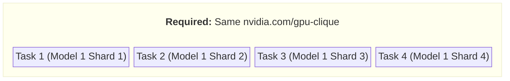
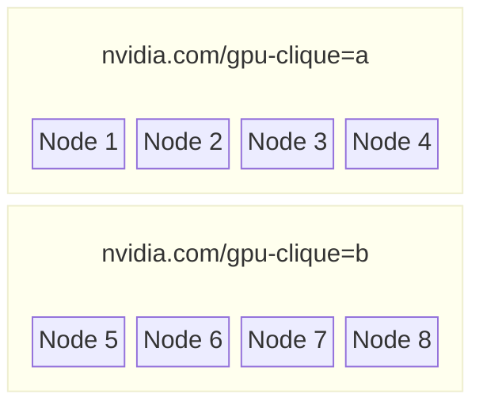
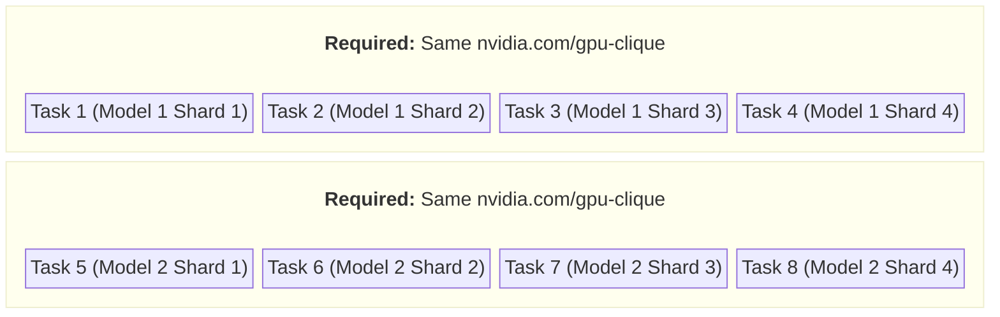
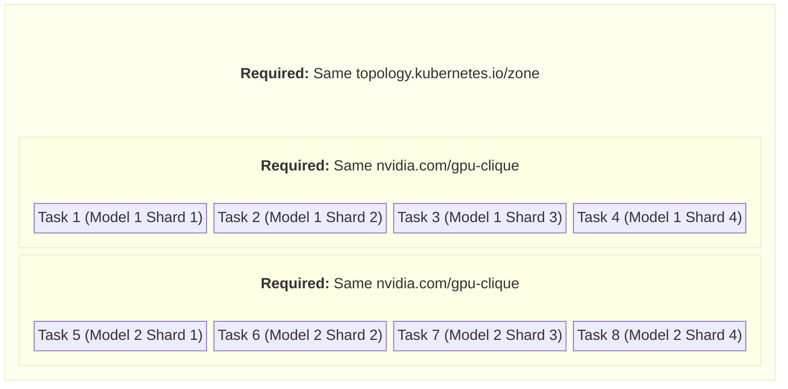
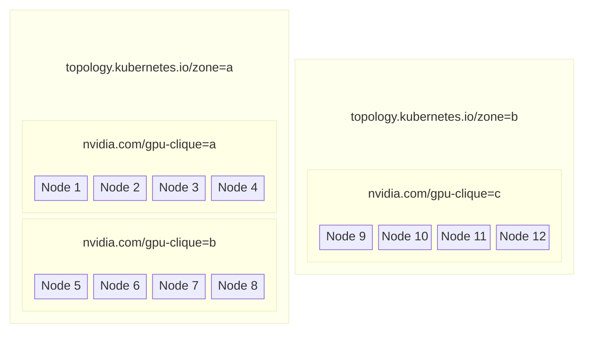
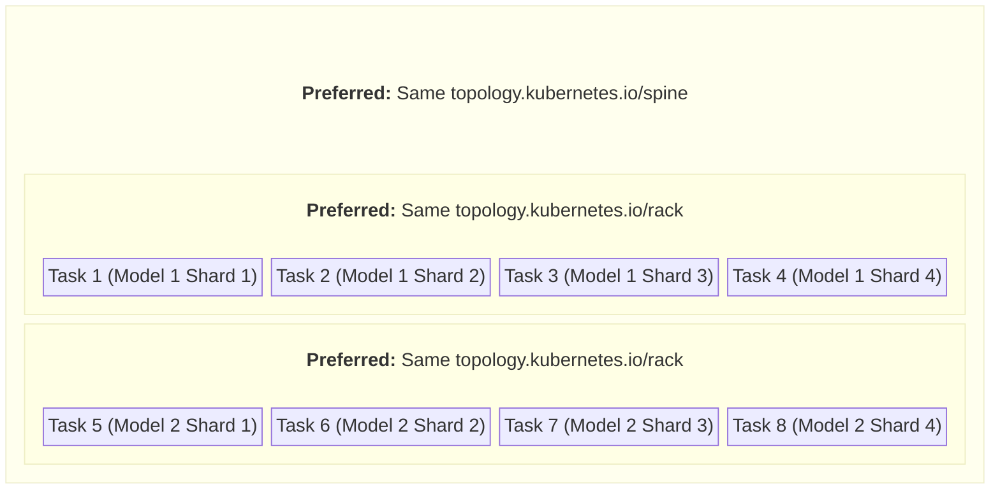
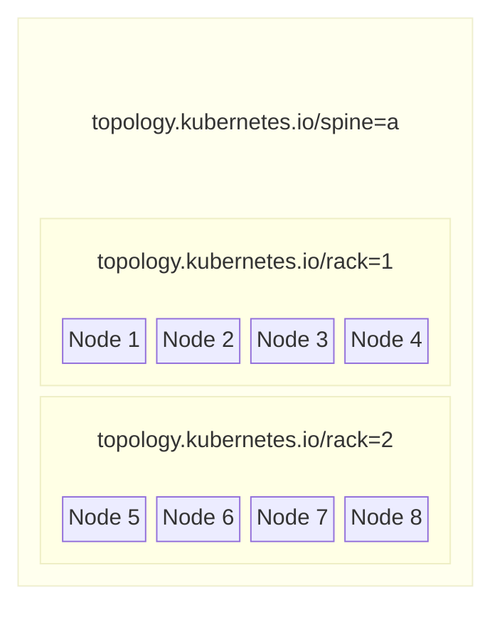
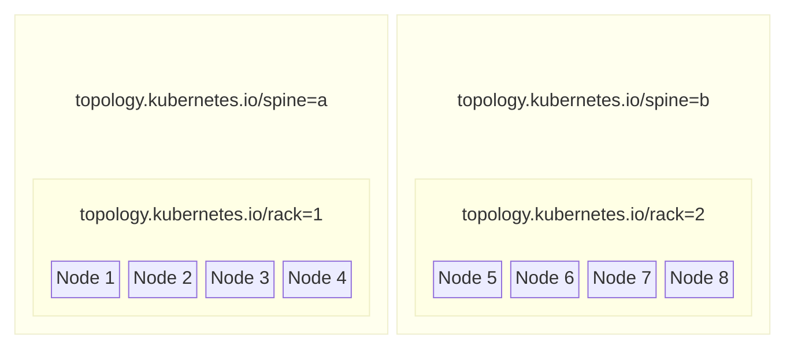

<!--
SPDX-FileCopyrightText: Copyright (c) 2026 NVIDIA CORPORATION. All rights reserved.

Licensed under the Apache License, Version 2.0 (the "License");
you may not use this file except in compliance with the License.
You may obtain a copy of the License at

http://www.apache.org/licenses/LICENSE-2.0

Unless required by applicable law or agreed to in writing, software
distributed under the License is distributed on an "AS IS" BASIS,
WITHOUT WARRANTIES OR CONDITIONS OF ANY KIND, either express or implied.
See the License for the specific language governing permissions and
limitations under the License.

SPDX-License-Identifier: Apache-2.0
-->

# \<Project Title\>

**Author**: @ecolternv 
**PIC**: @ecolternv 
**Proposal Issue**: [#206](https://github.com/nvidia/osmo/issues/123)

## Overview

This project will do the following:
- Add support for creating ComputeDomain CRDs natively for workflows that have NVL72 or other multi-node nvlink enabled backends.
- Add support for topology aware scheduling introduced in KAI Scheduler v0.10 to allow users to scheduled all of their tasks of a given workflow on the same NVL72 rack.

### Motivation

The current Blackwell generation of GPUs with GB200 and GB300, and future announced GPU generations feature Multi Node NVLINK with NVL72 and even higher numbers like NVL144, etc.

To properly get full node to node performance for multi-node training, workloads scheduled in kubernetes need to take advantage of NvLink.
They need to be able to carefully control how they pods are placed in the cluster so they end up in the same racks.

### Problem

#### Compute Domain CRD

To use MultiNode NvLink in kubernetes, you must create a ComputeDomain CRD and all pods that are part of a given training run must have a resourceClaim that points to the same ComputeDomain.

**Current Situation:** OSMO does not currently support creating/destroying ComputeDomains along with the lifecycle of the workflow.
To use NvLink with OSMO currently, you must have another system for creating/destroying ComputeDomains along with workflows.

#### Topology Aware Scheduling

To use MultiNode NvLink, pods that wish to communicate using NvLink must be placed in the same NVL72/NVL144/NVLxyz rack by the scheduler.

Further, even for non-NvLink workloads, users may wish to require pods be scheudled near each other with certain network topology constraints to ensure
the best performance.

**Current Situation:** Currently OSMO has some ability to handle topology aware scheduling with podAffinities added to OSMO pod templates, but this doesn't provide the granular level of control needed for many usecases in an NVLink enabled cluster.

_Describe the problem this project solves. What is the current situation?_

## Use Cases

1. **Single NVL72 Rack:**
A users wants to schedule a 4 task training workflow that trains a network in a 4x data parallel fashion. All tasks must be able to communicate with
one another using high bandwidth NvLink. A ComputeDomain must be created for the workflow, and OSMO must schedule them all on the same NVL72 Rack.

**Workflow topology**

**Sample cluster topology**

In this usecase, OSMO must be constrained to either place all tasks in gpu clique `a` or gpu clique `b`.

2. **Multiple NVL72 Racks:**
A users wants to schedule an 8 task training workflow that trains a network in a 2x data parallel 4x tensor parallel fashion. This means there are
two instance of the model being trained, with each instance being broken into 4 shards. All parts of a given model instance must be able to
communicate with each other using high bandwidth NvLink. OSMO must create a ComputeDomain for the workflow as well.

**Workflow topology**

**Sample cluster topology**

In this usecase, OSMO must be constrained to place all shards of the same model instance into the same gpu clique.

3. **Multiple NVL72 Racks in same zone:**
This is the same as the above usecase, `Multiple NVL72 Racks`, except that the cluster has racks in multiple "zones".
The entire training workflow must be scheduled in the same zone for the best speed between model instances.
OSMO must create a ComputeDomain for the workflow as well.

**Workflow topology**

**Sample cluster topology**

In this topology, OSMO will schedule the entire workflow in zone A, because only Zone A is large enough to hold all tasks as required by the topology.

4. **Best effort topology awareness:**
A users wants to schedule an 8 task training workflow that trains a network in a 2x data parallel 4x tensor parallel fashion. This means there are
two instance of the model being trained, with each instance being broken into 4 shards. This is done on a cluster that does NOT have NvLink, and all nodes can communicate with all other nodes using infiniband. However, there is still a latency benefit from tasks being scheduled on the same rack
or spine switch, so the user would like their workflow to be scheduled this way if possible for the best performance. If its not possible, they
would still like their workflow to be scheduled, even if it runs at a lower level of performance.
Shards of the same model instance should be scheduled on the same rack if possible, and the whole workflow should be scheduled on the same spine if
possible.

**Workflow topology**

**Sample cluster topology**

In the below cluster topology, OSMO is able to satisfy the workflow's topology constraints and does so.

In the below cluster topology, OSMO is not able to completely satisfy the topology requirements, but schedules the workflow anyway, doing the best
it can. All shards of the same model are put on the same rack, but the two instances of the model are on separate spines

## Requirements

| Title | Description | Type |
|---|---|---|
| Configure pool to use NvLink | An OSMO admin shall be able to configure a pool to use NvLink. | Functional |
| Create/destroy compute domains | For all workflows in pools configured to use NvLink, OSMO shall create/destroy a corresponding compute domain along with the creating/destruction of any task groups for that workflow. | Functional |
| Configure allowed topology keys | An OSMO admin shall be able to configure for each pool the allowed topology keys, and their ordering relative to each other. | Functional |
| Support topology keys for KAI scheduler | OSMO shall support topology keys for backends configured to use the KAI scheduler. | Functional |
| Prevent topology key configuration for unsupported schedulers | OSMO shall prevent admins from configuring pools to support topology keys if the backend uses a scheduler that does not support topology keys. | Functional |
| View available topology keys | OSMO shall have a way for users to view the available topology keys for a given pool. | Functional |
| Specify topology requirements in workflow spec | The OSMO workflow spec shall support a mechanism for specifying topology requirements. Topology requirements specify which tasks in a given group must have the same values for which topology keys, and whether that requirement is `required` for scheduling, or just `preferred`. | Functional |
| Schedule workflows satisfying topology requirements | OSMO shall schedule workflows to satisfy the topology requirements in the workflow spec as follows: For topology requirements specified as `required`, the workflow will not be scheduled unless the the requirement can be satisfied. For topology requirements specified as `preferred` OSMO will give a higher priority to scheduling in a way that satisfies the topology requirement. | Functional |

## Architectural Details

_Provide a high-level technical overview of the proposed solution. Include block diagrams if applicable. How will we solve the problem? What is the general approach?_

This should expand on the "High-Level Approach" field from the project proposal. Include:

- Architecture overview
- Key components or modules
- How they fit together
- Static and dynamic components
- User-facing changes (if applicable)

## Detailed Design

_Provide the detailed technical design. This is the core of the document._

Include:

- API designs (new endpoints, function signatures, interfaces)
- Data models and schemas
- System architecture diagrams
- Component interactions and workflows
- Configuration changes
- User interface mockups or flows (if applicable)
- Examples of how the system will be used

Break this into subsections as needed for clarity.

### Alternatives Considered

_What other approaches did you consider? Why did you choose this design over the alternatives?_

For each alternative:

- Describe the approach
- List pros and cons
- Explain why it was not chosen

### Backwards Compatibility

_Does this change break existing APIs, configurations, or user workflows? If yes, how will we handle it?_

### Performance

_What are the performance implications? Will this impact latency, throughput, resource usage, etc.?_

### Operations

_How does this affect operations, deployment, monitoring, or maintenance?_

### Security

_Are there any security considerations or implications?_

### Documentation

_What documentation needs to be created or updated?_

### Testing

_What unit, integration, or end-to-end tests need to be created or updated? How will these tests be integrated in automation? What test metrics will be tracked and what are KPIs?_

### Dependencies

_Which other projects or components impact this work? Which other projects or components are impacted by this work?_

## Implementation Plan

_[Optional] For large projects, break the project into smaller pieces._

## Open Questions

_List any unresolved questions or decisions that need to be made._

- [ ] Question 1?
- [ ] Question 2?
