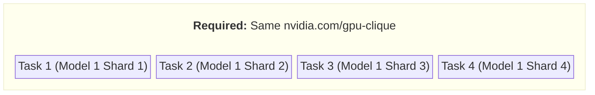
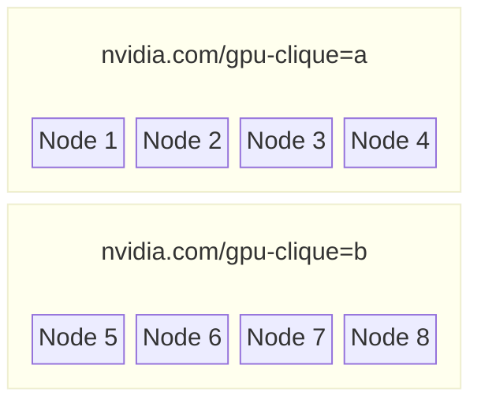
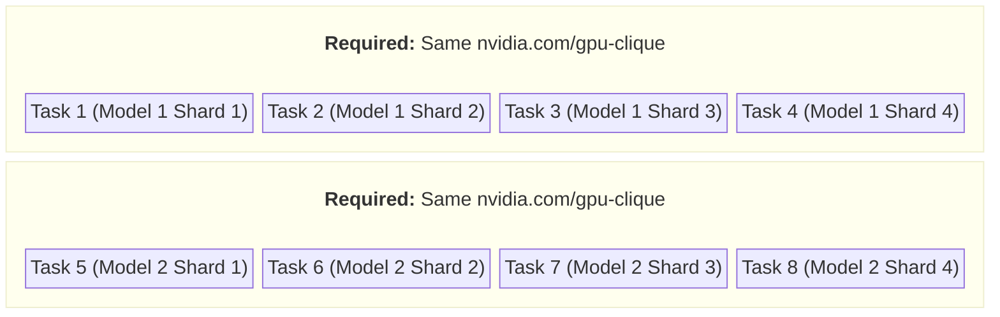
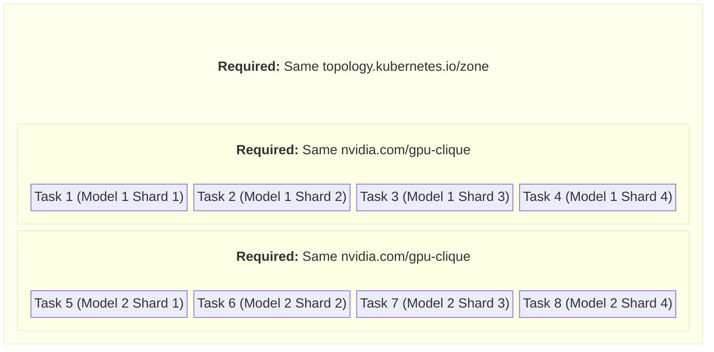
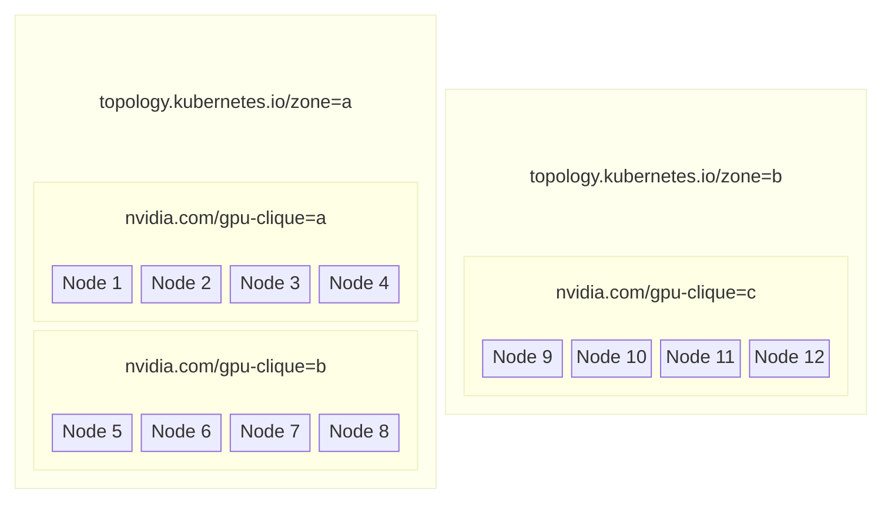
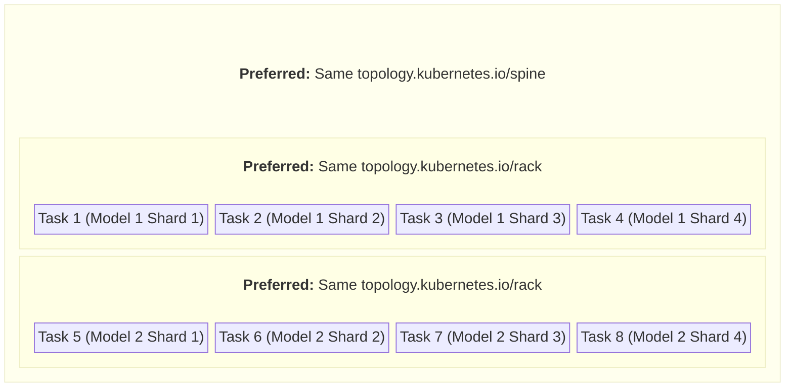
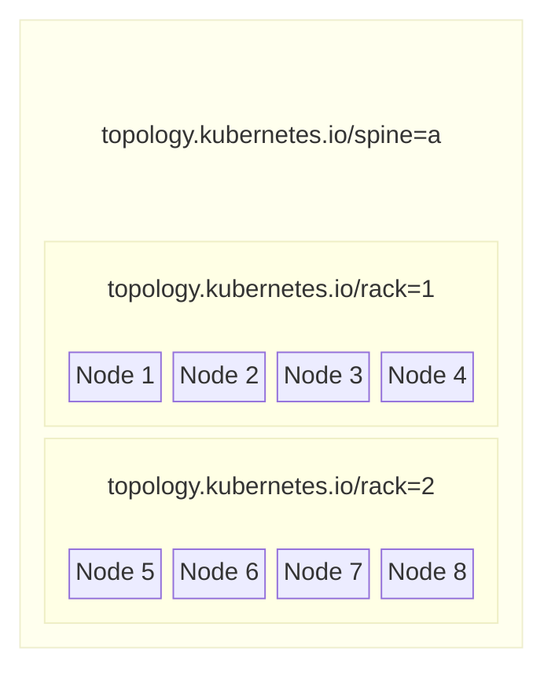
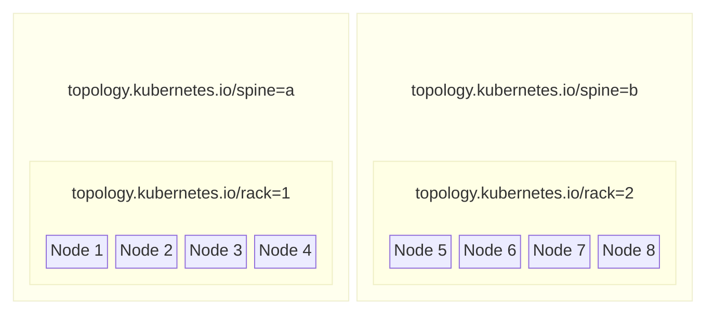

<!--
SPDX-FileCopyrightText: Copyright (c) 2026 NVIDIA CORPORATION. All rights reserved.

Licensed under the Apache License, Version 2.0 (the "License");
you may not use this file except in compliance with the License.
You may obtain a copy of the License at

http://www.apache.org/licenses/LICENSE-2.0

Unless required by applicable law or agreed to in writing, software
distributed under the License is distributed on an "AS IS" BASIS,
WITHOUT WARRANTIES OR CONDITIONS OF ANY KIND, either express or implied.
See the License for the specific language governing permissions and
limitations under the License.

SPDX-License-Identifier: Apache-2.0
-->

# Topology Aware Scheduling

**Author**: @ecolternv<br>
**PIC**: @ecolternv<br>
**Proposal Issue**: [#206](https://github.com/nvidia/osmo/issues/206)

## Overview

This project adds support for topology aware scheduling using features introduced in KAI Scheduler v0.10. This allows users to specify topology requirements in their workflow specifications to ensure tasks are scheduled with optimal network locality (same rack, same zone, etc.) for best performance.

### Motivation

The current Blackwell generation of GPUs with GB200 and GB300, and future announced GPU generations feature Multi Node NVLINK with NVL72 and even higher numbers like NVL144, etc.

To properly get full node to node performance for multi-node training, workloads scheduled in kubernetes need to take advantage of NvLink. They need to be able to carefully control how pods are placed in the cluster so they end up in the same racks.

Even for non-NvLink workloads, users may wish to require pods be scheduled near each other with certain network topology constraints to ensure the best performance.

### Problem

OSMO currently has some limited ability to handle topology aware scheduling with podAffinities added to OSMO pod templates, but this is quite limited,
and KAI scheduler only satisfies these as a best-effort basis. Further more teh current podAffinities method doesn't allow for complex, heirarchical topologies as all pods in a workflow will end up with te same `podAffiniy` term.

As clusters become more heterogeneous in their network topology with NVLink, we need a way for users to specify the network topology required between
the tasks in their workflows.

## Use Cases

<a name="usecase-1"></a>
1. **Single NVL72 Rack:**
A users wants to schedule a 4 task training workflow that trains a network in a 4x tensor parallel fashion. All tasks must be able to communicate with
one another using high bandwidth NvLink. OSMO must schedule them all on the same NVL72 Rack.

**Workflow topology**


**Sample cluster topology**


In this usecase, OSMO must be constrained to either place all tasks in gpu clique `a` or gpu clique `b`.

<a name="usecase-2"></a>
2. **Multiple NVL72 Racks:**
A users wants to schedule an 8 task training workflow that trains a network in a 2x data parallel 4x tensor parallel fashion. This means there are
two instance of the model being trained, with each instance being broken into 4 shards. All parts of a given model instance must be able to
communicate with each other using high bandwidth NvLink.

**Workflow topology**


**Sample cluster topology**


In this usecase, OSMO must be constrained to place all shards of the same model instance into the same gpu clique.


<a name="usecase-3"></a>
3. **Multiple NVL72 Racks in same zone:**
This is the same as the above usecase, `Multiple NVL72 Racks`, except that the cluster has racks in multiple "zones".
The entire training workflow must be scheduled in the same zone for the best speed between model instances.

**Workflow topology**


**Sample cluster topology**


In this topology, OSMO will schedule the entire workflow in zone A, because only Zone A is large enough to hold all tasks as required by the topology.


<a name="usecase-4"></a>
4. **Best effort topology awareness:**
A users wants to schedule an 8 task training workflow that trains a network in a 2x data parallel 4x tensor parallel fashion. This means there are
two instance of the model being trained, with each instance being broken into 4 shards. This is done on a cluster that does NOT have NvLink, and all nodes can communicate with all other nodes using infiniband. However, there is still a latency benefit from tasks being scheduled on the same rack
or spine switch, so the user would like their workflow to be scheduled this way if possible for the best performance. If its not possible, they
would still like their workflow to be scheduled, even if it runs at a lower level of performance.
Shards of the same model instance should be scheduled on the same rack if possible, and the whole workflow should be scheduled on the same spine if
possible.


**Workflow topology**


**Sample cluster topology**

In the below cluster topology, OSMO is able to satisfy the workflow's topology constraints and does so.


In the below cluster topology, OSMO is not able to completely satisfy the topology requirements, but schedules the workflow anyway, doing the best
it can. All shards of the same model are put on the same rack, but the two instances of the model are on separate spines



## Requirements

| Title | Description | Type |
|---|---|---|
| Configure allowed topology keys | An OSMO admin shall be able to configure for each pool the allowed topology keys, and their ordering relative to each other. | Functional |
| Support topology keys for KAI scheduler | OSMO shall support topology keys for backends configured to use the KAI scheduler. | Functional |
| Prevent topology key configuration for unsupported schedulers | OSMO shall prevent admins from configuring pools to support topology keys if the backend uses a scheduler that does not support topology keys. | Functional |
| View available topology keys | OSMO shall have a way for users to view the available topology keys for a given pool. | Functional |
| Specify topology requirements in workflow spec | The OSMO workflow spec shall support a mechanism for specifying topology requirements. Topology requirements specify which tasks in a given group must have the same values for which topology keys, and whether that requirement is `required` for scheduling, or just `preferred`. | Functional |
| Schedule workflows satisfying topology requirements | OSMO shall schedule workflows to satisfy the topology requirements in the workflow spec as follows: For topology requirements specified as `required`, the workflow will not be scheduled unless the the requirement can be satisfied. For topology requirements specified as `preferred` OSMO will give a higher priority to scheduling in a way that satisfies the topology requirement. | Functional |

## Detailed Design

_Provide the detailed technical design. This is the core of the document._

### Changes to Pool Config

A `topology_keys` parameter (list of objects) is added to the pool config to allow an admin to specify topology keys.
If the list is empty (the default value), then topology aware scheduling is not enabled.

Each entry in `topology_keys` has two fields:
- `key`: A user-friendly name that users will reference in their workflow specs
- `label`: The actual Kubernetes node label that will be used in the Topology CRD and PodGroup

Keys are listed from coarsest to finest granularity. Keys that appear later in the list are "smaller" groups of nodes and are subsets of the keys before them.
In the example below: One or more `rack`s appear in a given `spine` and one or more `spine`s appear in a given `zone`.

The `topology_keys` parameter is only allowed to be non-empty for pools that are part of a backend using KAI scheduler.


```yaml
{
    "name": "my-pool-01",
    "description": "A pool with topology aware scheduling enabled",
    # Topology keys are listed from coarsest to finest granularity
    # (ie zone contains multiple spines, spine contains multiple racks)
    "topology_keys": [
        {"key": "zone", "label": "topology.kubernetes.io/zone"},
        {"key": "spine", "label": "topology.kubernetes.io/spine"},
        {"key": "rack", "label": "topology.kubernetes.io/rack"},
    ],
    ...
}
```

### Changes to Workflow Spec

The `resources` portion of a task spec will have a new optional key: `topology`.

The following pydantic data types demonstrate the schema:

```python

class TopologyRequirementType(enum.Enum):
    """ Specifies whether the requirement will block scheduling if it can't be satisfied, or
    if its just a best effort attempt"""
    REQUIRED = 'required'
    PREFERRED = 'preferred'

class TopologyRequirement(pydantic.BaseModel):
    key: str  # References the "key" field from the pool's topology_keys config
    group: str = 'default'
    requirementType: TopologyRequirementType = TopologyRequirementType.REQUIRED


class ResourceSpec(pydantic.BaseModel, extra=pydantic.Extra.forbid):
    cpu: int | None = None
    ...
    # A list of topology requirements for this task
    # Order does not matter - validation ensures all tasks use the same keys
    topology: List[TopologyRequirement] = []

```

### Workflow Examples

For the below examples, assume the pool has the following `topology_keys` configured in the pool config
```yaml
{
  "topology_keys": [
    {"key": "zone", "label": "topology.kubernetes.io/zone"},
    {"key": "spine", "label": "topology.kubernetes.io/spine"},
    {"key": "rack", "label": "topology.kubernetes.io/rack"},
    {"key": "gpu-clique", "label": "nvidia.com/gpu-clique"},
  ]
}
```

#### Single NVL72 Rack

A workflow spec for [Usecase 1](#usecase-1) (Single NVL72 Rack) might look like the following

```yaml
workflow:
  name: single-nvl72-rack
  groups:
  - name: group1
    tasks:
    - name: model1-shard1
      ...
    - name: model1-shard2
      ...
    - name: model1-shard3
      ...
    - name: model1-shard4
      ...
resources:
  default:
    topology:
    - key: gpu-clique
```

#### Multiple NVL72 Racks

A workflow spec for [Usecase 2](#usecase-2) (Multiple NVL72 Racks) might look like the following.

In this example, we use the `group` field to specify that all tasks using the `model-1` resource should be scheduled on the same gpu-clique (but potentially a different gpu-clique than the tasks using the `model-2` resource).

```yaml
workflow:
  name: multiple-nvl72-racks
  groups:
  - name: group1
    tasks:
    - name: model1-shard1
      resource: model-1
      ...
    - name: model1-shard2
      resource: model-1
      ...
    - name: model1-shard3
      resource: model-1
      ...
    - name: model1-shard4
      resource: model-1
      ...
    - name: model2-shard1
      resource: model-2
      ...
    - name: model2-shard2
      resource: model-2
      ...
    - name: model2-shard3
      resource: model-2
      ...
    - name: model2-shard4
      resource: model-2
      ...
resources:
  model-1:
    topology:
    - key: gpu-clique
      group: model-1-group
  model-2:
    topology:
    - key: gpu-clique
      group: model-2-group
```

#### Multiple NVL72 Racks in Same Zone

A workflow spec for [Usecase 3](#usecase-3) (Multiple NVL72 Racks in same zone) might look like the following.

In this example, we use multiple topology requirements. The first requirement (with the finest granularity) groups tasks by gpu-clique based on which model instance they belong to. The second requirement ensures all tasks in the entire workflow are scheduled in the same zone.

```yaml
workflow:
  name: multiple-nvl72-same-zone
  groups:
  - name: group1
    tasks:
    - name: model1-shard1
      resource: model-1
      ...
    - name: model1-shard2
      resource: model-1
      ...
    - name: model1-shard3
      resource: model-1
      ...
    - name: model1-shard4
      resource: model-1
      ...
    - name: model2-shard1
      resource: model-2
      ...
    - name: model2-shard2
      resource: model-2
      ...
    - name: model2-shard3
      resource: model-2
      ...
    - name: model2-shard4
      resource: model-2
      ...
resources:
  model-1:
    topology:
    - key: gpu-clique
      group: model-1-group
    - key: zone
      group: workflow-group
  model-2:
    topology:
    - key: gpu-clique
      group: model-2-group
    - key: zone
      group: workflow-group
```

#### Best Effort Topology Awareness

A workflow spec for [Usecase 4](#usecase-4) (Best effort topology awareness) might look like the following.

This example is similar to Usecase 3, but uses `requirementType: preferred` to indicate that the topology requirements are best-effort. If the scheduler cannot satisfy the topology requirements, the workflow will still be scheduled.

```yaml
workflow:
  name: best-effort-topology
  groups:
  - name: group1
    tasks:
    - name: model1-shard1
      resource: model-1
      ...
    - name: model1-shard2
      resource: model-1
      ...
    - name: model1-shard3
      resource: model-1
      ...
    - name: model1-shard4
      resource: model-1
      ...
    - name: model2-shard1
      resource: model-2
      ...
    - name: model2-shard2
      resource: model-2
      ...
    - name: model2-shard3
      resource: model-2
      ...
    - name: model2-shard4
      resource: model-2
      ...
resources:
  model-1:
    topology:
    - key: rack
      group: model-1-group
      requirementType: preferred
    - key: spine
      group: workflow-group
      requirementType: preferred
  model-2:
    topology:
    - key: rack
      group: model-2-group
      requirementType: preferred
    - key: spine
      group: workflow-group
      requirementType: preferred
```


### Implementation

Topology aware scheduling will be implemented using KAI's topology aware scheduling feature.

When the `topology_keys` field of a pool is updated, a new KAI scheduler cluster topology CRD will be created or modified in the cluster for the pool using the `BackendSynchronizeQueues` backend job (which synchronizes queue and other scheduler-related CRDs for a backend).

The Topology CRD will use the `label` values from the pool's `topology_keys` configuration:

```yaml
apiVersion: kai.scheduler/v1
kind: Topology
metadata:
  name: "<osmo-pool-name>-topology"
spec:
  levels:
  - nodeLabel: "topology.kubernetes.io/rack"
  - nodeLabel: "topology.kubernetes.io/spine"
  - nodeLabel: "topology.kubernetes.io/zone"
```

When a workflow is submitted on a pool that uses topology, the KAI scheduler PodGroup will be created with topology constraints using the following tree-based algorithm:

**Tree-Based Algorithm for Creating PodGroup with Topology Constraints:**

1. **Determine topology levels at play**: Identify which topology levels are referenced in task topology requirements across the workflow. Sort these levels from coarsest to finest (matching the order in the pool's `topology_keys` configuration).

2. **Build a topology tree**:
   - Start with an empty root node
   - For each level of topology (coarsest to finest):
     - Create child nodes representing each unique group at that level
     - Group tasks based on their (topology_key, subgroup) pairs
   - Leaf nodes represent individual tasks
   - The structure is always a tree - if the same group name appears under different parent groups (e.g., "r1" under both "z1" and "z2"), they are treated as distinct groups with namespaced names ("z1-r1" and "z2-r1")

3. **Walk down the tree to find shared topology**:
   - Starting from the root, traverse down through each level that has only one child node
   - These single-child levels represent topology requirements shared by all tasks
   - The finest (most specific) shared topology level becomes the top-level `topologyConstraint` in the PodGroup spec
   - Stop when reaching a level with multiple child nodes (branching point)

4. **Create subgroups with hierarchy**:
   - Starting from the first branching point, create subgroups for each branch
   - For non-leaf subgroups: Set `topologyConstraint` to the topology level at that node, and add a `parent` field referencing the parent subgroup (if any)
   - For leaf subgroups: Set `topologyConstraint` to the finest topology level and set `minMember` to the number of tasks
   - Use the subgroup `parent` field to create hierarchical relationships (see [KAI multi-level topology docs](https://github.com/NVIDIA/KAI-Scheduler/blob/main/docs/topology/multilevel.md))

5. **Ensure all leaf nodes are at same tree level**:
   - **Critical constraint**: If any pod is in a subgroup, ALL pods must be in a subgroup
   - Tasks without topology constraints are placed in a catch-all subgroup with "preferred" constraints at the same topology level as other subgroups
   - Tasks with fewer topology levels than others are padded with "preferred" constraints at finer levels to reach the same depth
   - This ensures all leaf nodes in the tree are at the same level

6. **Handle minMember placement**:
   - If there are subgroups: Skip `minMember` at the top PodGroup level and only add it to leaf subgroups
   - If there are no subgroups: Use `minMember` at the PodGroup level

7. **Pod annotations and labels**: Each pod in the workflow receives:
   - Annotation: `pod-group-name: <group-uuid>`
   - Label: `kai.scheduler/subgroup-name: <subgroup-name>` (all pods get this when subgroups are used)

These annotations and labels associate each pod with its PodGroup and subgroup, enabling the KAI scheduler to enforce the topology constraints.

For example, for [Usecase 3](#usecase-3) (Multiple NVL72 Racks in Same Zone), the following PodGroup would be created:

```yaml
apiVersion: scheduling.run.ai/v2alpha2
kind: PodGroup
metadata:
  name: group1-abc123
  labels:
    kai.scheduler/queue: osmo-pool-my-pool
spec:
  queue: osmo-pool-my-pool
  # Note: minMember is NOT set at top level when subgroups are present
  topologyConstraint:
    topology: "osmo-pool-my-pool-topology"
    requiredTopologyLevel: "topology.kubernetes.io/zone"
  subgroups:
    # Subgroup for model 1 - all shards must be on same gpu-clique
    - name: model-1-subgroup
      minMember: 4
      topologyConstraint:
        topology: "osmo-pool-my-pool-topology"
        requiredTopologyLevel: "nvidia.com/gpu-clique"
    # Subgroup for model 2 - all shards must be on same gpu-clique
    - name: model-2-subgroup
      minMember: 4
      topologyConstraint:
        topology: "osmo-pool-my-pool-topology"
        requiredTopologyLevel: "nvidia.com/gpu-clique"
```

The pods would have the following annotations and labels:

```yaml
# model1-shard1, model1-shard2, model1-shard3, model1-shard4
metadata:
  annotations:
    pod-group-name: group1-abc123
  labels:
    kai.scheduler/subgroup-name: model-1-subgroup

# model2-shard1, model2-shard2, model2-shard3, model2-shard4
metadata:
  annotations:
    pod-group-name: group1-abc123
  labels:
    kai.scheduler/subgroup-name: model-2-subgroup
```

### Alternatives Considered

#### Pod Affinity

Kubernetes's `podAffinity` labels were considered which allow some level of topology aware scheduling, but they are
not as expressive as KAI scheduler's topology aware scheduling feature, and they are not fully supported by KAI
scheduler.

#### Group Templates

Because PodGroups are created per task group, they could possible be created as part of the new group template feature
instead being created directly by OSMO. This would complicate the group template feature, however, because currently our
templating mechanism only supports substituting within the values of fields. The PodGroups needed for topology aware scheduling
need new list items added per unique topology key/group pair, which isn't currently supported by our templating mechanism.

### Backwards Compatibility

For existing backends with KAI scheduler pre v0.10, OSMO will still work. Simply do not include any `topology_keys` in
the pool config, and OSMO will not create a Topology CRD. This will disallow users from adding topology requirements
to their workflows (Because there are not valid keys), so PodGroup subgroups will not be created.

### Performance

There will be a minimal impact on workflow submission time as the extra code that runs to figure out topology is not very extensive.
Not new kubernetes CRDs are created when a workflow is created in the backend, we only modify the existing CRDs (PodGroups and Pods).

### Testing

**Phase 1: Unit Tests**
Unit testing can be done by creating workflow specs that demonstrate various topology scenarios and
running those workflows through the code under test to generate a list of kubernetes objects for OSMO to create. We can inspect
the created PodGroup specs to see if they match expectation

**Phase 2: Integration tests** Running the above workflow specs in a cluster (Perhaps a local KIND cluster), allows us to verify that
the PodGroup and other CRDs are created and interpreted correctly by KAI scheduler to schedule the workflows correctly.

## Open Questions

- [ ] How can we visualize the racks/spines/zones in the UI to help users better understand why workflows aren't scheduling.
