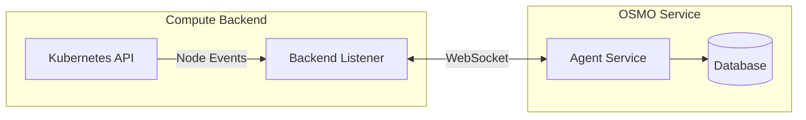
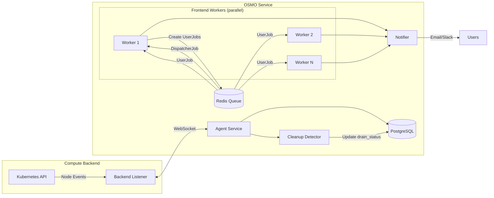
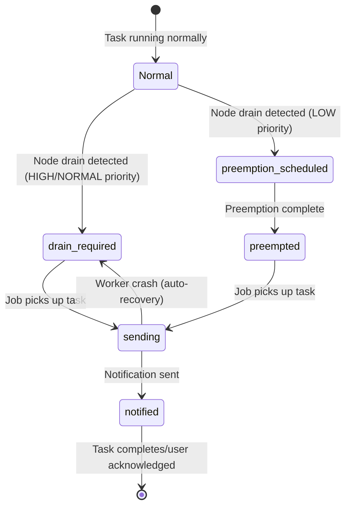
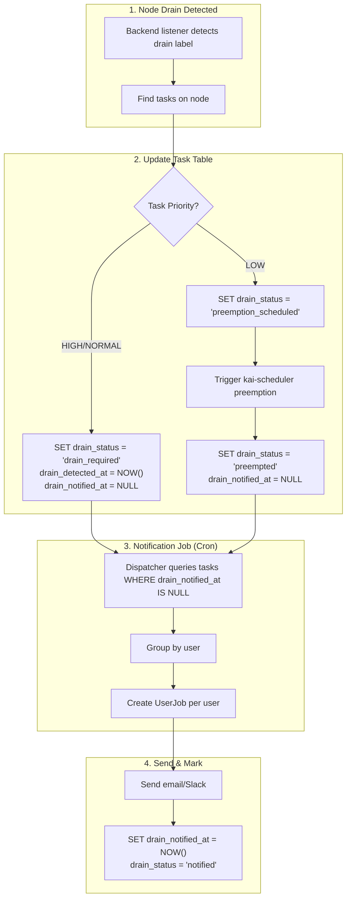
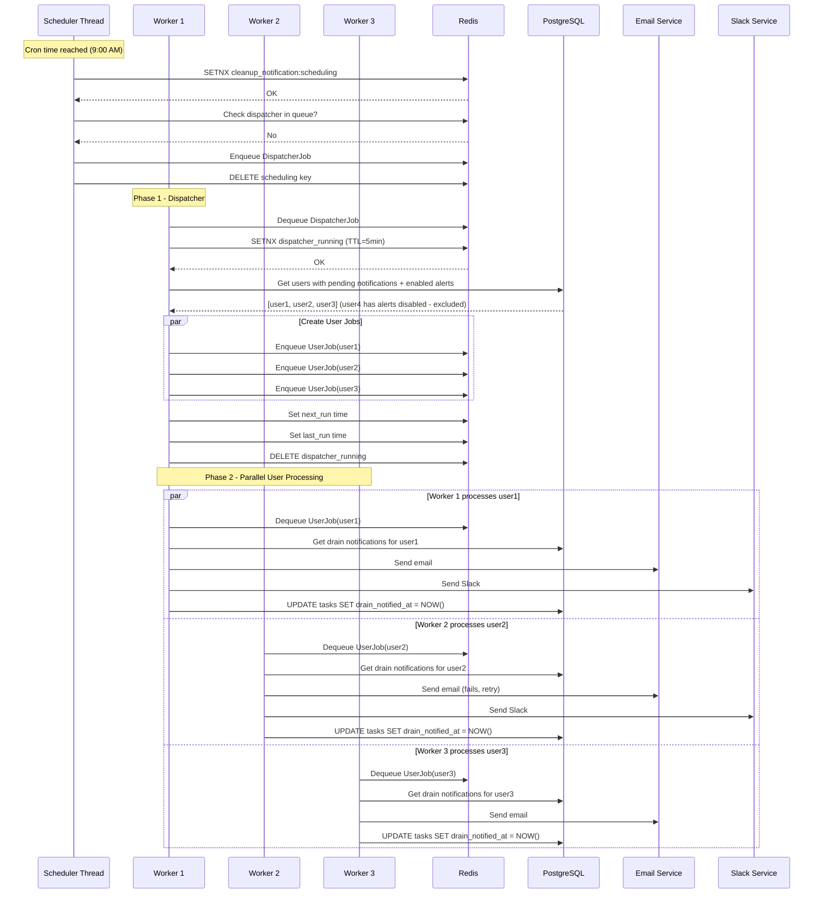

<!--
SPDX-FileCopyrightText: Copyright (c) 2026 NVIDIA CORPORATION. All rights reserved.

Licensed under the Apache License, Version 2.0 (the "License");
you may not use this file except in compliance with the License.
You may obtain a copy of the License at

http://www.apache.org/licenses/LICENSE-2.0

Unless required by applicable law or agreed to in writing, software
distributed under the License is distributed on an "AS IS" BASIS,
WITHOUT WARRANTIES OR CONDITIONS OF ANY KIND, either express or implied.
See the License for the specific language governing permissions and
limitations under the License.

SPDX-License-Identifier: Apache-2.0
-->

# Simplifying the Node Drain Process with Auto-Notifications

**Author**: @tdewan<br>
**PIC**: @tdewan<br>
**Proposal Issue**: [#340](https://github.com/nvidia/osmo/issues/340)

---

## Version History

| Version | Date | Changes |
|---------|------|---------|
| v1.0 | 2026-01-30 | Initial release - Two-phase job architecture with cron-based scheduling |

**Current Version: v1.0**

---

## Overview

This project introduces automated user notifications when nodes are marked for draining or cleanup in the compute backend. When the backend-listener detects specific node labels indicating a drain event, the system will automatically notify affected users about impacted workflows that require their attention.

### Motivation

Currently, when nodes are drained for maintenance or other operational reasons, users are not automatically notified about their affected workflows. This leads to:
- Delayed awareness of workflow disruptions
- Manual communication overhead for cluster administrators
- Potential loss of work if users don't take timely action to checkpoint or migrate their workloads

By automating notifications, we can:
- Improve user experience with proactive communication
- Reduce operational burden on administrators
- Give users time to prepare for workflow disruptions
- Enable better resource planning and workload management

### Problem

1. **Lack of Visibility**: Users have no automated way to know when their workflows are impacted by node drain events.
2. **Manual Communication**: Administrators must manually notify affected users, which is error-prone and time-consuming.
3. **Alert Fatigue**: Without proper batching, users could be overwhelmed with individual notifications for each affected task.
4. **Preemption Confusion**: Users may not understand why their low-priority workflows were cancelled/preempted.

## Use Cases

| Use Case | Description |
|---|---|
| Scheduled Maintenance | Administrator schedules node maintenance, system automatically notifies affected users |
| Emergency Node Drain | Node is cordoned due to hardware issues, users are notified of impacted workflows |
| Custom Label Drain | Production clusters using custom labels to mark nodes for draining, users get notified |
| Auto-Preempt for Node Drain | When a node needs draining and has LOW priority tasks, automatically preempt them via kai-scheduler to free the node, then notify the user |
| Daily Summary | User receives a single daily digest of all workflows affected by node events |

## Requirements

| Title | Description | Type |
|---|---|---|
| Configurable Cleanup Detection | System shall support configurable cleanup detection via cordon status or custom labels | Functional |
| Label-Based Detection | System shall detect drain events based on configurable node labels (default: `osmo.nvidia.com/cleanup=true`) | Functional |
| Per-Backend Tracking | Service shall track cleanup events per backend to handle multi-cluster deployments | Functional |
| Notification Batching | System shall batch notifications and send them at most once per day per user | Functional |
| Grouped Notifications | Notifications shall group affected workflows by pool, workflow ID, and impacted tasks | Functional |
| Email Notification | System shall send email notifications to users with notification preferences enabled | Functional |
| Slack Notification | System shall send Slack notifications to users with notification preferences enabled | Functional |
| Auto-Preempt LOW Priority | System shall automatically preempt LOW priority tasks on draining nodes and notify users | Functional |
| Feature Toggle | All cleanup notification features shall be gated behind `enable_cleanup` configuration flag | Functional |
| Custom Label Support | System shall support configurable custom labels for production drain detection | Functional |

---

## Design Summary (TL;DR)

### Key Design Decisions

| Decision | Choice | Rationale |
|----------|--------|-----------|
| **Detection Trigger** | Node labels / Cordon status | Configurable per environment |
| **Notification Frequency** | Cron-based (default: daily 9 AM UTC) | Prevents alert fatigue |
| **Job Architecture** | Two-phase (Dispatcher + User Jobs) | Parallel processing, no lock expiry |
| **Coordination** | Redis locks + deduplication | Distributed worker support |
| **User Preferences** | Check before job creation | No wasted jobs for disabled notifications |
| **Data Storage** | Tasks table (drain_status column) | Single source of truth, visible on workflow page |

### Two-Phase Job Flow

```
┌─────────────────────────────────────────────────────────────────────────┐
│  PHASE 1: Dispatcher (runs on cron)                                     │
│  ┌─────────────────────────────────────────────────────────────────┐   │
│  │ 1. Acquire lock (5 min TTL)                                      │   │
│  │ 2. Query users with pending notifications + enabled alerts       │   │
│  │ 3. Create UserJob for each eligible user                         │   │
│  │ 4. Release lock, schedule next run                               │   │
│  └─────────────────────────────────────────────────────────────────┘   │
└─────────────────────────────────────────────────────────────────────────┘
                                    │
                                    ▼
┌─────────────────────────────────────────────────────────────────────────┐
│  PHASE 2: User Jobs (parallel, distributed across workers)              │
│  ┌────────────┐  ┌────────────┐  ┌────────────┐  ┌────────────┐        │
│  │ Worker 1   │  │ Worker 2   │  │ Worker 3   │  │ Worker N   │        │
│  │ UserJob A  │  │ UserJob B  │  │ UserJob C  │  │ UserJob N  │        │
│  │ - Aggregate│  │ - Aggregate│  │ - Aggregate│  │ - Aggregate│        │
│  │ - Send     │  │ - Send     │  │ - Send     │  │ - Send     │        │
│  │ - Mark sent│  │ - Mark sent│  │ - Mark sent│  │ - Mark sent│        │
│  └────────────┘  └────────────┘  └────────────┘  └────────────┘        │
└─────────────────────────────────────────────────────────────────────────┘
```

### Redis Keys (Quick Reference)

| Key | Purpose |
|-----|---------|
| `cleanup_notification:dispatcher_running` | Dispatcher lock (5 min TTL) |
| `cleanup_notification:last_run` | Last successful run (missed-run detection) |
| `cleanup_notification:next_run` | Next scheduled run time |
| `dedupe:cleanup_user_{email}_{batch}` | Per-user job deduplication |

---

## Architectural Details

### Current Architecture



**Current Flow:**
1. Backend Listener watches node events from Kubernetes API
2. Node events are sent to Agent Service via WebSocket
3. Agent Service updates resource database
4. Notifications are only sent on workflow completion (not on node events)

### Proposed Architecture



**Proposed Flow (Two-Phase):**

**Phase 1 - Detection & Storage:**
1. Backend Listener detects node events with cleanup labels
2. `NodeDrainEvent` message sent to Agent Service
3. Cleanup Detector identifies affected workflows/tasks
4. Updates `drain_status` in tasks table

**Phase 2 - Dispatcher (runs on cron):**
5. Scheduler thread checks if cron time reached
6. Enqueues `CleanupNotificationDispatcherJob`
7. Dispatcher queries users with pending notifications AND enabled alerts
8. Creates individual `CleanupNotificationUserJob` per eligible user

**Phase 3 - User Notification (parallel):**
9. Multiple workers pick up user jobs from queue in parallel
10. Each worker processes one user: aggregate → send → mark sent
11. Delivery status tracked in tasks table

---

## Detailed Design

### 1. Configuration Schema

New configuration options for `BackendConfig`:

```yaml
cleanup:
  # Master toggle for cleanup notifications
  enable_cleanup: false

  # Detection methods (at least one must be enabled if enable_cleanup is true)
  enable_cleanup_on_cordon: false
  enable_cleanup_on_label: true

  # Label to detect cleanup events
  cleanup_label: "osmo.nvidia.com/cleanup"
  cleanup_label_value: "true"

  # Notification settings
  # Cron expression for when to send daily batch notifications
  # Default: 9:00 AM UTC every day
  notification_cron_schedule: "0 9 * * *"

  # Auto-preemption settings
  auto_preempt_low_priority: true
  preempt_grace_period_seconds: 30
```

**Production Configuration Example:**

```yaml
cleanup:
  enable_cleanup: true
  enable_cleanup_on_label: true
  cleanup_label: "example.com/node-state"  # Configure per environment
  cleanup_label_value: "draining"
```

### 2. Database Schema Changes

#### Task Table Changes (Existing Table)

Use the existing `tasks` table as the source of truth for drain status and notifications:

```sql
-- Add drain and notification tracking columns to existing tasks table
ALTER TABLE tasks
    ADD COLUMN drain_status VARCHAR(50) DEFAULT NULL,
    ADD COLUMN drain_detected_at TIMESTAMP WITH TIME ZONE,
    ADD COLUMN drain_reason TEXT,
    ADD COLUMN drain_notified_at TIMESTAMP WITH TIME ZONE;

-- Index for finding tasks needing notification
CREATE INDEX idx_tasks_drain_pending_notification
    ON tasks(drain_status, drain_notified_at)
    WHERE drain_status IS NOT NULL AND drain_notified_at IS NULL;
```

#### Drain Status Values

| `drain_status` | Description | Notification |
|----------------|-------------|--------------|
| `NULL` | No drain detected | None |
| `drain_required` | Node needs drain, task affected | Pending |
| `preemption_scheduled` | LOW priority, preemption triggered | Pending |
| `preempted` | Task was auto-preempted | Pending |
| `sending` | Notification in progress | In Progress |
| `notified` | User has been notified | Sent |

#### Notification State Machine (Based on Task Table)



#### Notification Query (Simple!)

Instead of a separate notifications table, query tasks directly:

```sql
-- Get all tasks needing notification (grouped by user)
SELECT
    w.user as user_email,
    w.workflow_id,
    t.name as task_name,
    t.drain_status,
    t.drain_reason,
    t.drain_detected_at,
    p.name as pool_name,
    t.node_name
FROM tasks t
JOIN workflows w ON t.workflow_uuid = w.workflow_uuid
JOIN pools p ON w.pool_uuid = p.pool_uuid
WHERE t.drain_status IS NOT NULL
  AND t.drain_notified_at IS NULL
  AND t.status IN ('RUNNING', 'PENDING')
ORDER BY w.user, w.workflow_id;
```

#### State Transitions



#### Workflow Page UI Integration

The task drain status is exposed via the existing task API:

```python
class TaskResponse(pydantic.BaseModel):
    name: str
    status: TaskStatus
    node_name: Optional[str]
    # ... existing fields ...

    # Drain tracking fields
    drain_status: Optional[str] = None
    drain_detected_at: Optional[datetime.datetime] = None
    drain_reason: Optional[str] = None
    drain_notified_at: Optional[datetime.datetime] = None
```

**UI Display:**

| `drain_status` | Badge | Color | Tooltip |
|----------------|-------|-------|---------|
| `drain_required` | ⚠️ Drain Scheduled | Yellow | "Node scheduled for maintenance" |
| `preemption_scheduled` | 🔄 Preempting | Orange | "Task being preempted" |
| `preempted` | ⏹️ Preempted | Red | "Preempted for node drain" |
| `notified` | ✉️ Notified | Gray | "User notified" |
| `NULL` | (none) | - | - |

### 3. Backend Listener Changes

#### New Message Type

```python
class NodeDrainBody(pydantic.BaseModel):
    """Message body for node drain events."""
    node_name: str
    detection_type: str  # 'cordon', 'label'
    label_key: Optional[str] = None
    label_value: Optional[str] = None
    timestamp: datetime.datetime

class MessageType(str, enum.Enum):
    # ... existing types ...
    NODE_DRAIN = 'node_drain'
```

#### Detection Logic in `watch_node_events`

```python
def check_node_for_cleanup(node, config: BackendListenerConfig) -> Optional[NodeDrainBody]:
    """Check if a node should trigger cleanup notifications."""
    if not config.cleanup.enable_cleanup:
        return None

    # Check for cordon (unschedulable)
    if config.cleanup.enable_cleanup_on_cordon and node.spec.unschedulable:
        return NodeDrainBody(
            node_name=node.metadata.name,
            detection_type='cordon',
            timestamp=datetime.datetime.now(datetime.timezone.utc)
        )

    # Check for cleanup label
    if config.cleanup.enable_cleanup_on_label:
        labels = node.metadata.labels or {}
        label_key = config.cleanup.cleanup_label
        expected_value = config.cleanup.cleanup_label_value

        if labels.get(label_key) == expected_value:
            return NodeDrainBody(
                node_name=node.metadata.name,
                detection_type='label',
                label_key=label_key,
                label_value=expected_value,
                timestamp=datetime.datetime.now(datetime.timezone.utc)
            )

    return None
```

### 4. Service-Side Cleanup Detector

New module: `src/service/cleanup_detector.py`

```python
class CleanupDetector:
    """Detects and tracks workflows affected by node cleanup events."""

    def __init__(self, database: PostgresDatabase):
        self.database = database

    async def process_node_drain_event(
        self,
        backend_name: str,
        drain_event: NodeDrainBody
    ) -> List[AffectedWorkflow]:
        """
        Process a node drain event and identify affected workflows.
        Returns list of affected workflows with their details.
        """
        # Query running tasks on the affected node
        affected = self.database.query("""
            SELECT DISTINCT
                w.workflow_id,
                w.workflow_uuid,
                w.user as user_email,
                w.priority,
                t.name as task_name,
                t.task_uuid,
                p.name as pool_name
            FROM workflows w
            JOIN tasks t ON w.workflow_uuid = t.workflow_uuid
            JOIN pools p ON w.pool_uuid = p.pool_uuid
            WHERE t.node_name = %s
              AND t.status IN ('RUNNING', 'PENDING')
        """, [drain_event.node_name])

        # Update drain_status in tasks table
        for workflow in affected:
            self._update_task_drain_status(
                backend_name, drain_event, workflow
            )

        return affected

    def _update_task_drain_status(self, backend_name, drain_event, workflow):
        """Update task drain status based on priority."""
        if workflow.priority == 'LOW':
            drain_status = 'preemption_scheduled'
        else:
            drain_status = 'drain_required'

        self.database.execute_commit_command("""
            UPDATE tasks
            SET drain_status = %s,
                drain_detected_at = %s,
                drain_reason = %s
            WHERE task_uuid = %s
              AND drain_status IS NULL
        """, [
            drain_status,
            drain_event.timestamp,
            f'Node {drain_event.node_name} marked for drain ({drain_event.detection_type})',
            workflow.task_uuid
        ])
```

### 5. Notification Aggregator

New module: `src/service/notification_aggregator.py`

```python
class NotificationAggregator:
    """Aggregates cleanup notifications for batch delivery."""

    def __init__(self, database: PostgresDatabase):
        self.database = database

    def get_pending_notifications_for_user(
        self,
        user_email: str,
        only_active_workflows: bool = True
    ) -> Dict[str, List[GroupedNotification]]:
        """
        Get all pending notifications grouped by backend and pool.
        Returns: {backend_name: [GroupedNotification]}
        """
        status_filter = "AND t.status IN ('RUNNING', 'PENDING')" if only_active_workflows else ""

        notifications = self.database.query(f"""
            SELECT
                b.name as backend_name,
                p.name as pool_name,
                w.workflow_id,
                array_agg(DISTINCT t.name) as tasks,
                array_agg(DISTINCT t.node_name) as nodes,
                t.drain_status,
                MIN(t.drain_detected_at) as first_detected
            FROM tasks t
            JOIN workflows w ON t.workflow_uuid = w.workflow_uuid
            JOIN pools p ON w.pool_uuid = p.pool_uuid
            JOIN backends b ON w.backend = b.name
            WHERE w.user = %s
              AND t.drain_status IS NOT NULL
              AND t.drain_notified_at IS NULL
              {status_filter}
            GROUP BY b.name, p.name, w.workflow_id, t.drain_status
            ORDER BY b.name, p.name, first_detected
        """, [user_email])

        return self._group_by_backend(notifications)

    def build_notification_message(
        self,
        grouped: Dict[str, List[GroupedNotification]]
    ) -> NotificationContent:
        """Build formatted notification content for email/Slack."""
        # Format as grouped digest
        ...
```

### 6. Worker-Based Notification Jobs

Leverages the existing frontend worker infrastructure (`worker.py`) with a two-phase job design:

1. **Phase 1: Dispatcher Job** - Runs on cron, creates per-user notification jobs
2. **Phase 2: User Notification Job** - Sends notification to a single user

This design:
- Prevents lock expiry issues (each user job is fast)
- Distributes work across multiple workers
- Respects user preferences before creating jobs
- Ensures one notification per user per cron cycle

#### Job Definitions

New job types in `src/utils/job/jobs.py`:

```python
# Redis keys for cleanup notification job coordination
CLEANUP_DISPATCHER_LOCK_KEY = 'cleanup_notification:dispatcher_running'
CLEANUP_NOTIFICATION_NEXT_RUN_KEY = 'cleanup_notification:next_run'
CLEANUP_LAST_RUN_KEY = 'cleanup_notification:last_run'
CLEANUP_BATCH_ID_KEY = 'cleanup_notification:current_batch'

# TTL for the dispatcher lock (short - only creates user jobs)
CLEANUP_DISPATCHER_LOCK_TTL = 300  # 5 minutes


# ============================================================================
# PHASE 1: Dispatcher Job - Creates per-user notification jobs
# ============================================================================

class CleanupNotificationDispatcherJob(Job):
    """
    Dispatcher job that runs on cron schedule.

    This job:
    1. Queries all users with pending cleanup notifications
    2. Checks each user's notification preferences (email/slack enabled)
    3. Creates individual CleanupNotificationUserJob for eligible users
    4. Schedules the next dispatcher run based on cron configuration

    This job is lightweight and fast - it only creates jobs, doesn't send notifications.
    """
    job_type: Literal['cleanup_notification_dispatcher'] = 'cleanup_notification_dispatcher'

    def execute(
        self,
        context: JobExecutionContext,
        progress_writer: progress.ProgressWriter,
        progress_iter_freq: datetime.timedelta = datetime.timedelta(seconds=15)
    ) -> JobResult:
        redis_client = context.redis_client

        # Acquire distributed lock (short TTL since this job is fast)
        lock_acquired = redis_client.set(
            CLEANUP_DISPATCHER_LOCK_KEY,
            self.job_uuid,
            nx=True,
            ex=CLEANUP_DISPATCHER_LOCK_TTL
        )

        if not lock_acquired:
            logging.info('CleanupNotificationDispatcherJob already running, skipping')
            return JobResult(status=JobStatus.SUCCESS, message='Skipped - already running')

        try:
            # Generate unique batch ID for this dispatch cycle
            batch_id = f'batch_{datetime.datetime.now(datetime.timezone.utc).strftime("%Y%m%d_%H%M%S")}'
            redis_client.set(CLEANUP_BATCH_ID_KEY, batch_id, ex=86400)  # 24hr TTL

            # Create user jobs
            jobs_created = self._dispatch_user_jobs(context, batch_id, progress_writer)

            # Schedule next run based on cron
            self._schedule_next_run(context)

            return JobResult(
                status=JobStatus.SUCCESS,
                message=f'Dispatched {jobs_created} user notification jobs'
            )
        finally:
            # Release lock
            redis_client.delete(CLEANUP_DISPATCHER_LOCK_KEY)

    def _dispatch_user_jobs(
        self,
        context: JobExecutionContext,
        batch_id: str,
        progress_writer: progress.ProgressWriter
    ) -> int:
        """Query eligible users and create notification jobs for each."""

        # Get users with pending drain notifications AND enabled alerts
        # Query tasks table directly, join with user_profiles
        eligible_users = context.postgres.query("""
            SELECT DISTINCT
                w.user as user_email,
                up.email_notification,
                up.slack_notification
            FROM tasks t
            JOIN workflows w ON t.workflow_uuid = w.workflow_uuid
            JOIN user_profiles up ON w.user = up.email
            WHERE t.drain_status IS NOT NULL
              AND t.drain_notified_at IS NULL
              AND t.status IN ('RUNNING', 'PENDING')
              AND (up.email_notification = TRUE OR up.slack_notification = TRUE)
        """)

        jobs_created = 0
        for user in eligible_users:
            # Skip users who have disabled all notifications
            if not user.email_notification and not user.slack_notification:
                logging.debug('Skipping user %s - all notifications disabled', user.user_email)
                continue

            # Check if user already has a pending job for this batch
            job_id = f'cleanup_user_{user.user_email}_{batch_id}'
            if context.redis_client.exists(f'dedupe:{job_id}'):
                logging.debug('Skipping user %s - job already exists for batch', user.user_email)
                continue

            # Create per-user notification job
            user_job = CleanupNotificationUserJob(
                job_id=job_id,
                job_uuid=common.generate_unique_id(16),
                user_email=user.user_email,
                batch_id=batch_id,
                send_email=user.email_notification,
                send_slack=user.slack_notification
            )
            user_job.send_job_to_queue()
            jobs_created += 1

            if jobs_created % 100 == 0:
                progress_writer.report_progress()
                logging.info('Dispatched %d user notification jobs', jobs_created)

        return jobs_created

    def _schedule_next_run(self, context: JobExecutionContext):
        """Calculate and store the next dispatcher run time and record successful completion."""
        workflow_config = context.postgres.get_workflow_configs()
        cron_schedule = workflow_config.cleanup.notification_cron_schedule

        # Calculate next run time based on cron
        next_run = croniter(
            cron_schedule,
            datetime.datetime.now(datetime.timezone.utc)
        ).get_next(datetime.datetime)

        # Store next scheduled run time
        context.redis_client.set(
            CLEANUP_NOTIFICATION_NEXT_RUN_KEY,
            next_run.isoformat()
        )

        # Record this successful run (used for missed run detection)
        context.redis_client.set(
            CLEANUP_LAST_RUN_KEY,
            datetime.datetime.now(datetime.timezone.utc).isoformat()
        )

        logging.info('Dispatcher completed. Next run scheduled for %s', next_run)


# ============================================================================
# PHASE 2: User Notification Job - Sends notification to single user
# ============================================================================

class CleanupNotificationUserJob(Job):
    """
    Per-user notification job.

    This job:
    1. Aggregates all pending notifications for a single user
    2. Groups by backend/pool/workflow
    3. Sends one consolidated notification via email and/or Slack
    4. Marks all notifications as sent

    Each job is fast (~seconds) so no lock renewal needed.
    """
    job_type: Literal['cleanup_notification_user'] = 'cleanup_notification_user'

    # User to send notification to
    user_email: str
    # Batch ID from dispatcher (for deduplication)
    batch_id: str
    # Channels to send (pre-checked by dispatcher)
    send_email: bool = False
    send_slack: bool = False

    def execute(
        self,
        context: JobExecutionContext,
        progress_writer: progress.ProgressWriter,
        progress_iter_freq: datetime.timedelta = datetime.timedelta(seconds=15)
    ) -> JobResult:

        # Double-check user preferences (may have changed since dispatch)
        profile = connectors.UserProfile.fetch_from_db(context.postgres, self.user_email)

        if not profile.email_notification and not profile.slack_notification:
            logging.info('User %s has disabled all notifications, skipping', self.user_email)
            self._mark_notifications_processed(context, skipped=True)
            return JobResult(status=JobStatus.SUCCESS, message='Skipped - notifications disabled')

        # Get pending notifications for this user (only active workflows)
        aggregator = NotificationAggregator(context.postgres)
        grouped = aggregator.get_pending_notifications_for_user(
            self.user_email,
            only_active_workflows=True
        )

        if not grouped:
            logging.info('No pending notifications for user %s', self.user_email)
            return JobResult(status=JobStatus.SUCCESS, message='No pending notifications')

        # Build notification content
        content = aggregator.build_notification_message(grouped)

        # Send notifications
        workflow_config = context.postgres.get_workflow_configs()
        notifier = Notifier(workflow_config.workflow_alerts)

        email_status = 'skipped'
        slack_status = 'skipped'

        if self.send_email and profile.email_notification:
            email_status = self._send_with_retry(
                notifier.send_cleanup_email_notification,
                self.user_email,
                content,
                channel='email'
            )

        if self.send_slack and profile.slack_notification:
            slack_status = self._send_with_retry(
                notifier.send_cleanup_slack_notification,
                self.user_email,
                content,
                channel='slack'
            )

        # Mark notifications as sent
        self._mark_notifications_sent(context, email_status, slack_status)

        return JobResult(
            status=JobStatus.SUCCESS,
            message=f'Sent notification to {self.user_email} (email={email_status}, slack={slack_status})'
        )

    def _send_with_retry(
        self,
        send_func: Callable,
        user_email: str,
        content: NotificationContent,
        channel: str,
        max_retries: int = 3
    ) -> str:
        """Send notification with retry logic."""
        for attempt in range(max_retries):
            try:
                send_func(user_email, content)
                return 'sent'
            except Exception as e:
                logging.warning(
                    'Failed to send %s to %s (attempt %d/%d): %s',
                    channel, user_email, attempt + 1, max_retries, e
                )
                if attempt < max_retries - 1:
                    time.sleep(2 ** attempt)  # Exponential backoff

        logging.error('All retries failed for %s notification to %s', channel, user_email)
        return 'failed'

    def _mark_notifications_sent(
        self,
        context: JobExecutionContext,
        email_status: str,
        slack_status: str
    ):
        """Mark all pending drain notifications for this user as sent."""
        context.postgres.execute_commit_command("""
            UPDATE tasks t
            SET drain_notified_at = NOW(),
                drain_status = 'notified'
            FROM workflows w
            WHERE t.workflow_uuid = w.workflow_uuid
              AND w.user = %s
              AND t.drain_status IS NOT NULL
              AND t.drain_notified_at IS NULL
              AND t.status IN ('RUNNING', 'PENDING')
        """, [self.user_email])

    def _mark_notifications_processed(self, context: JobExecutionContext, skipped: bool = False):
        """Mark drain notifications as processed (even if skipped)."""
        new_status = 'skipped' if skipped else 'notified'
        context.postgres.execute_commit_command("""
            UPDATE tasks t
            SET drain_notified_at = NOW(),
                drain_status = %s
            FROM workflows w
            WHERE t.workflow_uuid = w.workflow_uuid
              AND w.user = %s
              AND t.drain_status IS NOT NULL
              AND t.drain_notified_at IS NULL
        """, [new_status, self.user_email])


# Add to FRONTEND_JOBS registry
FRONTEND_JOBS['cleanup_notification_dispatcher'] = CleanupNotificationDispatcherJob
FRONTEND_JOBS['cleanup_notification_user'] = CleanupNotificationUserJob
```

#### Job Scheduler (Bootstrap)

New module: `src/service/cleanup_scheduler.py`

This runs on worker startup to check if a cleanup notification job needs to be scheduled:

```python
class CleanupNotificationScheduler:
    """
    Scheduler that ensures the cleanup notification dispatcher job is queued.

    Called on worker startup and periodically to:
    1. Check if dispatcher is already running or scheduled
    2. If not, check if it's time to run based on cron schedule
    3. Enqueue dispatcher job if needed
    """

    def __init__(self, redis_client, postgres: PostgresConnector):
        self.redis_client = redis_client
        self.postgres = postgres

    def ensure_job_scheduled(self):
        """Ensure cleanup notification dispatcher is scheduled if needed."""
        workflow_config = self.postgres.get_workflow_configs()

        # Feature flag check
        if not workflow_config.cleanup.enable_cleanup:
            return

        # Check if dispatcher is currently running
        if self.redis_client.exists(CLEANUP_DISPATCHER_LOCK_KEY):
            return

        # Atomically claim scheduling right (prevents race condition)
        claimed = self.redis_client.set(
            'cleanup_notification:scheduling',
            '1',
            nx=True,
            ex=10  # Short TTL for scheduling window
        )
        if not claimed:
            return  # Another worker is scheduling

        try:
            # Check if dispatcher job is already in queue
            if self._is_dispatcher_in_queue():
                return

            # Check if it's time to run
            if self._should_run_now(workflow_config.cleanup.notification_cron_schedule):
                self._enqueue_dispatcher()
        finally:
            self.redis_client.delete('cleanup_notification:scheduling')

    def _is_dispatcher_in_queue(self) -> bool:
        """Check if dispatcher job exists in Redis queue."""
        job_id = 'cleanup_notification_dispatcher_scheduled'
        return self.redis_client.exists(f'dedupe:{job_id}')

    def _should_run_now(self, cron_schedule: str) -> bool:
        """Check if current time matches cron schedule or missed a run."""
        now = datetime.datetime.now(datetime.timezone.utc)
        cron = croniter(cron_schedule, now)

        # Get the most recent scheduled time (before now)
        prev_scheduled = cron.get_prev(datetime.datetime)

        # Check 1: Is it time for the next scheduled run?
        next_run_str = self.redis_client.get(CLEANUP_NOTIFICATION_NEXT_RUN_KEY)
        if next_run_str:
            next_run = datetime.datetime.fromisoformat(next_run_str.decode())
            if now >= next_run:
                return True

        # Check 2: Did we miss a scheduled run?
        last_run_str = self.redis_client.get(CLEANUP_LAST_RUN_KEY)

        if last_run_str:
            last_run_time = datetime.datetime.fromisoformat(last_run_str.decode())

            # If last_run is BEFORE the previous scheduled time, we missed that run!
            if last_run_time < prev_scheduled:
                logging.warning(
                    'Missed scheduled run! Last run: %s, Should have run at: %s',
                    last_run_time, prev_scheduled
                )
                return True
        else:
            # First run ever - run now
            return True

        return False

    def _enqueue_dispatcher(self):
        """Enqueue the dispatcher job."""
        job = CleanupNotificationDispatcherJob(
            job_id='cleanup_notification_dispatcher_scheduled',
            job_uuid=common.generate_unique_id(16)
        )
        job.send_job_to_queue()
        logging.info('Enqueued cleanup notification dispatcher job')
```

#### Worker Startup Integration

```python
# In worker.py main():
def main():
    config = WorkerConfig.load()
    src.lib.utils.logging.init_logger('worker', config)
    # ... existing setup ...

    # Initialize cleanup notification scheduler
    redis_client = connectors.RedisConnector.get_instance().client
    postgres = connectors.PostgresConnector(config)

    cleanup_scheduler = CleanupNotificationScheduler(redis_client, postgres)
    cleanup_scheduler.ensure_job_scheduled()

    # Start periodic check thread
    scheduler_thread = threading.Thread(
        name='cleanup_scheduler_thread',
        target=_periodic_cleanup_check,
        args=(cleanup_scheduler,),
        daemon=True
    )
    scheduler_thread.start()

    # ... rest of worker startup ...


def _periodic_cleanup_check(scheduler: CleanupNotificationScheduler):
    """Periodically check if dispatcher job needs to be scheduled."""
    while True:
        time.sleep(60)  # Check every minute
        try:
            scheduler.ensure_job_scheduled()
        except Exception as e:
            logging.warning('Error in cleanup scheduler check: %s', e)
```

#### Redis Key Design

| Key | Purpose | TTL |
|-----|---------|-----|
| `cleanup_notification:dispatcher_running` | Lock for dispatcher job | 5 min |
| `cleanup_notification:scheduling` | Atomic scheduling claim | 10 sec |
| `cleanup_notification:next_run` | Next scheduled dispatcher run | None |
| `cleanup_notification:last_run` | Last successful dispatcher completion | None |
| `cleanup_notification:current_batch` | Current batch ID | 24 hours |
| `dedupe:cleanup_notification_dispatcher_scheduled` | Dispatcher deduplication | 5 days |
| `dedupe:cleanup_user_{email}_{batch}` | Per-user job deduplication | 5 days |

#### Sequence Diagram



#### Design Benefits

| Aspect | Benefit |
|--------|---------|
| **Lock duration** | Minutes (dispatcher only creates jobs) |
| **Parallelism** | Multiple workers process user jobs concurrently |
| **Failure isolation** | Single user affected per job failure |
| **User preferences** | Checked before job creation (no wasted jobs) |
| **Retry granularity** | Per-user retry on failure |
| **Queue visibility** | N jobs visible (one per user) |
| **Memory usage** | One user loaded at a time |

### 7. Notification Templates

#### Email Template

```html
<h2>🚧 OSMO Node Drain Alert</h2>
<p>The following workflows require your attention due to node maintenance:</p>


<h3>Backend: {{ backend }}</h3>

<div class="pool-section">
    <h4>Pool: {{ pool_group.pool_name }}</h4>
    <table>
        <tr>
            <th>Workflow ID</th>
            <th>Affected Tasks</th>
            <th>Nodes</th>
            <th>Reason</th>
        </tr>
        
        <tr>
            <td><a href="{{ service_url }}/workflows/{{ workflow.workflow_id }}">
                {{ workflow.workflow_id }}
            </a></td>
            <td>{{ workflow.tasks | join(', ') }}</td>
            <td>{{ workflow.nodes | join(', ') }}</td>
            <td>{{ workflow.drain_status }}</td>
        </tr>
        
    </table>
</div>



<p><strong>Recommended Actions:</strong></p>
<ul>
    <li>Save any important checkpoints</li>
    <li>Consider migrating workloads to other nodes</li>
    <li>Contact your administrator for maintenance schedule details</li>
</ul>
```

#### Slack Template

```python
def build_cleanup_slack_blocks(grouped: Dict) -> List[Dict]:
    blocks = [
        {
            "type": "header",
            "text": {
                "type": "plain_text",
                "text": "🚧 OSMO Node Drain Alert"
            }
        },
        {
            "type": "section",
            "text": {
                "type": "mrkdwn",
                "text": "The following workflows require your attention:"
            }
        },
        {"type": "divider"}
    ]

    for backend, pools in grouped.items():
        blocks.append({
            "type": "section",
            "text": {
                "type": "mrkdwn",
                "text": f"*Backend:* `{backend}`"
            }
        })

        for pool_group in pools:
            workflow_list = "\n".join([
                f"• <{url}/workflows/{w.workflow_id}|{w.workflow_id}> - "
                f"Tasks: {', '.join(w.tasks)}"
                for w in pool_group.workflows
            ])

            blocks.append({
                "type": "section",
                "text": {
                    "type": "mrkdwn",
                    "text": f"*Pool: {pool_group.pool_name}*\n{workflow_list}"
                }
            })

    return blocks
```

### 8. Auto-Preemption for Node Drain

When a node is marked for draining and has LOW priority tasks running, the system can automatically preempt those tasks to free up the node, then notify the affected users.

#### Flow

```
Node marked for drain (label detected)
           │
           ▼
┌─────────────────────────────────┐
│ Check tasks running on node     │
│ ┌─────────────────────────────┐ │
│ │ HIGH priority → Notify only │ │
│ │ NORMAL priority → Notify    │ │
│ │ LOW priority → Preempt +    │ │
│ │                 Notify      │ │
│ └─────────────────────────────┘ │
└─────────────────────────────────┘
           │
           ▼
    Node cleared for drain
```

#### Implementation

```python
class NodeDrainPreemptionHandler:
    """
    Handles automatic preemption of LOW priority tasks on draining nodes.

    When a node is detected as needing drain:
    1. Find all tasks running on the node
    2. For LOW priority tasks: trigger preemption via kai-scheduler
    3. Update drain_status in tasks table for all affected users
    """

    def handle_node_drain_event(
        self,
        backend_name: str,
        node_name: str,
        drain_event: NodeDrainBody
    ):
        """Process a node drain event and handle LOW priority preemption."""

        # Get all tasks running on this node
        tasks_on_node = self._get_tasks_on_node(backend_name, node_name)

        for task in tasks_on_node:
            workflow = self._get_workflow(task.workflow_uuid)

            if workflow.priority == WorkflowPriority.LOW:
                # LOW priority: Auto-preempt to free the node
                self._trigger_preemption(backend_name, task)

                # Update task with preemption status
                self._update_task_drain_status(
                    task=task,
                    drain_status='preempted',
                    reason=f'Preempted to free node {node_name} for drain'
                )
            else:
                # NORMAL/HIGH priority: Notify only (no auto-preemption)
                self._update_task_drain_status(
                    task=task,
                    drain_status='drain_required',
                    reason=f'Node {node_name} scheduled for drain'
                )

    def _trigger_preemption(self, backend_name: str, task: Task):
        """
        Trigger kai-scheduler to preempt the LOW priority task.

        This can be done by:
        1. Deleting the pod (kai-scheduler will reschedule if configured)
        2. Or: Sending a preemption request to kai-scheduler API
        """
        # Option 1: Delete pod to trigger reschedule
        api = client.CoreV1Api()
        api.delete_namespaced_pod(
            name=task.pod_name,
            namespace=task.namespace,
            body=client.V1DeleteOptions(grace_period_seconds=30)
        )

        logging.info(
            'Triggered preemption for LOW priority task %s on node %s',
            task.name, task.node_name
        )
```

#### Configuration

```yaml
cleanup:
  enable_cleanup: true
  enable_cleanup_on_label: true
  cleanup_label: "example.com/node-state"  # Configure per environment
  cleanup_label_value: "draining"

  # Auto-preemption settings
  auto_preempt_low_priority: true  # Enable auto-preemption for LOW priority
  preempt_grace_period_seconds: 30  # Grace period before pod deletion
```

#### Notification Content for Preempted Workflows

Users whose LOW priority workflows were auto-preempted receive a specific message:

```
🔄 Your workflow **{workflow_id}** was automatically preempted.

**Reason**: Node {node_name} is being drained for maintenance.
**Priority**: LOW (preemptible)
**Action**: Your workflow will be automatically rescheduled to another node.

If rescheduling is disabled, you can manually resubmit the workflow.
```

---

## Appendix A: Loopholes and Edge Cases

This section documents potential issues with the worker-based notification job approach and their mitigations.

> **Note**: Most loopholes are addressed by the two-phase architecture design.

#### 1. Race Condition: Multiple Workers Enqueueing Jobs

**Problem**: If multiple workers start simultaneously (e.g., during deployment), they may all check Redis at the same time, find no job exists, and each enqueue a duplicate job.

**Scenario**:
```
T0: Worker1 checks dedupe key → not exists
T0: Worker2 checks dedupe key → not exists
T1: Worker1 enqueues job
T1: Worker2 enqueues job  ← DUPLICATE
```

**Mitigation**:
- Use Redis `SETNX` (set if not exists) when enqueueing to atomically claim the scheduling right
- The job execution lock (`cleanup_notification:dispatcher_running`) prevents duplicate processing even if duplicate jobs are enqueued

```python
def _enqueue_job(self):
    # Atomically check and set scheduling claim
    claimed = self.redis_client.set(
        'cleanup_notification:scheduling',
        '1',
        nx=True,
        ex=10  # Short TTL, just for scheduling window
    )
    if not claimed:
        return  # Another worker is scheduling

    job = CleanupNotificationDispatcherJob(...)
    job.send_job_to_queue()
```

#### 2. Missed Scheduled Run

**Problem**: If all workers are down or busy during the scheduled cron time, the notification job may be missed entirely.

**Scenario**:
- Cron schedule: `0 9 * * *` (9:00 AM)
- All workers down from 8:55 AM to 9:10 AM
- When workers come back, they check `_should_run_now()` but 9:00 AM window has passed

**Mitigation** (Using cron schedule to detect missed runs):

1. **Track last successful run**: Store `cleanup_notification:last_run` timestamp after dispatcher completes
2. **Compare against cron schedule**: If `last_run < previous_scheduled_time` → we missed a run
3. **Periodic scheduler check**: Worker checks every 60 seconds, not just on startup

```python
def _should_run_now(self, cron_schedule: str) -> bool:
    now = datetime.datetime.now(datetime.timezone.utc)
    cron = croniter(cron_schedule, now)

    # Get the most recent scheduled time (before now)
    prev_scheduled = cron.get_prev(datetime.datetime)

    # Check 1: Is it time for the next scheduled run?
    next_run_str = self.redis_client.get(CLEANUP_NOTIFICATION_NEXT_RUN_KEY)
    if next_run_str:
        next_run = datetime.datetime.fromisoformat(next_run_str.decode())
        if now >= next_run:
            return True

    # Check 2: Did we miss a scheduled run?
    last_run_str = self.redis_client.get(CLEANUP_LAST_RUN_KEY)

    if last_run_str:
        last_run_time = datetime.datetime.fromisoformat(last_run_str.decode())

        # If last_run is BEFORE the previous scheduled time, we missed that run!
        if last_run_time < prev_scheduled:
            logging.warning(
                'Missed scheduled run! Last run: %s, Should have run at: %s',
                last_run_time, prev_scheduled
            )
            return True
    else:
        # First run ever - run if we're past a scheduled time
        return True

    return False
```

**Logic Explanation**:
```
Cron: 0 9 * * * (9:00 AM daily)
Current time: Day 2, 10:30 AM

prev_scheduled = Day 2, 9:00 AM  (most recent scheduled time before now)

Case A - Normal (ran on time):
  last_run = Day 2, 9:05 AM
  last_run (9:05 AM) > prev_scheduled (9:00 AM) → Already ran ✅ NO ACTION

Case B - Missed run (workers were down):
  last_run = Day 1, 9:05 AM
  last_run (Day 1 9:05 AM) < prev_scheduled (Day 2 9:00 AM) → Missed! ✅ RUN NOW

Case C - First time ever:
  last_run = None
  → ✅ RUN NOW
```

#### 3. ~~Lock Expiry During Long-Running Job~~ ✅ RESOLVED

**Original Problem**: Single job processing all users could exceed lock TTL.

**Resolution**: Two-phase architecture eliminates this issue:
- **Dispatcher Job**: Only creates user jobs, completes in seconds (5-min lock TTL is sufficient)
- **User Jobs**: Process single user each, complete in seconds (no lock needed)

Even with 100,000 users, the dispatcher only enqueues jobs - it doesn't wait for them to complete.

```
Before (Single Job):
  Worker1: [Process user1] → [Process user2] → ... → [Process user100000]
  Duration: Hours ❌ Lock expires

After (Two-Phase):
  Dispatcher: [Create job1] → [Create job2] → ... → [Create job100000]
  Duration: Seconds ✅

  Workers (parallel):
    W1: [Send to user1] ✅
    W2: [Send to user2] ✅
    W3: [Send to user3] ✅
    ...
```

#### 4. Worker Crash After Sending, Before Marking Sent

**Problem**: If a worker crashes after sending notifications but before updating `drain_notified_at` in the tasks table, users will receive duplicate notifications on the next run.

**Scenario**:
```
T0: Worker sends email to user@example.com
T1: Worker crashes before UPDATE tasks SET drain_notified_at = NOW()
T2: Next job run queries tasks with drain_notified_at IS NULL
T3: Same notifications sent again ← DUPLICATE
```

**Mitigation**:
- Use database transactions with "processing" state
- Mark as "sending" before sending, then "notified" after
- On job start, clean up stale "sending" records older than lock TTL

```sql
-- Mark as processing before sending
UPDATE tasks t
SET drain_status = 'sending'
FROM workflows w
WHERE t.workflow_uuid = w.workflow_uuid
  AND w.user = %s
  AND t.drain_status IN ('drain_required', 'preempted')
  AND t.drain_notified_at IS NULL;

-- After successful send
UPDATE tasks t
SET drain_notified_at = NOW(),
    drain_status = 'notified'
FROM workflows w
WHERE t.workflow_uuid = w.workflow_uuid
  AND w.user = %s
  AND t.drain_status = 'sending';

-- On job start, reset stale "sending" records
UPDATE tasks
SET drain_status = 'drain_required'
WHERE drain_status = 'sending'
  AND drain_detected_at < NOW() - INTERVAL '2 hours';
```

#### 5. Redis Unavailability

**Problem**: If Redis is temporarily unavailable, the scheduler cannot check job status or acquire locks, potentially causing jobs to not run or run duplicately.

**Scenario**:
- Redis failover happens during cron window
- Workers cannot check `cleanup_notification:running`
- When Redis comes back, multiple workers may have queued jobs

**Mitigation**:
- Add retry logic with exponential backoff for Redis operations
- Fall back to database-based locking if Redis is unavailable
- Use Redis Sentinel/Cluster for high availability

```python
def ensure_job_scheduled(self):
    max_retries = 3
    for attempt in range(max_retries):
        try:
            # ... existing logic
            return
        except redis.ConnectionError:
            if attempt < max_retries - 1:
                time.sleep(2 ** attempt)  # Exponential backoff
            else:
                logging.error('Redis unavailable, skipping cleanup scheduler check')
```

#### 6. Timezone and Daylight Saving Time Issues

**Problem**: Cron schedule uses UTC, but if administrators expect local time, jobs may run at unexpected times. DST transitions can cause missed or duplicate runs.

**Scenario**:
- Admin sets `0 9 * * *` expecting 9 AM local time
- During DST transition, job runs at 8 AM or 10 AM local time

**Mitigation**:
- Document that cron is always UTC
- Consider supporting timezone-aware cron (e.g., `CRON_TZ=America/New_York 0 9 * * *`)
- Use `pytz` or `zoneinfo` for timezone handling

#### 7. Notification Service Failures

**Problem**: If email/Slack services fail, notifications are marked as sent (because the job completed) but users never received them.

**Mitigation**:
- Track notification delivery status separately from processing status
- Implement retry queue for failed notifications
- Retry with exponential backoff (already implemented in `_send_with_retry`)

```python
def _send_notification(self, user_email, content, channel):
    try:
        if channel == 'email':
            notifier.send_cleanup_email_notification(user_email, content)
        elif channel == 'slack':
            notifier.send_cleanup_slack_notification(user_email, content)
        return 'sent'
    except Exception as e:
        logging.error('Failed to send %s notification to %s: %s', channel, user_email, e)
        return 'failed'

# Mark task as notified
UPDATE tasks t SET drain_notified_at = NOW(), drain_status = 'notified'
FROM workflows w WHERE t.workflow_uuid = w.workflow_uuid AND w.user = %s;
```

#### 8. Large Backlog Causing Memory Issues

**Problem**: If drain events accumulate over time (e.g., feature was disabled then re-enabled), processing a large backlog could cause memory issues or timeouts.

**Scenario**:
- Feature disabled for 30 days
- 100,000 drain events accumulated in tasks table
- Feature re-enabled
- Job tries to load all affected tasks into memory

**Mitigation**:
- Process in batches with pagination
- Add limit to users processed per run
- Consider separate "backlog processing" mode

```python
BATCH_SIZE = 1000
MAX_USERS_PER_RUN = 10000

def _dispatch_user_jobs(self, context, progress_writer):
    processed = 0
    while processed < MAX_USERS_PER_RUN:
        users = context.postgres.query("""
            SELECT DISTINCT w.user as user_email
            FROM tasks t
            JOIN workflows w ON t.workflow_uuid = w.workflow_uuid
            WHERE t.drain_status IS NOT NULL
              AND t.drain_notified_at IS NULL
            LIMIT %s
        """, [BATCH_SIZE])

        if not users:
            break

        for user in users:
            # ... process user
            processed += 1
            if processed >= MAX_USERS_PER_RUN:
                logging.info('Reached max users per run, will continue next run')
                break
```

#### 9. Stale Notifications

**Problem**: By the time daily notifications are sent, some workflows may have already completed or been deleted, making notifications irrelevant or confusing.

**Scenario**:
- Node drain detected at 8 PM
- Notification scheduled for 9 AM next day
- User's workflow completed at 10 PM
- User receives notification about already-completed workflow

**Mitigation**:
- Filter out notifications for completed/deleted workflows before sending
- Add workflow status to notification message
- Consider shorter notification windows for urgent events

```python
# Filter stale notifications - only active tasks
notifications = context.postgres.query("""
    SELECT t.*, w.workflow_id, w.status as workflow_status
    FROM tasks t
    JOIN workflows w ON t.workflow_uuid = w.workflow_uuid
    WHERE w.user = %s
      AND t.drain_status IS NOT NULL
      AND t.drain_notified_at IS NULL
      AND t.status IN ('RUNNING', 'PENDING')  -- Only active tasks
""", [user_email])
```

#### Summary Table

| Loophole | Severity | Status | Notes |
|----------|----------|--------|-------|
| Race condition on enqueue | Medium | ✅ Mitigated | Atomic SETNX scheduling claim |
| Missed scheduled run | Medium | ✅ Mitigated | Compare last_run vs prev_scheduled |
| Lock expiry during long job | High | ✅ Resolved | Two-phase architecture eliminates issue |
| Crash after send | Medium | ✅ Mitigated | Per-user jobs limit blast radius |
| Redis unavailability | Medium | 🔶 v2 | Add retry with backoff |
| Timezone/DST issues | Low | 📝 Document | Document UTC-only cron |
| Notification service failures | High | ✅ Mitigated | Retry logic + delivery status tracking |
| Large backlog memory | Medium | ✅ Resolved | Per-user jobs, no bulk loading |
| Stale notifications | Low | ✅ Mitigated | Filter active workflows in query |

---

## Appendix B: Alternatives Considered

### Alternative 1: Real-time Notifications

**Approach**: Send notifications immediately when drain events are detected.

**Pros**:
- Users get immediate awareness
- Simpler implementation (no batching logic)

**Cons**:
- Can overwhelm users with many notifications during large maintenance windows
- Higher notification costs
- Users may ignore frequent notifications

**Decision**: Rejected in favor of daily batching to prevent alert fatigue.

### Alternative 2: Backend-Side Notification Tracking

**Approach**: Track notifications in the backend listener instead of service.

**Pros**:
- Reduces service-side complexity
- Immediate access to node state

**Cons**:
- Cannot aggregate across backends
- Complicates backend listener (should remain stateless)
- Harder to implement user preference checks

**Decision**: Rejected. Service-side tracking provides better aggregation and access to user preferences.

### Alternative 3: Single Notification Job

**Approach**: One worker job that processes all users sequentially.

**Pros**:
- Simpler implementation (single job type)
- Easier to reason about

**Cons**:
- Lock expiry risk with large user batches (could take hours)
- No parallelism - single worker bottleneck
- All-or-nothing failure (one error affects all users)
- Memory issues with large backlogs

**Decision**: Rejected in favor of two-phase architecture which eliminates lock expiry issues and enables parallel processing.

---

## Appendix C: Non-Functional Requirements

### Backwards Compatibility

- All new features are opt-in via `enable_cleanup: true`
- Existing notification system remains unchanged
- No changes to existing API endpoints
- Database migrations are additive (new columns on tasks table)

### Performance

- Node label checks add minimal overhead to existing event processing
- Notification batching reduces database queries compared to real-time notifications
- Daily batch job runs during low-usage hours
- Indexed queries for efficient notification retrieval

### Operations

- New Prometheus metrics:
  - `osmo_cleanup_events_total{backend, detection_type}`
  - `osmo_drain_notifications_sent_total{backend, channel}`
  - `osmo_tasks_drain_pending{backend}` (tasks with drain_notified_at IS NULL)
- Grafana dashboard for monitoring cleanup notification status
- Alert on notification delivery failures

### Security

- Notifications only sent to workflow owners
- User email addresses not exposed in logs
- Slack tokens handled via existing secure configuration

### Documentation

- User guide section on cleanup notifications
- Admin guide for configuring cleanup detection labels
- API documentation for new configuration options

### Testing

- Unit tests for cleanup detection logic
- Integration tests for notification batching
- End-to-end test for full notification flow
- Load test for high-volume drain scenarios

### Dependencies

- Existing notification system (`src/utils/notify.py`)
- Backend listener node event handling
- User profile notification preferences
- Kai-scheduler for preemption detection
- Frontend worker infrastructure (`src/service/worker/worker.py`)
- Redis for job coordination and deduplication
- `croniter` library for cron schedule parsing (add to requirements.txt)

## Implementation Plan

| Phase | Description | Components | Est. Duration |
|-------|-------------|------------|---------------|
| **1** | **Database & Config** | Tasks table migration (add drain columns), config schema | 1 week |
| **2** | **Backend Detection** | Node label detection in backend-listener, `NodeDrainEvent` message type | 1 week |
| **3** | **Dispatcher Job** | `CleanupNotificationDispatcherJob`, scheduler, Redis coordination | 1.5 weeks |
| **4** | **User Notification Job** | `CleanupNotificationUserJob`, aggregator, delivery status tracking | 1.5 weeks |
| **5** | **Notification Templates** | Email HTML template, Slack blocks, retry logic | 1 week |
| **6** | **Preemption Integration** | Kai-scheduler event detection, `FAILED_PREEMPTED` handling | 1 week |
| **7** | **Testing & Docs** | Unit tests, integration tests, user guide, admin guide | 1 week |

**Total Estimated Duration: ~8 weeks**

## Open Questions

### Resolved ✅

- [x] ~~What should be the default cron schedule?~~ → `0 9 * * *` (9:00 AM UTC daily)
- [x] ~~How to handle lock expiry with large batches?~~ → Two-phase architecture
- [x] ~~How to detect missed scheduled runs?~~ → Compare `last_run` vs `prev_scheduled` from cron

### Open 🔶

- [ ] Should we support multiple cron schedules for different urgency levels?
- [ ] Should administrators receive a separate summary of all affected workflows?
- [ ] Should `drain_status` be cleared after task completion? (proposed: keep for audit trail)
- [ ] Should we integrate with PagerDuty for critical/production workloads?

### Resolved by Design ✅

- [x] ~~What should be the job lock TTL?~~ → 5 min for dispatcher (fast job creation)
- [x] ~~Startup only or periodic scheduling?~~ → Both (startup + every 60s)
- [x] ~~Worker crash handling?~~ → Per-user jobs limit blast radius; lock auto-expires
- [x] ~~Users with disabled notifications?~~ → Filtered out before job creation (no wasted jobs)
