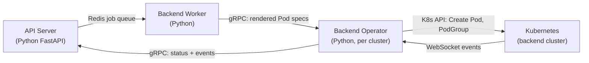
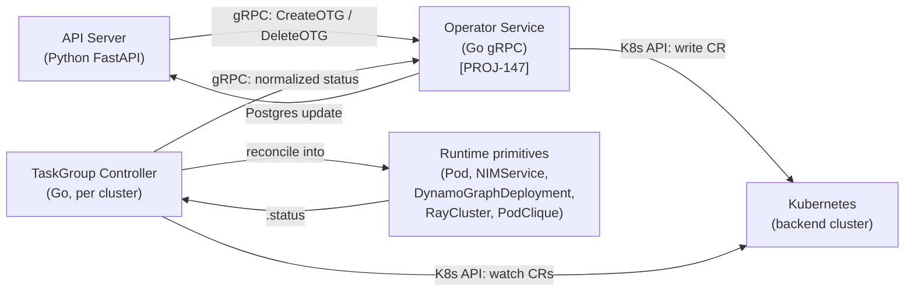
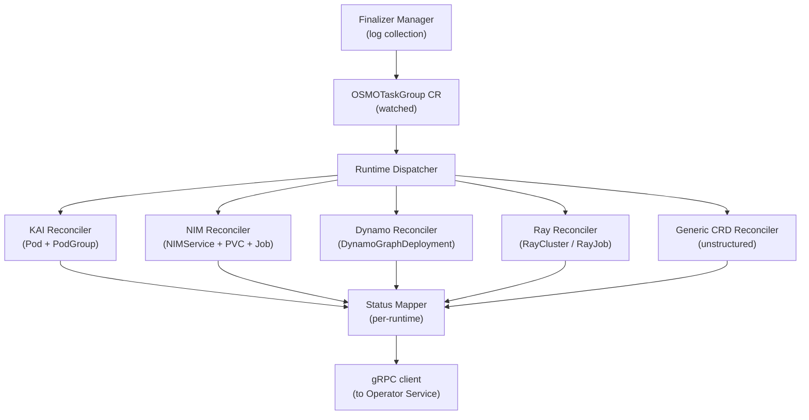

<!--
SPDX-FileCopyrightText: Copyright (c) 2026 NVIDIA CORPORATION & AFFILIATES. All rights reserved.

Licensed under the Apache License, Version 2.0 (the "License");
you may not use this file except in compliance with the License.
You may obtain a copy of the License at

http://www.apache.org/licenses/LICENSE-2.0

Unless required by applicable law or agreed to in writing, software
distributed under the License is distributed on an "AS IS" BASIS,
WITHOUT WARRANTIES OR CONDITIONS OF ANY KIND, either express or implied.
See the License for the specific language governing permissions and
limitations under the License.

SPDX-License-Identifier: Apache-2.0
-->

# OSMOTaskGroup CRD — Heterogeneous Workload Runtimes

**Author**: [Vivian Pan](https://github.com/vivian-nvidia)<br>
**PIC**: [Vivian Pan](https://github.com/vivian-nvidia)<br>
**Proposal Issue**: _TBD_

## Overview

OSMO today generates full Kubernetes Pod and PodGroup specs inside the Python API server and pushes them to backend clusters through an operator. This tight coupling means every new workload runtime — NIM, Dynamo, Ray, Grove, future things we haven't seen yet — requires changes to the API server, the backend worker, and the gRPC protocol between them. It also makes multi-cluster and edge scenarios hard: a workflow that spans two clusters can't be expressed cleanly because the API server is the one rendering pod specs targeted at a specific cluster.

This project replaces that pattern with a **Kubernetes CRD (`OSMOTaskGroup`)** as the contract between OSMO and the cluster. The API server writes CRs; a per-cluster controller reconciles them into whatever Kubernetes objects the chosen runtime requires. The CR is the extension point: adding a new runtime is ~200 LOC of Go in the controller, not a cross-cutting change across Python, Go, and SQL. Multi-cluster dispatch is a first-class property of the design — the API server chooses the target cluster at CR write time, and cross-cluster service references resolve through the deployment's configured cluster mesh.

### Motivation

1. **Runtime extensibility is load-bearing.** Physical AI workloads increasingly want NIMs for inference, Dynamo for disaggregated serving, Ray for distributed compute, Grove for gang-scheduled heterogeneous pods. The current architecture forces each of these into ad-hoc code paths in the API server. A declarative CRD lets each runtime be a first-class plugin instead of a branch in the job-spec generator.
2. **Multi-cluster is a real constraint.** OSMO already runs across AKS, AWS, GCP, on-prem clusters, neoclouds (Nebius, CoreWeave), and will increasingly span edge devices (Jetson, Orin). A workflow may legitimately span clusters — training in one, inference in another, edge data collection in a third. The current architecture has no clean way to express that.
3. **Separation of concerns.** The API server today knows Kubernetes details (security contexts, pod affinity, topology spread, toleration merging). Moving pod-spec generation into a controller that runs in the cluster aligns responsibility with locality: the cluster's controller knows what works in its cluster; the API server knows what the user asked for.
4. **Operational surface.** Today a schema change to Pod spec generation means an API server rollout, which is a shared-blast-radius event. A controller rollout affects only one cluster at a time.

### Problem

**Tight coupling to Kubernetes primitives.** `K8sObjectFactory` (`utils/job/kb_objects.py`) and `KaiK8sObjectFactory` render full Pod + PodGroup specs in Python, embedding cluster-specific knowledge. Every runtime change touches these files.

**Backend worker is a bottleneck.** All job creation goes through the backend worker process. It's a single-threaded Python component that frequently needs to be aware of specific runtime details (KAI gang scheduling, PodGroup minAvailable computation). Adding a NIM runtime today means adding NIM-specific code here.

**gRPC protocol is leaky.** The current protocol sends rendered Pod specs over gRPC. Any change in what we send (e.g., adding a new env var field, a new volume mount pattern) is a protocol-level change.

**No multi-cluster workflow support.** The API server has no concept of "task group that runs in cluster X." Workflows are cluster-scoped at submission, and cross-cluster orchestration is out of reach.

**Heterogeneous backend support is implicit.** Edge devices, neocloud bare-metal, and hyperscaler VMs all look like "Kubernetes clusters" to OSMO, but their operational characteristics (intermittent connectivity, outbound-only networking, ARM64, different CNIs) aren't surfaced in any design contract.

## Use Cases

| Use Case | Description |
|---|---|
| Submit a multi-runtime workflow | A user submits a workflow where one task group is a KAI batch job (training), another is a NIMService (inference endpoint), and a third is a Ray cluster (preprocessing). Each task group uses its native Kubernetes primitives; OSMO does not re-implement them |
| Span clusters in a single workflow | A user submits a workflow that runs Cosmos augmentation on an on-prem H100 cluster and downstream pseudo-labeling on a neocloud (CoreWeave). OSMO routes each task group to the designated cluster; data moves through Swift, services resolve via the configured cluster mesh |
| Deploy to an edge cluster | A user registers a Jetson Orin cluster as an OSMO backend. The same workflow YAML syntax works, but the cluster's `network.type` routes service references through a WireGuard overlay since the Jetson is NAT'd |
| Add a new runtime type | A platform team ships a new VLM-serving runtime (e.g., Grove PodClique). They write a Go reconciler + status mapper (~200 LOC) and register it with the controller. No API server change, no gRPC protocol change, no Python code |
| Migrate a workflow between runtimes | A user moves an inference task from in-group raw vLLM to an external NIMService by changing `runtimeType` in the workflow spec. No other workflow changes needed |

## Requirements

| Title | Description | Type |
|---|---|---|
| Runtime extensibility | OSMO shall support adding a new workload runtime (e.g. Ray, Grove) by implementing a Go reconciler + status mapper, without changes to the API server or gRPC protocol | Functional |
| Multi-cluster task routing | A workflow shall be able to declare per-task-group cluster targeting, and OSMO shall dispatch CRs to the correct cluster's controller | Functional |
| PostgreSQL as source of truth | Task group lifecycle state in PostgreSQL shall always converge with the state observed in the cluster's CR. Divergence shall be resolved by periodic reconciliation | Reliability |
| Graceful runtime failure | If a controller cannot reach the API server temporarily, it shall continue reconciling CRs it already has and resume status push when connectivity returns | Reliability |
| CR schema is stable | The `OSMOTaskGroup` CR schema shall be versioned; breaking changes shall be introduced via a new CRD version with a conversion webhook | Compatibility |
| etcd size safety | A single `OSMOTaskGroup` CR shall not exceed 500 KB, well below etcd's 1.5 MB object limit | KPI |
| Status push latency | The controller shall push terminal state changes (Succeeded, Failed) to the API server within 5 seconds under nominal conditions | Performance |
| Cross-cluster service discovery | A task group shall be able to reference a service exposed by a task group in a different cluster using a stable DNS name resolved by the cluster mesh | Functional |
| Backwards compatibility | Existing workflows using KAI task groups shall continue to work without modification during the transition | Compatibility |
| Observability | The controller shall emit Prometheus metrics for reconcile duration, status push failures, and per-runtime CR counts | Observability |
| Secure credential handoff | Task-level credentials (HF tokens, NGC keys, Swift secrets) shall be injected via Kubernetes Secrets in the target cluster, not carried in the CR body | Security |

## Architectural Details

### Current architecture



- API server renders full Pod/PodGroup specs via `K8sObjectFactory`
- Backend worker deduplicates and forwards to the cluster's operator
- Operator writes Pods directly to the cluster's K8s API
- Status propagates back via WebSocket listeners

**Limitations**: runtime-specific knowledge (NIM, Dynamo, Ray) must live in `K8sObjectFactory`; gRPC protocol carries rendered pod specs (leaky); single-cluster assumption baked in.

### Proposed architecture



- API server writes `OSMOTaskGroup` CRs via the Operator Service (PROJ-147 gRPC)
- Per-cluster Controller watches CRs it owns, reconciles each into runtime-native Kubernetes objects
- Controller normalizes per-runtime status back into the CR's `.status` field and pushes summaries via gRPC
- API server reconciles PostgreSQL state against CR status (primary: Postgres, secondary: CR)

### Key design principles

1. **CR-first.** The CR is the declarative contract. Every side — API server, Operator Service, Controller — reads and writes the CR. No side channel.
2. **OSMO routes workload, not packets.** The API server decides *which cluster* runs what. It does not get involved in pod-to-pod data flow. Networking between clusters is infra, resolved by stable DNS names.
3. **PostgreSQL is the source of truth across clusters.** When a single workflow spans multiple clusters, no cluster has the full picture. Postgres aggregates. Periodic reconciliation (60s) backstops the gRPC push so state never drifts permanently.
4. **Controller owns Kubernetes-native primitives.** Rendering Pod spec from a TaskGroup's compact template is the controller's job. The API server never sees a full Pod spec.
5. **Runtime is pluggable.** Adding a runtime means adding a `Reconciler` and a `StatusMapper` in Go. The CR schema has a generic `runtimeConfig` that each runtime interprets.
6. **Multi-cluster is first-class.** A single-cluster deployment works with one Controller. A multi-cluster deployment adds more Controllers and a cluster mesh; no API server code changes between the two.
7. **Fewer moving parts.** The CRD makes several services and the entire Redis dependency redundant. Removing them is in scope for this project.

## Service consolidation

The CRD-based design eliminates the need for several services and the Redis dependency entirely. This is in scope for this project, not a follow-up.

### Services removed

| Service | Role today | After CRD |
|---|---|---|
| **Worker** | Kombu Redis consumer; runs `FrontendJob`s (CreateGroup, UpdateGroup, BackendCleanupGroup) with dedup + retry + backoff | **Eliminated.** Group lifecycle is a single gRPC call to Operator Service. Retry/backoff moves to the gRPC client wrapper in the API server. Dedup is intrinsic — CR names are idempotent (Create returns AlreadyExists, which is a no-op). |
| **Delayed Job Monitor** | Polls Redis ZSET for scheduled jobs | **Eliminated.** Workflow-level retry backoff moves into the Controller's reconcile loop (standard controller-runtime backoff). If cron-style scheduled workflows are introduced later, the API server reads `next_run_at` from Postgres directly. |
| **Python Agent / Backend Listener / Backend Operator** | WebSocket from each cluster to ship events; runs jobs | **Eliminated** by PROJ-147 (Go Operator Service + listeners). Out of scope for this design doc but worth noting alongside. |

### Services that stay

| Service | Why |
|---|---|
| **API Server** | Auth, RBAC, workflow CRUD, UI backend, multi-cluster dispatch, Postgres ↔ CR reconciliation. Slimmer (no `K8sObjectFactory`) but core. |
| **Router** | User-initiated pod interactions (`exec`, `portforward`, `rsync`) — unchanged by the CRD design. |
| **Logger** | Continues to ingest container logs + task metrics. Internal data path changes (see [Workflow logs without Redis](#workflow-logs-without-redis)). |

### Redis elimination

Every current use of Redis has a replacement:

| Redis use today | Replacement |
|---|---|
| Kombu job queue (Worker) | Gone with Worker |
| Backend event streams (Agent → API server) | gRPC streaming (PROJ-147) |
| Delayed jobs ZSET (scheduled retries) | Controller reconcile backoff (in-cluster) |
| In-group task barriers | Already TCP between pods via `osmo_barrier.py` — Redis was never involved here |
| Workflow-wide barriers (Logger-mediated) | gRPC barrier service on Operator Service, state in Postgres ([see below](#barriers-without-redis)) |
| Real-time log tail | gRPC streaming from Logger to API server to client ([see below](#workflow-logs-without-redis)) |
| API server caching | In-process LRU cache (optional; current Redis cache patterns are not hot paths) |

After these moves there is no Redis user left. The Redis StatefulSet, its Helm chart, its Prometheus exporter, and its operator-side credentials all go away.

### Barriers without Redis

**In-group task barriers** (used by `osmo_barrier.py` in current workflows): unchanged. Workers already TCP-connect to the lead pod via in-group DNS:

```bash
LEAD_HOST="{{host:cosmos_augmentation_worker_0}}"
uv run python /tmp/osmo_barrier.py --num_nodes 2 --connect ${LEAD_HOST} --rank 0
```

Redis was never on this path.

**Workflow-wide barriers** (Logger-mediated cross-group sync): replaced by a small gRPC barrier service on the Operator Service.

```proto
service BarrierService {
  // Register an expected barrier. Idempotent on barrier_id.
  rpc RegisterBarrier(RegisterBarrierRequest) returns (BarrierHandle);

  // A participant arrives. Returns count of remaining arrivals.
  rpc Arrive(ArriveRequest) returns (ArriveResponse);

  // Block until all expected arrivals. Streaming RPC pushes BarrierComplete
  // when count is reached. Times out per WaitForCompletionRequest.timeout.
  rpc WaitForCompletion(WaitForCompletionRequest) returns (stream BarrierEvent);
}

message RegisterBarrierRequest {
  string workflow_id = 1;
  string barrier_id  = 2;
  int32  expected    = 3;
  google.protobuf.Duration ttl = 4;
}

message ArriveRequest {
  string workflow_id = 1;
  string barrier_id  = 2;
  string participant = 3;
}
```

State lives in Postgres (one row per barrier with `workflow_id`, `barrier_id`, `expected_count`, `current_arrivals`, `participants[]`, `ttl`). The Operator Service writes to Postgres atomically and notifies streaming subscribers when count is met. No new process — just an endpoint on the existing Operator Service.

Tradeoff vs Redis: Postgres adds a few ms of latency per Arrive vs Redis's sub-millisecond. Barriers block for seconds-to-minutes, so the latency increase is in the noise. Eliminating an entire data-store dependency is worth it.

### Workflow logs without Redis

Today's Logger uses Redis to buffer log lines between osmo-ctrl ingestion and Postgres persistence, and to support real-time tail (`osmo workflow logs -f`).

The replacement uses **object storage as the persistent layer** and **gRPC streaming for the live tail**:

```
osmo-ctrl ──gRPC stream──▶ Logger ──memory buffer──┐
                              │                     │
                              │                     │ periodic flush (30s or 10 MB)
                              │                     ▼
                              │              ┌──────────────────┐
                              │              │ Object Storage   │
                              │              │ swift://logs/    │
                              │              │   {workflow_id}/ │
                              │              │   {task_id}/     │
                              │              │   chunk-N.log    │
                              │              └──────────────────┘
                              │
                              │ live tail (gRPC stream)
                              ▼
                       API Server  ──▶ client (osmo workflow logs -f)
```

**Path-by-path:**

- **Ingestion.** osmo-ctrl sends log lines to the Logger over a gRPC stream (same pattern PROJ-147 uses for events; no Redis intermediary).
- **Buffering.** Logger holds an in-memory ring buffer per task, bounded (default 10 MB). On buffer-full or 30-second timer, the buffer is flushed to object storage.
- **Persistence.** Logs land in the workflow's existing storage backend (Swift, S3, Azure Blob, etc.) at a stable per-task prefix. Lifecycle / retention policies live with the storage backend, same as workflow output artifacts.
- **Final flush.** The Controller's log-collection finalizer (already in the design) catches container termination and ensures the Logger flushes any remaining buffer before the Pod is deleted.
- **Real-time tail.** `osmo workflow logs -f` opens a gRPC stream against the API server, which proxies to the Logger. The Logger pushes from its in-memory buffer to the subscriber. No persistence layer is involved on the live path.
- **Historical logs.** `osmo workflow logs` (no `-f`) reads chunks directly from object storage. The API server signs URLs / streams content as appropriate.
- **Task metrics** (timing, byte counters, retry counts): continue to write to Postgres directly. Small structured data, low frequency, well-suited to RDBMS.

**Why object storage instead of Postgres for logs:**

- Logs are append-only, write-heavy, and large — Postgres is the wrong tool
- Object storage is already a hard dependency (workflow inputs/outputs)
- TB-scale retention is trivial via lifecycle rules
- Cross-cluster compatible — logs land in the same bucket regardless of which cluster ran the task

**Why not keep using Postgres tables for logs (as some systems do):**

- High write amplification kills Postgres performance at scale
- Indexing/retention becomes operationally expensive
- Already using object storage for everything else; one less primitive

### Updated dependency map

After the cuts:

```
┌─────────────────────────────────────────────────────┐
│  Required services                                   │
│  • API Server   (Python FastAPI)                    │
│  • Operator Service   (Go gRPC, per PROJ-147)       │
│  • Controller   (Go, per backend cluster)           │
│  • Router       (existing, unchanged)               │
│  • Logger       (existing, internal path changed)   │
└─────────────────────────────────────────────────────┘

┌─────────────────────────────────────────────────────┐
│  Required data stores                                │
│  • PostgreSQL   (state, history, workflow metadata, │
│                  barrier state, task metrics)        │
│  • Object Storage  (Swift/S3 — workflow data + logs)│
└─────────────────────────────────────────────────────┘

┌─────────────────────────────────────────────────────┐
│  Eliminated                                          │
│  • Worker                                            │
│  • Delayed Job Monitor                               │
│  • Redis (in all uses)                              │
│  • Python Agent / Backend Listener / Backend         │
│    Operator   (per PROJ-147)                        │
└─────────────────────────────────────────────────────┘
```

## Detailed Design

### OSMOTaskGroup CRD schema

```yaml
apiVersion: workflow.osmo.nvidia.com/v1alpha1
kind: OSMOTaskGroup
metadata:
  name: cosmos-aug-workflow-abc-group-2
  namespace: osmo-workflows
  labels:
    osmo.nvidia.com/workflow-id: "workflow-abc"
    osmo.nvidia.com/cluster-id: "aks-osmo-eastus"
spec:
  workflowId: workflow-abc
  groupIndex: 2
  groupName: cosmos_augmentation_group
  runtimeType: kai   # one of: kai, nim, dynamo, ray, grove
  runtimeConfig:
    # Shape depends on runtimeType; see "Runtime types catalog" below
    gangScheduling: true
    minAvailable: 2
    schedulerName: kai-scheduler
    tasks:
    - name: cosmos_augmentation_worker_0
      lead: true
      image: nvcr.io/.../cosmos-augmentation:0.1.0
      resources:
        cpu: "11"
        memory: 100Gi
        nvidia.com/gpu: "1"
      env:
        - name: WORKER_ID
          value: "0"
      command: ["bash", "-c"]
      args: [...]
      inputs:
      - task: config_generation
      - url: swift://.../input-videos
      outputs:
      - url: swift://.../cosmos-augmented
      credentials:
      - secretName: hf-token-secret
        keyMap: {HF_TOKEN: HF_TOKEN}
    - name: cosmos_augmentation_worker_1
      lead: false
      # ...
  timeout: 24h
  maxRetries: 3
status:
  phase: Running    # Pending, Running, Succeeded, Failed, Terminating
  conditions:
  - type: Ready
    status: "True"
    lastTransitionTime: "2026-04-23T12:00:00Z"
  - type: Progressing
    status: "True"
    lastTransitionTime: "2026-04-23T12:00:00Z"
  runtimeStatus:
    # Runtime-specific payload, shape varies by runtimeType
    tasks:
    - name: cosmos_augmentation_worker_0
      podName: cosmos-aug-workflow-abc-group-2-worker-0-xyz
      state: Running
      startTime: "2026-04-23T12:00:00Z"
      conditions: [...]
  observedGeneration: 3
  retries: 0
  message: ""
```

**Key design choices:**

- **Compact task templates, not full Pod specs.** A `tasks[].image` + `resources` + `env` + `command` + inputs/outputs is enough for the controller to render a Pod. The controller adds security context, volume mounts, topology spread, affinity — all cluster-local knowledge. This keeps CRs under 500 KB even for 100-task groups (etcd limit is 1.5 MB).
- **`runtimeType` + `runtimeConfig` split.** The top-level fields (workflowId, timeout, retries) are universal. The runtime-specific shape lives in `runtimeConfig`. This mirrors the Kubernetes `Object.spec.<discriminator>` pattern (e.g., `Service.spec.type` + type-specific config).
- **`.status.runtimeStatus` is also runtime-specific.** But `.status.phase` and `.status.conditions` are normalized across runtimes so the API server has a stable interpretation surface.
- **`observedGeneration`** — standard K8s pattern to detect reconciliation lag.

### Controller design

Single controller binary per cluster, with pluggable reconcilers by `runtimeType`.



#### The dispatcher

A thin switch over `spec.runtimeType`:

```go
type Reconciler interface {
    Reconcile(ctx context.Context, otg *v1alpha1.OSMOTaskGroup) (ctrl.Result, error)
}

type StatusMapper interface {
    Map(ctx context.Context, otg *v1alpha1.OSMOTaskGroup) (v1alpha1.OSMOTaskGroupStatus, error)
}

type Runtime struct {
    Reconciler   Reconciler
    StatusMapper StatusMapper
}

var runtimes = map[string]Runtime{
    "kai":     {KAIReconciler{}, KAIStatusMapper{}},
    "nim":     {NIMReconciler{}, NIMStatusMapper{}},
    "dynamo":  {DynamoReconciler{}, DynamoStatusMapper{}},
    "ray":     {RayReconciler{}, RayStatusMapper{}},
    "grove":   {GroveReconciler{}, GroveStatusMapper{}},
}
```

Adding a runtime is registering in the map. No other change.

#### KAI reconciler

Replaces the current `K8sObjectFactory` path. Given an `OSMOTaskGroup` with `runtimeType: kai`:

1. For each task in `runtimeConfig.tasks`, render a full `corev1.Pod` (container security context, volume mounts, topology spread, affinity, tolerations — all from cluster-local policy).
2. Create a `scheduling.kai.run.ai/v2alpha2 PodGroup` with `minAvailable = len(tasks)` for gang scheduling (or the overridden value from `runtimeConfig.minAvailable`).
3. Set the PodGroup as controller-owner of each Pod (for cascade delete).
4. Create the Pods, treating an already-existing Pod as a no-op (idempotent reconcile).
5. Status mapper reads Pod phases, aggregates per-task states, rolls up to `phase` (Running if any task Running, Succeeded if all Succeeded, Failed if any Failed that exceeds retry budget).

#### Generic CRD reconciler

For runtimes that target an existing third-party CRD (NIMService, DynamoGraphDeployment, RayCluster, PodClique):

1. Use `dynamic.Interface` to create/get/watch the target CRD as `unstructured.Unstructured`.
2. Translate `spec.runtimeConfig` → target CRD's `spec` via a per-runtime template.
3. Set an owner reference from the OSMOTaskGroup to the target CR so cascade delete works automatically.
4. Status mapper reads the target's `.status`, extracts the runtime-specific ready/failed signals, normalizes to OSMOTaskGroup's `.status.phase`.

This means NIM, Dynamo, Ray, Grove, and future CRDs share ~80% of reconciler code — only the translator and status mapper differ per runtime.

#### Periodic reconciliation (drift detection)

Controller runs a periodic sweep (default 60s) over all `OSMOTaskGroup` CRs it owns:

1. List all CRs with the cluster label
2. For each, recompute desired state and compare against observed
3. If divergence, re-enqueue for reconciliation
4. Also: push a full status summary to the Operator Service via gRPC (covers gaps if a prior push failed)

This is the backstop against gRPC-push failures. PostgreSQL eventually converges with the CR state regardless of push reliability.

#### Finalizer: log collection before delete

When a task group is deleted (either by user or by workflow cancellation), the Pods' container logs are only readable while Pods exist. Cascade delete removes Pods immediately.

To collect logs before cascade delete:

1. Controller adds finalizer `workflow.osmo.nvidia.com/log-collection` to every OSMOTaskGroup on create.
2. On delete: the finalizer blocks cascade delete. Controller:
   - Iterates Pods in the group
   - Streams `kubectl logs`-equivalent via K8s API
   - Uploads logs to the workflow's Swift output path
   - Removes the finalizer
3. Kubernetes completes cascade delete as normal.

If log collection fails (Swift unreachable, pod already gone), the controller still removes the finalizer after a timeout (5 min) and emits a Prometheus counter. Better to lose logs than block delete forever.

### API Server changes

#### CR create/delete via Operator Service (no direct K8s access)

The Python API server does not have K8s credentials for every backend cluster. All CR operations go through the PROJ-147 Operator Service gRPC:

```proto
service OperatorService {
  rpc CreateOTG(CreateOTGRequest) returns (CreateOTGResponse);
  rpc DeleteOTG(DeleteOTGRequest) returns (DeleteOTGResponse);
  rpc GetOTGStatus(GetOTGStatusRequest) returns (OTGStatusResponse);
  rpc StreamOTGStatus(StreamOTGStatusRequest) returns (stream OTGStatusEvent);
}

message CreateOTGRequest {
  string cluster_id = 1;
  bytes otg_yaml = 2;  // serialized OSMOTaskGroup
}
```

The API server serializes the CR, picks the target cluster, and sends via Operator Service. The Operator Service uses its kubeconfig to write to the cluster's K8s API.

#### Multi-cluster dispatch

The API server's workflow submission path evaluates each task group's target cluster before writing CRs:

1. Each group in the workflow spec has a `cluster:` selector (explicit cluster id, or pool-based dynamic routing).
2. The API server resolves the selector to a concrete `cluster_id` using the `backend_cluster` table and current pool assignments.
3. For each group, the API server calls `CreateOTG(cluster_id, serialized_cr)`.
4. The Operator Service writes the CR into that cluster's K8s API.
5. Each cluster's Controller watches for CRs labeled with its own `cluster_id` and reconciles them.

A workflow with task groups in three different clusters produces three CR writes, one per cluster. No cluster sees CRs that aren't its own.

#### Periodic PostgreSQL reconciliation

A new goroutine in the API server (or a dedicated small service) runs every 60s:

1. Read workflow rows from PostgreSQL where state = Running.
2. For each, query the Operator Service for the current CR status.
3. If CR state differs from PostgreSQL, update PostgreSQL.
4. If CR doesn't exist but PostgreSQL says Running, this is a divergence → recreate the CR from the workflow definition.

This is the multi-cluster safety net: if a single cluster's gRPC push fails, the reconciler pulls the missing state.

#### Workflow spec language changes

A small, additive change to the workflow YAML DSL:

```yaml
groups:
- name: cosmos_augmentation_group
  runtimeType: kai    # defaults to "kai" for back-compat
  cluster: aks-osmo-eastus   # new: per-group cluster routing
  # For runtimeType: kai, existing fields (tasks, resources, ...) work unchanged
  tasks:
  - name: worker_0
    image: ...
    # ...

- name: vlm_inference_group
  runtimeType: nim
  cluster: coreweave-h100
  runtimeConfig:
    nimService:
      image: nvcr.io/nim/nvidia/model-free-nim:2.0.2
      model: hf://Qwen/Qwen3-VL-30B-A3B-Instruct
      env:
        NIM_SERVED_MODEL_NAME: Qwen/Qwen3-VL-30B-A3B-Instruct
      resources:
        gpu: 2
        memory: 180Gi
  # A NIM group is a persistent service, not a batch task.
  # Lifecycle: persistent until explicitly torn down or workflow completes.
```

`runtimeType: kai` is the implicit default to preserve existing workflows. `cluster:` defaults to the workflow's submission pool's default cluster.

#### Cluster registration with network config

Backend cluster records in PostgreSQL get a new `network_config` JSONB column:

```json
{
  "type": "submariner",
  "config": {
    "cluster_set_id": "osmo-production"
  }
}
```

Or:

```json
{
  "type": "tailnet",
  "config": {
    "tailnet_domain": "osmo-private.ts.net",
    "login_server": "https://headscale.internal.nvidia.com"
  }
}
```

Used by the API server's service-name resolver at workflow render time (see [Cross-cluster networking](#cross-cluster-networking)).

### Runtime types catalog

#### `runtimeType: kai` — KAI Scheduler batch

Direct replacement of the current path. Gang-scheduled Pods via KAI's PodGroup CRD.

**`runtimeConfig`:**
```yaml
gangScheduling: true
minAvailable: 2
schedulerName: kai-scheduler
queue: default
tasks: [...]    # compact task templates
```

**Creates:** `Pod` + `scheduling.kai.run.ai/v2alpha2 PodGroup`

**Status source:** Pod phases aggregated into `.status.phase`

#### `runtimeType: nim` — NVIDIA Inference Microservice

Renders a NIMService CR + required storage.

**`runtimeConfig`:**
```yaml
nimService:
  image: nvcr.io/nim/nvidia/model-free-nim:2.0.2
  authSecretName: ngc-api-secret
  model:
    source: hf       # hf | ngc | local
    modelName: Qwen/Qwen3-VL-30B-A3B-Instruct
  env: {...}
  storage:
    pvcTemplate:
      storageClass: default
      size: 100Gi
    preDownloadJob: true   # creates an HF pre-download Job + PVC (see inference/nim-operator/)
  resources:
    gpu: 2
    memory: 180Gi
```

**Creates:** `NIMService` + optional `PersistentVolumeClaim` + optional pre-download `Job` (see `inference/nim-operator/` for reference manifests)

**Status source:** NIMService `.status.conditions[?(@.type=="Ready")]`

#### `runtimeType: ray` — Ray cluster or Ray job

Renders a RayCluster for long-lived or RayJob for batch.

**`runtimeConfig`:**
```yaml
mode: job    # job | cluster
rayVersion: "2.9.0"
head:
  image: rayproject/ray:2.9.0-py310-gpu
  resources: {cpu: 4, memory: 16Gi}
worker:
  replicas: 8
  image: rayproject/ray:2.9.0-py310-gpu
  resources: {cpu: 8, memory: 32Gi, nvidia.com/gpu: "1"}
entrypoint: "python /opt/train.py"   # RayJob only
```

**Creates:** `ray.io/v1 RayCluster` or `RayJob`

**Status source:** RayCluster `.status.state` + `.status.availableWorkerReplicas`, or RayJob `.status.jobStatus`.

#### `runtimeType: dynamo` — NVIDIA Dynamo disaggregated serving

Renders a DynamoGraphDeployment CR.

**`runtimeConfig`:**
```yaml
graph:
  components:
  - name: prefill
    image: ...
    replicas: 2
    resources: {gpu: 4}
  - name: decode
    image: ...
    replicas: 4
    resources: {gpu: 4}
  kvTransfer:
    backend: nixl
```

**Creates:** `DynamoGraphDeployment`

**Status source:** Per-component conditions in the DynamoGraphDeployment status, rolled up.

#### `runtimeType: grove` — Grove PodClique

For heterogeneous gang scheduling of disaggregated serving workloads. Mutually exclusive with Dynamo for the same role; Grove is broader, Dynamo is specialized for prefill/decode.

**`runtimeConfig`:**
```yaml
cliques:
- name: vlm
  replicas: 1
  members: [...]
- name: llm
  replicas: 2
  members: [...]
scheduler: grove-scheduler
```

**Creates:** `scheduler.grove.io PodClique` resources.

**Status source:** PodClique `.status` fields.

### Status mapping

Each runtime's status shape is different. The controller normalizes into a stable `OSMOTaskGroupStatus`:

```go
type OSMOTaskGroupStatus struct {
    Phase              Phase               // Pending | Running | Succeeded | Failed | Terminating
    Conditions         []metav1.Condition  // Ready, Progressing, ...
    RuntimeStatus      *runtime.RawExtension  // opaque runtime-specific payload
    ObservedGeneration int64
    Retries            int
    Message            string
}
```

**Per-runtime normalization rules:**

| Runtime | Phase=Running if | Phase=Succeeded if | Phase=Failed if |
|---|---|---|---|
| kai | any Pod has `phase=Running` | all lead Pods have `phase=Succeeded` | any Pod has `phase=Failed` beyond retry budget, or PodGroup's `minAvailable` never met within grace period |
| nim | NIMService `Ready=False, Progressing=True` | N/A (persistent; use Ready) | NIMService `Ready=False, Progressing=False` + message |
| ray | RayCluster `state=ready` OR RayJob `jobStatus=RUNNING` | RayJob `jobStatus=SUCCEEDED` | RayJob `jobStatus=FAILED` / RayCluster `state=failed` |
| dynamo | any component `state=Running` | N/A (persistent) | any component `state=Failed` |
| grove | aggregate over PodClique conditions | aggregate over PodClique conditions | aggregate over PodClique conditions |

The normalization layer is the main per-runtime engineering — not the CR → native CRD translation, which is mostly plumbing.

### Cross-cluster networking

> **TL;DR**: OSMO routes workload, not packets. Task-to-task traffic travels directly through a cluster mesh that is chosen at infra-deployment time, not in the CR. The API server and controller get small, well-defined extensions to plug in any supported mesh.

#### Problem

OSMO workflows can span clusters on heterogeneous infrastructure: AKS, AWS EKS, GCP GKE, on-prem, neocloud (CoreWeave, Nebius), plus edge (Jetson, Orin). A task in one cluster may need to call a service in another — typically an inference endpoint, occasionally a coordination endpoint.

Additional constraints:

- **Private networks only.** No traffic may transit the public internet, even encrypted. This rules out commercial Tailscale (public DERP), Skupper (public HTTPS) as-is, and public Ingress + mTLS.
- **Mixed connectivity.** Some clusters have private interconnects (ExpressRoute, Direct Connect, Cloud Interconnect, Megaport/Equinix); edge devices may be NAT'd behind carrier APNs or corporate firewalls.
- **No shared IAM or network fabric.** Each cluster is an independent administrative domain.

#### Principle: OSMO routes workload, not packets

The core architectural decision is that **OSMO is a control plane; cross-cluster data flow is direct, mesh-mediated**.

Concretely:

- **API server**: writes `OSMOTaskGroup` CRs specifying *which cluster* runs what. Records cluster → mesh-identity mapping. Does not see task traffic.
- **Controller**: materializes CRs into Kubernetes objects. Creates mesh-discovery artifacts (e.g., `ServiceExport` CR, Tailscale Service annotation). Does not proxy traffic.
- **Mesh**: handles encryption, routing, discovery between peer clusters. Chosen per deployment.
- **Tasks**: resolve peer services by stable DNS name (`vlm-qwen3.osmo.svc.clusterset.local`) and establish direct connections.

```
┌────────────────────────────┐     ┌──────────────────────────┐
│ Task in cluster A           │     │ Service in cluster B     │
│   code calls:               │     │  listening on port 8000  │
│   http://vlm-qwen3:8000     │     │                          │
└───────────┬────────────────┘     └────────────▲─────────────┘
            │                                   │
            │ DNS → mesh-provided address       │
            │ connection → direct through mesh ─┘
            │
┌───────────▼────────────────────────────────────┐
│              Cluster mesh                       │
│   (Submariner IPsec, WireGuard, or Headscale)  │
│  Private backbone / private APN / private link │
└─────────────────────────────────────────────────┘

OSMO API server and Controller are NOT in this path.
```

#### Candidate meshes

Given the private-only + heterogeneous-backend constraints, three candidates are realistic off-the-shelf:

##### Submariner + Multi-Cluster Services (MCS)

```
Cluster A                                     Cluster B
┌──────────────┐       ┌──────────────┐      ┌──────────────┐
│ pod-A        │─┐     │ Gateway A    │      │ Gateway B    │
│ 10.0.1.5     │ │     │  IPsec/ESP   │═════▶│  decapsulate │
└──────────────┘ │     │  encapsulate │      └──────────────┘
                 │     └──────────────┘
                 └────▶ route to gateway
```

- Gateway node per cluster establishes IPsec (or VXLAN) tunnels over the private backbone
- Lighthouse DNS plugin resolves `name.ns.svc.clusterset.local` to the remote cluster's ClusterIP
- Globalnet handles CIDR overlap via NAT at the gateway
- Broker cluster holds the ServiceExport/ServiceImport registry

**Strengths:**
- Standard K8s API (MCS, [KEP-1645](https://github.com/kubernetes/enhancements/tree/master/keps/sig-multicluster/1645-multi-cluster-services-api))
- CNI-agnostic (no cluster-wide CNI replacement required)
- CNCF sandbox project, Apache-2.0

**Weaknesses:**
- Gateway node is a throughput bottleneck per cluster
- Requires each gateway to have a routable IP on the private backbone — awkward for NAT'd/edge clusters
- Added latency ~200–1000µs RTT vs direct routing

##### WireGuard mesh (Netmaker / Nebula / plain WireGuard)

```
Cluster A                                     Cluster B
┌──────────────┐       ┌──────────────┐      ┌──────────────┐
│ pod-A        │       │ node-a1 wg0  │      │ node-b5 wg0  │
│ 10.0.1.5     │──────▶│ WG encrypt   │═════▶│ WG decrypt   │
└──────────────┘       │ direct peer  │      │ forward pkt  │
                       └──────────────┘      └──────────────┘
```

- Every participating node runs a WireGuard interface
- Each node peers directly with every other node (mesh topology)
- Control plane (Netmaker server / Nebula lighthouse) distributes peer keys and allowed-IP routes; data never touches it
- Kernel WireGuard is extremely fast (~5–20µs per packet)

**Strengths:**
- No gateway bottleneck; per-node throughput
- Per-node cryptographic identity
- Works over any L3-reachable network (including private APN cellular)
- Lowest added latency (~50–200µs RTT)

**Weaknesses:**
- Not K8s-native out of the box — K8s Service discovery requires additional layering
- CIDR overlap not handled gracefully; pods either get mesh-space IPs (bypass CNI) or require non-overlapping CIDRs
- CIDR + pod routing integration with managed K8s CNIs is fragile

##### Headscale + DERP

```
# Direct mode (preferred; identical to WireGuard mesh)
pod → node wg0 ═══ UDP ═══ node wg0 → pod

# DERP relay mode (fallback for NAT-impossible cases)
pod → tailscaled → HTTPS(WG-encrypted payload) → DERP → HTTPS → tailscaled → pod
```

- Open-source (BSD-3) Tailscale-protocol coordination server + self-hosted DERP relays
- Same kernel WireGuard as plain mesh when direct peering works
- DERP relay fallback via HTTPS when hole-punching fails
- MagicDNS resolves short names within the tailnet
- Tailscale Kubernetes Operator exposes K8s Services into the tailnet

**Strengths:**
- Same raw performance as plain WireGuard mesh in direct mode (~50–200µs RTT)
- Automatic NAT traversal (STUN + hole punching) — handles edge/NAT'd clusters transparently
- DERP fallback preserves end-to-end WireGuard encryption through the relay
- Fully self-hostable with private-only DERP servers

**Weaknesses:**
- Two components to run (Headscale + DERP relays)
- Headscale feature-drifts behind commercial Tailscale by 6–12 months
- DERP relay mode adds 2–10ms RTT and is bandwidth-limited by the relay capacity

#### Tradeoff matrix (private-only)

| Dimension | Submariner | WireGuard mesh | Headscale + DERP |
|---|---|---|---|
| K8s-native discovery | **MCS (standard)** | Requires layering | MagicDNS + Operator |
| Private-only viable | ✅ | ✅ | ✅ (self-hosted DERP) |
| Works for NAT'd edge | ❌ gateway needs routable IP | ⚠️ manual relay config | ✅ automatic |
| Data-plane bottleneck | Per-cluster gateway | None | None (direct) / DERP (fallback) |
| Added latency RTT | 200–1000µs | 50–200µs | 50–200µs direct / 2–10ms DERP |
| CIDR overlap handling | Globalnet NAT | Not handled | Tailscale IP replaces pod CIDR |
| Day-1 setup time | 2–4 h | 3–6 h | 4–6 h |
| Per-new-cluster time | ~30 min | ~1 h | ~20 min |
| License | Apache-2.0 | BSD-3 / Apache-2.0 | BSD-3 |
| Community / maintenance | CNCF sandbox | Small community | Community + Tailscale Inc. adjacent |

#### Recommendation

**No single mesh fits every deployment.** OSMO should support multiple meshes pluggably, chosen at cluster registration time. Default reference deployments:

- **Datacenter-only deployments** (AKS + AWS + on-prem, no edge): **Submariner + MCS**. Standard API surface, clean developer experience, fine latency.
- **Datacenter + edge deployments** (includes Jetson / NAT'd clusters): **Headscale + DERP**. Automatic NAT traversal is the deciding factor; edge clusters join the tailnet with a single outbound connection.
- **Latency-critical, no-edge deployments** (HPC-adjacent, tight east-west patterns): **Netmaker / plain WireGuard mesh**. Lowest per-packet overhead, no gateway bottleneck.

#### Minimal API server + controller changes

The networking layer is orthogonal to OSMO's core — the integration surface is small:

**API server:**

1. **Cluster registration schema**: add `network_config` JSONB column on `backend_cluster` table. Example values:
   ```json
   {"type": "submariner", "config": {"cluster_set_id": "osmo-prod"}}
   {"type": "tailnet", "config": {"tailnet_domain": "osmo-private.ts.net", "login_server": "https://headscale.internal.nvidia.com"}}
   ```

2. **Service-name resolver helper** at workflow render time:
   ```python
   def resolve_service_dns(service_name: str, cluster: BackendCluster) -> str:
       match cluster.network_config.type:
           case "submariner":
               return f"{service_name}.osmo.svc.clusterset.local"
           case "tailnet":
               return f"{service_name}-{cluster.name}.{cluster.network_config.config['tailnet_domain']}"
           case "netmaker":
               return f"{service_name}.{cluster.name}.netmaker.internal"
           case "ingress":
               return f"{service_name}.{cluster.name}.{cluster.network_config.config['ingress_wildcard']}"
   ```

3. **Workflow spec**: allow service references that are cluster-qualified:
   ```yaml
   inputs:
     - service: vlm-qwen3
       cluster: aks-osmo-eastus
   ```
   The resolver produces the mesh-appropriate DNS at render time.

**Controller:**

4. **Service discovery reconciler interface**:
   ```go
   type ServiceDiscoveryReconciler interface {
       Expose(ctx context.Context, svc *corev1.Service, cluster *ClusterNetworkConfig) error
       Unexpose(ctx context.Context, svc *corev1.Service, cluster *ClusterNetworkConfig) error
   }
   ```
   With one implementation per mesh type:
   - Submariner: create a `ServiceExport` CR
   - Tailnet: annotate the Service (`tailscale.com/expose: "true"`, `tailscale.com/hostname: ...`)
   - Netmaker: create the mesh's equivalent CR or update its DNS
   - Ingress + mTLS: create an `Ingress` + cert-manager `Certificate`

**Estimated effort:**

| Component | Lines of code |
|---|---|
| API server: `network_config` schema migration + cluster model | ~100 |
| API server: service name resolver | ~50 |
| API server: workflow spec validation for service references | ~50 |
| Controller: `ServiceDiscoveryReconciler` interface + dispatcher | ~80 |
| Controller: per-mesh implementations (Submariner / Tailnet) | ~150 each |
| **Total core** | **~580 + ~150 per additional mesh** |

No changes to: CR schema, runtime containers, Redis/barriers, workflow spec DSL beyond adding cluster qualifier, data plane.

#### What is explicitly out of scope

1. **Cross-cluster synchronous collectives** (`torch.distributed`, NCCL all-reduce, cross-cluster barriers at high frequency) are unsupported. The design assumes cross-cluster traffic is `task → stable-service` or `task → Swift/S3`, not `task ↔ task` synchronous. Mesh latency makes the latter impractical anyway.
2. **Mesh enrollment automation.** OSMO does not join clusters to the mesh — that's an infra-provisioning step. OSMO records that a cluster is in the mesh (via `network_config`) and uses the mesh for service resolution.
3. **Failover between meshes.** A cluster is either in mesh X or not. OSMO does not gracefully degrade from Submariner to public Ingress if the backbone fails.

### Data plane

Swift/S3 remains the lingua franca for bulk data movement between task groups. Nothing about the CR design changes this:

- Task inputs/outputs are URLs (Swift, S3, Azure Blob, GCS, local storage backends)
- OSMO's existing storage SDK (`lib/data/storage/`) handles transfer parallelism
- A task in cluster A writes to `swift://.../step1-output`; a task in cluster B reads from the same URL
- Bucket placement is the deployment's responsibility — regional colocation with the consumer is how you minimize egress cost

The CR carries input/output URL references; the osmo_ctrl runtime container in each pod handles the actual transfer.

### Edge and heterogeneous backends

Edge clusters (K3s on Jetson / Orin, MicroK8s, KubeEdge) are *first-class* backend types under the CR design. The reason: a local controller reconciling a small CR against local Kubernetes primitives is exactly what edge K8s distros are designed for.

**Works well at the edge:**
- CRs are small (~1–2 KB), cheap to replicate over intermittent links
- Local controller tolerates disconnection — keeps reconciling against last-known state
- Same CR schema as datacenter clusters — workflow authors don't specialize

**Needs care at the edge:**

- **Image architecture**: Jetson is ARM64. Multi-arch container manifests required, or separate image references per cluster. Many NIMs currently don't publish ARM64.
- **Image pull strategy**: pulling GB-scale images over a slow link fails or is unacceptable. Pattern: local registry mirror per site, or pre-baked device images.
- **Execution lifecycle**: edge workloads are often persistent streaming (Deepstream pipeline, Holoscan app), not batch. The CR's lifecycle state machine must permit a "persistent runtime" type that does not terminate unless explicitly stopped.
- **Data plane**: Swift/S3 from a Jetson on LTE backhaul is a bad default. Tasks should declare local-only data, or the cluster registration includes an alternative object store (local NFS with periodic S3 sync).
- **Device enrollment**: zero-touch device provisioning (Fleet Command-style) is out of scope for the CR design but needed alongside it. OSMO does not manage device identity; cluster enrollment adds a Jetson cluster to the registry with appropriate `network_config`.

**Explicit out-of-scope for edge:**
- Cross-cluster synchronous service calls from edge to datacenter with low latency requirements — the backhaul latency (especially cellular) makes this unreliable.
- Distributed collective operations across edge + datacenter.

### Security

#### Credential distribution

Secrets (HF tokens, NGC keys, Swift credentials) do **not** travel in the CR body. They are:

1. Created in each target cluster as Kubernetes Secrets during cluster provisioning (or via an external-secrets operator).
2. Referenced by name in the CR: `credentials: - secretName: hf-token-secret, keyMap: {HF_TOKEN: HF_TOKEN}`.
3. Materialized as env vars or volume mounts at Pod render time by the controller.

The API server never has cleartext credentials. This matches current OSMO design.

#### Identity and mesh auth

- **Submariner**: cluster-level identity via IPsec certificates. Pods inherit cluster trust. Coarse-grained.
- **WireGuard mesh / Headscale**: per-node cryptographic identity. Finer-grained. ACLs enforced at the mesh control plane.
- **OSMO's role**: none for network-layer auth. The mesh is the identity system. OSMO's RBAC (API server) is separate and controls *who can submit workflows and what clusters they can target*.

#### RBAC for CR operations

The Operator Service holds cluster credentials; the API server authenticates to the Operator Service via mTLS. The existing authz sidecar (PROJ-148) governs user-facing API calls:

- `workflow:Create` in pool X → API server authorized to write CRs to pool X's clusters
- `cluster:Admin` → authorized to register new clusters

### Alternatives considered

#### Direct Pod push (current architecture)

**Approach:** Keep rendering full Pod specs in Python, push via gRPC.

**Pros:**
- No net-new components.
- Familiar code paths.

**Cons:**
- Every new runtime requires Python + Go coordinated changes.
- gRPC protocol leaks K8s object shape.
- No clean multi-cluster story.
- Schema changes require API server rollouts (blast radius).

**Rejected because:** doesn't solve the extensibility or multi-cluster requirements.

#### Argo Workflows / Kubeflow Pipelines

**Approach:** Adopt an existing workflow engine.

**Pros:**
- Mature.
- Community support.

**Cons:**
- Single-cluster by design (both).
- Don't integrate naturally with OSMO's pool / quota / multi-tenancy model.
- Migrating existing workflows would be a complete rewrite.
- No native NIM / Dynamo runtime abstraction — we'd still build it on top.

**Rejected because:** the impedance mismatch with OSMO's existing semantics is larger than the work to build a CRD.

#### KubeFed / Open Cluster Management

**Approach:** Use a federated control plane to push workloads to member clusters.

**Pros:**
- Solves the multi-cluster dispatch problem.

**Cons:**
- Designed for replicating the same workload across clusters, not per-cluster-specialized work.
- Adds a second control plane layer.
- Community momentum shifted; KubeFed is effectively retired; OCM is healthier but still an additional dependency.

**Rejected because:** our needs are per-cluster specialization, not global replication. A CRD with per-cluster controllers is simpler.

### Backwards compatibility

- Existing workflows default to `runtimeType: kai`. No YAML change required.
- The current backend worker path will coexist during migration (see Implementation Plan).
- gRPC protocol adds new messages (`CreateOTG`, etc.) without removing old ones for one release.
- Database migrations are additive (new `network_config` column with default `NULL`).

### Performance

- **Reconcile loop**: per-CR reconcile target <100 ms p99. Achieved via controller-runtime's client-side cache + indexer.
- **Status push latency**: terminal-state gRPC push <5 s from Pod phase transition. Achieved via controller-runtime watch + no intermediate buffering.
- **Periodic reconciliation**: 60 s sweep. At 10 k CRs per cluster, list+compare is ~2 s CPU; acceptable.
- **etcd object size**: budget 500 KB per CR (vs. 1.5 MB limit). Compact templates keep even 100-task groups under budget.
- **gRPC throughput**: status push uses streaming RPC. Tested to 10 k status updates/sec per controller.
- **Cross-cluster service latency**: see [Cross-cluster networking](#cross-cluster-networking) tradeoff matrix. Sub-millisecond for direct WireGuard; ~500 µs for Submariner IPsec.

### Operations

- **Installation**: one Helm chart per cluster for the controller. The Operator Service (PROJ-147) is deployed centrally.
- **Upgrades**: per-cluster controller upgrade is an independent operation. CRD schema upgrades require a K8s conversion webhook for breaking changes.
- **Monitoring**: Prometheus metrics from the controller — `otg_reconcile_duration_seconds`, `otg_status_push_failures_total`, `otg_active_by_runtime`, `otg_finalizer_log_collection_failures_total`.
- **Alerting**: controller's gRPC push error rate, CR reconciliation lag, periodic reconciliation drift count.
- **Debugging**: a user can `kubectl get osmotaskgroup -A` and see everything. CR events are standard `kubectl events`. Logs are standard controller logs.

### Documentation

- CRD schema reference (auto-generated from Go types).
- Per-runtime runbook (`runtimeType: nim`, `dynamo`, `ray`, `grove`).
- Workflow-spec migration guide for authors.
- Mesh integration guides (one per supported mesh).
- Cluster-registration guide for infra teams.

### Testing

- **Unit**: per-reconciler unit tests with fake K8s client. Target 80% coverage on reconciler code.
- **Integration**: envtest-based tests per runtime. A test fixture spins up a local K8s API + etcd, creates a CR, verifies rendered Pod / NIMService / etc. matches a golden file.
- **E2E**: full OSMO stack with a single local cluster, exercise each `runtimeType` end to end.
- **Multi-cluster E2E**: two local clusters connected via Submariner in a KIND-based setup, exercise cross-cluster service discovery. Part of Phase 1 because multi-cluster is not an afterthought.
- **Regression**: migration tests — submit a workflow via legacy path, submit the same workflow via CRD path, assert outputs match.

KPIs:
- CR reconcile p99 latency
- Status push p99 latency
- Per-runtime reconcile failure rate
- Finalizer log-collection success rate
- Cross-cluster service-exposure reconcile latency

### Dependencies

| Project | Relationship |
|---|---|
| **PROJ-147 Operator Redesign** | Hard dependency. The Go-based Operator Service is what the API server talks to for `CreateOTG`/`DeleteOTG`/`GetOTGStatus`. This project extends PROJ-147's gRPC surface |
| **PROJ-148 Auth Rework** | Soft dependency. RBAC for CR operations is enforced via the authz sidecar; new grants like `osmotaskgroup:Create` are added |
| **KAI Scheduler** | Runtime dependency for `runtimeType: kai`. PodGroup CRD must be installed |
| **NIM Operator** | Runtime dependency for `runtimeType: nim`. NIMService, NIMCache CRDs must be installed |
| **Ray Operator (KubeRay)** | Runtime dependency for `runtimeType: ray`. RayCluster / RayJob CRDs |
| **Dynamo Operator** | Runtime dependency for `runtimeType: dynamo`. DynamoGraphDeployment CRD |
| **Grove Scheduler** | Runtime dependency for `runtimeType: grove` |
| **Submariner / Tailscale / Netmaker** | Infra dependency per deployment. OSMO documents required versions |

## Implementation Plan

### Phase 1: CRD foundation + KAI + single-cluster + dual-write

Phase 1 ships a working CRD path for the existing KAI runtime against a single backend cluster, running alongside the legacy Python path. Multi-cluster, additional runtimes, mesh integration, and Redis elimination are all deferred to later phases.

**Critical:** the controller's *architecture* is built generic from day 1 even though only one runtime is implemented. The dispatcher, `Reconciler` interface, `StatusMapper` interface, `Generic CRD Reconciler` skeleton, and `ServiceDiscoveryReconciler` interface are all defined so later phases plug in implementations without revisiting Phase 1 code.

Scope:

- Define `OSMOTaskGroup` v1alpha1 CRD (schema, validation, CRD manifest)
- Implement controller binary with the full generic architecture in place:
  - **Dispatcher** that routes by `spec.runtimeType` to a registered `Reconciler`
  - **`Reconciler` interface** + **`StatusMapper` interface** (only KAI implementations in Phase 1)
  - **Generic CRD Reconciler** skeleton using `dynamic.Interface` — unused in Phase 1 but ready for NIM/Ray/Dynamo/Grove to plug in
  - **`ServiceDiscoveryReconciler` interface** — defined but no implementation in Phase 1
- Implement **KAI reconciler + status mapper** — must render Pods and PodGroups identical in effect to current `KaiK8sObjectFactory` (see Phase 0 note below)
- Implement **log-collection finalizer**
- Implement **periodic reconciliation** loop (60s drift detection + status push)
- Extend Operator Service gRPC with `CreateOTG`/`DeleteOTG`/`GetOTGStatus`
- **Dual-write mode in the API server:** every workflow submission writes through both the legacy path and the new CRD path. Compare and log divergences. Legacy path remains the production path until exit criteria are met.
- **Single cluster only.** No `cluster_id` column, no `network_config`, no cross-cluster routing, no service discovery implementations. Operator Service writes CRs to the one configured cluster.
- Deployed in single-cluster staging

**Phase 0 prerequisite (recommended):** before starting Phase 1, refactor the Python `K8sObjectFactory` + `KaiK8sObjectFactory` + relevant `task.py` rendering paths into a pure function with golden-file output fixtures. This gives the Go KAI reconciler something verifiable to diff against. Without it, "no divergence" in dual-write mode is unverifiable. This is a discovery-and-refactor task in the existing Python codebase, not new functionality.

**Exit criteria:** All existing KAI workflows run successfully via the CRD path in single-cluster staging for 2 weeks with zero divergence from legacy-path output (verified against the Phase 0 golden files).

**Explicitly out of scope for Phase 1:**
- Multi-cluster anything (no `cluster:` field, no `cluster_id`, no `network_config`)
- Service discovery / mesh integration (Submariner / Tailnet / Netmaker)
- Additional runtimes (NIM, Ray, Dynamo, Grove)
- Worker / Delayed Job Monitor elimination
- Redis migration
- Logger replatform / object-storage logs
- Barriers replatform

### Phase 2: Multi-cluster dispatch + service discovery

With Phase 1 stable on one cluster, add multi-cluster routing and the first service-discovery mesh.

- Add `cluster_id` and `network_config` columns to `backend_cluster` table
- API server: cluster-qualified service references in workflow spec, service-name resolver, dispatch CRs to the right cluster via Operator Service
- Per-cluster Controllers filter CRs by `cluster_id` label
- Implement **Submariner** as the reference `ServiceDiscoveryReconciler` (controller-side: create `ServiceExport` CRs; API-server-side: resolve `*.clusterset.local` DNS)
- Two-cluster staging deployment with Submariner mesh established between them

**Exit criteria:** A workflow that declares task groups in two different clusters with cross-cluster service references runs successfully end-to-end in staging.

### Phase 3: NIM + Ray runtimes

Adds the first two runtimes beyond KAI, exercising the Generic CRD Reconciler pattern.

- Implement **NIM reconciler + status mapper** via the Generic CRD Reconciler
  - Support NIMCache / manual PVC + HF download Job pattern (reference: `inference/nim-operator/`)
  - Handle persistent-service lifecycle (no terminal state unless workflow completes)
- Implement **Ray reconciler + status mapper**
  - RayCluster (persistent) and RayJob (batch) modes
- Workflow spec DSL accepts `runtimeType: nim`, `runtimeType: ray`
- Add **Tailnet** as the second `ServiceDiscoveryReconciler` implementation (to enable edge clusters)

**Exit criteria:** At least one production workflow served end-to-end using `runtimeType: nim` and one using `runtimeType: ray`, in a multi-cluster deployment.

### Phase 4: Service consolidation + Redis elimination

With the CRD path proven for multiple runtimes, eliminate Worker, Delayed Job Monitor, and Redis. Each Redis call site is its own migration; this phase enumerates them.

- Implement gRPC `BarrierService` on the Operator Service with Postgres-backed state
- Migrate the per-task action queue (currently Redis `brpop` from `osmo_ctrl` for restart/cancel signals) to gRPC streaming. Note: this requires a coordinated change in the Go `osmo_ctrl` runtime container.
- Migrate the workflow event XSTREAM (consumed by UI/CLI for workflow log timeline) to a Postgres-backed event log + gRPC streaming
- Migrate Logger from Redis-buffered logs to in-memory + periodic object-storage flush
- Wire `osmo workflow logs -f` to gRPC streaming through the Logger
- Add API server retry/backoff wrapper around `CreateOTG` (replaces Worker's role)
- Move workflow-level timeouts (`CheckQueueTimeout`, `CheckRunTimeout`, `CleanupWorkflow` delay — currently Delayed Job Monitor concerns) into a small in-API-server scheduler reading `next_run_at` from Postgres
- Remove `service/worker/` and `service/delayed_job_monitor/` Python code
- Remove Redis Helm chart, secrets, Prometheus exporter from staging then production deployments

**Exit criteria:** Production deployment has no Redis StatefulSet. All barrier, log-tail, action-queue, and event-stream features work via the new primitives.

### Phase 5: Dynamo + Grove + additional meshes

- Implement Dynamo, Grove reconcilers (each ~200–300 LOC via the Generic CRD Reconciler)
- Add the third mesh implementation (Netmaker) for deployments needing it
- Deprecation notices begin for the legacy backend worker / pod-rendering path

### Phase 6: Legacy path removal

- Default all new workflows to CRD path
- Migrate existing production workflows
- Remove dual-write logic
- Remove Python `K8sObjectFactory` and `KaiK8sObjectFactory`

## Open Questions

- [ ] Which mesh should ship as the "reference" default in OSMO's Helm chart — Submariner or leave it to the deployment? (Leaning: Submariner as the default, with Tailnet / Netmaker as alternatives the deployer selects at install time.)
- [ ] How do we handle credential rotation for cluster-mesh identity (e.g., WireGuard keys, IPsec certs)? Is OSMO involved or is that infra-ops?
- [ ] For edge clusters with persistent-streaming workloads, do we model them as a new `runtimeType: edge-stream` or as a long-running `runtimeType: kai` with no terminal state?
- [ ] Does the CR need a `priority` or `preemption` field, or is scheduler-native priority sufficient?
- [ ] CRD versioning — when we introduce v1, what's the conversion webhook strategy for live workflows?
- [ ] Should the controller run leader-election-elected replicas per cluster, or is a single active instance acceptable given reconciliation is idempotent?
- [ ] Benchmark target: how many CRs per cluster do we support at the 100 ms reconcile p99 SLO?
- [ ] Do we need a dry-run mode for CR creation (render-only, don't apply) for CLI preview?
- [ ] Multi-cluster credential propagation — where does `ngc-api-secret` live for each cluster? Automated via external-secrets, or manually provisioned at cluster registration?
