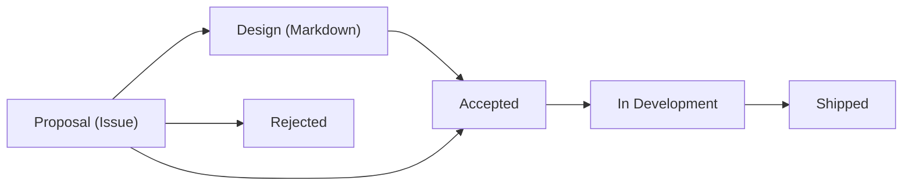

<!--
SPDX-FileCopyrightText: Copyright (c) 2025 NVIDIA CORPORATION. All rights reserved.

Licensed under the Apache License, Version 2.0 (the "License");
you may not use this file except in compliance with the License.
You may obtain a copy of the License at

http://www.apache.org/licenses/LICENSE-2.0

Unless required by applicable law or agreed to in writing, software
distributed under the License is distributed on an "AS IS" BASIS,
WITHOUT WARRANTIES OR CONDITIONS OF ANY KIND, either express or implied.
See the License for the specific language governing permissions and
limitations under the License.

SPDX-License-Identifier: Apache-2.0
-->

# Projects Process

This directory contains the **projects process** for proposing, designing, and implementing significant changes to this repository. The process is lightweight, async-first, and uses GitHub Issues and Pull Requests.



## Overview

The projects process consists of three key artifacts:

1. **Project proposal** ([GitHub Issue](../.github/ISSUE_TEMPLATE/4-project-proposal.yml)) – A structured issue that outlines a new project or major change.
2. **Project design** ([Markdown document](./_project-design-template.md)) – A detailed technical design document for accepted proposals.
3. **Project board** ([GitHub Project](https://github.com/orgs/NVIDIA/projects/157)) – A tracking board that provides visibility into proposal status and progress.

## When to Use a Project Proposal

Use a project proposal for:

- **New projects or major features** – Significant additions to the codebase that affect multiple areas.
- **Cross-cutting changes** – Changes that span multiple components or modules.
- **Potentially breaking changes** – Modifications that could impact existing APIs, configurations, or user workflows.
- **Architectural decisions** – Changes to system design, infrastructure, or technical direction.

For smaller, localized changes, a normal issue and pull request are sufficient and no proposal is needed.

## Roles

- **Project proposal author** – The person who opens the project proposal issue. They describe the problem, goals, and high-level approach.
- **Person in Charge (PIC)** – The person responsible for driving the proposal and design through all stages. This is often the author, but can be someone else who takes ownership.
- **Maintainers / OSMO team** – Review proposals, provide feedback, guide design discussions, and ultimately decide whether to accept or reject proposals.

## Stages

The projects process has four stages, tracked via the **Stage** field in the Projects project board. Only OSMO team members can change the Stage field in the Projects board. This ensures proper governance and tracking of proposals through their lifecycle.

### Stage: Proposal (Issue)

**Goal:** Propose a new project and gather initial feedback.

1. **Search for existing proposals** – Before creating a new proposal, search existing issues with the `project-proposal` label to avoid duplication.
2. **Open a project proposal** – Use the [Project Proposal issue template](https://github.com/NVIDIA/OSMO/issues/new?template=4-project-proposal.yml) to create a new issue.
   - Fill out all required fields.
   - The issue will automatically be labeled with `project-proposal`.
   - The issue will automatically be added to the [Project Board](https://github.com/orgs/NVIDIA/projects/157) with **Stage: Proposal**.
3. **Discuss and refine** – Maintainers, the PIC, and the community discuss the proposal asynchronously in the issue comments.
   - Clarify scope and goals.
   - Identify risks and alternatives.
   - Determine if a detailed design is needed.

**Possible stage outcomes:**

- **Design**
  - The proposal is approved by OSMO team members.
  - The proposal requires a design.
  - The issue is moved to **Stage: Design**.
  - Proceed to Stage: Design (Markdown).
- **Accepted**
  - The proposal is approved by OSMO team members.
  - The proposal does not require a design.
  - The issue is moved to **Stage: Accepted**.
  - Proceed to Stage: In Development.
- **Rejected**
  - The proposal is declined by OSMO team members.
  - OSMO team updates closes the issue with an explanation.
  - The issue is moved to **Stage: Rejected**.

### Stage: Design (Markdown)

**Goal:** Create a detailed technical design for accepted proposals.

For proposals that are significant or complex, a project design document provides a deeper technical plan.

1. **Copy the template** – Duplicate [`_project-design-template.md`](./_project-design-template.md) to a new file:
   ```bash
   cp projects/_project-design-template.md projects/PROJ-NNN-short-slug.md
   ```
   Use the proposal issue number (e.g., `PROJ-123`, `PROJ-456`) and a short, descriptive slug.

2. **Fill out the design** – Complete the template, expanding on the proposal:
   - **Copy content from the proposal** – The Overview should align closely with the project proposal fields. Copy and refine as needed.
   - **Add detailed design** – Include API designs, architecture diagrams, data models, component interactions, and examples.
   - **Document alternatives** – Explain what alternatives were considered and why this design was chosen.
   - **Address impact** – Discuss backwards compatibility, performance, operations, security, and documentation.

3. **Open a pull request** – Submit the project design as a PR.
   - Link to the project proposal issue.
   - The PR description should summarize the design and invite review.

4. **Review and iterate** – Discuss the design in the PR comments. Revise as needed.
   - Key decisions should be summarized back in the project proposal issue for visibility.
   - Once the PR has received approvals, merge the PR.

5. **Update the project board** – OSMO team sets **Stage: Accepted**.

### Stage: In Development

**Goal:** Build the project according to the design.

1. **Create sub-issues** – Break the project into concrete tasks and open sub-issues for each.
   - Use the implementation plan from the project design to organize work.

2. **Track progress** – OSMO team updates the **Stage** field to **Stage: In Development** in the Projects project board.

3. **Work in a feature branch** - Work in a feature branch to keep `main` clean during feature development.
   - Add a comment on the [Proposal Issue](#stage-proposal-issue) asking an OSMO team member to create a branch for you. Creating feature branches is restricted.
   - In the comment, provide a name for the feature branch with the naming `feature/PROJ-NNN-short-slug`. Use the same name as your [Design (Markdown)](#stage-design-markdown).
   - If your feature can be completed in a single, reasonably-sized PR, this project process may be unecessary. Use your discretion about whether a feature branch is necessary, and feel free to ask the OSMO team in your proposal issue.

4. **Submit pull requests** – Implement the project in PRs against your feature branch.
   - Reference the sub-issues in PR descriptions for context.

5. **Merge `main`** - Keep your feature branch compatible with `main` by merging `main` into your feature branch with a PR.
   - PRs will be opened weekly on Monday by automation to merge the latest `main` into the feature branch.
   - Resolve any merge conflicts you encounter and merge into your feature branch.

5. **Update the project design** – As implementation progresses, update the project design document if decisions change or new details emerge.
   - Submit PRs to update the design document as needed.

### Stage: Shipped

**Goal:** Mark the project as complete and communicate the outcome.

1. **Update the project design** – Once implementation is complete:
   - Update the document with links to final PRs and documentation.

2. **Close the project proposal issue** – Close the issue with a brief summary:
   - What was delivered.
   - Links to the project design, key PRs, and documentation.
   - Any follow-up work or future considerations.

3. **Update the project board** – OSMO team sets **Stage: Shipped** in the Projects project.

> [!NOTE]
> The project will be included in the next release of OSMO.

## Questions?

If you have questions about the projects process, ask in the project proposal issue or reach out to a maintainer.

------------------

Inspired by [nf-core](https://nf-co.re/docs/contributing/project_proposals) and [Astro](https://github.com/withastro/roadmap).
