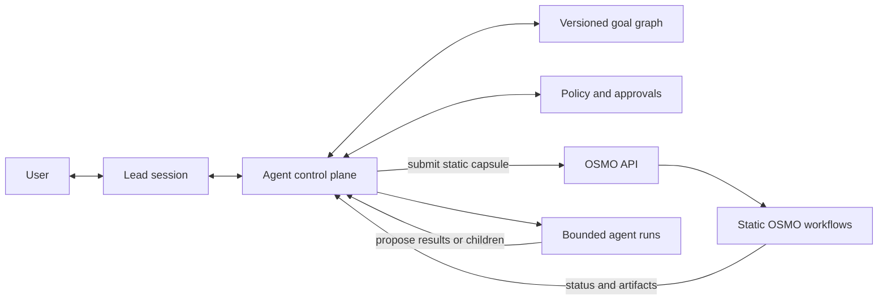
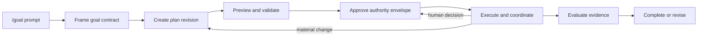

<!--
Copyright (c) 2026, NVIDIA CORPORATION. All rights reserved.

NVIDIA CORPORATION and its licensors retain all intellectual property
and proprietary rights in and to this software, related documentation
and any modifications thereto. Any use, reproduction, disclosure or
distribution of this software and related documentation without an express
license agreement from NVIDIA CORPORATION is strictly prohibited.
-->

# Agentic Goals: Overview

Status: Draft

## Vision

Give a user one place to state a high-level goal, align on what success means, and authorize a bounded organization of agents and workflows to pursue it.

The experience begins with:

```text
/goal <high-level objective>
```

A lead agent collaborates with the user to turn that objective into a goal contract and a versioned execution plan. After approval, the lead coordinates specialized agents, deterministic tools, and OSMO workflows while preserving a clear path for inspection, steering, approval, cancellation, and evidence-based completion.

## Product thesis

OSMO is the execution substrate, not the agentic state machine.

OSMO is well suited to static, containerized DAG execution across heterogeneous Kubernetes clusters. It already provides task dependencies, resource scheduling, datasets and artifacts, credentials, retries, logs, rendered-spec dry-run, and validation. It does not currently provide dynamic graph expansion, native child workflows, durable conversations, approval gates, or hierarchical agent semantics.

The agentic layer therefore lives in a new control plane above OSMO:



OSMO validates a complete workflow before submission and materializes its groups and tasks as a static DAG. See the current [workflow submission API](../../external/src/service/core/workflow/workflow_service.py), [workflow schema](../../external/src/utils/job/workflow.py), and [submit job](../../external/src/utils/job/jobs.py).

## Three distinct graphs

The design must keep three related structures separate:

1. **Goal and delegation graph**
   - Describes ownership: which agent or deterministic process is responsible for each sub-goal.
   - May grow as bounded agents propose additional work.

2. **Execution graph**
   - Describes dependencies, joins, approvals, evaluations, retries, and plan revisions.
   - Is dynamic only through durable, versioned, auditable changes.

3. **OSMO workflow DAG**
   - Describes a static execution capsule submitted to OSMO.
   - Is immutable after submission; a materially changed plan produces a new workflow or attempt.

Agent loops and replanning mean the complete system is a durable state machine over graph revisions, not one recursively mutable DAG.

## Core concepts

- **Goal**: The user-visible objective and durable root of all work.
- **Goal contract**: Objective, non-goals, acceptance criteria, constraints, deadline, budget, autonomy policy, and permitted capabilities.
- **Plan revision**: An immutable version of the proposed execution graph.
- **Workstream**: A user-comprehensible sub-goal owned by one agent or deterministic process.
- **Node run**: One execution of a workstream contract.
- **Attempt**: One retry or revised strategy for a node run.
- **Agent run**: A bounded model-driven loop with typed inputs, outputs, tools, budget, stop conditions, and evaluator.
- **Workflow capsule**: A static OSMO workflow used for coarse, isolated, resource-intensive, or data-bearing execution.
- **Approval**: A human decision that grants or denies a specific authority envelope.
- **Artifact**: A typed, addressable output used as evidence or as input to later work.
- **Evidence**: Information that supports an acceptance criterion or a material decision.
- **Event**: An append-only record of state changes, decisions, actions, and external bindings.

## Execution node classes

The initial system supports three explicit node classes:

1. **Deterministic job**
   - Runs a script, tool, API call, or OSMO task from typed inputs.
   - Has predictable control flow even when the external system may fail.

2. **Bounded agent run**
   - Uses a model to reason, select tools, and produce a typed result.
   - Is constrained by a tool policy, budget, deadline, maximum steps, and evaluator.

3. **Constrained agent-tool loop**
   - Uses deterministic tools inside a nondeterministic reasoning harness.
   - Treats the harness as controlled and auditable without claiming model behavior is deterministic.

There is no unbounded “pure agent” node. Every node has an enforceable contract and termination policy.

## Design principles

- `/goal` creates a draft; it never starts execution by itself.
- Human approval grants bounded authority, not blanket autonomy.
- Plan changes are revisions, not invisible mutations.
- Delegation depth, fan-out, concurrency, spend, compute, tokens, and wall time are bounded.
- Lightweight planning and model calls stay in the agent control plane; OSMO runs coarse execution capsules.
- State lives outside chat and can survive process, model, and UI restarts.
- Agents exchange typed artifacts and messages rather than relying on copied transcripts.
- Completion is based on acceptance criteria and evidence, not agent self-declaration.
- Every external side effect is attributable, policy-checked, and idempotent or compensatable.
- The lead summarizes and governs; it does not ingest every raw child transcript into one context window.

## End-to-end experience



The detailed lifecycle is defined in [02-lifecycle.md](02-lifecycle.md). The user experience is defined in [03-ui.md](03-ui.md) and [05-human-interfaces.md](05-human-interfaces.md).

## Scope

The first validation should support:

- One technical user.
- A chat-first `/goal` entry point and a visual run console.
- One lead agent and one bounded level of delegated workers.
- Deterministic jobs, bounded agent runs, and coarse OSMO workflow capsules.
- Versioned plans and explicit approval envelopes.
- One controlled replan path.
- Durable status, evidence, cost, and lineage.
- Goal-wide pause and best-effort cancellation semantics.
- Independent evaluation before completion.

## Non-goals for the first validation

- Unlimited recursive delegation.
- Treating every LLM turn or tool call as an OSMO workflow.
- Mutating an in-flight OSMO workflow DAG.
- Exactly-once execution across arbitrary external tools.
- Reproducing nondeterministic model outputs during replay.
- Replacing OSMO workflow, resource, log, event, or shell views.
- Autonomous privilege escalation or unrestricted credential propagation.
- A general-purpose organizational simulation based on the CEO metaphor.

## First success criteria

The concept is viable when a representative goal can demonstrate:

- Recovery after coordinator restart without duplicate OSMO submissions or duplicate side effects.
- End-to-end lineage from the goal prompt through plans, agents, tools, OSMO workflow IDs, artifacts, approvals, and evaluation.
- Enforced delegation, resource, time, and spend limits.
- Human inspection and steering of a nested worker without losing the lead context.
- A failed or timed-out child cannot strand the parent indefinitely.
- Goal-wide stop behavior eventually reconciles all descendants.
- Every completion claim maps to explicit acceptance criteria and evidence.
- The user can always answer: what is happening, why, what changed, what needs attention, what supports completion, and what can be safely stopped.

## Document map

- [02-lifecycle.md](02-lifecycle.md): Goal, plan, node, attempt, approval, and termination state machines.
- [03-ui.md](03-ui.md): Chat-first experience and visual run console.
- [04-lead-agent.md](04-lead-agent.md): Lead responsibilities, decision boundaries, and context management.
- [05-human-interfaces.md](05-human-interfaces.md): Approvals, attention routing, steering, notifications, and manual intervention.
- [06-workflow-construction.md](06-workflow-construction.md): Compiling execution nodes into static OSMO workflows.
- [07-agent-construction.md](07-agent-construction.md): Agent manifests, harnesses, capabilities, budgets, and evaluators.
- [08-agent-agent-communication.md](08-agent-agent-communication.md): Typed messages, artifacts, delegation, joins, and event semantics.
