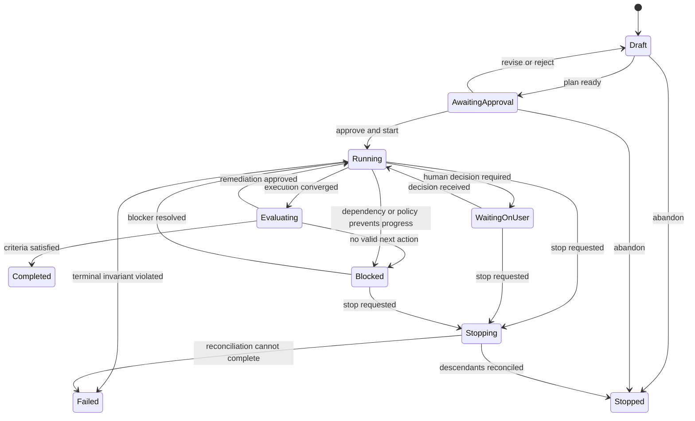
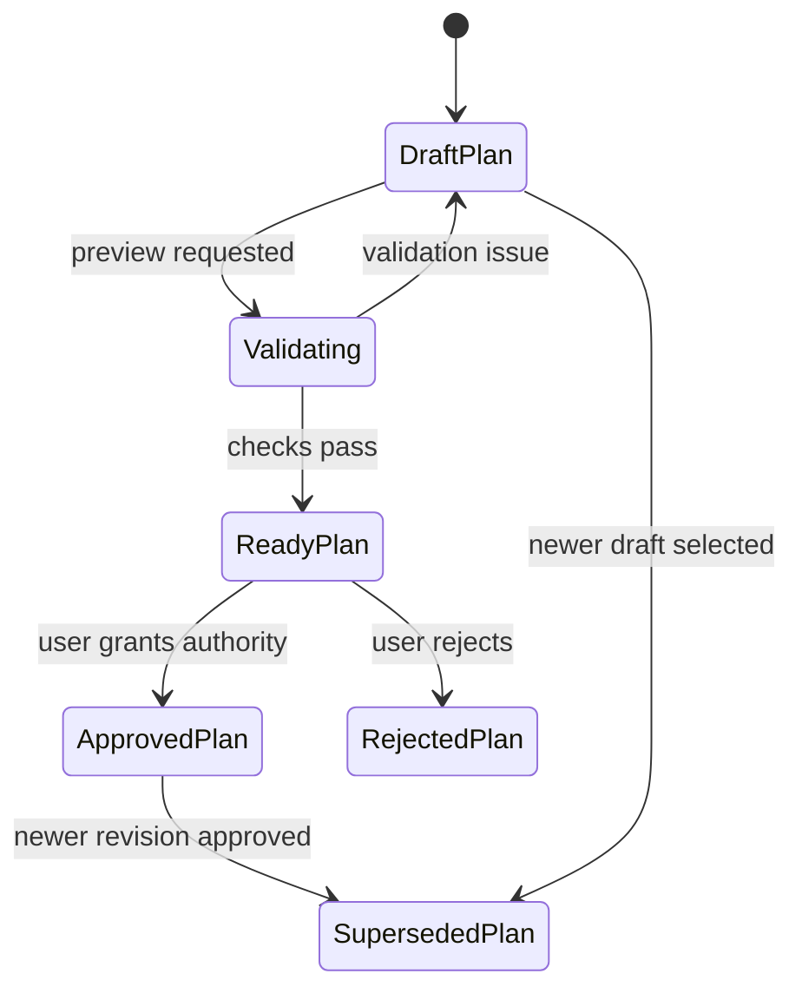
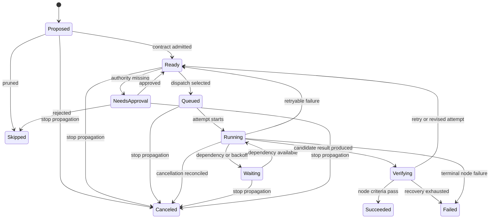

<!--
Copyright (c) 2026, NVIDIA CORPORATION. All rights reserved.

NVIDIA CORPORATION and its licensors retain all intellectual property
and proprietary rights in and to this software, related documentation
and any modifications thereto. Any use, reproduction, disclosure or
distribution of this software and related documentation without an express
license agreement from NVIDIA CORPORATION is strictly prohibited.
-->

# Agentic Goals: Lifecycle

Status: Draft

## Purpose

Define durable, comprehensible lifecycle semantics for goals that may contain plan revisions, bounded agent loops, deterministic work, human decisions, and multiple OSMO workflow attempts.

The lifecycle must remain correct when:

- The coordinator, model runtime, UI, or network restarts.
- A child agent proposes more work.
- A user changes direction during execution.
- An OSMO submission is duplicated, delayed, canceled, or restarted.
- A tool succeeds but its response is lost.
- A parent fails while children remain active.
- Evaluation rejects an apparently successful result.

## Lifecycle model

The source of truth is an append-only event history plus transactional projections. Chat messages, model context, and OSMO status are inputs to reconciliation; none is the sole system of record.

Every transition records:

- Entity ID and prior state.
- New state and reason.
- Actor: user, lead, worker, policy engine, evaluator, reconciler, tool, or OSMO.
- Plan revision and authority envelope in force.
- Correlation and causation IDs.
- Relevant attempt, artifact, approval, and OSMO workflow IDs.
- Timestamp and idempotency key.

## Goal lifecycle

### Goal states

- **Draft**: The goal contract and plan may change freely. No execution side effects are permitted.
- **Awaiting approval**: A specific plan revision and authority envelope are ready for a human decision.
- **Running**: The coordinator may dispatch work within the approved envelope.
- **Waiting on user**: Progress is intentionally suspended on a required human decision. Work independent of that decision may continue only if the plan explicitly permits it.
- **Evaluating**: Planned execution has converged and independent acceptance checks are running.
- **Blocked**: No permitted action can currently make progress. The goal may recover when a dependency, policy, credential, resource, or human-provided input changes.
- **Stopping**: No new work is dispatched; the coordinator is reconciling queued and active descendants according to the selected stop mode.
- **Stopped**: The user or policy intentionally ended the goal. Partial artifacts and evidence remain available.
- **Completed**: Acceptance criteria are satisfied with recorded evidence.
- **Failed**: The system cannot preserve a required invariant or has exhausted approved recovery paths. Ordinary child failure does not automatically imply goal failure.

`Completed`, `Stopped`, and `Failed` are terminal for a goal run. Continuing later creates a new run or an explicit successor linked to the prior run.

## Plan revision lifecycle

Plans are immutable after proposal. Editing creates a new revision.

Each revision contains:

- Goal contract snapshot.
- Initial execution graph.
- Node contracts and evaluators.
- Expected artifacts and joins.
- Tool, model, skill, harness, and image versions.
- OSMO workflow previews where known.
- Expansion limits and approval triggers.
- Resource, token, spend, and time budgets.
- Risk summary, assumptions, and known unknowns.

A running goal may have only one active approved revision. Work already dispatched under an older revision remains attributable to it and is reconciled by the transition policy.

## Node lifecycle

### Node invariants

- A node cannot become `Ready` without a valid contract, dependency set, evaluator, budget allocation, and authority classification.
- A node cannot become `Running` without exactly one active attempt lease.
- A node cannot become `Succeeded` solely because a model or process returned success; its evaluator must accept the result.
- A terminal node retains all attempts, artifacts, messages, and evidence.
- Child creation is a proposal until the coordinator admits it under graph, policy, and budget limits.

## Attempt lifecycle

An attempt is the unit of dispatch and external idempotency.

1. **Created**: Inputs, contract, authority, and idempotency key are frozen.
2. **Dispatching**: The coordinator claims a lease and starts a model harness, tool call, or OSMO submission.
3. **Executing**: The external runtime has acknowledged the attempt.
4. **Reconciling**: The coordinator observes outputs and terminal state, including after a crash.
5. **Succeeded**, **Failed**, **Canceled**, or **Unknown**: Terminal attempt outcome.

`Unknown` means an external side effect may have happened but cannot yet be proven. The coordinator must reconcile by idempotency key, external identifier, or human review before retrying.

## Parent, child, and join semantics

- A parent owns the scope and budget delegated to its children.
- Child state does not directly overwrite parent state.
- Parents declare an explicit join policy:
  - All required children succeed.
  - Any one child succeeds.
  - A quorum succeeds.
  - An evaluator decides from available evidence.
  - Best effort until deadline or budget exhaustion.
- Optional children may fail or be skipped without failing the parent.
- Required child failure returns control to the parent for retry, replacement, replan, partial completion, or terminal failure.
- Cancellation propagates from parent to descendants; descendant cancellation does not automatically propagate upward.
- Shared dependencies are represented as graph edges, not duplicated children.

## Retry, restart, and replan

These are different operations:

- **Retry**: Repeat the same node contract and strategy with a new attempt.
- **Restart**: Recreate an execution capsule while reusing verified outputs where the runtime supports it. OSMO restart creates a new workflow rather than resuming the old one.
- **Replan**: Change dependencies, strategy, tools, resources, evaluator, or authority envelope in a new plan revision.

Automatic retry is allowed only when:

- The failure is classified as transient.
- The node contract and strategy remain unchanged.
- The authority envelope and retry budget permit it.
- Repeating the side effect is idempotent or safe.

A material change always requires a revision. It may proceed automatically only when the existing approval explicitly authorizes that class of revision.

## Pause and stop semantics

OSMO has cancellation but no native workflow pause/resume. The goal-level UI must therefore use precise controls:

- **Pause coordination**
  - Acquire no new dispatch leases.
  - Do not create or start new attempts.
  - Active attempts and OSMO workflows continue.

- **Stop pending work**
  - Pause coordination.
  - Cancel proposed, ready, and queued descendants.
  - Let active attempts reach a terminal state.

- **Stop everything**
  - Pause coordination.
  - Cancel all pending descendants.
  - Send best-effort cancellation to active model, tool, and OSMO attempts.
  - Reconcile until every descendant is terminal or explicitly marked unknown.

The goal remains `Stopping` until reconciliation completes. The UI must not report `Stopped` immediately after a cancellation request.

## Time and liveness

Every nonterminal entity has:

- A deadline or inherited deadline.
- A last-progress timestamp.
- A lease owner and lease expiry when actively coordinated.
- A next reconciliation time.
- A bounded waiting reason.

The coordinator detects:

- Expired dispatch leases.
- Attempts with no progress.
- Parents waiting on terminal children with no valid join path.
- Human decisions past their deadline.
- OSMO workflows missing from expected queries.
- Goals with no runnable node and no declared blocker.

Detected liveness failures produce explicit events and recovery actions; they must not remain silent `Running` states.

## Recovery and reconciliation

The reconciler repeatedly compares desired goal state with:

- Durable node and attempt records.
- Model harness run state.
- Tool idempotency records.
- OSMO workflow and task status.
- Approval decisions.
- Artifact and evaluator results.

Reconciliation is at-least-once. All transition handlers must therefore be idempotent, and every external dispatch must have a stable client-generated key.

## Lifecycle acceptance criteria

- Every UI state has a precise durable counterpart.
- No terminal state has active descendants.
- No attempt can be dispatched twice under the same idempotency key.
- Coordinator restart reconstructs the same desired state from durable records.
- Material plan changes remain visible as revision diffs.
- Evaluation gates completion independently of execution success.
- Pause and stop actions behave exactly as described.
- Stalled goals are detected and surfaced within a defined reconciliation interval.
