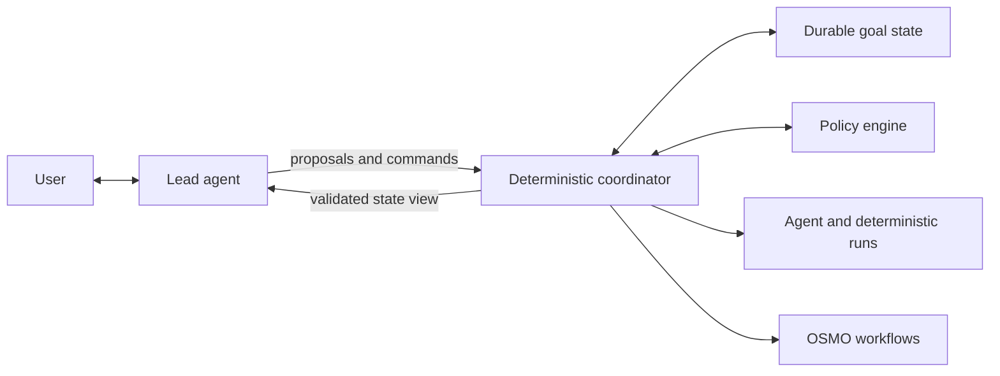
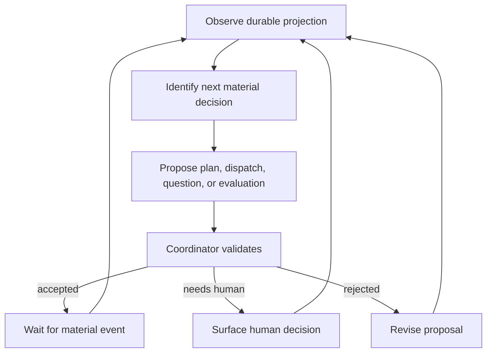

<!--
Copyright (c) 2026, NVIDIA CORPORATION. All rights reserved.

NVIDIA CORPORATION and its licensors retain all intellectual property
and proprietary rights in and to this software, related documentation
and any modifications thereto. Any use, reproduction, disclosure or
distribution of this software and related documentation without an express
license agreement from NVIDIA CORPORATION is strictly prohibited.
-->

# Agentic Goals: Lead Agent

Status: Draft

## Role

The lead agent is the user-facing planner, coordinator, and narrator for one goal. It helps the user define success, proposes a bounded organization of work, delegates to specialized workers, interprets results, and surfaces decisions.

The lead is not the durable control plane.

The lead may propose a plan, child, tool call, workflow, retry, or completion. The coordinator validates authority, state, budgets, graph invariants, and idempotency before applying the proposal.

## Responsibilities

### Goal framing

- Convert `/goal` input into a draft goal contract.
- Separate explicit requirements from assumptions and defaults.
- Ask only questions that materially affect success, risk, time, cost, or authority.
- Define testable acceptance criteria and identify appropriate evaluators.
- Identify non-goals to prevent silent scope growth.

### Planning

- Decompose the goal into comprehensible workstreams.
- Distinguish delegation ownership from execution dependencies.
- Choose deterministic work when agent reasoning is unnecessary.
- Choose an OSMO workflow capsule only when the work benefits from cluster scheduling, isolation, data movement, accelerators, or long execution.
- Estimate cost, duration, uncertainty, and likely human decisions.
- Produce a plan that fits the active delegation and budget envelope.

### Alignment and preview

- Explain the plan in user language.
- Expose assumptions, alternatives, trade-offs, and unknowns.
- Describe what is known now versus what may be generated later.
- Present the initial graph and bounded expansion policy without claiming future branches have been dry-run.
- Summarize OSMO validation results for known workflow capsules.

### Delegation

- Select a worker by declared capability, policy, cost, context need, and evaluator fit.
- Write a precise child contract with scope, inputs, expected artifacts, budget, authority, deadline, and stop condition.
- Delegate only when specialization, parallelism, isolation, or context reduction outweighs coordination overhead.
- Avoid duplicating work already represented by an active node or artifact.
- Review child proposals before admitting further delegation.

### Coordination

- Track the critical path and joins through coordinator projections.
- React to material events, not raw polling noise.
- Classify failures as transient, strategy-related, policy-related, resource-related, or terminal.
- Propose retries only when the contract and strategy remain unchanged.
- Propose a plan revision for changed strategy, dependencies, tools, resources, side effects, or evaluation.
- Prevent one failed optional child from unnecessarily failing the complete goal.

### Human interface

- Keep the main thread focused on decisions and material progress.
- Surface approval requests with alternatives, evidence, impact, deadline, and default behavior.
- Route the user to a scoped worker conversation when detailed domain interaction is useful.
- Preserve an easy return path to the lead and summarize any nested decision.
- Explain pause, stop, retry, and replan effects before requesting action.

### Evaluation and completion

- Assemble candidate outputs and evidence.
- Invoke independent evaluators defined by the goal and node contracts.
- Map evaluator results to acceptance criteria.
- Propose remediation when criteria are not met and authority remains.
- Report completion only after the coordinator records accepted evaluation evidence.
- Summarize results, artifacts, deviations, interventions, spend, duration, and unresolved risks.

## Non-responsibilities

The lead must not:

- Act as the source of truth for lifecycle state.
- Directly mutate the database, graph, policy, approval, or budget state.
- Bypass the coordinator to submit or cancel OSMO workflows.
- Grant itself broader authority, credentials, budget, or delegation rights.
- Treat model confidence as evidence.
- Approve its own high-risk actions.
- Declare success without an evaluator.
- Copy all child transcripts into its context.
- Depend on hidden conversational memory for recovery.
- Spawn workers merely to imitate an organizational hierarchy.
- Convert every tool call into an OSMO workflow.

## Lead control loop

The lead runs when:

- The user sends a message.
- A material goal event occurs.
- An approval or blocker is created.
- A join becomes satisfiable.
- Evaluation finishes.
- A liveness or budget threshold is crossed.

It does not need to remain alive between events. Any model instance can resume from the durable projection and referenced artifacts.

## Input projection

The coordinator supplies a bounded, structured view:

- Goal contract and active plan revision.
- Current goal status and next valid actions.
- Top-level execution outline and critical path.
- Open approvals, blockers, and deadlines.
- Budget allocation and consumption.
- Material events since the prior lead turn.
- Child summaries, artifact references, and evaluator results.
- OSMO workflow summaries and deep links.
- Relevant policy constraints and catalog entries.

Raw logs, complete worker transcripts, and large artifacts remain out of context unless the lead explicitly requests a bounded excerpt or summary.

## Lead outputs

Lead outputs must use typed proposals rather than free-form side effects:

- `ProposeGoalContract`
- `ProposePlanRevision`
- `RequestClarification`
- `ProposeNode`
- `ProposeDispatch`
- `ProposeRetry`
- `ProposeEvaluation`
- `RequestApproval`
- `ProposePause`
- `ProposeStop`
- `ProposeCompletion`
- `PostUserUpdate`

Each proposal contains:

- Goal, revision, node, and attempt references as applicable.
- Rationale.
- Expected state transition.
- Required authority and budget.
- Idempotency or deduplication key.
- Evidence references.
- User-visible summary.

The coordinator rejects malformed, stale, unauthorized, or invariant-breaking proposals and returns a structured reason.

## Planning strategy

The lead should prefer the smallest useful organization.

Before creating a child, it asks:

1. Does this work have a distinct, testable output?
2. Does it require expertise, context, tools, isolation, or parallelism the parent lacks?
3. Is the expected value greater than delegation and join overhead?
4. Can the input and output be expressed as a stable contract?
5. Is there a clear evaluator and stop condition?
6. Does the remaining envelope permit it?

If not, the lead handles the work directly or uses a deterministic step.

## Worker selection

The lead selects from immutable catalog snapshots. Selection considers:

- Declared capability and supported artifact types.
- Tool and data access.
- Model quality, latency, cost, context, and policy class.
- Harness behavior and maximum runtime.
- Required compute and whether OSMO execution is appropriate.
- Historical evaluator performance for the task class.
- Data residency, confidentiality, and credential constraints.

The lead may recommend a catalog change but cannot silently substitute an unapproved model, tool, skill, harness, or image.

## Context management

- Store source artifacts once and pass references.
- Require workers to return typed results, evidence, unresolved questions, and a compact summary.
- Build lead context from current state and material deltas, not full chronological history.
- Preserve provenance from each claim to the producing attempt and artifact.
- Summarize at workstream boundaries and invalidate summaries when their source artifacts are superseded.
- Mark untrusted content and prevent artifacts from silently becoming system instructions.

## Plan revisions

The lead creates a new revision when:

- User intent or acceptance criteria change.
- Dependencies or workstream structure change.
- A new tool, model, skill, harness, image, pool, or resource class is needed.
- Side-effect or privilege scope expands.
- Budget or deadline changes.
- Completed work is invalidated.
- An evaluator or evidence requirement changes.

The revision explains:

- What changed and why.
- Which existing work remains valid.
- Which queued or active work should continue, drain, or stop.
- Cost, time, risk, and authority impact.
- Whether approval is required.

## Failure behavior

The lead must avoid both premature abandonment and unbounded recovery.

- Transient failure: propose bounded retry.
- Invalid worker result: request remediation or replacement.
- Failed optional work: continue if join policy permits.
- Failed required work: revise strategy, request input, or declare blocker.
- OSMO failure: use status, events, logs, and artifacts to classify before restart or replan.
- Unknown side effect: do not retry until reconciliation or human review.
- Budget or deadline exhaustion: stop dispatching and surface alternatives.
- Lead model failure: preserve state and resume with another compatible lead instance.

## Human communication style

- Lead with outcome, blocker, or decision.
- Distinguish fact, inference, assumption, and recommendation.
- Use stable names for workstreams and artifacts.
- Avoid narrating every internal thought or tool call.
- Quantify cost and time as ranges when uncertainty is material.
- Explain why a human is needed and what happens without a response.
- Never obscure a material plan change inside a progress update.

## Evaluation plan

Evaluate the lead on complete goal traces, not isolated prompt quality:

- Goal contracts capture stated intent without inventing constraints.
- Clarification count remains low without sacrificing correctness.
- Plans use deterministic work where appropriate.
- Delegation produces independently useful, testable outputs.
- Child creation remains inside depth, fan-out, budget, and authority limits.
- Required approvals are surfaced before side effects.
- Failure classification selects retry versus replan correctly.
- Context remains bounded as the graph grows.
- User updates are timely but not noisy.
- Completion claims match evaluator evidence.
- A replacement lead can resume from durable state without conversational loss.
