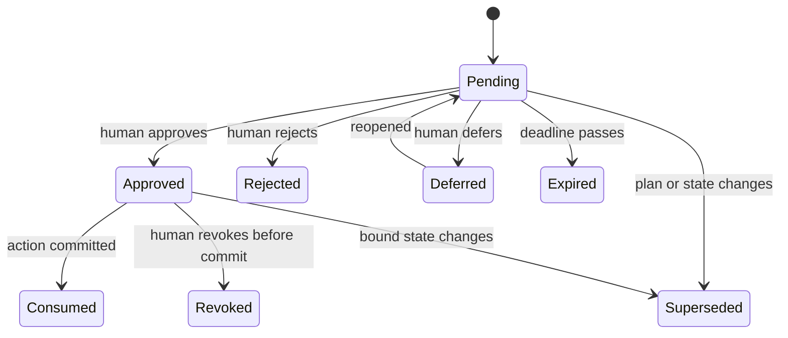

<!--
Copyright (c) 2026, NVIDIA CORPORATION. All rights reserved.

NVIDIA CORPORATION and its licensors retain all intellectual property
and proprietary rights in and to this software, related documentation
and any modifications thereto. Any use, reproduction, disclosure or
distribution of this software and related documentation without an express
license agreement from NVIDIA CORPORATION is strictly prohibited.
-->

# Agentic Goals: Human Interfaces

Status: Draft

## Purpose

Define how a human aligns, authorizes, observes, steers, interrupts, and evaluates an agentic goal without becoming the manual scheduler for every nested worker.

Human interaction is a first-class protocol. It is not an ad hoc pause in an agent transcript.

## Principles

- Ask for human attention only when it can change an outcome or authority.
- State exactly what decision is needed and why automation cannot make it.
- Bind approval to an immutable scope and plan revision.
- Distinguish questions from state-changing directives.
- Let the user inspect any nested scope without losing the lead context.
- Record manual interventions and their downstream impact.
- Define deadline and default behavior for every blocking request.
- Never treat silence as approval for a new side effect or expanded authority.
- Preserve a useful result when the user stops or abandons a partially completed goal.

## Human interaction classes

### Alignment

Used while the goal is a draft:

- Clarify objective or non-goals.
- Define acceptance criteria.
- Select among meaningful strategies.
- Set constraints, deadline, budget, and autonomy.
- Confirm inferred assumptions.
- Supply missing input or credentials.

Alignment does not grant execution authority.

### Approval

Used when the system needs explicit authority:

- Approve a plan revision and start execution.
- Permit an external write or irreversible action.
- Expand tool, model, data, credential, network, privilege, pool, or resource scope.
- Increase budget, deadline, delegation depth, fan-out, or concurrency.
- Accept a material strategy change.
- Authorize retry of an uncertain or non-idempotent side effect.
- Accept partial completion or waive an acceptance criterion.

### Information request

Used when the system needs domain input but not authority:

- Choose a dataset or benchmark.
- Explain ambiguous source material.
- Resolve a business or scientific preference.
- Provide missing environmental context.

### Notification

Used for material but nonblocking updates:

- Major milestone.
- Critical-path change.
- Automatic recovery that affects confidence, time, or cost.
- Approaching budget or deadline threshold.
- Evaluation result.
- Terminal outcome.

### Intervention

Initiated by the user:

- Ask the lead or a worker for explanation.
- Add context or evidence.
- Propose a directive.
- Pause coordination.
- Stop pending work.
- Stop everything.
- Open an OSMO workflow, log, event, or shell.

## Authority envelope

Approval grants a bounded envelope, not general autonomy.

An envelope records:

- Goal and immutable plan revision.
- Effective user and approving identity.
- Allowed agent, model, skill, harness, tool, and image versions.
- Permitted data, repositories, services, network destinations, credentials, and OSMO pools.
- Allowed side-effect and risk classes.
- Spend, token, compute, time, depth, fan-out, concurrency, retry, and OSMO submission limits.
- Actions that always require additional approval.
- Expiration and revocation conditions.

Suggested presets:

### Supervised

- Read-only reasoning and preview may proceed.
- Every model/tool dispatch, child creation, workflow submission, and mutation requires approval.

### Guardrailed

- Recommended initial preset.
- Reads, approved model calls, local computation, child creation, and OSMO submissions may proceed inside the envelope.
- External writes, destructive actions, privilege expansion, policy exceptions, uncertain retries, and envelope changes require approval.

### Broad autonomy

- Most actions inside the envelope proceed.
- Destructive actions, privilege expansion, policy exceptions, and envelope changes still require approval.
- Not required for the first validation.

## Approval request contract

Every approval request contains:

- Stable approval ID.
- Requesting goal, workstream, node, and agent.
- Current plan revision and proposed revision when applicable.
- One concise decision statement.
- Reason the decision is needed now.
- Recommended option and alternatives.
- Evidence and relevant artifacts.
- Expected effect on outcome, cost, time, risk, and completed work.
- Exact authority to be granted.
- Whether the grant applies once, to one workstream, or to the remaining goal.
- Deadline.
- Safe default if unanswered.
- Idempotency key for the resulting action.

Available decisions:

- Approve once.
- Approve this class for the current workstream.
- Approve this class for the remaining goal within a displayed limit.
- Edit and approve.
- Reject.
- Defer.
- Ask a question without deciding.

## Approval lifecycle

An approval is consumed only when the authorized transition commits. A stale approval cannot authorize a changed plan, input, target, cost, or side effect.

## Attention inbox

The inbox is the canonical list of unresolved human requests.

It separates:

- **Blocking now**: No valid critical-path action can continue.
- **Blocking later**: Independent work continues, but a future join depends on the answer.
- **Review requested**: The system recommends inspection but can proceed under current authority.
- **Informational**: No decision required.

Ordering considers:

- Critical-path impact.
- Deadline.
- Cost of waiting.
- Risk.
- Number of descendants blocked.

The lead batches compatible low-risk decisions where doing so does not obscure scope.

## Chat scope

Global chat addresses the lead. A user may enter a nested scope through `Talk to this worker`.

Every scoped conversation displays:

- Goal and workstream breadcrumb.
- Worker identity and contract.
- Current attempt and plan revision.
- Whether the worker is active, waiting, or terminal.
- `Return to lead`.

The worker receives only the scoped message and relevant contract/artifact references. It does not inherit unrestricted authority from the user merely because the user opened its chat.

When the user returns:

- The nested conversation is summarized into a durable decision or context artifact.
- The lead receives the summary and any proposed plan change.
- Material directives still pass through coordinator and policy validation.

## Ask versus Direct

The composer has two explicit modes:

### Ask

- Read-only.
- May query state, reasoning, evidence, logs, expected impact, or alternatives.
- Cannot dispatch work, modify desired state, increase authority, or cancel execution.

### Direct

- Proposes a state-changing instruction.
- Shows affected scope before submission.
- Produces a plan diff or runtime action preview.
- States whether current authority is sufficient.
- Requires approval when the instruction exceeds the envelope.

Natural language can suggest a mode, but the UI must make the final mode visible before committing.

## Steering semantics

Steering may:

- Add context or an artifact.
- Change priority among ready nodes.
- Request a new workstream.
- Change strategy or evaluator.
- Replace a worker.
- Revise budget or deadline.
- Pause or stop a scope.

The preview identifies:

- Work that remains valid.
- Work invalidated or made obsolete.
- Active attempts that should continue, drain, or cancel.
- Added cost and time.
- New authority or human decisions.
- Revised acceptance criteria.

Steering never edits historical plan revisions or attempt records.

## Pause and stop

Human controls use the lifecycle definitions from [02-lifecycle.md](02-lifecycle.md):

- **Pause coordination**: Start no new work; active work continues.
- **Stop pending work**: Cancel queued work; active work continues.
- **Stop everything**: Best-effort cancel all descendants.

Before commitment, show:

- Number of pending and active nodes.
- Active OSMO workflows and whether their outputs may be lost.
- Non-cancelable or uncertain side effects.
- Estimated time to reconcile.
- Artifacts already preserved.

The user may apply the action to one node, one workstream, or the whole goal.

## Manual OSMO intervention

The user may open existing OSMO workflow detail, logs, events, dashboards, or shell.

- Read-only inspection requires no additional goal transition.
- Cancel, restart, resubmit, exec, port-forward, rsync, or shell commands are recorded as interventions.
- State-changing actions should be initiated through the goal console when possible so policy and lifecycle semantics remain consistent.
- If an action occurs directly in OSMO, the reconciler records external intervention and evaluates whether the plan is still valid.
- Shell access is considered an elevated expert action because it may alter workload state outside the declared node contract.

## Notification policy

Default delivery remains in the active chat and console. Optional external channels may notify for:

- Blocking approval.
- Security or policy event.
- Budget or deadline threshold.
- Goal completion, failure, or stop.

Notifications contain no secrets or large artifacts and link to the durable request.

Users can configure:

- Quiet hours.
- Severity threshold.
- Digest versus immediate delivery.
- Goal-specific overrides.
- Escalation target when a deadline approaches.

Repeated polling or retry events are aggregated rather than emitted individually.

## Unanswered requests

Every request declares a safe default:

- Continue independent work.
- Pause affected work.
- Reject the proposed action.
- Stop the affected scope.
- Escalate to another authorized human.

No unanswered request defaults to expanded authority, destructive action, or irreversible side effect.

When a request expires, the system records the default action and explains its impact in the lead conversation.

## Conflicts and concurrency

- Human decisions use optimistic concurrency against the plan revision and entity version.
- If state changes while an approval card is open, the card becomes stale and displays the replacement request.
- Conflicting directives from different authorized humans are resolved by explicit policy, not last-write-wins chat order.
- Revoking authority stops new dispatch immediately and reconciles active work according to the revocation policy.
- A human can override an agent recommendation but cannot bypass platform security or tenancy policy.

## Trust and evidence

Human-facing claims distinguish:

- Observed fact.
- Tool or OSMO result.
- Agent inference.
- Assumption.
- Recommendation.

Approval cards cite the source artifact or event. Untrusted artifact text is not rendered as an instruction. Sensitive inputs are redacted according to policy before entering model context, chat, notification, or audit views.

## Acceptance criteria

- No execution starts from `/goal` without a scoped approval.
- Every side effect can be traced to an envelope and actor.
- Stale approvals cannot authorize changed work.
- The user can inspect and converse with any worker while retaining a clear return to the lead.
- Questions cannot accidentally mutate state.
- Stop controls accurately describe and eventually reflect descendant state.
- Blocking requests always explain why a human is needed and what happens without a response.
- Notification volume remains bounded during long-running goals.
- Manual OSMO intervention is visible in goal history.
