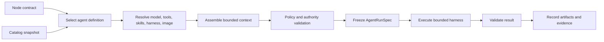

<!--
Copyright (c) 2026, NVIDIA CORPORATION. All rights reserved.

NVIDIA CORPORATION and its licensors retain all intellectual property
and proprietary rights in and to this software, related documentation
and any modifications thereto. Any use, reproduction, disclosure or
distribution of this software and related documentation without an express
license agreement from NVIDIA CORPORATION is strictly prohibited.
-->

# Agentic Goals: Agent Construction

Status: Draft

## Purpose

Define how a catalog of models, tools, skills, harnesses, images, policies, and evaluators becomes one immutable, bounded agent run.

An agent is not merely a model plus a prompt. It is a versioned execution contract with enforceable capabilities, limits, inputs, outputs, and evaluation.

## Agent definition

An agent definition contains:

- Stable name, version, owner, and purpose.
- Declared capabilities and task classes.
- Accepted input artifact schemas.
- Required output artifact schemas.
- Model selection policy.
- Harness and prompting strategy.
- Tool and skill allowlist.
- Execution environment and optional image.
- Context assembly and memory policy.
- Delegation policy.
- Authority and credential requirements.
- Step, token, spend, compute, and wall-time limits.
- Stop conditions.
- Failure and retry behavior.
- Evaluators.
- Security and data-handling classification.

Agent definitions are immutable after publication. Changes produce a new version.

## Agent run construction



The deterministic constructor produces an immutable `AgentRunSpec`. The model does not select or mutate its own enforcement limits after execution begins.

## AgentRunSpec

Each run freezes:

- Goal, plan revision, node, and attempt IDs.
- Agent definition and catalog snapshot versions.
- Input contracts, artifact references, checksums, and trust labels.
- Expected output and evidence schemas.
- Selected model and parameters.
- Harness version and system instructions.
- Tool and skill manifests.
- Capability and credential tokens.
- Execution placement.
- Delegation allowance.
- Step, token, spend, compute, and time budgets.
- Stop conditions and deadlines.
- Evaluator definitions.
- Idempotency and correlation IDs.

The run spec is stored before model execution.

## Node contract

Every agent begins with a node contract containing:

- One bounded sub-goal.
- Why the work exists and how it contributes to the parent.
- Explicit non-goals.
- Typed inputs.
- Expected output artifacts.
- Acceptance criteria.
- Permitted tools, data, and side effects.
- Delegation allowance.
- Budget and deadline.
- Required human approvals.
- Join or handoff target.

If the contract is ambiguous enough to change execution materially, the agent returns a clarification request instead of silently expanding scope.

## Model selection

Model selection is policy-driven and frozen per attempt.

Selection may consider:

- Capability and evaluator performance for the task class.
- Context size and modality.
- Tool-calling support.
- Latency and cost.
- Data confidentiality and residency.
- Availability and rate limits.
- Required reasoning depth.
- Execution environment.

The agent may recommend escalation to another model, but the coordinator validates availability, policy, and budget before creating a new attempt.

Model output is always treated as nondeterministic. Temperature or a deterministic harness does not make the complete agent deterministic.

## Harness

The harness controls the agent loop:

1. Load the frozen run spec and bounded context.
2. Ask the model for a typed next action.
3. Validate the action against state, schema, capability, policy, and remaining budget.
4. Execute an approved read, tool call, proposal, or response.
5. Record the action, result, cost, and evidence reference.
6. Update bounded working context.
7. Stop on accepted output, clarification, approval, delegation proposal, budget/deadline, cancellation, or unrecoverable failure.

The harness, not the prompt, enforces:

- Maximum steps.
- Tool allowlist.
- Argument schemas.
- Timeouts.
- Output size.
- Token and spend limits.
- Delegation bounds.
- Side-effect gating.
- Cancellation.

## Agent classes

### Lead agent

Defined in [04-lead-agent.md](04-lead-agent.md). It receives a goal-level projection, proposes plans and coordination actions, and communicates with the user.

### Worker agent

Owns one bounded node contract and returns a typed result, evidence, clarification, approval request, or child proposal.

### Evaluator agent

Judges a candidate artifact against explicit criteria. It must not be the same run that produced the candidate when independent evaluation is required.

### Specialist agent

Provides domain-specific analysis or tool operation under a narrow capability set. Specialization should reduce context and authority, not merely change persona wording.

## Tools

Every tool manifest declares:

- Stable name and version.
- Description and capability class.
- Typed input and output schemas.
- Read or side-effect classification.
- Idempotency support.
- Compensation behavior.
- Authentication and credential scope.
- Network, filesystem, and environment needs.
- Timeout and output limits.
- Data sensitivity constraints.
- Execution location.
- Audit and redaction rules.

Model-generated arguments are schema-validated. High-risk arguments may require deterministic policy checks or human approval even when the tool itself is allowlisted.

## Skills

A skill is reusable procedural guidance and supporting resources, not an authority grant.

- Pin skill version in the run spec.
- Treat skill instructions as lower priority than platform policy and the node contract.
- Declare the tools and side effects a skill expects.
- Evaluate skill behavior with representative traces.
- Do not let a skill silently widen tool, credential, data, or delegation access.
- Keep skill content out of context unless selected for the current task.

The existing OSMO Agent Skills demonstrate resource selection, workflow generation, submission, monitoring, diagnosis, and retries outside OSMO core. See [external/skills](../../external/skills/README.md).

## Context construction

Context is assembled from durable references:

- Node contract.
- Relevant goal contract subset.
- Active plan revision subset.
- Typed input artifacts.
- Parent handoff.
- Applicable policy.
- Tool and skill instructions.
- Material prior-attempt summary when retrying.

Avoid:

- Full goal event history.
- Complete parent or sibling transcripts.
- Unbounded logs.
- Duplicate large artifacts.
- Secrets not required by the model.
- Treating artifact content as trusted system instructions.

Context artifacts carry provenance and trust labels. Large data is accessed through tools or OSMO inputs rather than copied into the prompt.

## Memory

Working memory is attempt-local and disposable.

Durable memory consists only of explicit artifacts:

- Result.
- Evidence.
- Summary.
- Open questions.
- Learned constraints.
- Reusable domain knowledge approved for future use.

Agents do not retain hidden cross-goal memory. Any memory reused across runs is versioned, attributable, policy-filtered, and visible to the user or administrator.

## Delegation

An agent may propose a child only when its run spec permits delegation.

The proposal includes:

- Child sub-goal and non-goals.
- Expected output and evaluator.
- Inputs and artifact references.
- Requested agent capability.
- Tool, authority, resource, and credential needs.
- Budget and deadline allocation.
- Parent join policy.
- Rationale for delegation.

The coordinator checks depth, fan-out, concurrency, duplication, cycle risk, authority, policy, and remaining parent budget. Accepted children receive a fraction of the parent envelope; authority is never implicitly inherited in full.

## OSMO execution placement

An agent may run:

- In the agent control plane for low-latency reasoning and lightweight tools.
- In an isolated service runtime.
- As an OSMO-hosted agent task when it needs accelerator inference, data locality, specialized dependencies, long runtime, or stronger workload isolation.

An OSMO-hosted agent:

- Runs a complete bounded harness.
- Receives scoped inputs and capability tokens.
- Emits typed results and proposals.
- Does not directly mutate the goal graph.
- Does not receive unrestricted user or OSMO credentials.
- Uses the workflow construction path in [06-workflow-construction.md](06-workflow-construction.md).

## Result envelope

Every worker terminates with exactly one typed outcome:

- `Completed`
- `NeedsClarification`
- `NeedsApproval`
- `ProposeChildren`
- `RetryableFailure`
- `TerminalFailure`
- `Canceled`

A successful result contains:

- Output artifacts.
- Compact summary.
- Evidence references.
- Acceptance-criterion mapping.
- Assumptions and uncertainty.
- Unresolved questions.
- Suggested follow-up.
- Token, cost, time, and tool-use accounting.

Free-form text may accompany the envelope but cannot replace required fields.

## Evaluation

Evaluators may be:

- Deterministic tests.
- Schema and invariant checks.
- Artifact comparisons.
- OSMO workflow or benchmark runs.
- Model-based judges with calibrated criteria.
- Human review.
- Combinations of the above.

Prefer deterministic evidence whenever available. Model-based evaluation must record its model, rubric, inputs, output, and uncertainty.

An agent cannot be the sole evaluator of its own high-impact result.

## Failure and retry

- Harness or infrastructure failure may retry the same frozen run spec.
- Invalid model output may be repaired within the same step budget.
- Tool failure is classified before retry.
- Changed model, tool, strategy, context, or evaluator creates a new attempt.
- Unknown external side effect blocks automatic retry.
- Budget exhaustion returns a bounded failure or escalation request.
- Cancellation must interrupt model streaming and prevent new tool dispatch.

## Security and supply chain

- Pin images by digest and catalog entries by immutable version.
- Verify signatures where available.
- Issue short-lived, least-privilege capability tokens.
- Separate model-visible context from tool-held secrets.
- Sandbox filesystem and network access.
- Redact logs and artifacts before model ingestion.
- Treat tool output, retrieved documents, and child messages as untrusted data.
- Record all model, tool, skill, harness, image, policy, and evaluator versions.
- Prevent an agent from editing its own manifest, policy, evaluator, or budget.

## Example manifest shape

```yaml
name: workflow-investigator
version: 1
purpose: Diagnose one failed OSMO workflow and return evidence-backed recovery options.
inputs:
  - workflow-binding/v1
outputs:
  - diagnosis/v1
modelPolicy: technical-reasoning
harness: bounded-tool-loop/v1
tools:
  - osmo-workflow-read/v1
  - osmo-logs-read/v1
delegation:
  allowed: false
limits:
  steps: 20
  wallTime: 15m
  spend: 2.00
sideEffects: none
evaluator: diagnosis-evidence-check/v1
```

## Acceptance criteria

- Every run can be reconstructed from an immutable spec.
- Agents cannot exceed tool, authority, delegation, or budget limits through prompting.
- Inputs and outputs are typed and attributable.
- Context remains bounded as the goal grows.
- A replacement runtime can resume from durable artifacts without hidden memory.
- Agent-created children are admitted by the coordinator rather than executed implicitly.
- Model, tool, skill, harness, image, and evaluator versions are recorded.
- Completion requires evaluator evidence.
