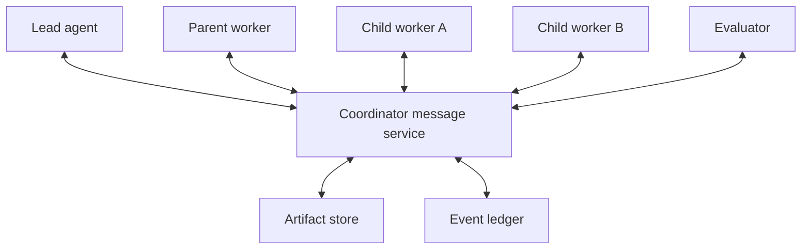

<!--
Copyright (c) 2026, NVIDIA CORPORATION. All rights reserved.

NVIDIA CORPORATION and its licensors retain all intellectual property
and proprietary rights in and to this software, related documentation
and any modifications thereto. Any use, reproduction, disclosure or
distribution of this software and related documentation without an express
license agreement from NVIDIA CORPORATION is strictly prohibited.
-->

# Agentic Goals: Agent-to-Agent Communication

Status: Draft

## Purpose

Define durable, typed communication among the lead, workers, evaluators, deterministic processes, and OSMO-hosted agents.

Agents do not communicate through invisible shared context or unrestricted peer-to-peer chat. They exchange messages and artifacts through the coordinator so communication remains attributable, bounded, policy-checked, and recoverable.

## Principles

- Artifacts carry substantive data; messages carry intent and references.
- Every message has a sender, recipient, purpose, contract, and correlation ID.
- Delivery is at-least-once, so consumers must be idempotent.
- Authority is never transferred by prose.
- Parent/child ownership and execution dependencies remain separate.
- Messages are untrusted input to the receiving agent.
- Communication volume is budgeted and backpressured.
- Human-visible summaries are derived from durable messages and artifacts.
- OSMO logs or task output are not an agent messaging protocol.

## Communication topology

The first validation supports:

- Lead to worker.
- Worker to lead or parent.
- Parent to child.
- Evaluator to the node being evaluated through coordinator state.
- Coordinator broadcasts of cancellation, revision, or authority changes.
- Explicit sibling exchange only through an approved shared artifact or coordinator-routed request.



Unrestricted mesh communication is intentionally excluded. It complicates authority, creates hidden dependencies, and makes completion and cancellation difficult to reason about.

## Message envelope

Every message includes:

- Message ID.
- Goal and plan revision IDs.
- Sender and recipient entity IDs.
- Sender attempt ID.
- Message type and schema version.
- Conversation or delegation ID.
- Correlation and causation IDs.
- Sequence number within the conversation.
- Creation time and optional expiry.
- Priority.
- Human-visibility classification.
- Authority requirement.
- Artifact references.
- Typed payload.
- Idempotency key.
- Integrity metadata.

Messages are immutable after publication. Corrections reference and supersede prior messages.

## Message types

### DelegationRequest

Parent proposes a child contract:

- Sub-goal and non-goals.
- Input artifact references.
- Expected output and evaluator.
- Requested capabilities.
- Budget, deadline, and authority allocation.
- Join policy.
- Rationale.

The coordinator admits or rejects the proposal before a child exists.

### DelegationAccepted

Confirms:

- Child node and run IDs.
- Frozen contract.
- Allocated envelope.
- Expected delivery schema.
- Cancellation and deadline semantics.

### WorkDirective

Sends approved desired work to an existing agent. A directive cannot silently modify the frozen contract; material changes create a new attempt or plan revision.

### Query

Requests bounded information or analysis from another scope without changing desired state.

### Response

Answers a query with typed content and artifact references.

### Progress

Reports a material milestone, blocker, changed estimate, or heartbeat. Routine internal steps remain in attempt history rather than producing cross-agent messages.

### Result

Returns:

- Outcome type.
- Output artifacts.
- Evidence.
- Acceptance mapping.
- Summary.
- Assumptions and uncertainty.
- Unresolved questions.
- Accounting.

### ClarificationRequest

Requests missing information needed to satisfy the contract. The parent may answer, route to the lead, or create a human request.

### ApprovalRequest

Proposes an action outside current authority. The coordinator turns it into the human approval protocol from [05-human-interfaces.md](05-human-interfaces.md).

### ChildProposal

Requests further delegation. It is not executable until coordinator admission.

### Cancel

Revokes desired execution for a scope. Recipients acknowledge and stop new work before reconciling active operations.

### RevisionNotice

Informs affected agents that a new plan revision changes, supersedes, or invalidates their work.

### EvaluationResult

Records criterion-level pass, fail, or unresolved outcomes with evidence and rubric version.

## Artifacts

Messages reference artifacts rather than embedding large payloads.

Every artifact has:

- Stable artifact ID and version.
- Type and schema version.
- Producing goal, node, and attempt.
- Content checksum.
- Storage location.
- Size and media type.
- Trust and sensitivity labels.
- Retention policy.
- Access policy.
- Supersession relationship.
- Human-readable summary when useful.

Examples:

- Goal contract.
- Plan revision.
- Dataset manifest.
- Source bundle.
- Model checkpoint.
- Analysis report.
- OSMO workflow binding.
- Tool result.
- Evidence bundle.
- Worker summary.
- Evaluation report.

Consumers verify schema, integrity, access, and trust classification before use.

## Handoffs

A parent-to-child handoff contains only what the child needs:

- Frozen child contract.
- Relevant goal context.
- Referenced inputs.
- Constraints and policy.
- Expected output.
- Parent join semantics.
- Escalation route.

A child-to-parent handoff contains:

- Typed result.
- Evidence and artifacts.
- Compact summary.
- Assumptions.
- Uncertainty.
- Unresolved questions.
- Recommended next action.

Raw child transcript is retained for audit according to policy but is not automatically injected into the parent context.

## Conversations

A conversation is a durable ordered stream associated with one goal scope and purpose.

Conversation classes:

- Lead and user.
- Parent and child.
- Query and response.
- Human and nested worker.
- Evaluator clarification.

Per-conversation sequence numbers preserve local order. Global ordering across independent conversations is not assumed; causation IDs establish meaningful relationships.

## Delivery semantics

- Persist message before delivery.
- Deliver at least once.
- Acknowledge processing with the consumer attempt and message ID.
- Deduplicate by message ID and idempotency key.
- Retry transient delivery failure with bounded backoff.
- Move permanently invalid messages to a visible rejected state with reason.
- Expired messages do not trigger new work.
- Cancellation and authority revocation have higher priority than normal work.

Exactly-once model or tool execution is not assumed. External actions use their own idempotency and reconciliation records.

## Ordering and stale messages

Before acting, a consumer validates:

- Plan revision is still applicable.
- Node and attempt are current.
- Sender was authorized to send the message.
- Recipient contract accepts the message type.
- Referenced artifacts are still valid.
- Deadline has not passed.

A stale message is recorded and ignored or transformed into a clarification; it never silently mutates current state.

## Joins and aggregation

Parents do not wait on chat completion. They wait on durable child terminal states and declared artifacts.

Supported join policies:

- All required children.
- Any successful child.
- Quorum.
- Best effort until budget or deadline.
- Evaluator decides from available evidence.

The aggregator:

- Validates child result schemas.
- Detects conflicting claims.
- Deduplicates shared artifacts.
- Preserves provenance.
- Produces a bounded parent summary.
- Requests adjudication when conflicts affect acceptance criteria.

## Conflict handling

When agents disagree:

1. Preserve both claims and evidence.
2. Determine whether the disagreement affects the parent contract.
3. Apply a deterministic rule or evaluator when defined.
4. Create a focused adjudication node when additional work is justified.
5. Route to a human when policy, values, or irreducible ambiguity requires it.

The lead must not erase disagreement by selecting the most fluent response.

## Authority and credentials

- Messages carry references to authority, never bearer secrets.
- A parent can allocate only a subset of its delegable envelope.
- A child cannot expand scope by requesting it from a sibling.
- Tool capability tokens are issued directly by the coordinator for one run and scope.
- Recipients verify effective authority at action time, not only message creation time.
- Revocation prevents new actions even if old messages remain queued.

## Security and trust

- Treat every message and artifact body as untrusted data.
- Keep policy and system instructions outside user-controlled artifacts.
- Mark externally retrieved or model-generated content.
- Scan and redact secrets before model exposure or human notification.
- Enforce artifact access independently of message routing.
- Sign or integrity-check messages crossing execution boundaries.
- Limit links and network destinations to approved schemes and domains.
- Record provenance for summaries so users can inspect original evidence.

## Communication budgets

Each run has limits for:

- Messages sent.
- Queries to siblings or parent.
- Child proposals.
- Total embedded payload bytes.
- Artifact reads.
- Progress update frequency.
- Model tokens consumed by communication.

The coordinator applies backpressure:

- Coalesce routine progress.
- Reject duplicate questions.
- Prefer artifact summaries over repeated raw reads.
- Rate-limit noncritical communication.
- Prioritize cancellation, approval, blocker, and terminal result messages.

## Liveness

Messages that require a response declare:

- Response schema.
- Deadline.
- Retry policy.
- Escalation target.
- Safe default.

The coordinator detects:

- Unacknowledged directives.
- Children with no material progress.
- Parents waiting on messages instead of declared joins.
- Expired clarification or approval requests.
- Orphan conversations after plan revision or cancellation.

Agents use bounded progress heartbeats only for liveness; heartbeats do not imply useful progress.

## OSMO-hosted agents

OSMO-hosted agents communicate with the coordinator through a scoped callback or message API:

- The workflow task receives goal, node, attempt, and callback identifiers.
- Authentication is short-lived and limited to the current run.
- Messages are persisted by the external control plane.
- Large outputs are uploaded as artifacts and referenced in result messages.
- Loss of the callback path causes bounded retry and eventual attempt failure or reconciliation.
- The task does not use OSMO logs, Redis internals, or unrestricted user credentials as a substitute for the protocol.

## Human visibility

Messages declare one visibility level:

- Hidden operational record.
- Available in history.
- Summarized by the lead.
- Requires immediate human attention.

The lead may summarize but cannot change the underlying message or evidence. A human entering a nested worker conversation creates messages in that scoped conversation; any state-changing directive still goes through coordinator validation.

## Example result message

```json
{
  "type": "Result",
  "schemaVersion": 1,
  "messageId": "msg-123",
  "goalId": "goal-abc",
  "planRevisionId": "plan-3",
  "senderAttemptId": "attempt-7",
  "recipientNodeId": "node-parent",
  "conversationId": "delegation-42",
  "outcome": "Completed",
  "artifacts": ["artifact-report-9"],
  "evidence": ["evidence-test-4"],
  "summary": "The candidate passed the required benchmark.",
  "unresolvedQuestions": [],
  "idempotencyKey": "result-attempt-7"
}
```

## Acceptance criteria

- Agent communication survives runtime and coordinator restart.
- Every message is attributable and schema-valid.
- Duplicate delivery does not duplicate work or side effects.
- Authority cannot be delegated through prose.
- Parent context remains bounded as child count grows.
- Required joins depend on durable states and artifacts, not transcript inspection.
- Cancellation and revision notices supersede stale work.
- Sibling communication cannot create hidden dependency or authority paths.
- OSMO-hosted agents use the same durable protocol as control-plane agents.
- Human summaries preserve links to original messages and evidence.
