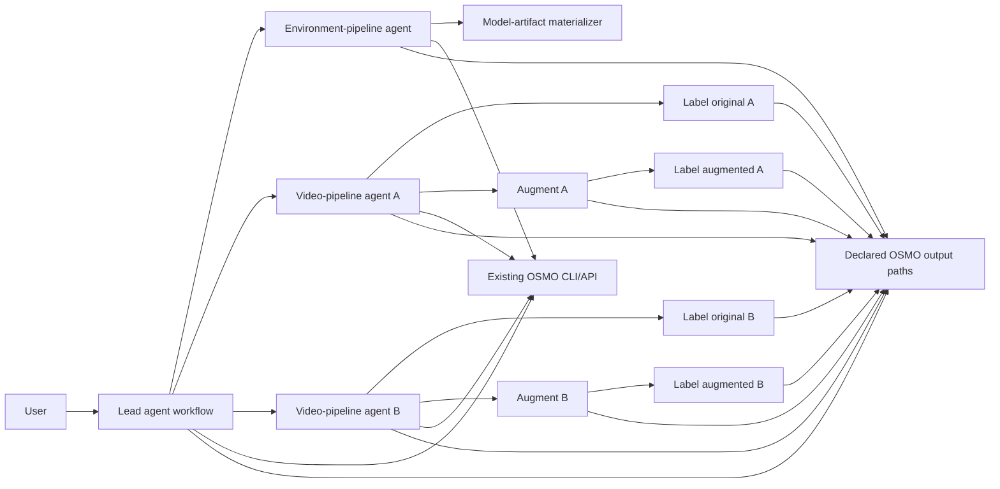

<!--
Copyright (c) 2026, NVIDIA CORPORATION. All rights reserved.

NVIDIA CORPORATION and its licensors retain all intellectual property
and proprietary rights in and to this software, related documentation
and any modifications thereto. Any use, reproduction, disclosure or
distribution of this software without an express license agreement from
NVIDIA CORPORATION is strictly prohibited.
-->

# POC Plan: Architecture and Contracts

Status: Draft

## Outcome

Define the minimum contracts that let an OSMO-hosted lead coordinate one
video-pipeline agent per video and its deterministic VDA `e2e` stages without
hiding plan changes, authority, or evidence in chat history.

## POC architecture



The long-lived lead task is the temporary coordinator for one goal. It first
submits one bounded environment-pipeline agent, then—only after its typed
`environment-ready` result—one video-pipeline agent per approved video. The
environment agent owns conditional model-artifact materialization; each video
agent executes the real `e2e` branch-and-join sequence for its fixed video.
OSMO workflow IDs and declared output artifacts are the observable coordination
surface. The POC does not introduce a new database or control-plane service.

## Minimal durable records

Write these as versioned artifacts beneath declared OSMO output paths. Their
exact serialization format is an implementation choice; their ownership and
content are the POC contract.

| Record | Owner | Required contents |
| --- | --- | --- |
| Goal plan | lead | objective, non-goals, VDA batch scope, acceptance criteria, budget, deadline, selected pool/resource profile/concurrency limit, and environment-pipeline binding |
| Environment request | lead | run workspace, model-artifact root, permitted materializer contract, and cache acceptance criteria |
| Environment-ready binding | environment pipeline | cache lock, immutable model-artifact workspace URL, manifest digest, and materializer workflow binding when one was required |
| Cache manifest and result | model-artifact materializer | source revisions, file checksums, cache URLs, entrypoint version, and typed terminal outcome |
| Video-agent contract | lead | one fixed video, lead-selected pool and stage image/profile/cache references, join policy, and concurrency limits |
| Video-stage bundle | video agent | non-secret configuration, helper scripts, entrypoint version, endpoint references, and checksums |
| Environment lock | constructor | custom agent-image digest and the pinned upstream PAIDF stage-image digests |
| Workflow binding | submitting agent | canonical capsule hash, submission key, returned workflow ID, and output URL |
| Video manifest | video agent | stage bindings, terminal status, and one video result |
| Stage result | deterministic worker | VDA stage result path, schema/contract check, evidence, and terminal outcome |

Records are immutable after publication. A correction writes a new version or
an event that supersedes the prior record.

## Minimal contracts

### Goal plan

The lead owns the one VDA batch goal. Each video agent owns exactly one video
and cannot change the batch. Its original-label and augmentation stages may run
in parallel; its augmented-label stage is admitted only after valid augmentation
evidence. The topology, depth, and fan-out rules are fixed in
[Locked topology](locked-topology.md).

For this POC, the lead dynamically discovers every pool and resource profile
visible to its task context, selects viable capacity, and freezes the chosen
pool, profile, and batch concurrency limit into the goal plan before fan-out.
It must validate representative capsules before delegation. This authorizes
selection and submission only; it does not authorize the lead to change cluster
resources, quotas, or credentials.

Before video fan-out, the lead creates the run workspace and submits one frozen
environment request. The environment-pipeline agent computes the cache lock and
verifies the corresponding immutable cache manifest. A valid cache becomes an
`environment-ready` binding. On a miss, that agent submits exactly one
deterministic model-artifact-materializer capsule, verifies its cache result and
manifest, then returns the binding to the lead. The lead does not submit the
materializer directly.

### Environment request

The lead, environment-pipeline, and video agents use the pinned custom
agent-runtime image. A deterministic VDA stage uses the selected upstream PAIDF
image by digest and never requests an environment or installs packages at
runtime. The conditional model-artifact-materializer capsule is a distinct
deterministic task whose image and downloader entrypoint are pinned in the
cache lock before the environment pipeline submits it. For example, a declared
agent capability is:

```yaml
capabilities:
  - osmo-workflow-read/v1
  - git-read/v1
runtime: agent-runtime/python
```

The constructor pins the custom agent image and the upstream PAIDF stage images
and emits an environment lock. A missing requirement blocks the run rather than
triggering an implicit runtime install.

### Video-stage bundle

Before child admission, the video agent writes one immutable bundle for its
fixed video. Every stage receives that bundle and a small stage-specific
contract plus the lead's immutable cache binding as declared task inputs. The
standard stage entrypoint verifies and materializes the bundle, prepares
writable cache paths, runs the installed PAIDF application, validates outputs,
and writes the terminal stage result. It performs no dependency installation.

### Stage result

Every deterministic stage writes exactly one terminal envelope:

```yaml
outcome: Completed # or NeedsClarification, NeedsEnvironment, RetryableFailure, TerminalFailure
summary: concise result for the lead
evidence: []
artifacts: []
acceptanceCriteria: []
openQuestions: []
accounting:
  wallTime: 0s
  toolCalls: 0
```

Each video agent joins its original and augmented pseudo-label results into one
video result. The lead joins the video results and evaluates the batch against
the VDA `e2e` output contract before it reports completion.

Every listed outcome is terminal only for its current immutable capsule. Its
owning agent may reconcile the result, repair the next safe contract, and retry
with a new capsule without a numeric retry ceiling. Only an ambiguity that it
cannot resolve safely becomes `NeedsClarification` for the human.

## Build steps

1. Define one declared output-root convention for the goal, per-video agents,
   video-stage bundles, and the original-label, augmentation, and
   augmented-label outputs.
2. Define contracts for the environment request/ready result, cache
   result/manifest, lead-to-video-agent handoff, video-agent-to-stage request,
   video manifest, and stage result.
3. Implement environment-pipeline admission: reuse a verified cache or submit
   one deterministic model-artifact-materializer capsule, then return its
   verified binding.
4. Record correlation IDs and OSMO workflow bindings at each dynamic submit.
5. Make the lead, environment, and video agents read OSMO status/logs/events by
   workflow ID and consume only typed result artifacts; raw logs stay by
   reference.

## Validation gates

- Each dynamically submitted workflow has one recorded submit key, workflow ID,
  input video, image digest, and output path.
- The lead admits video work only with a verified immutable `environment-ready`
  binding; a cold cache makes the environment pipeline create at most one
  model-artifact-materializer workflow for its cache lock.
- A video agent cannot submit an augmented-label worker before valid
  augmentation evidence or submit the same stage twice.
- Every stage verifies the video-stage bundle checksum before execution and
  performs no package installation at boot.
- A malformed video-agent request, stage result, or output contract is rejected
  before it controls the next lifecycle action.
- An agent's prose alone cannot mark the goal complete.

## Exit criterion

The POC has enough contract structure to run the accepted two-video topology:
one lead, one environment-pipeline agent, two video agents, six deterministic
VDA stages, and—only on a cache miss—one model-artifact-materializer stage. Do
not add a database service, UI, static preflight workflow, or platform-managed
setup workflow before this path is proven.
