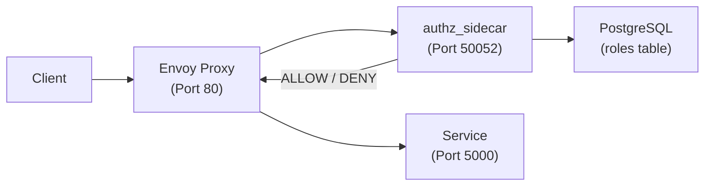

<!--
SPDX-FileCopyrightText: Copyright (c) 2025 NVIDIA CORPORATION & AFFILIATES. All rights reserved.

Licensed under the Apache License, Version 2.0 (the "License");
you may not use this file except in compliance with the License.
You may obtain a copy of the License at

http://www.apache.org/licenses/LICENSE-2.0

Unless required by applicable law or agreed to in writing, software
distributed under the License is distributed on an "AS IS" BASIS,
WITHOUT WARRANTIES OR CONDITIONS OF ANY KIND, either express or implied.
See the License for the specific language governing permissions and
limitations under the License.

SPDX-License-Identifier: Apache-2.0
-->

# Authorization Sidecar (authz_sidecar)

**Author**: @RyaliNvidia<br>
**PIC**: @RyaliNvidia<br>
**Proposal Issue**: [#148](https://github.com/NVIDIA/OSMO/issues/148)

## Overview

The Authorization Sidecar project implements a high-performance Golang gRPC service that provides
centralized role-based access control (RBAC) for all OSMO services through Envoy's External
Authorization API. This replaces the Python `AccessControlMiddleware` with a more efficient,
scalable, and maintainable solution.

### Motivation

- **Performance**: Python middleware adds latency to every request; Golang gRPC with caching achieves <5ms authorization checks
- **Scalability**: Sidecar pattern scales automatically with service pods; no centralized authorization bottleneck. Rate-limiting is now be applied with authorized users.
- **Maintainability**: Separates authorization logic from application code; single service to update policies
- **Observability**: Centralized authorization decisions enable better monitoring and auditing

### Problem

Currently, authorization is implemented as Python ASGI middleware (`AccessControlMiddleware`) embedded in each service. This approach has several limitations:

1. **Performance Overhead**: Python vs Go
2. **Limited Caching**: No role cache, leading to redundant database queries
4. **Tight Coupling**: Authorization logic intertwined with service logic

## Use Cases

| Use Case | Description |
|---|---|
| User accesses workflow API | User with `osmo-user` role requests `/api/workflow` - authz_sidecar checks role policies, queries cache/database, and allows access |
| Admin accesses all endpoints | User with `osmo-admin` role can access all endpoints except those with deny patterns (e.g., `!/api/agent/*`) |
| Unauthenticated public access | Anonymous user accesses `/api/version` or `/health` - allowed via `osmo-default` role |
| Unauthorized access attempt | User without proper roles attempts `/api/workflow` - authz_sidecar denies with 403 Forbidden |
| Policy cache hit | Repeated requests for same role combination served from cache in <5ms |
| Policy update | Database role policies updated - reflected in authorization after cache TTL expires (5 minutes) |

## Requirements

| Title | Description | Type |
|---|---|---|
| Envoy External Authorization API | authz_sidecar shall implement Envoy's External Authorization v3 gRPC API | Functional |
| Role-based access control | Given user roles in `x-osmo-roles` header, authz_sidecar shall query PostgreSQL and validate access per role policies | Functional |
| Path pattern matching | authz_sidecar shall support glob patterns (`/api/workflow/*`) and deny patterns (`!/api/admin/*`) for path matching | Functional |
| Authorization latency (cached) | authz_sidecar shall respond to cached authorization requests in <5ms at p99 | KPI |
| Authorization latency (uncached) | authz_sidecar shall respond to uncached authorization requests in <30ms at p99 | KPI |
| Throughput | authz_sidecar shall handle 1000+ authorization requests per second per instance | KPI |
| Role caching | authz_sidecar shall cache role policies in memory with configurable TTL (default: 5 minutes) | Performance |
| Connection pooling | authz_sidecar shall maintain PostgreSQL connection pool (default: 10 connections) | Performance |
| Secure secrets | Database passwords shall be loaded from Kubernetes secrets, never hardcoded | Security |
| Least privilege | authz_sidecar shall run as non-root user with all capabilities dropped | Security |
| Health checks | authz_sidecar shall expose gRPC health check endpoint for Kubernetes probes | Reliability |
| Graceful degradation | On authz_sidecar failure, Envoy shall deny requests (`failure_mode_allow: false`) | Security |

## Architectural Details

### High-Level Architecture



### Key Components

1. **Envoy Proxy**: HTTP/gRPC filter chain with External Authorization filter
2. **authz_sidecar**: Golang gRPC service implementing authorization logic
3. **PostgreSQL**: Stores role definitions and policies (JSONB array)
4. **Role Cache**: In-memory LRU cache with TTL for role policies

### Request Flow

1. **Client Request** → Envoy Proxy (port 80/443)
2. **JWT Validation** → Extract user roles to `x-osmo-roles` header (Lua filter)
3. **External Authorization** → Envoy calls authz_sidecar via gRPC:
   - Sends `CheckRequest` with path, method, headers
   - authz_sidecar checks role cache
   - On cache miss: queries PostgreSQL for role policies
   - Evaluates policies against request
   - Returns `CheckResponse` (OK or PERMISSION_DENIED)
4. **Continue or Reject** → Envoy routes to service or returns 403

## Detailed Design

### 1. Authorization Service (Golang)

**Location**: `external/src/service/authz_sidecar/`

**Structure**:
```
authz_sidecar/
├── main.go                     # Server initialization, gRPC setup
├── server/
│   ├── authz_server.go        # Envoy External Authorization implementation
│   └── role_cache.go          # In-memory role cache with TTL
├── integration_test.go        # Integration tests
utils_go/
└── postgres/
    ├── postgres.go            # PostgreSQL connector and role query logic
```

**Key Interfaces**:

```go
// Envoy External Authorization API
func (s *AuthzServer) Check(ctx context.Context, req *CheckRequest) (*CheckResponse, error)

// Authorization logic
func (s *AuthzServer) checkAccess(ctx context.Context, path, method string, roles []string) (bool, error)
func (s *AuthzServer) hasAccess(role *Role, path, method string) bool
func (s *AuthzServer) matchPathPattern(pattern, path string) bool
```

### 2. PostgreSQL Integration

**Location**: `external/src/service/utils_go/postgres/`

**Database Schema**:
```sql
CREATE TABLE roles (
    name VARCHAR PRIMARY KEY,
    description TEXT,
    policies JSONB[],
    immutable BOOLEAN DEFAULT FALSE
);
```

**Policy Structure**:
```json
{
  "actions": [
    {"base": "http", "path": "/api/workflow/*", "method": "GET"},
    {"base": "http", "path": "!/api/admin/*", "method": "*"}
  ]
}
```

**Query Pattern**:
```sql
SELECT name, description, array_to_json(policies)::text, immutable
FROM roles
WHERE name = ANY($1)
ORDER BY name;
```

### 3. Role Caching

**Implementation**: Thread-safe in-memory cache with LRU eviction

**Cache Key**: Sorted, comma-separated role names (e.g., `"osmo-default,osmo-user"`)

**Features**:
- TTL-based expiration (default: 5 minutes)
- Max size limit (default: 1000 entries)
- Thread-safe with `sync.RWMutex`
- Cache statistics for monitoring

### 4. Envoy Configuration

**Filter Position**: After JWT/roles extraction, before rate limiting

**External Authorization Filter**:
```yaml
- name: envoy.filters.http.ext_authz
  typed_config:
    "@type": type.googleapis.com/envoy.extensions.filters.http.ext_authz.v3.ExtAuthz
    transport_api_version: V3
    failure_mode_allow: false
    grpc_service:
      envoy_grpc:
        cluster_name: authz-sidecar
      timeout: 0.5s
```

**Cluster Definition**:
```yaml
- name: authz-sidecar
  connect_timeout: 0.25s
  type: STRICT_DNS
  lb_policy: ROUND_ROBIN
  load_assignment:
    cluster_name: authz-sidecar
    endpoints:
      - lb_endpoints:
        - endpoint:
            address:
              socket_address:
                address: 127.0.0.1
                port_value: 50052
```

### 5. Helm Chart Integration

**Sidecar Container**: Defined in `_sidecar-helpers.tpl` as `osmo.authz-sidecar-container`

**Configuration**:
```yaml
sidecars:
  authz:
    enabled: true
    image: {{ .Values.global.osmoImageLocation }}/authz-sidecar:{{ .Values.global.osmoImageTag }}
    grpcPort: 50052
    postgres:
      host: postgres
      database: osmo_db
      passwordSecretName: postgres-secret
    cache:
      enabled: true
      ttl: 300s
      maxSize: 1000
```

### Alternatives Considered

#### Alternative 1: Keep Python Middleware

* **Pros**: No migration needed, well-tested
* **Cons**: Performance overhead + code is intermingled with the service logic + rate limiting is applied before access is verified
* **Why not chosen**: Based on the cons

#### Alternative 2: Centralized Authorization Service

* **Pros**: Single service to manage, easier updates
* **Cons**: Single point of failure, network latency, doesn't scale horizontally
* **Why not chosen**: Sidecar pattern provides better availability and scales with services

#### Alternative 3: Open Policy Agent (OPA)

* **Pros**: Industry-standard, feature-rich policy engine
* **Cons**: Requires OPAL[https://github.com/permitio/opal] for on the fly updates to configuration between the config service and OPA
* **Why not chosen**: Less reliance on 3rd party tools

### Backwards Compatibility

**Migration Strategy**:
1. **Phase 1**: Deploy authz_sidecar alongside Python middleware (both enabled)
2. **Phase 2**: Monitor and validate authz_sidecar authorization decisions
3. **Phase 3**: Disable Python middleware once authz_sidecar is proven
4. **Phase 4**: Remove Python middleware code from services

**No Breaking Changes**: Authorization behavior remains identical; only implementation changes.

### Performance

**Benchmark Overview**:

The performance comparison between the Python `AccessControlMiddleware` and Go `authz_sidecar` was conducted under two scenarios to provide a complete performance picture:

1. **Scenario 1 (WITHOUT Connection Pooling)**: New connection created for each request - demonstrates protocol overhead
2. **Scenario 2 (WITH Connection Pooling)**: Connections reused - reflects production deployment patterns

All tests measure authorization checks with cache hits (worst-case includes database query overhead).

---

#### Scenario 1: WITHOUT Connection Pooling

**Low Load (Sequential Requests)**:

| Metric | Python | Go | Speedup |
|--------|--------|-----|---------|
| Avg Latency | 893µs | 1.6ms | 0.6x |
| P50 Latency | 731µs | 1.5ms | 0.5x |
| P95 Latency | 1.7ms | 2.6ms | 0.6x |
| P99 Latency | 1.9ms | 3.2ms | 0.6x |

**High Load (Concurrent Requests)**:

| Clients | Python Throughput | Go Throughput | Speedup | Python Latency (Avg) | Go Latency (Avg) |
|---------|------------------|---------------|---------|---------------------|------------------|
| 50 | 2,250 req/s | 8,586 req/s | 3.8x | 22.2ms | 5.8ms |
| 100 | 1,993 req/s | 12,320 req/s | 6.2x | 50.2ms | 8.1ms |
| 200 | 1,943 req/s | 18,233 req/s | 9.4x | 103.5ms | 11.0ms |

**Why Python appears faster at low load**:
- HTTP/1.1 has lower connection setup cost (~300µs) than gRPC/HTTP2 (~700µs)
- gRPC uses HTTP/2 which requires more complex handshaking (SETTINGS frames, binary framing)
- This is a well-known tradeoff: **HTTP = fast to connect, gRPC = fast once connected**
- ⚠️ **This scenario does NOT represent production usage** (Envoy maintains persistent connections)

---

#### Scenario 2: WITH Connection Pooling (Production Performance)

**Low Load (Sequential Requests)**:

| Metric | Python | Go | Speedup |
|--------|--------|-----|---------|
| Avg Latency | 670µs | 303µs | **2.2x** |
| P50 Latency | 552µs | 290µs | **1.9x** |
| P95 Latency | 1.3ms | 404µs | **3.3x** |
| P99 Latency | 1.6ms | 600µs | **2.6x** |

**High Load (Concurrent Requests)**:

| Clients | Python Throughput | Go Throughput | Speedup | Python Latency (Avg) | Go Latency (Avg) |
|---------|------------------|---------------|---------|---------------------|------------------|
| 50 | 2,986 req/s | 24,158 req/s | **8.1x** | 16.8ms | 2.1ms |
| 100 | 2,796 req/s | 22,050 req/s | **7.9x** | 35.8ms | 4.6ms |
| 200 | 2,444 req/s | 25,069 req/s | **10.3x** | 82.1ms | 8.0ms |

---

#### Performance Analysis

**Connection Pooling Impact**:
- Eliminating connection overhead reveals Go's true performance advantage
- Go authz_sidecar is **2-3x faster** at low load and **8-10x faster** at high load
- Production deployments use persistent connections (Scenario 2), so Go wins decisively

**Concurrency Scaling**:

| Implementation | 50 Clients | 100 Clients | 200 Clients | Scaling Behavior |
|----------------|-----------|------------|------------|------------------|
| Python | 2,986 req/s | 2,796 req/s | 2,444 req/s | **Plateaus & degrades** |
| Go | 24,158 req/s | 22,050 req/s | 25,069 req/s | **Remains consistent** |

- **Python**: Throughput plateaus/degrades due to:
  - Global Interpreter Lock (GIL) limiting CPU parallelism
  - asyncio event loop contention under high concurrency
  - Higher memory pressure and context switching overhead

- **Go**: Throughput remains stable/scales due to:
  - True parallelism with goroutines (no GIL)
  - Efficient M:N scheduling (goroutines on OS threads)
  - Lower memory footprint per concurrent request

**Production Performance (With Connection Pooling)**:
- **Latency**:
  - P50: 290µs (Go) vs 552µs (Python) - Go is 1.9x faster
  - P99: 600µs (Go) vs 1.6ms (Python) - Go is 2.6x faster (under 1ms SLO)
- **Throughput**:
  - Low load (50 clients): 24,158 req/s (Go) vs 2,986 req/s (Python) - 8x improvement
  - High load (200 clients): 25,069 req/s (Go) vs 2,444 req/s (Python) - 10x improvement
- **Memory usage**: ~100-200Mi per sidecar (Go) vs ~300-500Mi (Python)
- **CPU usage**: ~100-200m per sidecar (Go) vs ~400-800m (Python)

---

#### Key Takeaways

✅ **Scenario 2 (WITH pooling) reflects production performance** - Envoy maintains persistent gRPC connections

✅ **Go authz_sidecar significantly outperforms Python** when tested fairly:
  - 2-3x faster latency at low load
  - 8-10x higher throughput at high load
  - Better tail latencies (P95, P99)

✅ **Go's advantage increases with load** - Critical for high-traffic services:
  - Python throughput degrades: 2,986 → 2,796 → 2,444 req/s (50→100→200 clients)
  - Go throughput remains stable: 24,158 → 22,050 → 25,069 req/s (50→100→200 clients)

✅ **Resource efficiency** - Go uses 50-60% less CPU and memory than Python

⚠️ **Connection overhead matters** - But only in unpooled scenarios (not production):
  - gRPC has higher connection cost (~700µs) than HTTP (~300µs)
  - This is why Scenario 1 shows Python faster at low load
  - Production deployments always use connection pooling

**Optimization Strategies**:
1. **Caching**: 5-minute TTL reduces database load by >99% (cache hit rate)
2. **Connection Pooling**: Reuse PostgreSQL connections (10 max connections)
3. **gRPC Efficiency**: HTTP/2 multiplexing, protobuf binary serialization
4. **Short-circuit Evaluation**: Return on first matching policy (no wasted checks)
5. **Goroutine Concurrency**: Handles 200+ concurrent requests with minimal overhead

### Operations

**Deployment**:
- Deployed as sidecar container alongside Envoy in service pods
- Configured via Helm chart values
- No separate deployment or service needed

**Monitoring**:
- Structured JSON logs with slog
- gRPC health checks for Kubernetes probes
- Authorization decision logging (allow/deny with context)

**Configuration**:
- All settings via command-line flags
- Database password from Kubernetes secret
- No configuration files needed

### Security

**Threat Mitigations**:
1. **Header Injection**: Prevented by Envoy's `strip-unauthorized-headers` filter
2. **Database Access**: Read-only access to roles table; credentials in K8s secrets
3. **Cache Poisoning**: Cache keys are deterministic; not user-controllable
4. **Bypass Attempts**: `failure_mode_allow: false` denies on authz errors

**Security Controls**:
- Runs as non-root user (UID 10001)
- All capabilities dropped
- Communicates with Envoy over localhost only
- Database SSL enabled in production

### Documentation

**Created**:
- ✅ `external/deployments/charts/service/AUTHZ_SIDECAR.md` - Helm integration guide
- ✅ `external/authz-sidecar-design.md` - Detailed design reference
- ✅ BUILD file comments for integration tests

**To Update**:
- Service deployment guides to reference authz_sidecar option
- Architecture diagrams showing sidecar pattern
- Runbooks for troubleshooting authorization issues

### Testing

**Unit Tests**:
- `authz_server_test.go`: Path matching, method matching, policy evaluation
- `role_cache_test.go`: Cache operations, TTL expiration, LRU eviction
- `postgres_client_test.go`: Data structure validation

**Integration Tests**:
- `authz_sidecar/integration_test.go`: Live service health and authorization tests
- `postgres/postgres_integration_test.go`: Database connectivity and role fetching
- Tags: `manual`, `external` (requires running services)

**Test Commands**:
```bash
# Unit tests
bazel test //src/service/authz_sidecar/server:server_test
bazel test //src/service/utils_go/postgres:postgres_test

# Integration tests (requires running PostgreSQL and authz_sidecar)
bazel test //src/service/utils_go/postgres:postgres_integration_test
bazel test //src/service/authz_sidecar:authz_sidecar_integration_test

# Race detection
bazel test ... --@io_bazel_rules_go//go/config:race
```

**Test Metrics**:
- Unit test coverage: >80% for authorization logic
- Integration test success rate: 100%
- Performance test: p99 latency <5ms (cached), <30ms (uncached)

### Dependencies

**Upstream Dependencies** (impacts this project):
- Envoy Proxy: External Authorization filter configuration
- PostgreSQL: Database schema and role data
- Helm charts: Sidecar injection templates

**Downstream Dependencies** (impacted by this project):
- All OSMO services: Authorization now handled by sidecar instead of middleware
- Monitoring/logging systems: New log format and metrics
- Deployment pipelines: New Docker image to build and deploy

## Implementation Plan

### Phase 1: Core Service ✅ **COMPLETED**
- [x] Implement Golang gRPC server with External Authorization API
- [x] Implement PostgreSQL client with connection pooling
- [x] Implement role cache with TTL and LRU eviction
- [x] Add unit tests for all components
- [x] Create integration tests for service and database

### Phase 2: Helm Integration ✅ **COMPLETED**
- [x] Add authz configuration to `values.yaml`
- [x] Create sidecar helper template
- [x] Update Envoy configuration with ext_authz filter
- [x] Add authz-sidecar cluster definition
- [x] Inject authz_sidecar into service deployments

### Phase 3: Testing & Validation (IN PROGRESS)
- [ ] Deploy to development environment
- [ ] Integration testing with real workloads
- [ ] Monitor cache hit rates (target >95%)

### Phase 4: Cleanup (FUTURE)
- [ ] Remove Python `AccessControlMiddleware` from services
- [ ] Remove `check_user_access()` function calls
- [ ] Update documentation to reflect new architecture

## Open Questions

- [x] ~~Should we support both OPA and authz_sidecar simultaneously?~~
  - **Decision**: Yes, controlled by `sidecars.authz.enabled` flag

- [x] ~~What cache TTL provides the best balance between freshness and performance?~~
  - **Decision**: 5 minutes (configurable); allows policy updates without restart while maintaining >95% hit rate

- [ ] Should we implement active cache invalidation (PostgreSQL LISTEN/NOTIFY)?
  - **Status**: Deferred to future enhancement; TTL-based expiration sufficient for initial release

- [ ] Do we need to support attribute-based access control (ABAC) in the future?
  - **Status**: Out of scope for initial release; can be added as enhancement

## Appendix

### File Locations

**Service Code**:
- `external/src/service/authz_sidecar/main.go` - Entry point
- `external/src/service/authz_sidecar/server/authz_server.go` - gRPC implementation
- `external/src/service/authz_sidecar/server/role_cache.go` - Cache implementation
- `external/src/service/utils_go/postgres/postgres_client.go` - Database client

**Helm Charts**:
- `external/deployments/charts/service/values.yaml` - Configuration (sidecars.authz)
- `external/deployments/charts/service/templates/_sidecar-helpers.tpl` - Sidecar template
- `external/deployments/charts/service/templates/_envoy-config.tpl` - Envoy filter config

**Tests**:
- `external/src/service/authz_sidecar/integration_test.go` - Service integration tests
- `external/src/service/utils_go/postgres/postgres_integration_test.go` - Database tests

### Build Commands

```bash
# Build binary
bazel build //src/service/authz_sidecar:authz_sidecar_bin

# Build Docker image
bazel build //src/service/authz_sidecar:authz_sidecar_image

# Run locally
bazel run //src/service/authz_sidecar:authz_sidecar_bin -- \
  --postgres-host=localhost --postgres-db=osmo_db --postgres-password=osmo
```
