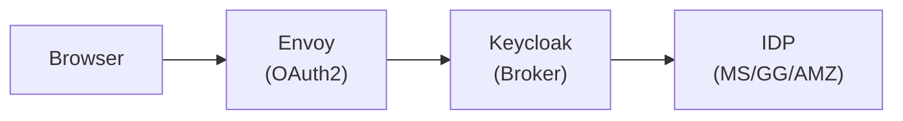
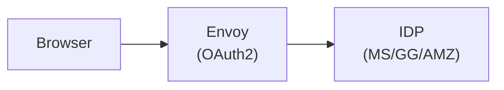

<!--
SPDX-FileCopyrightText: Copyright (c) 2025 NVIDIA CORPORATION & AFFILIATES. All rights reserved.

Licensed under the Apache License, Version 2.0 (the "License");
you may not use this file except in compliance with the License.
You may obtain a copy of the License at

http://www.apache.org/licenses/LICENSE-2.0

Unless required by applicable law or agreed to in writing, software
distributed under the License is distributed on an "AS IS" BASIS,
WITHOUT WARRANTIES OR CONDITIONS OF ANY KIND, either express or implied.
See the License for the specific language governing permissions and
limitations under the License.

SPDX-License-Identifier: Apache-2.0
-->

# Direct IDP Integration: Removing Keycloak

**Author**: @RyaliNvidia<br>
**PIC**: @RyaliNvidia<br>
**Proposal Issue**: [#148](https://github.com/NVIDIA/OSMO/issues/148)

## Overview

This document describes how to configure Envoy to authenticate users directly with external
identity providers (Microsoft Entra ID, Google, and Amazon Cognito) without using Keycloak as
an intermediary. It also covers the new Role Management APIs for assigning and removing users from roles.

### Motivation

- **Reduce complexity** — Eliminate Keycloak as a dependency, reducing deployment and maintenance overhead
- **Direct integration** — Use organization's existing identity provider directly for SSO
- **Simplified architecture** — Fewer moving parts means easier debugging and operations
- **Cost reduction** — One less service to deploy, scale, and maintain

### Problem

Using Keycloak as an identity broker introduces several issues that complicate the authentication and authorization flow:

1. **Duplicated Role Management** — Roles must be defined in two places:
   - In Keycloak (clients, realm roles, group mappings)
   - In OSMO's database (role policies, user-role assignments)

   This duplication leads to synchronization challenges and inconsistent state when roles are updated in one system but not the other.

2. **Complex Role Mapping** — Keycloak requires roles to be created in both `osmo-browser-flow` and `osmo-device` clients, then mapped to groups, then groups assigned to users. A single role assignment requires:
   - Create role in `osmo-browser-flow` client
   - Create same role in `osmo-device` client
   - Create a group
   - Assign both roles to the group
   - Add user to the group
   - Create matching role policy in OSMO database

3. **Opaque Token Claims** — Keycloak transforms and relays claims from the upstream IDP, making it difficult to:
   - Debug authentication issues (which system rejected the token?)
   - Understand what claims are available from the original IDP
   - Leverage IDP-specific features (Azure AD groups, Google Workspace domains, Cognito custom attributes)

4. **Operational Overhead** — Keycloak adds significant operational burden:
   - Separate database (PostgreSQL) for Keycloak state
   - Realm configuration management and backup
   - Version upgrades and security patches
   - Additional monitoring and alerting
   - Troubleshooting authentication flows across three systems (IDP → Keycloak → OSMO)

5. **User Experience Friction** — The extra hop through Keycloak adds:
   - Additional redirect latency during login
   - Potential for session mismatches between Keycloak and OSMO
   - Confusing logout behavior (must log out of both systems)

**By removing Keycloak and connecting Envoy directly to the IDP**, we achieve:

- **Single source of truth** for role assignments (OSMO database only)
- **Simplified role management** via REST APIs
- **Direct access** to IDP claims without transformation
- **Reduced latency** in authentication flow
- **Easier debugging** with fewer components in the chain
- **Lower operational costs** with one less service to maintain

### Architecture Comparison

**Before (with Keycloak):**


**After (Direct IDP):**


---

## Table of Contents

1. [Prerequisites](#prerequisites)
2. [Microsoft Entra ID (Azure AD)](#microsoft-entra-id-azure-ad)
3. [Google OAuth2](#google-oauth2)
4. [Amazon Cognito](#amazon-cognito)
5. [Envoy Configuration](#envoy-configuration)
6. [Role Management APIs](#role-management-apis)
7. [Verification Steps](#verification-steps)
8. [Migration from Keycloak](#migration-from-keycloak)
9. [Troubleshooting](#troubleshooting)

---

### Common Values

Throughout this guide, replace these placeholders:

| Placeholder | Description | Example |
|-------------|-------------|---------|
| `<your-domain>` | Your OSMO service hostname | `osmo.example.com` |
| `<tenant-id>` | Microsoft tenant ID | `12345678-1234-1234-1234-123456789abc` |
| `<client-id>` | OAuth2 client/application ID | `abcd1234-...` |
| `<client-secret>` | OAuth2 client secret | `xxx...` |
| `<user-pool-id>` | Amazon Cognito user pool ID | `us-west-2_abc123` |
| `<cognito-domain>` | Cognito hosted UI domain | `myapp.auth.us-west-2.amazoncognito.com` |

---

## Microsoft Entra ID (Azure AD)

### Step 1: Register an Application

1. Go to [Azure Portal](https://portal.azure.com) → **Microsoft Entra ID** → **App registrations**
2. Click **New registration**
3. Configure the application:
   - **Name**: `OSMO Service`
   - **Supported account types**: Select based on your requirements
     - Single tenant: Only accounts in your organization
     - Multi-tenant: Accounts in any organization
   - **Redirect URI**:
     - Platform: **Web**
     - URI: `https://<your-domain>/api/auth/getAToken`
4. Click **Register**
5. Note the **Application (client) ID** and **Directory (tenant) ID**

### Step 2: Create Client Secret

1. In your app registration, go to **Certificates & secrets**
2. Click **New client secret**
3. Add a description (e.g., `OSMO OAuth Secret`)
4. Set expiration (recommended: 24 months)
5. Click **Add**
6. **Copy the secret value immediately** (you won't be able to see it again)

### Step 3: Configure API Permissions

1. Go to **API permissions**
2. Click **Add a permission** → **Microsoft Graph**
3. Select **Delegated permissions**
4. Add these permissions:
   - `openid`
   - `profile`
   - `email`
   - `User.Read`
5. Click **Add permissions**
6. If you're an admin, click **Grant admin consent**

### Step 4: Configure Token Claims (Optional)

To include group/role information in tokens:

1. Go to **Token configuration**
2. Click **Add groups claim**
3. Select **Security groups** (or **Groups assigned to the application**)
4. Under **ID** and **Access** tokens, select **Group ID**
5. Click **Add**

### Step 5: Gather Endpoint URLs

| Endpoint | URL |
|----------|-----|
| Token Endpoint | `https://login.microsoftonline.com/<tenant-id>/oauth2/v2.0/token` |
| Authorization Endpoint | `https://login.microsoftonline.com/<tenant-id>/oauth2/v2.0/authorize` |
| JWKS URI | `https://login.microsoftonline.com/<tenant-id>/discovery/v2.0/keys` |
| Issuer | `https://login.microsoftonline.com/<tenant-id>/v2.0` |

### Microsoft Entra Values Configuration

```yaml
sidecars:
  envoy:
    enabled: true

    service:
      hostname: <your-domain>

    # OAuth2 filter for browser-based authentication
    oauth2Filter:
      enabled: true
      tokenEndpoint: https://login.microsoftonline.com/<tenant-id>/oauth2/v2.0/token
      authEndpoint: https://login.microsoftonline.com/<tenant-id>/oauth2/v2.0/authorize
      clientId: <client-id>
      redirectPath: api/auth/getAToken
      logoutPath: logout
      forwardBearerToken: true
      secretName: oidc-secrets
      clientSecretKey: client_secret
      hmacSecretKey: hmac_secret

    # JWT validation for API authentication
    jwt:
      user_header: x-osmo-user
      providers:
      # For browser-based authentication (uses v2.0 endpoint)
      - issuer: https://login.microsoftonline.com/<tenant-id>/v2.0
        audience: <client-id>
        jwks_uri: https://login.microsoftonline.com/<tenant-id>/discovery/v2.0/keys
        user_claim: preferred_username
        cluster: oauth
      # For service-to-service / device authentication (if using v1.0 tokens)
      - issuer: https://sts.windows.net/<tenant-id>/
        audience: <client-id>
        jwks_uri: https://login.microsoftonline.com/<tenant-id>/discovery/v2.0/keys
        user_claim: unique_name
        cluster: oauth
```

---

## Google OAuth2

### Step 1: Create OAuth 2.0 Credentials

1. Go to [Google Cloud Console](https://console.cloud.google.com)
2. Select or create a project
3. Navigate to **APIs & Services** → **Credentials**
4. Click **Create Credentials** → **OAuth client ID**

### Step 2: Configure OAuth Consent Screen

If prompted, configure the OAuth consent screen first:

1. Go to **OAuth consent screen**
2. Select **Internal** (for G Suite/Workspace) or **External** (for any Google account)
3. Fill in the required fields:
   - **App name**: `OSMO Service`
   - **User support email**: Your email
   - **Developer contact information**: Your email
4. Click **Save and Continue**
5. Add scopes:
   - `openid`
   - `email`
   - `profile`
6. Click **Save and Continue**

### Step 3: Create OAuth Client ID

1. Return to **Credentials** → **Create Credentials** → **OAuth client ID**
2. Select **Web application**
3. Configure:
   - **Name**: `OSMO Web Client`
   - **Authorized JavaScript origins**: `https://<your-domain>`
   - **Authorized redirect URIs**: `https://<your-domain>/api/auth/getAToken`
4. Click **Create**
5. **Copy the Client ID and Client Secret**

### Step 4: Gather Endpoint URLs

| Endpoint | URL |
|----------|-----|
| Token Endpoint | `https://oauth2.googleapis.com/token` |
| Authorization Endpoint | `https://accounts.google.com/o/oauth2/v2/auth` |
| JWKS URI | `https://www.googleapis.com/oauth2/v3/certs` |
| Issuer | `https://accounts.google.com` |

### Google OAuth2 Values Configuration

```yaml
sidecars:
  envoy:
    enabled: true

    service:
      hostname: <your-domain>

    # OAuth2 filter for browser-based authentication
    oauth2Filter:
      enabled: true
      tokenEndpoint: https://oauth2.googleapis.com/token
      authEndpoint: https://accounts.google.com/o/oauth2/v2/auth
      clientId: <client-id>.apps.googleusercontent.com
      redirectPath: api/auth/getAToken
      logoutPath: logout
      forwardBearerToken: true
      secretName: oidc-secrets
      clientSecretKey: client_secret
      hmacSecretKey: hmac_secret

    # JWT validation for API authentication
    jwt:
      user_header: x-osmo-user
      providers:
      - issuer: https://accounts.google.com
        audience: <client-id>.apps.googleusercontent.com
        jwks_uri: https://www.googleapis.com/oauth2/v3/certs
        user_claim: email
        cluster: oauth
```

### Important Notes for Google OAuth2

1. **User Claim**: Google uses `email` as the user identifier (not `preferred_username`)
2. **Audience**: Must include the full client ID with `.apps.googleusercontent.com` suffix
3. **Domain Restriction**: For Workspace/G Suite, you can restrict to your domain in the OAuth consent screen

---

## Amazon Cognito

### Step 1: Create a User Pool

1. Go to [Amazon Cognito Console](https://console.aws.amazon.com/cognito)
2. Click **Create user pool**
3. Configure sign-in experience:
   - **Cognito user pool sign-in options**: Email (recommended)
   - Enable **Federated identity providers** if you want to use external IDPs
4. Configure security requirements as needed
5. Configure message delivery (email for verification)
6. Name your user pool (e.g., `osmo-users`)
7. Click **Create user pool**
8. Note the **User pool ID** (format: `<region>_<id>`)

### Step 2: Create an App Client

1. In your user pool, go to **App integration** tab
2. Scroll to **App clients and analytics**
3. Click **Create app client**
4. Configure:
   - **App type**: **Confidential client**
   - **App client name**: `OSMO Service`
   - **Client secret**: Generate a client secret
5. Under **Hosted UI settings**:
   - **Allowed callback URLs**: `https://<your-domain>/api/auth/getAToken`
   - **Allowed sign-out URLs**: `https://<your-domain>/logout`
   - **Identity providers**: Select your providers
   - **OAuth 2.0 grant types**: Authorization code grant
   - **OpenID Connect scopes**: `openid`, `email`, `profile`
6. Click **Create app client**
7. Note the **Client ID** and **Client secret**

### Step 3: Configure Hosted UI Domain

1. In **App integration** → **Domain**
2. Create either:
   - **Cognito domain**: `<your-prefix>.auth.<region>.amazoncognito.com`
   - **Custom domain**: Your own domain (requires certificate)
3. Note the domain URL

### Step 4: Gather Endpoint URLs

| Endpoint | URL |
|----------|-----|
| Token Endpoint | `https://<cognito-domain>/oauth2/token` |
| Authorization Endpoint | `https://<cognito-domain>/oauth2/authorize` |
| JWKS URI | `https://cognito-idp.<region>.amazonaws.com/<user-pool-id>/.well-known/jwks.json` |
| Issuer | `https://cognito-idp.<region>.amazonaws.com/<user-pool-id>` |

### Amazon Cognito Values Configuration

```yaml
sidecars:
  envoy:
    enabled: true

    service:
      hostname: <your-domain>

    # OAuth2 filter for browser-based authentication
    oauth2Filter:
      enabled: true
      tokenEndpoint: https://<cognito-domain>/oauth2/token
      authEndpoint: https://<cognito-domain>/oauth2/authorize
      clientId: <client-id>
      redirectPath: api/auth/getAToken
      logoutPath: logout
      forwardBearerToken: true
      secretName: oidc-secrets
      clientSecretKey: client_secret
      hmacSecretKey: hmac_secret

    # JWT validation for API authentication
    jwt:
      user_header: x-osmo-user
      providers:
      - issuer: https://cognito-idp.<region>.amazonaws.com/<user-pool-id>
        audience: <client-id>
        jwks_uri: https://cognito-idp.<region>.amazonaws.com/<user-pool-id>/.well-known/jwks.json
        user_claim: email
        cluster: oauth
```

### Important Notes for Amazon Cognito

1. **User Claim**: Cognito uses `email` or `cognito:username` as user identifiers
2. **Custom Attributes**: You can add custom attributes for roles in Cognito
3. **Groups**: Cognito supports groups that can be included in tokens via `cognito:groups` claim

---

## Envoy Configuration

### Create Kubernetes Secrets

Before deploying, create the required secrets:

```bash
# Generate a random HMAC secret (256 bits / 32 bytes)
HMAC_SECRET=$(openssl rand -base64 32)

# Create the secret
kubectl create secret generic oidc-secrets \
  --namespace <your-namespace> \
  --from-literal=client_secret='<your-client-secret>' \
  --from-literal=hmac_secret="${HMAC_SECRET}"
```

### Complete Envoy Sidecar Configuration

Here's the full configuration structure in your Helm values:

```yaml
sidecars:
  envoy:
    enabled: true
    useKubernetesSecrets: true

    image: envoyproxy/envoy:v1.29.0
    imagePullPolicy: IfNotPresent

    # Paths that skip authentication
    skipAuthPaths:
    - /health
    - /api/router/version
    - /api/version

    # Listener configuration
    listenerPort: 8080
    maxHeadersSizeKb: 128
    logLevel: info

    # Service configuration
    service:
      port: 8000
      hostname: <your-domain>
      address: 127.0.0.1

    # OAuth2 filter configuration (browser flow)
    oauth2Filter:
      enabled: true
      tokenEndpoint: <see-provider-specific-section>
      authEndpoint: <see-provider-specific-section>
      clientId: <your-client-id>
      redirectPath: api/auth/getAToken
      logoutPath: logout
      forwardBearerToken: true
      secretName: oidc-secrets
      clientSecretKey: client_secret
      hmacSecretKey: hmac_secret

    # JWT validation configuration
    jwt:
      user_header: x-osmo-user
      providers:
      - issuer: <see-provider-specific-section>
        audience: <your-client-id>
        jwks_uri: <see-provider-specific-section>
        user_claim: <email|preferred_username|unique_name>
        cluster: oauth

    # Internal OSMO auth (for service-issued tokens)
    osmoauth:
      enabled: true
      port: 80
```

### OAuth Cluster Definition

Envoy needs a cluster definition to reach the IDP's token endpoint. This is typically auto-generated by the Helm chart, but if manual configuration is needed:

```yaml
# In Envoy config
clusters:
- name: oauth
  connect_timeout: 10s
  type: LOGICAL_DNS
  lb_policy: ROUND_ROBIN
  dns_lookup_family: V4_ONLY
  load_assignment:
    cluster_name: oauth
    endpoints:
    - lb_endpoints:
      - endpoint:
          address:
            socket_address:
              # For Microsoft:
              address: login.microsoftonline.com
              # For Google:
              # address: oauth2.googleapis.com
              # For Cognito:
              # address: <cognito-domain>
              port_value: 443
  transport_socket:
    name: envoy.transport_sockets.tls
    typed_config:
      "@type": type.googleapis.com/envoy.extensions.transport_sockets.tls.v3.UpstreamTlsContext
      sni: login.microsoftonline.com  # Match the address above
```

---

## Role Management APIs

To manage user-to-role assignments without Keycloak, OSMO provides REST APIs for role management. These APIs replace the role assignment functionality previously handled through Keycloak's admin console or IdP group mappings.

### Why New APIs Are Needed

With Keycloak removed, we lose the following capabilities that must be replaced:

| Keycloak Feature | OSMO Replacement |
|-----------------|------------------|
| Assign role to user via admin console | `POST /api/users/{username}/roles` |
| Remove role from user | `DELETE /api/users/{username}/roles/{role_name}` |
| View user's roles | `GET /api/users/{username}/roles` |
| List users with a role | `GET /api/roles/{role_name}/users` |
| Bulk role assignment via groups | `POST /api/roles/{role_name}/users` |
| Role expiration | `expires_at` field in role assignment |

### Key Design Decisions

1. **User-centric and Role-centric APIs** — Provide both `/api/users/{username}/roles` and `/api/roles/{role_name}/users` endpoints to support different admin workflows

2. **Audit Trail** — Every assignment records `assigned_by` (who made the change) and `assigned_at` (when) for compliance

3. **Time-bound Roles** — Support `expires_at` for temporary access (contractors, trials, incident response)

4. **Idempotent Operations** — Assigning an already-assigned role returns success (not error)

5. **Authorization Required** — Only users with `role:Manage` action can modify role assignments

### Required Permissions

To use the role management APIs, the caller must have the `role:Manage` action. This is included in the `osmo-admin` role by default.

```json
{
  "statements": [
    {
      "effect": "Allow",
      "actions": ["role:Manage"],
      "resources": ["*"]
    }
  ]
}
```

For fine-grained control, you can restrict which roles an admin can assign:

```json
{
  "statements": [
    {
      "effect": "Allow",
      "actions": ["role:Manage"],
      "resources": ["role/osmo-team-*"]
    }
  ]
}
```

### Database Schema for User-Role Assignments

```sql
-- User-role assignment table
CREATE TABLE user_roles (
    id SERIAL PRIMARY KEY,
    username VARCHAR(255) NOT NULL,
    role_name VARCHAR(255) NOT NULL REFERENCES roles(name) ON DELETE CASCADE,
    assigned_by VARCHAR(255) NOT NULL,
    assigned_at TIMESTAMP WITH TIME ZONE DEFAULT NOW(),
    expires_at TIMESTAMP WITH TIME ZONE,
    UNIQUE(username, role_name)
);

-- Index for fast lookups
CREATE INDEX idx_user_roles_username ON user_roles(username);
CREATE INDEX idx_user_roles_role_name ON user_roles(role_name);
```

### API Endpoints

#### List User Roles

Get all roles assigned to a user.

```
GET /api/users/{username}/roles
```

**Response:**
```json
{
  "username": "user@example.com",
  "roles": [
    {
      "name": "osmo-user",
      "assigned_by": "admin@example.com",
      "assigned_at": "2025-01-15T10:30:00Z",
      "expires_at": null
    },
    {
      "name": "osmo-ml-team",
      "assigned_by": "admin@example.com",
      "assigned_at": "2025-01-15T10:30:00Z",
      "expires_at": "2025-07-15T10:30:00Z"
    }
  ]
}
```

#### Assign Role to User

Add a role to a user.

```
POST /api/users/{username}/roles
```

**Request Body:**
```json
{
  "role_name": "osmo-ml-team",
  "expires_at": "2025-07-15T10:30:00Z"  // Optional
}
```

**Response:**
```json
{
  "username": "user@example.com",
  "role_name": "osmo-ml-team",
  "assigned_by": "admin@example.com",
  "assigned_at": "2025-01-15T10:30:00Z",
  "expires_at": "2025-07-15T10:30:00Z"
}
```

**Errors:**
- `400 Bad Request`: Invalid role name or user already has role
- `403 Forbidden`: Caller doesn't have permission to assign roles
- `404 Not Found`: Role doesn't exist

#### Remove Role from User

Remove a role assignment from a user.

```
DELETE /api/users/{username}/roles/{role_name}
```

**Response:** Success

**Errors:**
- `403 Forbidden`: Caller doesn't have permission to remove roles
- `404 Not Found`: User doesn't have this role

#### List All Role Assignments

Get all users with a specific role.

```
GET /api/roles/{role_name}/users
```

**Response:**
```json
{
  "role_name": "osmo-ml-team",
  "users": [
    {
      "username": "user1@example.com",
      "assigned_by": "admin@example.com",
      "assigned_at": "2025-01-15T10:30:00Z"
    },
    {
      "username": "user2@example.com",
      "assigned_by": "admin@example.com",
      "assigned_at": "2025-01-16T09:00:00Z"
    }
  ]
}
```

#### Bulk Role Assignment

Assign a role to multiple users at once.

```
POST /api/roles/{role_name}/users
```

**Request Body:**
```json
{
  "usernames": [
    "user1@example.com",
    "user2@example.com",
    "user3@example.com"
  ],
  "expires_at": "2025-12-31T23:59:59Z"  // Optional
}
```

**Response:**
```json
{
  "role_name": "osmo-ml-team",
  "assigned": [
    "user1@example.com",
    "user2@example.com"
  ],
  "already_assigned": [
    "user3@example.com"
  ],
  "failed": []
}
```

### Role Resolution in authz_sidecar

When a request comes in, the authz_sidecar resolves user roles from multiple sources:

1. **JWT Token Claims**: Roles from the IDP (e.g., `groups` claim in Azure AD)
2. **Database Lookup**: Roles from the `user_roles` table
3. **Default Roles**: `osmo-default` for unauthenticated, `osmo-user` for authenticated

```go
func (s *AuthzServer) resolveRoles(ctx context.Context, username string, jwtRoles []string) ([]string, error) {
    // Start with roles from JWT
    roles := make(map[string]bool)
    for _, r := range jwtRoles {
        roles[r] = true
    }

    // Add roles from database
    dbRoles, err := s.postgresClient.GetUserRoles(ctx, username)
    if err != nil {
        return nil, err
    }
    for _, r := range dbRoles {
        roles[r.RoleName] = true
    }

    // Convert to slice
    result := make([]string, 0, len(roles))
    for r := range roles {
        result = append(result, r)
    }
    return result, nil
}
```

### Service Implementation

The role management APIs are implemented in the OSMO core service (`config_service.py`). The following new endpoints are added:

**File**: `external/src/service/core/config/config_service.py`

```python
from fastapi import APIRouter, HTTPException, Depends
from typing import Optional
from datetime import datetime

router = APIRouter()

@router.get('/api/users/{username}/roles')
def get_user_roles(
    username: str,
    current_user: str = Depends(get_current_user)
) -> UserRolesResponse:
    """Get all roles assigned to a user."""
    postgres = PostgresConnector.get_instance()
    roles = postgres.get_user_roles(username)
    return UserRolesResponse(username=username, roles=roles)


@router.post('/api/users/{username}/roles', status_code=201)
def assign_role_to_user(
    username: str,
    request: AssignRoleRequest,
    current_user: str = Depends(require_role_manage_permission)
) -> RoleAssignment:
    """Assign a role to a user."""
    postgres = PostgresConnector.get_instance()

    # Validate role exists
    role = postgres.get_role(request.role_name)
    if not role:
        raise HTTPException(status_code=404, detail=f"Role '{request.role_name}' not found")

    # Create assignment
    assignment = postgres.assign_role_to_user(
        username=username,
        role_name=request.role_name,
        assigned_by=current_user,
        expires_at=request.expires_at
    )
    return assignment


@router.delete('/api/users/{username}/roles/{role_name}', status_code=204)
def remove_role_from_user(
    username: str,
    role_name: str,
    current_user: str = Depends(require_role_manage_permission)
):
    """Remove a role from a user."""
    postgres = PostgresConnector.get_instance()

    if not postgres.remove_role_from_user(username, role_name):
        raise HTTPException(status_code=404, detail="Role assignment not found")


@router.get('/api/roles/{role_name}/users')
def get_role_users(
    role_name: str,
    current_user: str = Depends(get_current_user)
) -> RoleUsersResponse:
    """Get all users with a specific role."""
    postgres = PostgresConnector.get_instance()
    users = postgres.get_users_with_role(role_name)
    return RoleUsersResponse(role_name=role_name, users=users)


@router.post('/api/roles/{role_name}/users')
def bulk_assign_role(
    role_name: str,
    request: BulkAssignRequest,
    current_user: str = Depends(require_role_manage_permission)
) -> BulkAssignResponse:
    """Assign a role to multiple users."""
    postgres = PostgresConnector.get_instance()

    assigned = []
    already_assigned = []
    failed = []

    for username in request.usernames:
        try:
            result = postgres.assign_role_to_user(
                username=username,
                role_name=role_name,
                assigned_by=current_user,
                expires_at=request.expires_at
            )
            if result.was_created:
                assigned.append(username)
            else:
                already_assigned.append(username)
        except Exception as e:
            failed.append({"username": username, "error": str(e)})

    return BulkAssignResponse(
        role_name=role_name,
        assigned=assigned,
        already_assigned=already_assigned,
        failed=failed
    )
```

### Action Registry Addition

Add the new role management actions to the action registry:

**File**: `external/src/service/authz_sidecar/server/action_registry.go`

```go
// Add to ActionRegistry map
"role:Manage": {
    {Path: "/api/users/*/roles", Methods: []string{"POST", "DELETE"}},
    {Path: "/api/users/*/roles/*", Methods: []string{"DELETE"}},
    {Path: "/api/roles/*/users", Methods: []string{"POST"}},
},
"role:Read": {
    {Path: "/api/users/*/roles", Methods: []string{"GET"}},
    {Path: "/api/roles/*/users", Methods: []string{"GET"}},
},
```

### CLI Commands [WIP]

The OSMO CLI provides commands for managing user roles:

```bash
# List roles for a user
osmo user roles list user@example.com

# Assign a role to a user
osmo user roles add user@example.com --role osmo-ml-team

# Assign a role with expiration
osmo user roles add user@example.com --role osmo-ml-team --expires 2025-12-31

# Remove a role from a user
osmo user roles remove user@example.com --role osmo-ml-team

# List all users with a role
osmo role users list osmo-ml-team

# Bulk assign a role to multiple users
osmo role users add osmo-ml-team --users user1@example.com,user2@example.com
```

**CLI Implementation** (`external/src/cli/user.py`):

```python
import click
from datetime import datetime

@click.group()
def user():
    """User management commands."""
    pass

@user.group()
def roles():
    """Manage user role assignments."""
    pass

@roles.command('list')
@click.argument('username')
def list_roles(username: str):
    """List all roles assigned to a user."""
    client = get_service_client()
    response = client.get(f'/api/users/{username}/roles')
    response.raise_for_status()

    data = response.json()
    click.echo(f"Roles for {data['username']}:")
    for role in data['roles']:
        expires = f" (expires: {role['expires_at']})" if role.get('expires_at') else ""
        click.echo(f"  - {role['name']}{expires}")

@roles.command('add')
@click.argument('username')
@click.option('--role', required=True, help='Role name to assign')
@click.option('--expires', help='Expiration date (YYYY-MM-DD)')
def add_role(username: str, role: str, expires: str = None):
    """Assign a role to a user."""
    client = get_service_client()

    body = {'role_name': role}
    if expires:
        body['expires_at'] = f"{expires}T23:59:59Z"

    response = client.post(f'/api/users/{username}/roles', json=body)
    response.raise_for_status()

    click.echo(f"Assigned role '{role}' to {username}")

@roles.command('remove')
@click.argument('username')
@click.option('--role', required=True, help='Role name to remove')
def remove_role(username: str, role: str):
    """Remove a role from a user."""
    client = get_service_client()
    response = client.delete(f'/api/users/{username}/roles/{role}')
    response.raise_for_status()

    click.echo(f"Removed role '{role}' from {username}")
```

### PostgreSQL Functions

Add the following functions to the PostgreSQL connector:

**File**: `external/src/utils/connectors/postgres.py`

```python
def get_user_roles(self, username: str) -> List[RoleAssignment]:
    """Get all roles assigned to a user."""
    query = """
        SELECT role_name, assigned_by, assigned_at, expires_at
        FROM user_roles
        WHERE username = %s
          AND (expires_at IS NULL OR expires_at > NOW())
        ORDER BY assigned_at
    """
    with self.connection.cursor() as cursor:
        cursor.execute(query, (username,))
        rows = cursor.fetchall()
        return [
            RoleAssignment(
                name=row[0],
                assigned_by=row[1],
                assigned_at=row[2],
                expires_at=row[3]
            )
            for row in rows
        ]

def assign_role_to_user(
    self,
    username: str,
    role_name: str,
    assigned_by: str,
    expires_at: Optional[datetime] = None
) -> RoleAssignment:
    """Assign a role to a user. Idempotent - returns existing if already assigned."""
    query = """
        INSERT INTO user_roles (username, role_name, assigned_by, expires_at)
        VALUES (%s, %s, %s, %s)
        ON CONFLICT (username, role_name)
        DO UPDATE SET expires_at = EXCLUDED.expires_at
        RETURNING assigned_at, (xmax = 0) as was_created
    """
    with self.connection.cursor() as cursor:
        cursor.execute(query, (username, role_name, assigned_by, expires_at))
        row = cursor.fetchone()
        self.connection.commit()
        return RoleAssignment(
            username=username,
            role_name=role_name,
            assigned_by=assigned_by,
            assigned_at=row[0],
            expires_at=expires_at,
            was_created=row[1]
        )

def remove_role_from_user(self, username: str, role_name: str) -> bool:
    """Remove a role from a user. Returns True if deleted, False if not found."""
    query = """
        DELETE FROM user_roles
        WHERE username = %s AND role_name = %s
    """
    with self.connection.cursor() as cursor:
        cursor.execute(query, (username, role_name))
        deleted = cursor.rowcount > 0
        self.connection.commit()
        return deleted

def get_users_with_role(self, role_name: str) -> List[UserRoleInfo]:
    """Get all users with a specific role."""
    query = """
        SELECT username, assigned_by, assigned_at, expires_at
        FROM user_roles
        WHERE role_name = %s
          AND (expires_at IS NULL OR expires_at > NOW())
        ORDER BY username
    """
    with self.connection.cursor() as cursor:
        cursor.execute(query, (role_name,))
        rows = cursor.fetchall()
        return [
            UserRoleInfo(
                username=row[0],
                assigned_by=row[1],
                assigned_at=row[2],
                expires_at=row[3]
            )
            for row in rows
        ]
```

### Database Migration

WIP

---

## Verification Steps

### Step 1: Verify OAuth2 Endpoints

Test that the IDP endpoints are reachable from your cluster:

```bash
# Test Microsoft Entra ID
curl -s "https://login.microsoftonline.com/<tenant-id>/v2.0/.well-known/openid-configuration" | jq .

# Test Google
curl -s "https://accounts.google.com/.well-known/openid-configuration" | jq .

# Test Amazon Cognito
curl -s "https://cognito-idp.<region>.amazonaws.com/<user-pool-id>/.well-known/openid-configuration" | jq .
```

**Expected Output**: JSON document with `authorization_endpoint`, `token_endpoint`, `jwks_uri`, etc.

### Step 2: Verify JWKS Endpoint

```bash
# Test that JWKS is accessible
curl -s "<jwks_uri>" | jq '.keys[0].kid'
```

**Expected Output**: A key ID string (e.g., `"nOo3ZDrODXEK1jKWhXslHR_KXEg"`)

### Step 3: Test Browser Authentication Flow

1. Open a browser in incognito/private mode
2. Navigate to `https://<your-domain>`
3. You should be redirected to your IDP login page
4. After logging in, you should be redirected back to OSMO
5. Check browser developer tools → Network tab for:
   - Redirect to IDP authorization endpoint
   - Callback to `/api/auth/getAToken` with authorization code
   - Cookie set with session token

### Step 4: Verify JWT Token

After logging in, inspect your token:

```bash
# Decode manually
echo "<token>" | cut -d. -f2 | base64 -d 2>/dev/null | jq .
```

**Expected Claims:**
```json
{
  "iss": "https://login.microsoftonline.com/<tenant-id>/v2.0",
  "sub": "user-id",
  "aud": "<client-id>",
  "preferred_username": "user@example.com",
  "exp": 1705320000
}
```

### Step 5: Test API Authentication

```bash
# Test authenticated API call
curl -H "Authorization: Bearer <token>" \
  "https://<your-domain>/api/version"

# Should return version info if authenticated
```

### Step 6: Verify Role Resolution

```bash
# Check user roles via API
curl -H "Authorization: Bearer <token>" \
  "https://<your-domain>/api/users/<user>/roles"
```

---

## Migration from Keycloak

### Phase 1: Parallel Operation

1. **Configure direct IDP** alongside Keycloak
2. Add a second JWT provider in Envoy configuration:

```yaml
jwt:
  providers:
  # Existing Keycloak provider
  - issuer: https://auth-<your-domain>/realms/osmo
    audience: osmo-browser-flow
    jwks_uri: https://auth-<your-domain>/realms/osmo/protocol/openid-connect/certs
    user_claim: preferred_username
    cluster: keycloak
  # New direct IDP provider
  - issuer: https://login.microsoftonline.com/<tenant-id>/v2.0
    audience: <client-id>
    jwks_uri: https://login.microsoftonline.com/<tenant-id>/discovery/v2.0/keys
    user_claim: preferred_username
    cluster: oauth
```

## Troubleshooting

### Authentication Fails with "Invalid Token"

**Symptoms**: 401 Unauthorized with "JWT verification failed"

**Solutions**:

1. **Check issuer mismatch**:
   ```bash
   # Decode token and compare issuer
   echo "<token>" | cut -d. -f2 | base64 -d | jq .iss
   ```
   The issuer in the token must exactly match the `issuer` in your Envoy configuration.

2. **Check audience mismatch**:
   ```bash
   echo "<token>" | cut -d. -f2 | base64 -d | jq .aud
   ```
   The audience must match your `audience` configuration.

3. **Check JWKS connectivity**:
   ```bash
   kubectl exec -it <pod> -c envoy -- \
     curl -v "<jwks_uri>"
   ```

### OAuth2 Redirect Fails

**Symptoms**: Browser shows error after IDP login, redirect back fails

**Solutions**:

1. **Verify redirect URI** in IDP matches exactly:
   - Check for trailing slashes
   - Check for HTTP vs HTTPS
   - Check hostname matches

2. **Check Envoy logs**:
   ```bash
   kubectl logs <pod> -c envoy | grep -i oauth
   ```

3. **Verify secrets exist**:
   ```bash
   kubectl get secret oidc-secrets -o yaml
   ```

### User Has No Roles

**Symptoms**: User authenticates but gets 403 Forbidden

**Solutions**:

1. **Check x-osmo-user header**:
   ```bash
   # In Envoy access logs, verify the user header is set
   kubectl logs <pod> -c envoy | grep x-osmo-user
   ```

2. **Verify user_claim configuration**:
   - Microsoft: `preferred_username` or `unique_name`
   - Google: `email`
   - Cognito: `email` or `cognito:username`

3. **Check database for role assignments**:
   ```sql
   SELECT * FROM user_roles WHERE username = 'user@example.com';
   ```

### Session Cookie Not Set

**Symptoms**: User has to log in on every request

**Solutions**:

1. **Check cookie settings**:
   - Verify `SameSite` attribute allows cross-site if needed
   - Verify `Secure` attribute matches HTTPS usage

2. **Check HMAC secret**:
   - Verify the secret hasn't changed
   - Verify the secret is properly base64 encoded

### Envoy Can't Reach IDP

**Symptoms**: Timeouts or connection refused errors

**Solutions**:

1. **Check network policies**:
   ```bash
   kubectl get networkpolicies
   ```

2. **Test from pod**:
   ```bash
   kubectl exec -it <pod> -- curl -v https://login.microsoftonline.com
   ```

3. **Check DNS resolution**:
   ```bash
   kubectl exec -it <pod> -- nslookup login.microsoftonline.com
   ```

---

## Quick Reference

### Endpoint Summary

| Provider | Token Endpoint | Auth Endpoint | JWKS URI | Issuer |
|----------|---------------|---------------|----------|--------|
| Microsoft | `https://login.microsoftonline.com/<tenant>/oauth2/v2.0/token` | `https://login.microsoftonline.com/<tenant>/oauth2/v2.0/authorize` | `https://login.microsoftonline.com/<tenant>/discovery/v2.0/keys` | `https://login.microsoftonline.com/<tenant>/v2.0` |
| Google | `https://oauth2.googleapis.com/token` | `https://accounts.google.com/o/oauth2/v2/auth` | `https://www.googleapis.com/oauth2/v3/certs` | `https://accounts.google.com` |
| Cognito | `https://<domain>/oauth2/token` | `https://<domain>/oauth2/authorize` | `https://cognito-idp.<region>.amazonaws.com/<pool-id>/.well-known/jwks.json` | `https://cognito-idp.<region>.amazonaws.com/<pool-id>` |

### User Claim Mapping

| Provider | Common Claims |
|----------|--------------|
| Microsoft | `preferred_username`, `unique_name`, `email`, `upn` |
| Google | `email`, `name`, `sub` |
| Cognito | `email`, `cognito:username`, `sub` |
