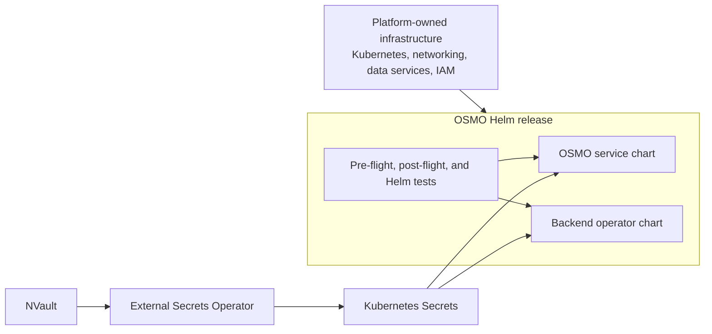

<!--
SPDX-FileCopyrightText: Copyright (c) 2026 NVIDIA CORPORATION & AFFILIATES. All rights reserved.

Licensed under the Apache License, Version 2.0 (the "License");
you may not use this file except in compliance with the License.
You may obtain a copy of the License at

http://www.apache.org/licenses/LICENSE-2.0

Unless required by applicable law or agreed to in writing, software
distributed under the License is distributed on an "AS IS" BASIS,
WITHOUT WARRANTIES OR CONDITIONS OF ANY KIND, either express or implied.
See the License for the specific language governing permissions and
limitations under the License.

SPDX-License-Identifier: Apache-2.0
-->

# Kubernetes-Native OSMO Deployment Engineering Plan

# 1\. Problem space

## 1.1 Scope

In Q3 2026, we are focused on fundamentally simplifying the OSMO deployment
lifecycle to reduce operational burden and increase reliability. The primary
goal is to transition from script-heavy, Terraform-dependent bootstrap
processes toward a more Kubernetes-native model that leverages controllers and
standardized Helm patterns.

This project covers the installation, configuration, verification, upgrade,
and day-two diagnostic experience for OSMO on an existing Kubernetes cluster.
It also includes the application changes required to make a Kubernetes-native
installation possible, such as portable scheduling, declarative backend
registration, and Kubernetes-native Secret consumption.

The platform boundary for this project is a conformant Kubernetes cluster.
Helm will own the Kubernetes resources required by OSMO, but it will not
provision cloud networks, Kubernetes clusters, managed databases, cloud IAM
resources, or other provider-specific infrastructure.

## 1.2 Goals

1. Users should be able to install OSMO using `helm install`.
2. Audit and simplify Helm installations, providing validated charts and
   reference values for single-node, minimal, and split-plane deployment
   patterns.
3. Divest reliance on specific Terraform providers by moving Kubernetes
   deployment logic into Helm and decommissioning
   `deploy-osmo-minimal.sh`.
4. Implement robust pre-flight and post-flight verification checks to validate
   cluster requirements and installation success automatically.
5. Transition all production secret handling to Kubernetes-native Secret
   management using External Secrets and NVault.
6. Provide a supported upgrade, rollback, and diagnostic path so the Helm
   installation is operable after the initial deployment.
7. Port Orion infrastructure to the new deployment pattern in collaboration
   with Ethan Look-Potts US. See the _Productize Orion Infrastructure Plan_
   (link to be added).

## 1.3 Requirements

1. Support installation on an existing conformant Kubernetes cluster without
   requiring Terraform or cloud-provider-specific deployment code.
2. Support a single-command Helm installation for a single-node deployment.
3. Support single-node, minimal, split control-plane, and split compute-plane
   reference values.
4. Keep the service and backend-operator charts independently installable for
   split-plane deployments.
5. Support Linux `amd64` and `arm64` clusters using pinned, multi-architecture
   images.
6. Support Kubernetes default scheduling for CPU and basic deployments without
   requiring KAI CRDs.
7. Retain KAI as an optional scheduler for gang scheduling, GPU workloads, and
   topology-aware scheduling.
8. Consume all credentials through Kubernetes Secrets. Production Secrets
   should be synchronized from NVault using External Secrets.
9. Support existing Kubernetes Secrets for users with another Secret
   provisioning mechanism.
10. Support generated, persistent Secrets only for explicitly non-production
    single-node installations.
11. Move the Master Encryption Key (MEK) from a ConfigMap to a Secret and
    preserve it across install, upgrade, rollback, and reinstall.
12. Remove the post-install requirement to use the OSMO CLI to create a
    backend user and mint a backend token.
13. Validate Kubernetes version, APIs, RBAC, storage, required CRDs, Secrets,
    and external service connectivity before starting OSMO.
14. Validate migrations, service readiness, backend connectivity, and object
    storage after installation.
15. Provide `helm test` coverage that submits a CPU workflow and validates
    workflow logs and output storage. GPU validation should be opt-in.
16. Support upgrade from the previous stable OSMO release without losing
    database data, the MEK, or backend credentials.
17. Publish a release-specific compatibility matrix covering Kubernetes
    versions, distributions, architectures, schedulers, and optional
    dependencies.
18. Preserve the existing OSMO workflow, CLI, API, and UI behavior except where
    a change is explicitly required to make installation declarative.

## 1.4 Out of Scope

1. Provisioning cloud accounts, virtual networks, Kubernetes clusters, managed
   PostgreSQL, managed Redis, cloud object stores, or cloud IAM resources from
   the OSMO Helm chart.
2. Bundling or taking ownership of cluster-wide operators such as External
   Secrets, KAI Scheduler, NVIDIA GPU Operator, ingress controllers,
   certificate managers, or observability stacks.
3. Treating embedded PostgreSQL, Redis, or object storage as production-grade
   managed services.
4. Replacing the OSMO workflow orchestration architecture as part of this
   project. That work is covered separately by the OSMO for CRDs project.
5. Guaranteeing identical scheduling behavior between the Kubernetes default
   scheduler and KAI. Gang scheduling and advanced topology remain optional
   KAI capabilities.
6. Supporting clusters that do not allow OSMO to create the required
   namespace-scoped resources or, for compute-plane installations, the
   required cluster-scoped RBAC resources.
7. Moving provider-specific infrastructure provisioning into Helm through
   another abstraction such as Terraform controllers or Crossplane.

## 1.5 References

1. [OSMO deployments](../deployments/README.md)
2. [OSMO Helm charts](../deployments/charts/README.md)
3. [OSMO deployment scripts](../deployments/scripts/README.md)
4. [OSMO deployment values](../deployments/values/README.md)
5. [ConfigMap-based configuration](./configmap-configs.md)
6. _Productize Orion Infrastructure Plan_ (link to be added)
7. _OSMO for CRDs Engineering Plan_

# 2\. Design

Section 2 describes what we will build. Section 3 describes how the work will
be sequenced and divided into implementation workstreams.

## 2.1 Kubernetes Deployment Boundary

OSMO will treat Kubernetes as its deployment platform and API boundary. Cloud
and data-center infrastructure provisioning happens before the OSMO
installation and produces a conformant cluster plus endpoints and identities
for external services.

The initial conformance boundary requires:

1. A supported Kubernetes version running Linux nodes.
2. Functional cluster DNS and Service networking.
3. A default dynamic `ReadWriteOnce` StorageClass when embedded persistence is
   enabled.
4. Access to the configured image registry or an existing image pull Secret.
5. Network access to configured PostgreSQL, Redis, object storage, identity,
   and observability services.
6. Sufficient namespace-scoped and, for compute-plane installations,
   cluster-scoped RBAC permissions.
7. Optional CRDs only when their corresponding feature is enabled.



## 2.2 Helm Chart Architecture

A new `osmo` umbrella chart will be the primary installation entry point. It
will compose the existing service and backend-operator charts using
conditional Helm dependencies.

The umbrella chart will:

1. Install the control plane, compute plane, or both.
2. Conditionally create and retain required namespaces.
3. Use one release version to select compatible chart and application images.
4. Replace shell-generated values and imperative post-install configuration
   with declarative Helm values and Kubernetes resources.
5. Provide concise release notes with access and diagnostic commands, but no
   credentials.

Single-node and minimal installations will use one Helm release. Split-plane
installations will use one control-plane release and one release per compute
cluster because a Helm release operates against one Kubernetes cluster.

The target single-node experience is:

```bash
helm install osmo oci://<registry>/osmo \
  --version <version> \
  --namespace osmo \
  --create-namespace \
  --values values-single-node.yaml \
  --wait \
  --atomic
```

## 2.3 Deployment Profiles

The charts will ship with validated reference values for four profiles.

1. **Single-node**: control plane, compute plane, PostgreSQL, Redis, and local
   S3-compatible object storage in one cluster. It uses the Kubernetes
   scheduler and generated Secrets. This profile is for local development,
   evaluation, and CI.
2. **Minimal**: control and compute planes in one cluster with small embedded
   stateful dependencies by default. Each dependency can be replaced with an
   external endpoint. It supports the Kubernetes scheduler or KAI.
3. **Split control plane**: installs only the OSMO services and exposes an
   endpoint for one or more compute clusters. Its stateful dependencies may be
   embedded for evaluation or external for production.
4. **Split compute plane**: installs only the backend operator and workflow
   resources. It receives the control-plane endpoint and backend credential
   through values and Kubernetes Secrets.

Profiles will select explicit capabilities rather than invoke hidden
imperative behavior. Users can override individual capabilities without
copying or forking the base chart.

## 2.4 Kubernetes-Native Secret Management

All OSMO components will consume credentials through Kubernetes Secrets. The
charts will define stable Secret names, keys, mount paths, and environment
variable contracts without requiring knowledge of the external Secret
provider.

The chart will support three Secret sources:

1. **External Secrets**: the production reference. The chart renders
   `ExternalSecret` resources that read from a configurable `SecretStore` or
   `ClusterSecretStore` backed by NVault.
2. **Existing Secrets**: a provider-neutral mode for clusters that provision
   Kubernetes Secrets using another controller or an out-of-band process.
3. **Generated Secrets**: a non-production mode for single-node installations.
   Generated values must be preserved across Helm upgrades.

The production Secret contract includes PostgreSQL, Redis, MEK, backend
identity, OAuth, TLS, registry, and workflow storage credentials.

External Secrets synchronizes Kubernetes Secret objects, but OSMO must still
react safely to changes. File-mounted credentials should be reloaded when the
application supports it. Environment-variable credentials will trigger a
controlled rolling restart. MEK rotation must retain old keys until data
re-encryption has been verified.

## 2.5 Portable Scheduling and Cluster Dependencies

OSMO will support the Kubernetes default scheduler as the baseline for CPU and
simple deployments. In this mode, OSMO will not require KAI queues, PodGroups,
topology CRDs, or KAI-specific RBAC.

KAI remains an optional scheduler for gang scheduling, GPU workloads, and
topology-aware production environments. Enabling KAI causes pre-flight checks
to validate the required CRDs, scheduler readiness, and configuration.

External Secrets, KAI, NVIDIA GPU Operator, Prometheus Operator, ingress, and
certificate management remain platform-owned cluster dependencies. OSMO will
detect and validate them when enabled but will not install them by default.

## 2.6 Declarative Backend Registration

OSMO service will support declarative bootstrap principals. A bootstrap
principal consists of a username, roles, token name, and token read from a
mounted Kubernetes Secret.

For a converged installation, the API service and backend operator consume the
same generated or externally synchronized token. The API service idempotently
reconciles the `osmo-backend` user, role, and hashed token during startup.

For a split-plane installation, External Secrets materializes the same
NVault-held backend credential in the control and compute clusters. This
removes the current requirement to port-forward the API, log in using the OSMO
CLI, create a user, mint a token, and copy that token into the backend
namespace.

## 2.7 Stateful Dependencies

PostgreSQL, Redis, and object storage will each have an explicit deployment
mode:

1. **Embedded**: installed as a chart dependency for single-node and CI use.
2. **External**: configured using endpoints, TLS settings, and Kubernetes
   Secret references for operator-managed or cloud-managed services.

Embedded dependencies will use pinned images, persistent volume claims, and
stable credentials, but will be documented as non-production. Production
reference values will use external dependencies.

Cloud workload identity remains supported through provider-neutral
ServiceAccount annotations and pod labels. Cloud-side identity creation and
authorization remain outside the OSMO chart.

## 2.8 Installation Verification

A small multi-architecture `osmo-check` image will provide one validation
implementation for Helm hooks, Helm tests, and day-two diagnostics.

Pre-flight checks will validate:

1. Kubernetes version, APIs, node operating system, and architecture.
2. RBAC permissions.
3. StorageClass and test PVC provisioning.
4. Required CRDs and controllers for enabled capabilities.
5. Required Secret names and keys.
6. External Secret and SecretStore readiness.
7. DNS, TLS, and connectivity to PostgreSQL, Redis, object storage, and the
   control-plane endpoint.
8. Image pull access.
9. GPU resources and KAI readiness when enabled.

Post-flight checks will validate:

1. Database migrations and schema version.
2. Deployment availability and container readiness.
3. API and gateway health.
4. Backend registration and connectivity.
5. Object-storage read, write, and delete.
6. Configuration and Secret resolution.

Longer smoke tests will run through `helm test` and validate a complete CPU
workflow, workflow logs, input and output storage, and cleanup. GPU workflow
validation is enabled only for GPU profiles.

The same checks will be independently runnable as `osmo doctor` for operators
and for GitOps systems that disable or reinterpret Helm hooks.

## 2.9 Releases, Upgrades, and Legacy Decommissioning

OSMO charts will be distributed as signed, versioned OCI artifacts. Chart
dependencies and container images will be pinned, and the default image tag
will derive from the chart application version rather than `latest`.

Database migrations will use a pinned, multi-architecture migration image
instead of downloading an architecture-specific binary at runtime. Release
qualification will cover installation, the previous-release-to-current
upgrade, rollback behavior, Secret preservation, and split-plane version
compatibility.

Terraform will no longer be part of the OSMO installation contract. Existing
provider examples may remain temporarily as optional infrastructure examples,
but Helm will not consume Terraform outputs.

`deploy-osmo-minimal.sh`, `deploy-k8s.sh`, generated values fragments,
imperative backend token setup, and the shell smoke-test path will be
deprecated after the Helm path reaches feature and reliability parity.

## 2.10 Orion Migration

Orion will be the first production consumer of the new deployment contract.
The migration will produce:

1. An inventory of cluster, identity, network, storage, and observability
   prerequisites that remain outside Helm.
2. Orion-specific values layered on a supported OSMO reference profile.
3. NVault paths and External Secret mappings for every OSMO credential.
4. Automated pre-flight, installation, post-flight, and smoke-test execution.
5. A canary rollout and rollback plan.
6. Removal of Orion dependencies on OSMO deployment scripts and Terraform
   outputs.

The Orion migration will be coordinated with the _Productize Orion
Infrastructure Plan_ and will serve as the production exit gate for this
project.

# 3\. Implementation Plan

## 3.1 Sequencing

1. Requirements and top-level design alignment, including the Kubernetes
   support matrix and infrastructure boundary.
2. Agreement on chart topology, profile semantics, namespace ownership, and
   the public values contract.
3. Agreement on Kubernetes Secret contracts, NVault paths, External Secrets
   ownership, and rotation behavior.
4. Fix the current chart correctness, versioning, and portability issues.
5. Implement the Kubernetes scheduler and declarative backend principal.
6. Build the single-node proof of concept using the umbrella chart,
   Kubernetes Secrets, and `osmo-check`.
7. Build and validate the minimal and split-plane profiles.
8. Complete production hardening, upgrade qualification, and Orion canary.
9. Make Helm the default installation path and decommission the legacy
   scripts after the migration gates pass.

## 3.2 Workstreams

Following alignment on the chart and Secret contracts, the following
workstreams will proceed mostly independently and can be worked on in parallel.

### 3.2.1 Helm Charts

Create `deployments/charts/osmo` as the umbrella chart while retaining
`deployments/charts/service` and `deployments/charts/backend-operator` as
independently installable charts.

This workstream adds conditional dependencies, a dependency lock,
`kubeVersion`, JSON Schema validation, shared chart helpers, optional namespace
creation, reference values, and release notes. It will also fix duplicate node
selectors, hard-coded Secret names, plaintext production credential paths,
unpinned images, and the architecture-specific migration download.

Every profile must pass strict lint, schema validation, duplicate-key
detection, Kubernetes API schema validation, and policy checks.

### 3.2.2 Secret Handling

Inventory every Secret and plaintext credential used by the service, gateway,
backend operator, registry integration, workflow storage, and observability
components. Define canonical Kubernetes Secret names and keys, while allowing
existing Secret names to be configured.

Implement External Secrets, existing Secret, and generated Secret modes. Move
the MEK from ConfigMap to Secret, define backup and recovery behavior, and add
safe reload or rolling restart behavior for synchronized credentials.

Tests must cover missing keys, External Secret readiness, Secret refresh,
workload rollout, MEK preservation, and the failure case where an initialized
database is paired with a missing or incompatible MEK.

### 3.2.3 OSMO Service Bootstrap

Generalize the existing default-admin bootstrap into a declarative principal
reconciler. The API service should idempotently create or update the backend
user, roles, and hashed token using a token read from a mounted Secret.

The raw token must not be written to logs, events, audit messages, or error
output. Backend-token rotation must support token overlap or another
coordinated transition before periodic rotation is enabled.

This workstream is complete when a chart-managed backend connects without an
OSMO CLI login or token-mint step.

### 3.2.4 Scheduler Portability

Add a Kubernetes scheduler implementation alongside the existing KAI object
factory. Kubernetes mode creates normal Pods and omits KAI queues, PodGroups,
topologies, labels, and RBAC.

KAI behavior will remain unchanged. OSMO will reject KAI-only workflow or pool
features with a clear error when a backend uses the Kubernetes scheduler.

This workstream is complete when a CPU workflow runs on a clean cluster with
no KAI APIs installed and the existing KAI test suite continues to pass.

### 3.2.5 Verification Tooling

Build `osmo-check` as a reusable binary and multi-architecture image. It will
implement pre-flight, post-flight, `helm test`, and `osmo doctor` checks using a
stable result schema and actionable remediation messages.

Fast checks will run as bounded Helm hooks. Longer workflow smoke tests will
run through `helm test`. Failed checks will retain enough status and logs for
diagnosis, and the same commands will be usable as explicit GitOps sync stages.

### 3.2.6 CI, Release, and Upgrade Qualification

Replace default-only chart validation with a profile and lifecycle matrix.
Per-pull-request checks will build dependencies without ignored failures,
render every reference profile, validate Kubernetes schemas and policies, and
install the CPU single-node profile on Kind.

Nightly and release checks will cover MicroK8s or K3s, two-cluster split-plane
installation, Kubernetes and KAI scheduler variants, GPU workflows,
`amd64`/`arm64`, private registries, restricted egress, upgrades, rollbacks, and
Secret preservation.

Release artifacts will include signed OCI charts, pinned multi-architecture
images, reference values, a compatibility matrix, and an upgrade guide.

### 3.2.7 Orion Infrastructure

In collaboration with Ethan Look-Potts US, map Orion infrastructure outputs to
the new cluster prerequisite and Helm values contracts. Infrastructure
provisioning must be separated from OSMO installation.

Create Orion control-plane and compute-plane values, NVault records, External
Secret mappings, validation automation, and canary promotion gates. Exercise
upgrade, rollback, Secret rotation, backend reconnection, and workflow smoke
tests before removing Orion calls to the legacy OSMO deployment scripts.

Orion migration is complete when its supported environments use the published
chart contract and no longer depend on OSMO-owned Terraform modules or
deployment scripts.

### 3.2.8 Documentation and Operations

Create installation guides for each profile, a Kubernetes support matrix,
existing Secret and External Secrets/NVault examples, workload identity
examples, and upgrade, rollback, backup, restore, and uninstall documentation.

Operational documentation will include MEK recovery and rotation, `osmo
doctor`, support bundles, ownership of persistent resources and namespaces,
and the legacy-script migration timeline.

## 3.3 Repo

The implementation will remain in the existing OSMO repository:

1. Helm charts, reference values, hooks, and deployment documentation will live
   under `deployments/`.
2. Application changes for scheduler support, bootstrap principals, and Secret
   reload behavior will live under `src/`.
3. Chart and deployment lifecycle tests will extend the existing deployment
   and CI test infrastructure.
4. Provider-specific Terraform will be removed from the supported installation
   path and may be retained temporarily as clearly separated examples.

The legacy scripts can be removed only after the reference profiles are
published, automated install and upgrade tests are required, production Secret
handling is qualified, Orion has migrated, and at least one release has shipped
with Helm as the default installation path.

## 3.4 Proof-of-Concept Branch

The `harnholm/spike-simplified-deployments` branch implements the first
executable proposal:

1. `deployments/charts/osmo` composes the existing service and backend charts.
2. Four schema-validated profiles render single-node, minimal, split-control,
   and split-compute deployments.
3. Existing Secret, External Secret, and development-only generated Secret
   modes share one Kubernetes Secret contract. MEK material is mounted from a
   Secret rather than a ConfigMap.
4. Declarative bootstrap principals replace the CLI-driven backend user and
   token creation step.
5. Kubernetes scheduler mode creates plain Pods without KAI resources; KAI
   remains opt-in.
6. Bounded Helm hook Jobs prototype preflight, postflight, and `helm test`
   behavior using a pinned kubectl image and read-only RBAC.
7. Chart CI renders every profile and no longer ignores dependency-build
   failures.

The branch intentionally does not deploy to a cluster. Before production
adoption, the prototype hook scripts must move into the multi-architecture
`osmo-check` image, the migration Job must stop downloading pgroll at runtime,
Secret rotation and MEK recovery tests must be added, and the full Kind,
upgrade, split-cluster, and Orion qualification gates above must pass.
