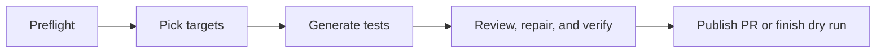

# Testbot: AI-Powered Test Generation

Testbot analyzes coverage gaps, generates tests using Claude Code, recovers interrupted generation, reviews and repairs the changes with an independent Codex session, verifies the final diff, and opens PRs for human review. It also responds to inline review comments via `/testbot`.

## Architecture

### Test Generation (`testbot.yaml`)

GitHub Actions displays five connected jobs, each with its own status and logs:



Selection combines Codecov coverage with code importance and git history.
Generation and review retain their own recovery loops inside the corresponding
job. Summaries show only results owned by that stage:

- **Pick targets:** selected files, starting coverage, and uncovered line counts.
- **Generate tests:** generation attempts, elapsed time, and recovery reasons.
- **Review, repair, and verify:** review and verification attempts, repairs, and measured coverage.
- **Publish:** the generated PR link, dry-run result, or publication failure.

Summaries are available after the job finishes; job status and logs show live
progress. Full attempt history remains in the artifacts passed between jobs.

Jobs transfer patches, metadata, and checkpoints through separate artifacts.
`pipeline.py --stage generate` produces the generation handoff; `--stage review`
restores it on a clean checkout at the same commit, then reviews and verifies it.
`--stage restore` reconstructs the final changes and checks the verification
manifest before publication, including in dry runs. New files, binary changes,
deletions, and executable modes survive the transfer. An incomplete generator
result remains eligible for review and is reported as incomplete in its summary.
Infrastructure failures block dependent jobs. Re-running failed jobs reuses the
successful upstream artifact; re-running an upstream job replaces its own artifact.

The shared setup action installs the system `bubblewrap` package and its AppArmor
profile on Ubuntu 24.04, following the [Codex sandbox prerequisites](https://learn.chatgpt.com/docs/sandboxing#prerequisites).
A sandboxed read/write probe runs before target selection and again before review,
so a broken sandbox fails before spending time on generation or model retries.
AppArmor and Codex workspace restrictions remain enabled. Agent jobs use read-only
GitHub permissions and do not retain checkout credentials; write credentials are
limited to the publication job.

The target picker preserves the original coverage work queue. Generation stays
in one session until it succeeds or fails; there are no fixed file/range batches.
`pipeline.py` supervises both agents using `agent_runner.py`:

- Generation uses Claude Code 2.1.116. Compaction failure interrupts the process
  immediately. Timeouts, context limits, missing results, and operational errors
  can restart in a fresh session, retaining working-tree edits and a concise
  on-disk checkpoint. Authentication/configuration errors are not blindly retried.
- Recovery is bounded to three attempts per stage. Generation shares a 400-turn
  budget and 30-minute deadline across attempts. Each agent attempt has a
  15-minute timeout. Review shares 20 minutes; independent verification shares
  15 minutes, including any repair iterations. CLI flags can override stage
  budgets. The generation/review jobs each default to a 75-minute runner timeout;
  the shared agent/check budgets above still bound the work. Later scheduled runs
  queue instead of canceling an active recovery/review.
- A separate Codex 0.154.0 `exec` session uses
  `azure/openai/gpt-6-astra` through the NVIDIA Responses API at
  `https://inference-api.nvidia.com/v1`. `NVIDIA_API_KEY` supplies authentication;
  the workflow uses the matching secret, falling back to `NVIDIA_NIM_KEY`.
  The reviewer can improve tests, fix necessary source bugs, and enable skipped
  regression tests. It must reproduce suspected bugs and verify the fix. It
  cannot publish changes; GitHub credentials are provided only to the PR step.
- A zero CLI exit code is insufficient: generation checks `is_error` and the
  terminal reason, while review requires a completed turn, a valid structured
  decision, `ready=true`, and no remaining work. A failed generation can be
  salvaged by the reviewer, which must finish and independently verify the full
  original work queue. Failed final checks feed the next fresh review session.
- `verification.py` runs Bazel tests/style checks/coverage for selected and changed
  packages; source fixes also include reverse-dependent tests. Changed test
  files must be registered in BUILD. UI changes use `pnpm validate:coverage`.
  Missing or stale coverage and failing checks block publication. Targets below
  the 70% coverage goal require an explicit reviewer-assessed explanation in the
  PR body. Source fixes can shift lines: unchanged lines are mapped to the
  original coordinates, while replaced/deleted original lines conservatively
  count as uncovered; the report calls out this limitation.
- PR creation accepts production fixes only through the verified manifest and
  rejects any file-content or baseline change after verification. Standalone
  `create_pr.py` without that manifest keeps its existing test-only behavior.

`TESTBOT_REVIEW_PROMPT.md` defines the independent review contract. Agents can
read and edit the checkout, run checks, and maintain an external checkpoint;
the harness owns retries, deadlines, original target metadata, final validation,
and publication. Codex runs with workspace-write permissions and network access
for build/test dependencies, without interactive approval prompts. Its Bazel
and other build caches live under the run's `.build-cache` directory; that
hidden cache is excluded from diagnostic artifact uploads. The API key
is excluded from its tool subprocess environment and independent verification commands.

Every run retains per-attempt prompts, JSONL streams, stderr, terminal outcomes,
checkpoints, generated patches (including untracked files), verification logs,
coverage reports, and the final review summary in per-stage GitHub Actions artifacts for
14 days. This includes failures and dry runs. Dry runs execute review and final
verification but skip PR creation.

### Review Response (`testbot-respond.yaml`)

```text
/testbot comment → respond.py
  ├─ fetch all thread comments (GraphQL)
  ├─ filter: trigger phrase, author, dedup
  ├─ Claude Code CLI: read files, apply fix, run tests
  ├─ respond.py: git commit + push
  ├─ structured reply via --json-schema
  └─ post inline reply to each thread
```

| Feature | Description |
|---------|-------------|
| **Trigger** | Comment starting with `/testbot` on any PR with the `ai-generated` label |
| **Thread context** | Full conversation history (all nested comments) passed to Claude |
| **Structured output** | `--json-schema` returns per-thread replies and commit message |
| **Safety** | Repo-member-only access, crash recovery, push retry |
| **Dedup** | Skips threads where the bot already replied and is awaiting human follow-up |

### Generation and publication boundary

| Operation | Generator | Independent reviewer | Harness |
|---|---|---|---|
| Read source and tests | Yes | Yes | Yes |
| Edit tests and test BUILD entries | Yes | Yes | — |
| Fix production bugs | No | Yes, with regression coverage | — |
| Run tests and measure coverage | Yes | Yes | Required final check |
| Commit, push, create PR | No | No | Yes, after verification |
| Preserve failures and enforce budgets | — | — | Yes |

The separate `/testbot` response workflow retains its existing permissions.

## Triggering on GitHub

### Manual dispatch

**Actions → Testbot → Run workflow**, or via CLI:

```bash
gh workflow run testbot.yaml --ref <branch> \
  -f max_targets=3 \
  -f max_uncovered=500 \
  -f max_turns=400 \
  -f model=aws/anthropic/bedrock-claude-opus-5
```

### Schedule

Runs automatically every hour on weekdays. A cheap preflight job lists open
testbot PRs first; generation is skipped while any open testbot PR is still
unapproved, and proceeds when there are no open testbot PRs or all open testbot
PRs are approved.

### Review response

Add the `ai-generated` label to your PR, then start an inline review comment with `/testbot <instruction>`. The command must be the first text in the comment. Examples:

```text
/testbot add unit tests for this file
/testbot fix this based on the CodeRabbit suggestion above
/testbot rename test methods to follow test_<behavior>_<condition> convention
/testbot refactor this function to reduce duplication
```

The bot responds only to repo members (OWNER, MEMBER, COLLABORATOR). It will not respond to its own replies or comments from bots.

### Reverting a testbot commit

If the bot's commit isn't what you wanted, revert it and retry:

```bash
git pull && git revert HEAD --no-edit && git push
```

Then post a new `/testbot` comment with clearer instructions.

## Configuration

### Test generation (dispatch inputs)

| Input | Default | Description |
|-------|---------|-------------|
| `max_targets` | `3` | Files to target per run |
| `max_uncovered` | `500` | Uncovered lines cap per target (0 = no cap) |
| `max_turns` | `400` | Claude Code agent turns |
| `timeout_minutes` | `75` | Maximum minutes per generation/review job |
| `model` | `aws/anthropic/bedrock-claude-opus-5` | LLM model on API gateway |
| `dry_run` | `false` | Generate without creating PR |

### Slack review requests

After `create_pr.py` opens a PR, it posts a short review request to Slack when
`TESTBOT_SLACK_BOT_TOKEN` is set. The channel is resolved as: workflow_dispatch
`slack_channel` input (if non-null) → `vars.TESTBOT_SLACK_CHANNEL` repo/org var
(prod sets this to `#osmo-code-reviews`, which is also the dispatch input
default) → the in-code fallback `#osmo-slack-test` for forks/dev repos with
no var configured. Pass an empty string to the dispatch input to skip the
notification. Direct channel IDs are also accepted.

### Review response (CLI args in `testbot-respond.yaml`)

| Arg | Default | Description |
|-----|---------|-------------|
| `--max-turns` | `200` | Claude Code agent turns |
| `--max-responses` | `10` | Max threads to address per trigger |
| `--timeout` | `720` | Claude Code CLI timeout in seconds |
| `--model` | `aws/anthropic/bedrock-claude-opus-5` | LLM model |

### Coverage target selection

The selector runs in two stages. Tunables live in `criticality_scorer.py`
(Stage 1) and `select_targets_agent.py` (Stage 2).

**Stage 1 — heuristic (`criticality_scorer.py`):**

| Constant | Value | Description |
|----------|-------|-------------|
| `TIER_PREFIXES` | `lib/`, `utils/`, `runtime/pkg/` = 0; `service/core/` = 1; `cli/`, `runtime/cmd/` = 2; supporting services + `operator/` = 3 | Path-prefix tier (lower = more critical). |
| `Weights` | tier=1.0, fan_in=2.5, churn=0.8 | Default weights for the criticality score. fan_in dominates because dependency centrality is the most durable signal — a hub stays a hub for years, while coverage and churn shift week to week. |
| `CHURN_SINCE` | `6 months ago` | Window for the `git log` churn count. |
| `MIN_LOC` | `30` | Skip files smaller than this — too small to give useful coverage gain. |
| `--shortlist-size` | `20` | Number of candidates handed to the Stage-2 picker. |

Score formula (per file):

```
criticality   =   w_tier   · (DEFAULT_TIER − tier)
                + w_fan_in · log(fan_in + 1) / log(max_fan_in + 1)
                + w_churn  · log(churn  + 1) / log(max_churn  + 1)

coverage_gap  =   (1 − coverage_pct / 100)
                × log(min(uncovered_lines, 500) + 1)

score         =   criticality × coverage_gap
```

Each term:

| Term | Meaning | Range with defaults |
|------|---------|---------------------|
| `w_tier · (DEFAULT_TIER − tier)` | Path-prefix bonus. `DEFAULT_TIER = 4`, so `lib/`/`utils/`/`runtime/pkg/` (tier 0) get +4.0 here, fall-through paths (tier 4) get 0. | `[0, 4.0]` |
| `w_fan_in · log_norm(fan_in)` | Log-normalized reverse-import count. `log_norm(x) = log(x+1)/log(peak+1)` lives in `[0, 1]`, so this term saturates at `w_fan_in` for the most-imported file in the corpus. | `[0, 2.5]` |
| `w_churn · log_norm(churn)` | Log-normalized commit count over the last 6 months, same shape as `fan_in`. | `[0, 0.8]` |
| `(1 − coverage_pct/100)` | Linear coverage gap. A 10%-covered file scales the criticality 9× more than a 90%-covered one. | `[0, 1.0]` |
| `log(min(uncovered, 500) + 1)` | Log-scaled uncovered surface area. Cap means a 5000-line uncovered file doesn't dwarf a 500-line one infinitely. | `[0, log(501) ≈ 6.22]` |

Why **multiplication**, not addition: a perfectly-covered hub scores `0` (nothing to test) and a 0%-covered trivial file scores low (criticality term is small). Both signals must be present for a file to rank high.

Why **log normalization** on `fan_in` and `churn`: without it, OSMO's `lib/utils/common.py` (fan_in=222) would single-handedly drown out everything else. With it, each of those two terms is bounded at its weight.

Used together with the existing `IGNORE_PATTERNS` /
`SKIP_BASENAME_PATTERNS` from `coverage_targets.py` plus extra skips for
generated barrels and vendored code.

**Stage 2 — LLM picker (`select_targets_agent.py`):**

| Setting | Value | Description |
|---------|-------|-------------|
| `ALLOWED_TOOLS` | `Read,Glob,Grep` | Read-only — the picker can never modify anything. |
| `DEFAULT_MAX_TURNS` | `30` | Hard turn cap for the picker subagent. |
| Output contract | JSON `{targets: [{file_path, reason}]}` in a fenced block | Picker can return `[]` to skip a day. |

The picker rejects heavy I/O glue, long-running orchestration, and SDK-call
delegators where unit-test coverage gain would be shallow. When picks are
made, the rationale is surfaced in the resulting PR description so reviewers
can see *why* a file was chosen.

## File Structure

```text
src/scripts/testbot/
├── agent_runner.py            # CLI processes, failure detection, NVIDIA Codex configuration
├── pipeline.py                # Recovery, stage handoffs, and independent review
├── run_summary.py             # Attempt history and Actions job summaries
├── verification.py            # Harness checks and verified-content manifest
├── TESTBOT_REVIEW_PROMPT.md    # Independent review/repair contract
├── coverage_targets.py         # Codecov API client + filtering helpers
├── criticality_scorer.py       # Stage 1: heuristic shortlist (fan-in × churn × tier × coverage gap)
├── select_targets_agent.py     # Stage 2: Claude subagent that picks the best test targets
├── SELECT_TARGETS_PROMPT.md    # System prompt for the Stage-2 picker
├── verify_coverage.py          # LCOV → per-range coverage report (used by generator + harness)
├── create_pr.py                # Branch, commit, push, open PR (with coverage report in body)
├── guardrails.py               # Test-file-only filter, shared by all scripts
├── respond.py                  # Review response: Claude Code CLI + GitHub API
├── TESTBOT_RULES.md            # Shared test quality rules and conventions
├── TESTBOT_PROMPT.md           # Prompt for generate workflow (coverage targets)
├── TESTBOT_RESPOND_PROMPT.md   # Prompt for respond workflow (review feedback)
├── README.md                   # This file
└── tests/
    ├── test_coverage_targets.py
    ├── test_create_pr.py
    ├── test_criticality_scorer.py
    ├── test_guardrails.py
    ├── test_respond.py
    ├── test_select_targets_agent.py
    └── test_verify_coverage.py

.github/workflows/
├── testbot.yaml                    # Scheduled test generation
├── testbot-respond.yaml            # /testbot review response
└── testbot-respond-approve.yaml    # Auto-approve for org members
```
