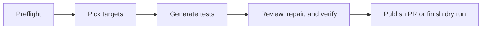

# Testbot: AI-Powered Test Generation

Testbot analyzes coverage gaps, generates tests using Claude Code, recovers interrupted generation, reviews and repairs the changes with an independent Codex session, verifies the final diff, and opens PRs for human review. It also responds to inline review comments via `/testbot`.

## Architecture

### Test Generation (`testbot.yaml`)

GitHub Actions displays five connected jobs, each with its own status and logs:



Selection combines Codecov coverage, code importance, and git history. If it
selects no targets, the remaining jobs are skipped. Each job summarizes its own
results: selected files, generation attempts, review/check outcomes and coverage,
or the published PR link. Job status and logs show live progress.

`pipeline.py` supervises Claude Code 2.1.116 generation and independent Codex
0.154.0 review. Failed compaction, timeouts, context limits, or missing results
can restart an agent with fresh context, preserving edits and a checkpoint.
Authentication/configuration failures stop retries. The original targets remain
the work queue; the reviewer can finish incomplete generation, fix source bugs,
and enable skipped regressions after proving they fail before the fix and pass
afterward. Failed final checks feed the next review attempt.

| Default budget | Limit |
|---|---|
| Attempts per agent stage | 3 |
| Generation, shared across attempts | 400 turns / 30 minutes |
| Review / independent verification | 20 / 15 minutes, including retries |
| Each agent attempt | 15 minutes |
| Generation/review runner job | 75 minutes |

CLI flags can override stage budgets. Scheduled runs queue behind active work.
Codex uses `azure/openai/gpt-6-astra` at
`https://inference-api.nvidia.com/v1`, authenticated with `NVIDIA_API_KEY`
(the workflow falls back to `NVIDIA_NIM_KEY`).

The reviewer must return a valid structured decision with `ready=true` and no
remaining work. `verification.py` then checks Bazel tests/style/BUILD registration
and fresh coverage for selected and changed packages, including reverse-dependent
tests for source fixes. UI changes use `pnpm validate:coverage`; UI dependencies
are installed when needed. Coverage below the 70% listed-line goal requires a
reviewed explanation. Source fixes map coverage to unchanged original lines;
replaced/deleted lines count as uncovered. Missing coverage or failed checks
block publication.

Stage handoffs carry patches and content fingerprints. `--stage review` restores
generation's changes on the same clean baseline; `--stage restore` checks the
final verified files before publication, including in dry runs. Standalone
`create_pr.py` without a verified manifest remains limited to test changes.
Generation/review diagnostic artifacts retain prompts, streams, errors,
checkpoints, patches, and check results for 14 days, including failures and dry
runs. Publication downloads only the verified patch, manifests, metadata, and
summaries. Re-running a failed job reuses its successful upstream handoff; dry
runs complete verification and restoration without creating a PR.

The shared setup action installs Ubuntu 24.04 `bubblewrap` and its AppArmor
profile and probes the sandbox before selection and review. Codex uses
workspace-write permissions with network access for dependencies. Its build
cache is shared with final verification, excluded from artifact uploads, and
uses `--nocache_test_results` to rerun tests. API keys are excluded from reviewer
tool subprocesses and verification commands. Agent jobs have read-only GitHub
permissions and no stored checkout credentials; only Create PR receives write
authentication. See the permissions table below and `TESTBOT_REVIEW_PROMPT.md`.

### Review Response (`testbot-respond.yaml`)

```text
/testbot comment → respond.py
  ├─ fetch all thread comments (GraphQL)
  ├─ filter: trigger phrase, author, dedup
  ├─ Codex CLI: read files, apply fix, run tests
  ├─ respond.py: git commit + push
  ├─ structured reply via --output-schema
  └─ post inline reply to each thread
```

| Feature | Description |
|---------|-------------|
| **Trigger** | Comment starting with `/testbot` on any PR with the `ai-generated` label |
| **Thread context** | Full conversation history (all nested comments) passed to Codex |
| **Structured output** | `--output-schema` returns per-thread replies and commit message |
| **Safety** | Repo-member-only access, crash recovery, push retry |
| **Dedup** | Skips threads where the bot already replied and is awaiting human follow-up |

### Generation and publication boundary

| Operation | Generator | Independent reviewer | Harness |
|---|---|---|---|
| Read source and tests | Yes | Yes | Yes |
| Edit tests and test BUILD entries | Yes | Yes | — |
| Fix production bugs | No | Yes, with regression coverage | — |
| Run tests and measure coverage | Yes | Yes | Required final check |
| Commit, push, create PR | No | No | Yes, after verification |
| Preserve failures and enforce budgets | — | — | Yes |

The separate `/testbot` response workflow retains its existing permissions.

## Triggering on GitHub

### Manual dispatch

**Actions → Testbot → Run workflow**, or via CLI:

```bash
gh workflow run testbot.yaml --ref <branch> \
  -f max_targets=3 \
  -f max_uncovered=500 \
  -f max_turns=400 \
  -f model=aws/anthropic/bedrock-claude-opus-5
```

### Schedule

Runs automatically every two hours on weekdays. A cheap preflight job lists open
testbot PRs first; generation is skipped while any open testbot PR is still
unapproved, and proceeds when there are no open testbot PRs or all open testbot
PRs are approved.

### Review response

Add the `ai-generated` label to your PR, then start an inline review comment with `/testbot <instruction>`. The command must be the first text in the comment. Examples:

```text
/testbot add unit tests for this file
/testbot fix this based on the CodeRabbit suggestion above
/testbot rename test methods to follow test_<behavior>_<condition> convention
/testbot refactor this function to reduce duplication
```

The bot responds only to repo members (OWNER, MEMBER, COLLABORATOR). It will not respond to its own replies or comments from bots.

### Reverting a testbot commit

If the bot's commit isn't what you wanted, revert it and retry:

```bash
git pull && git revert HEAD --no-edit && git push
```

Then post a new `/testbot` comment with clearer instructions.

## Configuration

### Test generation (dispatch inputs)

| Input | Default | Description |
|-------|---------|-------------|
| `max_targets` | `3` | Files to target per run |
| `max_uncovered` | `500` | Uncovered lines cap per target (0 = no cap) |
| `max_turns` | `400` | Claude Code agent turns |
| `timeout_minutes` | `75` | Maximum minutes per generation/review job |
| `model` | `aws/anthropic/bedrock-claude-opus-5` | LLM model on API gateway |
| `dry_run` | `false` | Generate without creating PR |

### Slack review requests

After `create_pr.py` opens a PR, it posts a short review request to Slack when
`TESTBOT_SLACK_BOT_TOKEN` is set. The channel is resolved as: workflow_dispatch
`slack_channel` input (if non-null) → `vars.TESTBOT_SLACK_CHANNEL` repo/org var
(prod sets this to `#osmo-code-reviews`, which is also the dispatch input
default) → the in-code fallback `#osmo-slack-test` for forks/dev repos with
no var configured. Pass an empty string to the dispatch input to skip the
notification. Direct channel IDs are also accepted.

### Review response (CLI args in `testbot-respond.yaml`)

| Arg | Default | Description |
|-----|---------|-------------|
| `--max-responses` | `10` | Max threads to address per trigger |
| `--timeout` | `1800` | Codex session timeout in seconds (workflow) |
| `--model` | `azure/openai/gpt-6-astra` | LLM model |

### Coverage target selection

The selector runs in two stages. Tunables live in `criticality_scorer.py`
(Stage 1) and `select_targets_agent.py` (Stage 2).

**Stage 1 — heuristic (`criticality_scorer.py`):**

| Constant | Value | Description |
|----------|-------|-------------|
| `TIER_PREFIXES` | `lib/`, `utils/`, `runtime/pkg/` = 0; `service/core/` = 1; `cli/`, `runtime/cmd/` = 2; supporting services + `operator/` = 3 | Path-prefix tier (lower = more critical). |
| `Weights` | tier=1.0, fan_in=2.5, churn=0.8 | Default weights for the criticality score. fan_in dominates because dependency centrality is the most durable signal — a hub stays a hub for years, while coverage and churn shift week to week. |
| `CHURN_SINCE` | `6 months ago` | Window for the `git log` churn count. |
| `MIN_LOC` | `30` | Skip files smaller than this — too small to give useful coverage gain. |
| `--shortlist-size` | `20` | Number of candidates handed to the Stage-2 picker. |

Score formula (per file):

```
criticality   =   w_tier   · (DEFAULT_TIER − tier)
                + w_fan_in · log(fan_in + 1) / log(max_fan_in + 1)
                + w_churn  · log(churn  + 1) / log(max_churn  + 1)

coverage_gap  =   (1 − coverage_pct / 100)
                × log(min(uncovered_lines, 500) + 1)

score         =   criticality × coverage_gap
```

Each term:

| Term | Meaning | Range with defaults |
|------|---------|---------------------|
| `w_tier · (DEFAULT_TIER − tier)` | Path-prefix bonus. `DEFAULT_TIER = 4`, so `lib/`/`utils/`/`runtime/pkg/` (tier 0) get +4.0 here, fall-through paths (tier 4) get 0. | `[0, 4.0]` |
| `w_fan_in · log_norm(fan_in)` | Log-normalized reverse-import count. `log_norm(x) = log(x+1)/log(peak+1)` lives in `[0, 1]`, so this term saturates at `w_fan_in` for the most-imported file in the corpus. | `[0, 2.5]` |
| `w_churn · log_norm(churn)` | Log-normalized commit count over the last 6 months, same shape as `fan_in`. | `[0, 0.8]` |
| `(1 − coverage_pct/100)` | Linear coverage gap. A 10%-covered file scales the criticality 9× more than a 90%-covered one. | `[0, 1.0]` |
| `log(min(uncovered, 500) + 1)` | Log-scaled uncovered surface area. Cap means a 5000-line uncovered file doesn't dwarf a 500-line one infinitely. | `[0, log(501) ≈ 6.22]` |

Why **multiplication**, not addition: a perfectly-covered hub scores `0` (nothing to test) and a 0%-covered trivial file scores low (criticality term is small). Both signals must be present for a file to rank high.

Why **log normalization** on `fan_in` and `churn`: without it, OSMO's `lib/utils/common.py` (fan_in=222) would single-handedly drown out everything else. With it, each of those two terms is bounded at its weight.

Used together with the existing `IGNORE_PATTERNS` /
`SKIP_BASENAME_PATTERNS` from `coverage_targets.py` plus extra skips for
generated barrels and vendored code.

**Stage 2 — LLM picker (`select_targets_agent.py`):**

| Setting | Value | Description |
|---------|-------|-------------|
| `ALLOWED_TOOLS` | `Read,Glob,Grep` | Read-only — the picker can never modify anything. |
| `DEFAULT_MAX_TURNS` | `30` | Hard turn cap for the picker subagent. |
| Output contract | JSON `{targets: [{file_path, reason}]}` in a fenced block | Picker can return `[]` to skip a day. |

The picker rejects heavy I/O glue, long-running orchestration, and SDK-call
delegators where unit-test coverage gain would be shallow. When picks are
made, the rationale is surfaced in the resulting PR description so reviewers
can see *why* a file was chosen.

## File Structure

```text
src/scripts/testbot/
├── agent_runner.py            # CLI processes, failure detection, NVIDIA Codex configuration
├── pipeline.py                # Recovery, stage handoffs, and independent review
├── run_summary.py             # Attempt history and Actions job summaries
├── verification.py            # Harness checks and verified-content manifest
├── TESTBOT_REVIEW_PROMPT.md    # Independent review/repair contract
├── coverage_targets.py         # Codecov API client + filtering helpers
├── criticality_scorer.py       # Stage 1: heuristic shortlist (fan-in × churn × tier × coverage gap)
├── select_targets_agent.py     # Stage 2: Claude subagent that picks the best test targets
├── SELECT_TARGETS_PROMPT.md    # System prompt for the Stage-2 picker
├── verify_coverage.py          # LCOV → per-range coverage report (used by generator + harness)
├── create_pr.py                # Branch, commit, push, open PR with agent summaries
├── guardrails.py               # Test-file-only filter, shared by all scripts
├── respond.py                  # Review response: Codex CLI + GitHub API
├── TESTBOT_RULES.md            # Shared test quality rules and conventions
├── TESTBOT_PROMPT.md           # Prompt for generate workflow (coverage targets)
├── TESTBOT_RESPOND_PROMPT.md   # Prompt for respond workflow (review feedback)
├── README.md                   # This file
└── tests/
    ├── test_coverage_targets.py
    ├── test_create_pr.py
    ├── test_criticality_scorer.py
    ├── test_guardrails.py
    ├── test_respond.py
    ├── test_select_targets_agent.py
    └── test_verify_coverage.py

.github/workflows/
├── testbot.yaml                    # Scheduled test generation
├── testbot-respond.yaml            # /testbot review response
└── testbot-respond-approve.yaml    # Auto-approve for org members
```
