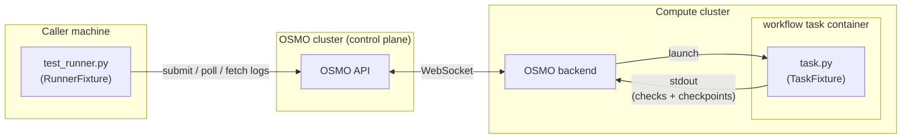
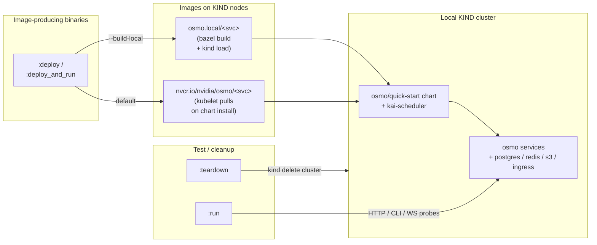

# OETF — OSMO E2E Test Framework

OETF validates a deployed OSMO instance by running Bazel-native tests against
it. Every test is a `py_test` target, so Bazel handles discovery, tag filters,
parallelism, caching (off for OETF), and per-target reporting. A thin wrapper
(`oetf:run`) translates env + flag selection into a `bazel test` invocation and
prints the familiar `[PASS] / [FAIL]` summary.

## Quick start

OETF ships four binaries — `oetf:run`, `oetf:deploy`, `oetf:teardown`,
`oetf:deploy_and_run` — that all share `--env <name>`. Pick the section
that matches what you have:

### Run (against an existing instance)

You have an already-running OSMO instance (staging, dev cluster, your
own KIND, …). Just point OETF at it.

```bash
# First-time setup for staging: export an auth token for the env.
# Get one via `osmo login https://staging.example` +
# `osmo token set oetf --roles osmo-admin`.
export OETF_TOKEN=<your-staging-token>

# All smoke + scenario tests against staging
bazel run //test/oetf:run -- --env staging

# Smoke only (fast HTTP/CLI/WebSocket probes)
bazel run //test/oetf:run -- --env staging --tags smoke

# One specific test by method name
bazel run //test/oetf:run -- --env staging --name test_router_connectivity

# Quick test against an arbitrary URL with dev auth (no env entry needed)
bazel run //test/oetf:run -- \
  --url http://localhost:8000 --auth-method dev --auth-username testuser \
  --tags smoke

# Direct Bazel invocation (bypassing the wrapper) for IDE / debugger use
bazel test //test/smoke:api-checks \
  --test_env=OETF_URL=https://staging.example \
  --test_env=OETF_AUTH_METHOD=token \
  --test_env=OETF_AUTH_TOKEN=$OETF_TOKEN \
  --test_env=OETF_POOL=default \
  --test_env=OETF_LOCAL_OSMO=/usr/local/bin/osmo \
  --cache_test_results=no
```

### Deploy (spin up a local KIND OSMO)

You don't have an instance — let OETF spin up a disposable local KIND
cluster running OSMO via the `osmo/quick-start` chart. See
[`Local KIND deploy`](#local-kind-deploy-type-kind) for the full story
and prereqs.

```bash
# Default deploy (pulls images from public NGC; ~5-10min first time)
bazel run //test/oetf:deploy -- --env kind

# Pin a specific osmo image tag (NGC tags include `6.2`, `6.1`, daily
# stamped builds, etc.). Useful for reproducing a bug against a known
# release without local builds.
bazel run //test/oetf:deploy -- --env kind --image-tag 6.2

# List available `osmo/quick-start` chart versions, then pin one.
bazel run //test/oetf:deploy -- --list-versions
bazel run //test/oetf:deploy -- --env kind --chart-version 1.2.1

# Build images from local source and load them into KIND
# (incremental rebuild + rollout-restart on subsequent re-runs)
bazel run //test/oetf:deploy -- --env kind --build-local

# Force-recreate from scratch (deletes existing cluster first)
bazel run //test/oetf:deploy -- --env kind --build-local --fresh

# Tear down — reads the breadcrumb at ~/.cache/oetf/last-deploy.json,
# no flags needed
bazel run //test/oetf:teardown
```

After `oetf:deploy`, the dashboard is reachable at
`http://quick-start.osmo/` and tests run with:

```bash
bazel run //test/oetf:run -- --env kind --tags kind
```

### Deploy + run (one-shot)

CI / agent / "is-OSMO-broken" check: deploy → run → teardown in one
command. Cluster is always destroyed at the end (pass or fail).

```bash
# Smoke + 3 self-contained scenarios on a fresh KIND
bazel run //test/oetf:deploy_and_run -- --env kind --tags kind

# With locally-built images
bazel run //test/oetf:deploy_and_run -- --env kind --build-local --tags kind

# Keep the cluster on failure for post-mortem (skip the auto-teardown)
bazel run //test/oetf:deploy_and_run -- --env kind --tags kind --keep-on-failure
```

### Deploy to your dev instance (`type: dev`)

Roll your persistent dev cluster (e.g. `<user>-dev.osmo.nvidia.com`)
with a laptop-built image set. Mirrors the Jenkins
`osmo_dev.jenkinsfile` flow but skips the `argocd` CLI — ArgoCD
auto-sync picks up the value-file commit on its own; OETF verifies
rollout via `/api/version`. See [`Dev-instance deploy`](#dev-instance-deploy-type-dev)
for the full story.

```bash
# First-time setup: token for your dev env (token_env from your overlay)
export OSMO_DEV_TOKEN=<your dev token>

# Build everything locally + push to nvcr.io + bump charts_value/dev/<user>_*.yaml
# + commit to argocd/<user> + wait for /api/version.hash to match.
bazel run //test/oetf:deploy -- --env <user>-dev --build-local

# Redeploy an existing image tag (no push, just bump argocd):
bazel run //test/oetf:deploy -- --env <user>-dev --image-tag <existing-tag>

# Cross-arch push (e.g. arm64 laptop → amd64 dev cluster) — see
# external/BUILD_AND_TEST.md for the builder-container path.
bazel run //test/oetf:deploy -- --env <user>-dev --build-local --target-arch x86_64

# Teardown is a no-op for dev (persistent infra; managed in ArgoCD).
bazel run //test/oetf:teardown -- --env <user>-dev
```

## Environment config

`--env <name>` resolves to a URL + pool + auth method from two layered
config files — nothing silently defaults beyond what's declared.

1. **Canonical (in-repo):** `test/oetf/data/oetf.default.yaml` ships
   `staging` and `kind`. `--env staging` works out of the box; the user
   just exports the auth token referenced in the entry
   (e.g. `OETF_TOKEN`).
2. **User overlay:** `~/.config/osmo/oetf.yaml` — same XDG discovery rules
   as the osmo CLI (`$OSMO_CONFIG_FILE_DIR`, then `$XDG_CONFIG_HOME/osmo/`,
   then `~/.config/osmo/`). Add personal envs here and/or override
   canonical entries field-by-field.

CLI flags (`--url`, `--auth-token`, `--auth-username`, `--pool`,
`--local-osmo`) win over both. Any missing required field (url, pool,
auth, token) hard-errors with an `ERROR:` / `NEXT:` hint pointing
at the file that owns the env.

### Schema

Each entry uses a nested `auth:` block and two lifecycle-controlling fields:

```yaml
environments:
  <name>:
    url: https://...                    # required
    auth:                               # required
      strategy: token | dev
      token_env: OETF_TOKEN     # required when strategy=token
      username: testuser                # required when strategy=dev
    type: kind | dev | custom           # required
    allow_deploy: true | false          # default false; type=custom always false
    cluster_name: osmo                  # required when type=kind
    mode: cpu | gpu                     # kind only; default cpu
    dev_user: testuser                    # required when type=dev
    image_registry: nvcr.io/...         # dev only; default registry.example.com/project
    argocd_branch: argocd/<user>        # dev only; default argocd/<dev_user>
    pool: default                 # optional
    exclude_tags: [auth]                # optional
```

**Lifecycle fields:**

| Field | Values | Meaning |
|---|---|---|
| `type` | `kind`, `dev`, `custom` | What kind of infra this env is. Drives adapter selection. `custom` = externally managed, `oetf:run` only. |
| `allow_deploy` | `true` / `false` (default `false`) | Safety gate — `oetf:deploy` refuses unless explicitly `true`. `type: custom` always pins this to `false`. |

**Canonical entries** (from `test/oetf/data/oetf.default.yaml`):

```yaml
environments:
  staging:
    url: https://staging.example
    auth: {strategy: token, token_env: OETF_TOKEN}
    type: custom                      # externally managed; allow_deploy implicitly false
    pool: default

  kind:
    url: http://quick-start.osmo
    auth: {strategy: dev, username: testuser}
    type: kind
    allow_deploy: true
    cluster_name: osmo
    mode: cpu
    pool: default
    exclude_tags: [auth]              # KIND uses dev-auth; skip JWT-only checks
```

**User overlay** (optional) — `~/.config/osmo/oetf.yaml`. Merged on load;
user keys win on conflict. Use this for personal envs without polluting the
repo file:

```yaml
# ~/.config/osmo/oetf.yaml
environments:
  testuser-dev:
    url: https://dev.example
    auth: {strategy: token, token_env: OSMO_DEV_TOKEN}
    type: dev
    allow_deploy: true
    dev_user: testuser
    pool: cpu-pool

  # Override a canonical entry (e.g. point `staging` at a different pool):
  staging:
    pool: <other-pool>
```

OETF fails fast with an actionable `ERROR: / NEXT:` message if the env is
misconfigured or not deployable — you won't see tests running against the
wrong instance or pushes to infra the env didn't opt into.

## Test shapes

Four test shapes, all Bazel `py_test` targets:

| Shape | BUILD macro | Example target | What it does |
|---|---|---|---|
| **smoke** | `oetf_smoke_test` | `//test/smoke:api-checks` | HTTP / CLI / WebSocket probes of the target instance. No workflows submitted. |
| **scenario** (plain) | `oetf_scenario_test(src=...)` | `//test/scenarios:privileged` | Submit a referenced workflow YAML (under `test/workflow/`), poll, assert outcome. One py_test class per tightly related group of scenarios. |
| **scenario** (split) | `oetf_scenario_test(src=..., test_filter=...)` | `//test/scenarios:serial-workflow` | Same as plain, but one Bazel target per test method so Bazel parallelizes them. Used for files whose combined runtime exceeded ~120s. |
| **scenario** (3-file) | `oetf_scenario_test(test_dir=...)` | `//test/scenarios:router-connectivity` | Plain scenario plus a `task.py` injected into the container. Used when both in-container and caller-side assertions matter. |

### Scenario layouts: plain vs 3-file

Plain scenarios reference an existing workflow YAML under
`test/workflow/`; 3-file scenarios bundle their own spec plus a
`task.py` that runs inside the container:

```
test/scenarios/serial.py            ← plain scenario: a py test file whose methods
                                         call self.workflow("test/workflow/<X>.yaml")
                                         against already-existing yamls under test/workflow/

test/scenarios/router_connectivity/ ← 3-file scenario (in-task code)
├── spec.yaml         ← workflow definition; submitted as-is
├── task.py           ← in-container assertions — subclass TaskFixture; stdlib only
└── test_runner.py    ← caller-side assertions — subclass RunnerFixture; full Python + osmo CLI
```

`test_runner.py` runs on the caller machine; `task.py` is injected into
the workflow container and runs on a compute cluster (separate from
the OSMO control plane). The two are bridged by an OSMO backend that
lives in the compute cluster and holds a persistent connection back
to the OSMO API. The runner submits and polls through the API; task
emissions (check results, checkpoint markers) surface on stdout, stream
through the backend, and land in the workflow logs the runner fetches.



## Writing tests

### Smoke test

Extend an existing file or add a new one under `test/smoke/`. Subclass
`SmokeFixture`; each probe builder is chainable.

**Probe builders:**

- `self.http(method, endpoint)` → `HttpProbe` — `.params(...)` /
  `.payload(...)` + terminals `.expect_ok()` / `.expect_body(**kv)` /
  `.expect_body_contains(key)` / `.send()` (non-asserting, returns body).
- `self.cli(command)` → `CliProbe` (auto-logs in the osmo CLI on first
  `osmo …` invocation) — terminals `.expect_exit(code)` /
  `.expect_stdout_contains(text)` / `.run()`.
- `self.ws(endpoint)` → `WsProbe` — terminal `.expect_connect()`.

**Minimal example:**

```python
# test/smoke/my_checks.py
import unittest
from test.oetf.smoke_fixture import SmokeFixture

class MyChecks(SmokeFixture):
    def test_my_endpoint(self):
        # Minimal: endpoint returns 2xx.
        self.http("GET", "/api/my_endpoint").expect_ok()

    def test_my_endpoint_shape(self):
        # Richer: response body contains expected key + value.
        self.http("GET", "/api/my_endpoint") \
            .expect_body(version="1.0", status="ok")

if __name__ == "__main__":
    unittest.main()
```

BUILD:

```starlark
oetf_smoke_test(
    name = "my-checks",
    src = "my_checks.py",
    tags = ["smoke", "custom"],
)
```

**Dropping to raw logic when a probe terminal isn't enough.** The builders
cover the common cases; for richer assertions (cryptographic checks,
cross-endpoint state, stdout regex), call `.send()` / `.run()` to get the
raw response and assert on it with plain `unittest` helpers. Two worked
examples from `test/smoke/`:

```python
# test/smoke/auth_checks.py — mint a JWT, verify it's signed with a
# key from the JWKS endpoint (no pyjwt decoder needed beyond sig check).
class AuthChecks(SmokeFixture):
    def test_token_signed_with_jwks_key(self):
        minted = self.http("POST", "/api/auth/jwt/access_token") \
            .payload({"token": self.config.auth_token}) \
            .expect_body_contains("token")
        jwks = self.http("GET", "/api/auth/keys").send() or {}

        # Try each JWKS key; at least one must verify the JWT signature.
        for key_dict in jwks.get("keys", []):
            public_key = RSAAlgorithm.from_jwk(json.dumps(key_dict))
            try:
                pyjwt.decode(minted["token"], public_key, algorithms=["RS256"],
                             options={"verify_aud": False, "verify_exp": False})
                return
            except pyjwt.InvalidSignatureError:
                continue
        self.fail("no JWKS key verifies the minted JWT")
```

```python
# test/smoke/cli_checks.py — loose regex on stdout without coupling
# to exact format. Run the CLI via self.cli(...).expect_exit(0); the
# return value is the subprocess.CompletedProcess for further asserts.
class CliChecks(SmokeFixture):
    def test_version(self):
        result = self.cli("osmo version").expect_exit(0)
        self.assertRegex(result.stdout, r"\d+\.\d+",
                         f"`osmo version` lacks a version-like string: {result.stdout!r}")
```

### Plain scenario test (declarative)

Under `test/scenarios/`. Reference an existing yaml; terminate the chain
with an `.expect_*` method:

```python
# test/scenarios/my_workflows.py
import unittest
from test.oetf.runner_fixture import RunnerFixture

class MyWorkflows(RunnerFixture):
    def test_my_flow(self):
        # Happy path — one chained expression:
        self.workflow("test/workflow/my_workflow.yaml") \
            .expect_completed()

    def test_my_flow_with_set_vars(self):
        # Override Jinja template vars via .args():
        self.workflow("test/workflow/group_actions.yaml") \
            .args("ignore_nonlead_status=false") \
            .expect_failed()
```

BUILD:

```starlark
oetf_scenario_test(
    name = "my-workflows",
    src = "my_workflows.py",
    tags = ["scenario", "custom"],
)
```

Available terminals: `.expect_completed()` / `.expect_failed()` /
`.expect_timeout()` / `.expect_failed_submission()` — each submits and asserts
the outcome in one call.

**Class-level defaults + per-submission overrides.** Set defaults at the
class level for a whole file; override per-submission with chainable
methods:

```python
class CliWorkflows(RunnerFixture):
    client = "cli"               # class default — force CLI submit for every test in this file
    timeout = "5m"               # class default — OETF poll deadline

    def test_exec_workflow(self):
        self.workflow("test/workflow/exec_workflow.yaml") \
            .timeout("10m") \    # per-submission override
            .expect_completed()
```

Available class-level defaults: `pool`, `client`, `timeout`. Available
per-submission overrides: `.pool(...)`, `.client(...)`, `.args(...)`,
`.timeout(...)`.

> **Platform arg usage.** Most tests omit `platform=...` — workflow YAMLs
> declare their platform (or the pool's `default_platform` applies). Pass
> it explicitly only when a test *requires* a specific platform
> (e.g. `.args("platform=data-ops")` for the transfer-service test,
> `.args("platform=bad-platform")` for a negative-path test).

### 3-file scenario test (in-container + caller-side)

`.expect_completed()` is enough for pure submit-and-wait tests. When you
need mid-run actions — exec into a task, port-forward through the router,
cancel early, or assert behavior that only the in-container side can see —
drop to the imperative form: `.submit()` returns a `WorkflowHandle` that
you drive explicitly, and inject a `task.py` that runs inside the
container. The macro picks up three files from a scenario directory:

```
test/scenarios/my_scenario/
├── spec.yaml            ← workflow definition; submitted as-is
├── task.py              ← subclass TaskFixture; stdlib only (runs in-container)
└── test_runner.py       ← subclass RunnerFixture; caller-side
```

`task.py` is **stdlib-only** — no pip deps — since the task image may be
minimal.

BUILD:

```starlark
oetf_scenario_test(
    name = "my-scenario",
    test_dir = "my_scenario",
    tags = ["scenario", "custom"],
)
```

Two patterns, often combined in the same scenario:

- **In-task checks** — task.py runs self-contained assertions (DNS,
  env vars, filesystem, custom `record_check` blocks); runner just
  asserts they all passed. Use when the thing you need to verify is
  only visible from inside the container.
- **Runner–task coordination** — task.py sets up in-container state
  (writes a sentinel, starts a listener, keeps the container alive);
  runner exec's into the task or port-forwards, gated on durable
  log-marker checkpoints emitted from inside. Use when the test needs
  to interact with a *running* task from the outside.

---

#### In-task checks

Task records check results via `TaskFixture` helpers. `execute()` prints
the accumulated results as one JSON line to stdout at exit; the caller
parses that line out of the workflow logs.

`task.py`:

```python
# test/scenarios/my_scenario/task.py
import os

from task_fixture import TaskFixture


class MyConnectivityCheck(TaskFixture):
    def run_checks(self):
        # Declarative helpers — each records one or more named results:
        self.check_mounts_writable(["{{output}}"])             # {{output}} is an OSMO template var
        self.check_dns(["kubernetes.default.svc.cluster.local"])
        self.check_env_vars(["OSMO_CONFIG_FILE_DIR"])

        # Custom check: `record_check(name)` is a context manager — PASS
        # if the block completes, FAIL with the exception message if it
        # raises. Set `check.message` for optional PASS context (e.g. the
        # path written, value read).
        with self.record_check("wrote_marker") as check:
            path = os.path.join("{{output}}", "oetf-ran.txt")
            with open(path, "w") as handle:
                handle.write(f"pid={os.getpid()}\n")
            check.message = path


if __name__ == "__main__":
    MyConnectivityCheck().execute()
```

`test_runner.py`:

```python
# test/scenarios/my_scenario/test_runner.py
import unittest
from test.oetf.runner_fixture import RunnerFixture


class MyConnectivity(RunnerFixture):
    timeout = "5m"

    def test_my_connectivity(self):
        handle = self.workflow("spec.yaml").submit()
        handle.expect_outcome("completed")
        # task_name scopes the log fetch to just that task's stdout
        # (server-side filter), so the parser sees exactly one results blob.
        handle.assert_in_task_checks_passed(task_name="check")
```

**What lands in the workflow logs.** `TaskFixture.execute()` prints every
recorded result inline as it happens, then emits a final JSON summary
line. The runner parses the summary line to assert pass/fail:

```text
[PASS] mount:/workspace:
[PASS] dns:kubernetes.default.svc.cluster.local: [(...,)]
[FAIL] env:OSMO_CONFIG_FILE_DIR: MISSING
[PASS] wrote_marker: /workspace/oetf-ran.txt
{"checks": [
    {"name": "mount:/workspace", "status": "PASS", "detail": ""},
    {"name": "dns:kubernetes.default.svc.cluster.local", "status": "PASS", "detail": "[(...,)]"},
    {"name": "env:OSMO_CONFIG_FILE_DIR", "status": "FAIL", "detail": "MISSING"},
    {"name": "wrote_marker", "status": "PASS", "detail": "/workspace/oetf-ran.txt"}
 ], "passed": 3, "failed": 1}
```

If any check recorded a failure, the caller-side test fails with each
failing `name: detail` printed. For scenarios where several tasks each
run their own `TaskFixture`, use `handle.assert_all_task_checks_passed(
task_names=[...])` to require every named task emitted a blob AND all
its checks passed.

---

#### Runner–task coordination via checkpoints

Task writes a file / starts a listener / keeps alive; test_runner execs
into the task or port-forwards through the router and asserts.

**The race to avoid.** `wait_for_task_running(task_name)` resolves the
instant the task's K8s status flips to RUNNING — but at that moment
`task.py` may only have reached its `import` statements. The sentinel
file may not exist yet, the HTTP listener may not be bound. Gate
caller-side actions (exec, port-forward) on an explicit in-task
checkpoint instead (inspired by
[testcontainers' `Wait.forLogMessage`](https://java.testcontainers.org/features/startup_and_waits/)):

- **Task side:** `self.checkpoint(name, message="")` emits a durable log
  marker stamped with the emitting task's YAML name. `message` is a
  free-form string the task hands back to the runner via the payload.
- **Caller side:** `handle.wait_for_task_checkpoint(name, task_name="...")`
  blocks until the marker surfaces in the workflow logs. Fast-fails if
  the workflow reaches terminal status without emitting it. `task_name`
  is required — checkpoints are inherently task-scoped.

`task.py` (writes a sentinel, serves HTTP, emits checkpoints, keeps alive):

```python
# test/scenarios/router_connectivity/task.py
import time
from task_fixture import TaskFixture

SENTINEL = "OETF_ROUTER_SENTINEL_c5b41e"
WORKSPACE = "/workspace"


class RouterProbe(TaskFixture):
    def run_checks(self):
        path = f"{WORKSPACE}/sentinel.txt"
        with self.record_check("write_sentinel") as check:
            with open(path, "w") as handle:
                handle.write(SENTINEL)
            check.message = path

        # Notify the runner: `cat /workspace/sentinel.txt` is now safe.
        self.checkpoint("sentinel_written", message=f"{WORKSPACE}/sentinel.txt")

        # ... start HTTP server on :8080 ...
        self.checkpoint("http_listening", message="port=8080")

        # Keep the container alive for the external runner to exec into.
        time.sleep(200)


if __name__ == "__main__":
    RouterProbe().execute()
```

`test_runner.py` (waits for each checkpoint before the matching caller-side action):

```python
# test/scenarios/router_connectivity/test_runner.py
import unittest
from test.oetf.runner_fixture import RunnerFixture

# Kept in sync with task.py — the two files run on different machines
# (task.py in-container, test_runner.py on the caller) so they can't share
# a module; duplicate the constants rather than cross-importing.
SENTINEL = "OETF_ROUTER_SENTINEL_c5b41e"
WORKSPACE = "/workspace"


class RouterConnectivity(RunnerFixture):
    def test_router_connectivity(self):
        handle = self.workflow("spec.yaml").submit()
        handle.wait_for_task_running("router-target")

        # Gate exec on the sentinel file actually existing.
        handle.wait_for_task_checkpoint("sentinel_written", task_name="router-target")
        output = handle.cli_exec("router-target", f"cat {WORKSPACE}/sentinel.txt")
        self.assertIn(
            SENTINEL, output,
            f"sentinel missing from exec output: {output[:300]!r}",
        )

        # Gate port-forward on the HTTP server actually binding.
        handle.wait_for_task_checkpoint("http_listening", task_name="router-target")
        with handle.cli_port_forward("router-target", 18080, 8080):
            # ... curl through the forward ...
            pass

        handle.cancel()
        handle.expect_outcome("failed")
```

**What lands in the workflow logs.** Each `checkpoint()` prints one line
with the `OETF_CHECKPOINT::` prefix and a JSON payload — durable (a late
`wait_for_task_checkpoint` still sees the line) and server-side
filterable (by `task_name=` + `regexes=[...]`):

```text
OETF_CHECKPOINT::{"task": "router-target", "name": "sentinel_written", "message": "/workspace/sentinel.txt", "time": 1716429600.12}
OETF_CHECKPOINT::{"task": "router-target", "name": "http_listening", "message": "port=8080", "time": 1716429601.45}
```

On timeout, the error includes the workflow URL, current status, every
checkpoint emitted so far (useful for typo detection — e.g. if you wait
on `"http_listen"` but the task emitted `"http_listening"`), and the
last 500 chars of the log tail.

---

#### Multi-task workflows

`task_fixture.py` + your `task.py` are injected into *every* task in the
spec whose `args` reference `/tmp/oetf/task.py`, so multiple tasks in the
same workflow can each run their own copy of `TaskFixture`. Emissions
are stamped with the emitting task's YAML `name` (via an injected
`/tmp/oetf/task_name` identity file), and the caller picks the cardinality
that matches its intent:

| Call | Semantics | Returns |
|---|---|---|
| `wait_for_task_checkpoint(name, task_name="X")` | One specific task must emit | `Dict` (payload) |
| `wait_for_any_task_checkpoints(name, task_names=[...])` | Race — return on the first task to emit | `Tuple[str, Dict]` — `(winning_task, payload)` |
| `wait_for_all_task_checkpoints(name, task_names=[...])` | Barrier — every named task must emit | `Dict[str, Dict]` — `{task: payload}` |
| `assert_in_task_checks_passed(task_name="X")` | One specific task's checks all passed | None (fails test if anything failed) |
| `assert_all_task_checks_passed(task_names=[...])` | Every named task ran AND all checks passed | None |

```python
# Single-task wait — required task_name makes the intent explicit.
handle.wait_for_task_checkpoint("ready", task_name="worker-a")

# Race — proceed when whichever worker becomes ready first.
winner, payload = handle.wait_for_any_task_checkpoints(
    "ready", task_names=["worker-a", "worker-b", "worker-c"],
)

# Fan-in barrier — proceed only after every worker is ready.
payloads = handle.wait_for_all_task_checkpoints(
    "ready", task_names=["worker-a", "worker-b", "worker-c"],
)
```

Under the hood, both filter server-side (by `task_name=` for scoped
fetches, plus `regexes=["OETF_CHECKPOINT::"]` / `regexes=['"checks":']`
for the specific signal). Per-poll bandwidth is O(checkpoint_count) or
O(one results blob) instead of O(all log lines) — scales to arbitrary
task concurrency.

On timeout, error messages include the workflow URL, current status,
every checkpoint emitted so far (displayed as `<task>/<name>`, useful
for typo detection), and the last 500 chars of the log tail — so you
can tell at a glance whether the task crashed, is slow, or emitted a
different name than you waited on.

`WorkflowHandle` imperative methods: `wait_for_task_running`,
`wait_for_task_checkpoint` / `wait_for_any_task_checkpoints` /
`wait_for_all_task_checkpoints`, `wait_for_terminal`, `cli_exec`
(PTY-attached `osmo workflow exec`), `cli_port_forward` (context manager
around `osmo workflow port-forward`), `cancel`, `expect_outcome`, plus
lazy `status` / `tasks` / `logs` properties and
`assert_in_task_checks_passed` / `assert_all_task_checks_passed`.

#### TaskFixture reference

| Helper | Use |
|---|---|
| `check_dns(hosts)` | PASS per host if `getaddrinfo` resolves. |
| `check_http(urls)` | PASS per URL if response < 500. |
| `check_env_vars(names)` | PASS per name if the env var is set. |
| `check_mounts_writable(paths)` | PASS per path if it exists and is writable. |
| `check_gpu()` | PASS if `nvidia-smi` exits 0. |
| `check_packages(packages)` | PASS per package if it imports. |
| `record_check(name)` (context manager) | PASS if the block completes, FAIL with the exception message if it raises. Set `check.message = "..."` for optional PASS context. |
| `record_pass(name, detail)` / `record_fail(name, detail)` | Record an already-evaluated result explicitly. |
| `checkpoint(name, message="")` | Emit a durable log marker the caller-side `handle.wait_for_task_checkpoint(name, task_name=...)` can block on. `message` is a free-form string the task returns to the runner via the payload (bound port, chosen path, ...). Stamped with the emitting task's YAML name for multi-task disambiguation. |

### Load tests

Submit many workflows in parallel, then verify system-wide behavior via
a Prometheus query. `self.prometheus` is an optional `PrometheusClient`
populated when `OETF_PROMETHEUS_URL` is configured (in the env preset or
via `--bazel-arg --test_env=OETF_PROMETHEUS_URL=...`).

Example — load the logger service and assert Envoy distributed the
active log-stream connections evenly across its replicas:

```python
class LoggerLoadTest(RunnerFixture):
    timeout = "15m"

    def test_envoy_distributes_logger_connections(self):
        # Each workflow runs a task that streams stdout through osmo-ctrl
        # to the logger service, which is fronted by Envoy.
        handles = [
            self.workflow("test/workflow/serial_workflow.yaml").submit()
            for _ in range(50)
        ]
        self.wait_all(handles)

        # envoy_cluster_upstream_cx_active is gauge of currently-open
        # upstream connections, labeled per logger pod. One row per replica.
        results = self.prometheus.query(
            "envoy_cluster_upstream_cx_active",
            labels={"envoy_cluster_name": "service", "pod": "osmo-logger-.*"},
        )
        connections_per_pod = {
            row["metric"]["pod"]: int(float(row["value"][1]))
            for row in results
        }
        self.assertGreaterEqual(
            len(connections_per_pod), 3,
            f"expected ≥3 logger replicas holding connections, got: {connections_per_pod}",
        )
        max_conns = max(connections_per_pod.values())
        min_conns = min(connections_per_pod.values())
        self.assertLess(
            max_conns / max(min_conns, 1), 2.0,
            f"logger connections unbalanced (max/min > 2x): {connections_per_pod}",
        )
```

Pattern applies to any per-replica / per-upstream metric — scheduling
fairness, backend latency percentiles, error-rate spikes under load.

## `oetf:run` wrapper

The wrapper (`test/oetf/main.py`) is thin:

1. Load `data/oetf.default.yaml` + user overlay at `~/.config/osmo/oetf.yaml`.
2. Resolve `--env` to `OETF_URL` / `OETF_AUTH_TOKEN` / `OETF_POOL` (CLI flags win).
3. If `--data-cred-*` flags are set, `osmo login` + `osmo credential set osmo_cred --type DATA …` so CLI-mode scenarios find the DATA cred.
4. `bazel query` for the target list matching `--tags` (needed because OETF
   targets are `manual`-tagged; wildcard expansion skips them). For `--name`,
   resolve via split-target naming first, fall back to combined target.
5. `bazel test <targets> --test_env=OETF_*=... --cache_test_results=no
   --local_test_jobs=<N> --build_event_json_file=...`.
6. Parse the BEP stream for per-target outcomes; pull the first failure's
   `method: ExceptionClass: message` out of each target's `test.log` and
   stamp it on the summary line (see `log_summary.py`).
7. Render the `[PASS]/[FAIL]` table (with clickable workflow URLs in
   assertion messages), write `--output-json` if set.

### Flags

| Flag | Meaning |
|---|---|
| `--env <name>` | Target environment resolved from `data/oetf.default.yaml` + `~/.config/osmo/oetf.yaml`. Canonical: `staging`, `kind`. |
| `--tags smoke,scenario,router,kind,...` | Comma-separated Bazel tag filter. `smoke` / `scenario` are aliases for `oetf-smoke` / `oetf-scenario`. The `kind` tag selects tests verified to pass against `oetf:deploy --env kind` (see "Tests that pass on local KIND" below). |
| `--name test_foo` or `Class.test_foo` | Run a single test method. Wrapper scans `test/smoke/` and `test/scenarios/` and prefers the split target when one filters to that method. |
| `--jobs N` | `--local_test_jobs=N` (default 3 — staging sweet spot). |
| `--url` | Override the env's URL. Useful for quick-test against an arbitrary instance. |
| `--auth-method {token,dev}` | Override the env's auth strategy. `token` uses `--auth-token` / `${env.auth.token_env}`; `dev` uses `--auth-username` with no JWT. Auto-adds the `auth` smoke suite to `exclude_tags` when `dev` is chosen (the auth suite needs a real JWT issuer). |
| `--auth-token`, `--auth-username`, `--pool`, `--local-osmo` | Override env defaults. `--auth-username` is required for `--auth-method=dev`. |
| `--data-cred-access-key-id`, `--data-cred-access-key`, `--data-cred-endpoint`, `--data-cred-region` | Seed the osmo CLI's DATA credential cache before tests run. Needed for CLI-mode scenarios with `localpath:` datasets. All four required together (or none). |
| `--output-json PATH` | Write per-target results JSON after the run. Jenkins archives this as a build artifact. |
| `--bazel-arg FLAG` | Extra arg passed verbatim to `bazel test`. Repeat for multiple. |
| `--verbose` | Enable debug logging. |

> The flag set above is shared with `oetf:deploy_and_run` — they're both
> defined in `cli_args.add_env_args` + `cli_args.add_run_args`. Any new
> run-side flag added there propagates to `deploy_and_run` automatically
> (and is forwarded to its subprocess via `forward_run_args`).

### Bazel tags the macros apply

- `external` — no test result caching.
- `requires-network` — allow network access.
- `no-sandbox` — run outside the sandbox so the osmo CLI can write
  `~/.local/state/osmo/*` and in-cluster services are reachable.
- `manual` — keeps OETF tests out of `bazel test //...` default expansion.
- `oetf-smoke` / `oetf-scenario` — for wrapper tag filtering.
- `kind` — applied to tests **verified to pass against
  `oetf:deploy --env kind`**. `oetf:run --env kind --tags kind` runs
  this curated subset (currently 10 tests: 2 smoke probes + 4
  submission-validation scenarios + 3 self-contained 3-file scenarios +
  `serial-workflow-mounting`). Tests that require NVIDIA-only platforms,
  registry credentials, or pre-existing data are intentionally not
  tagged.
- User-supplied `tags = [...]` on individual targets pass through for
  fine-grained filtering (`serial`, `router`, `load`, etc.).

## Local KIND deploy (`type: kind`)

Four sibling binaries all share the same `--env <name>` flag. With
`type: kind` the env tells OETF to spin up a disposable local cluster via
`osmo/quick-start`.

| Binary | When to use |
|--------|-------------|
| `oetf:deploy` | Spin up a fresh (or reuse existing) KIND cluster. Leaves it running. |
| `oetf:run` | Test against an already-running target. Iterate here. |
| `oetf:teardown` | Destroy the cluster. Reads the breadcrumb — no args needed. |
| `oetf:deploy_and_run` | One-shot: deploy → run → teardown. |

The chart's deployments receive images from one of two sources — local
Bazel-built tarballs (when `--build-local` is set) or the chart-default
registry (otherwise):



### User journey: iterating on a service with `--build-local`

`oetf:deploy --env kind --build-local` is idempotent: subsequent calls
detect the existing cluster, do an incremental bazel rebuild, kind-load
any changed image digests, and `kubectl rollout restart` the osmo
deployments so running pods pick up the new images. No manual
`kubectl rollout restart` step. Edits to either the 9 Python services *or*
the web-ui (Next.js) are picked up by the same re-run — the 9-service bazel
build and the UI docker buildx build run concurrently inside the pre-install
hook.

To force a refresh without source-code changes (e.g., to pick up a chart
upgrade), pass `--fresh` — that deletes the cluster first and runs the
first-deploy path on a clean slate.


### Relationship to `osmo/quick-start` and existing deploy scripts

The KIND adapter (`deploy_adapters/kind_adapter.py`) is a **consumer** of
the public `osmo/quick-start` Helm chart, not a reimplementation. The chart
owns *what* to deploy; the adapter owns *where, how, and when*.

```
osmo/quick-start chart  (helm.ngc.nvidia.com/nvidia/osmo)
  │  Bundles: service · web-ui · router · backend-operator · ingress-nginx
  │           postgres · redis · localstack-s3
  │  Owns: k8s manifests, default values, sub-chart pinning, image tags,
  │        node-selector defaults. Knows nothing about OETF or KIND.
  ▼
OETF KIND adapter  (this file)
  Provides what the chart assumes already exists:
    • A 6-node KIND cluster with node_group={service, compute, ingress,
      kai-scheduler, data} labels matching the chart's nodeSelector defaults
    • kai-scheduler installed (chart expects it pre-existing)
    • A stub `nvidia` RuntimeClass (CPU-only KIND has no real GPU operator)
    • /etc/hosts: 127.0.0.1 quick-start.osmo
  Passes KIND-specific value overrides via `helm upgrade --install`:
    • ingress-nginx.controller.nodeSelector.node_group=service
      (KIND has no `node_group=ingress` worker)
    • global.osmoImageLocation/Tag (when --build-local)
    • per-service imagePullPolicy=IfNotPresent (build-local)
  Adds lifecycle the chart doesn't have:
    • Idempotent re-deploy + `kubectl rollout restart` on rebuild
    • Health-check wait against http://quick-start.osmo/health
    • Breadcrumb-driven teardown (oetf:teardown reads ~/.cache/oetf/)
    • Local image build + `kind load docker-image` (for --build-local)
```

`kind_adapter.deploy()` is a thin orchestrator: cluster bringup → single
`helm upgrade --install osmo/quick-start <overrides>` → post-install wait
+ optional rollout-restart. The helm step is the only place the adapter
touches the chart, and it's just one shell-out — no per-component logic,
no manifest patching.

#### Versus `run/start_service_kind.py`

Public users may also know
[`run/start_service_kind.py`](../../run/start_service_kind.py)
— an older script that predates the umbrella chart. Comparison:

| Dimension                | OETF KIND adapter                       | `start_service_kind.py`                                  |
|--------------------------|-----------------------------------------|----------------------------------------------------------|
| Role                     | Test driver — deploy + run + teardown   | Manual exploration script                                |
| Cluster shape            | 6 nodes (multi-group labels)            | 2 nodes (control-plane + 1 worker)                       |
| Component wiring         | One `helm install osmo/quick-start`     | 3+ separate helm installs from `deployments/charts/`     |
| Image source             | NGC default, or `osmo.local/*` (build-local) | `registry.example.com/project` (NVCR creds required)      |
| Lifecycle                | Idempotent + rollout-restart            | Fresh setup only                                         |
| Aligns with public guide | ✅ Mirrors `deploy_local.html` (Option B) | Predates current public deploy guide                    |

Both flows ultimately use the same chart. OETF's adapter takes the
"blessed" path published at
`nvidia.github.io/OSMO/deployment_guide/appendix/deploy_local.html`,
which is why it's the recommended way to drive a KIND OSMO instance for
testing. `start_service_kind.py` remains useful for hands-on exploration
of the lower-level chart wiring.

#### Versioning

The adapter pins no chart version by default — it uses the latest from
the helm repo. Pass `--chart-version <X.Y.Z>` to lock to a specific
chart release (CI does this). Forward-compatibility relies on the
override keys (`global.osmoImageTag`, `ingress-nginx.controller.nodeSelector.*`,
`web-ui.services.ui.imagePullPolicy`) staying stable across chart releases.


### Prereqs (one-time)

Install `docker`, `kind`, `kubectl`, and `helm`, then add the hosts entry:

```bash
echo "127.0.0.1 quick-start.osmo" | sudo tee -a /etc/hosts
```

OETF's pre-flight enumerates every missing tool and prints an `ERROR: / NEXT:`
fix command for each before deploy starts.

### Fast local iteration loop

```bash
# First call: cluster + chart + images, ~8-12 min cold
bazel run //test/oetf:deploy -- --env kind --build-local

# Iterate: edit src/service/..., then re-run the same command.
# Bazel rebuilds incrementally; KIND reuses the cluster; pods are
# rolled out to pick up new images. ~30-90s warm.
bazel run //test/oetf:deploy -- --env kind --build-local

bazel run //test/oetf:run -- --env kind --tags smoke

bazel run //test/oetf:teardown                      # when done
```

### One-shot CI / agent loop

```bash
bazel run //test/oetf:deploy_and_run -- --env kind --tags smoke
# fails → cluster torn down anyway (unless --keep-on-failure)
# passes → cluster torn down (unless --keep)
```

### Flags on `oetf:deploy` / `oetf:deploy_and_run`

| Flag | Description |
|------|-------------|
| `--fresh` | Delete the existing KIND cluster first, then create fresh. Skips the build-local consistency check (see below). |
| `--mode {cpu,gpu}` | Override `env.mode` for this invocation |
| `--cluster-name X` | Override `env.cluster_name` (default: `osmo`) |
| `--chart-version X` | Pin `osmo/quick-start` chart version (default: latest) |
| `--image-location / --image-tag` | Override chart image defaults |
| `--build-local` | Build OSMO images from local source, kind-load them, and restart osmo deployments. |
| `--build-images all,service,…` | With `--build-local`, restrict to specific image short_names (default `all`). |
| `--with-metrics-server` | Install metrics-server (opt-in; not needed for smoke / router tests) |
| `--extra-set key=value` | Extra `helm --set` override (repeatable). |
| `--list-versions` | Print available `osmo/quick-start` chart versions and exit. Available on both `oetf:deploy` and `oetf:deploy_and_run`. |
| `--keep-on-failure` | Skip rollback teardown on deploy failure (for debugging the partial state). |
| `--keep` *(deploy_and_run only)* | Skip teardown after a passing test run (leaves cluster running for inspection). |

> The deploy-side flag set above is shared between `oetf:deploy` and
> `oetf:deploy_and_run` via `cli_args.add_env_args` +
> `cli_args.add_deploy_args`. Adding a flag in one place exposes it on
> both binaries automatically.

**Build-local consistency check.** If the existing osmo helm release
was deployed with `--build-local` (`global.osmoImageLocation=osmo.local`),
re-running `oetf:deploy --env kind` *without* `--build-local` would
silently helm-upgrade pods back to NGC images and discard your local
build. To prevent this, the deploy refuses to start with an
`ERROR: / NEXT:` pointing at `--build-local` (to keep local images) or
`--fresh` (to recreate from scratch with NGC defaults). The check runs
before `DeploySession` opens, so abort doesn't trigger rollback —
the existing cluster is untouched.

`oetf:teardown` reads `~/.cache/oetf/last-deploy.json` (the breadcrumb
written by deploy) so it always tears down the right cluster even if you
forget the cluster name.

**GPU workstations:** `mode: gpu` (env field or `--mode gpu` flag) is
reserved for the future nvkind + gpu-operator path but not yet implemented.
CPU mode installs a stub `nvidia` RuntimeClass so chart-default workflow pods
can still be admitted.

### Pre-flight checks (`ERROR: / NEXT:` contract)

Before touching any infra, `oetf:deploy` / `oetf:deploy_and_run` run a
pre-flight that validates:

- Required tools are **installed and functional**: `docker`, `kind`,
  `kubectl`, `helm`. Beyond `shutil.which`, the docker daemon is
  probed via `docker info` so a stopped Docker Desktop fails fast
  with `NEXT: open -a Docker` instead of a cryptic socket error from
  deep in the deploy.
- `quick-start.osmo` resolves **to 127.0.0.1**. A leftover `/etc/hosts`
  entry pointing at any other IP fails fast (the KIND ingress only
  listens on loopback) — without this check, deploy succeeds and
  `_wait_for_health` times out 3 minutes later with a misleading
  "did not stabilize" error.
- The env has `allow_deploy: true`.
- Auth requirements (token env var present, dev username set, etc.).
- (For re-deploys) the existing helm release's `--build-local` state
  matches the new invocation — see "Build-local consistency check"
  above.

Each failure prints a single `ERROR:` line (what's wrong) and a `NEXT:`
line (the exact fix command). Pre-flight errors are collected and
printed together so you can fix everything in one pass; the
build-local consistency error aborts immediately (single-cause).

### Diagnostic output on workflow timeouts

When `wait_for_terminal` or `wait_for_task_running` times out (workflow
or task didn't reach the expected status in the deadline), the failure
message includes per-task `name=status` lines plus the last 5 events
from `api/workflow/<id>/events`. This is most useful on local KIND
where over-submission can leave workflows queued in PENDING — the
events surface the scheduler's reason (`InsufficientResources`,
`PodScheduled`, etc.) directly in the test output, without needing a
separate `osmo workflow events` follow-up.

## Dev-instance deploy (`type: dev`)

`oetf:deploy --env <user>-dev` rolls a developer's persistent dev
cluster (e.g. `dev.example`) the same way the
`osmo_dev.jenkinsfile` Jenkins pipeline does — without requiring the
`argocd` CLI (laptop users typically don't have the cluster permissions
Jenkins runs with).

### Prereqs (one-time setup for a new dev user)

Assumes your `<user>-dev.osmo.nvidia.com` cluster + `argocd/<user>`
branch are already set up.
OETF fails fast with `ERROR: / NEXT:` when any of these is missing.

1. **Auth token for the env.** OETF talks to the live service via the
   bearer token resolved from `auth.token_env` — used both by
   `wait_for_rollout` (`/api/version` polling) and by
   `update_service_configs` (PATCH the service's runtime `osmo_images`
   / `cli` defaults after rollout):
   ```bash
   osmo login https://<user>-dev.osmo.nvidia.com
   osmo token set oetf --roles osmo-admin
   # copy the printed token, then:
   export OSMO_DEV_TOKEN=<token>   # name must match `auth.token_env` in your overlay
   ```
   Add the export to your shell rc so it persists.

2. **NGC registry credentials** (only for `--build-local`). Get an NGC
   API key at https://org.ngc.nvidia.com/setup/personal-keys with
   **both** scopes:
   - Public Catalog (Read) — for base images like
     `nvcr.io/nvidia/distroless/python`
   - Private Registry (Write) — to push to `registry.example.com/project/*`

   Then export (single quotes on the username are mandatory — the
   literal `$oauthtoken` is what NGC expects, not a shell-expanded
   variable):
   ```bash
   export CONTAINER_REGISTRY=nvcr.io
   export CONTAINER_REGISTRY_USERNAME='$oauthtoken'
   export CONTAINER_REGISTRY_PASSWORD=<NGC API key>
   ```

3. **Docker Desktop running** (only for `--build-local` on a non-Linux
   host or cross-arch). The adapter wraps `bazel run //ci:push_images`
   in `osmo-builder:latest-<arch>` automatically; first-time builder
   image load takes ~3-5 min via
   `bazel run @osmo_workspace//run:builder_image_load_<arch>`.

4. **Git push access to `origin`** for the `argocd/<user>` branch (SSH
   key or HTTPS credential helper — whatever your existing `git push`
   already uses). The pre-flight verifies branch reachability with
   `git ls-remote --exit-code --heads origin argocd/<user>`.

5. **OETF env entry** in `~/.config/osmo/oetf.yaml` (see
   [Schema additions](#schema-additions) below for the full template).

### Pipeline

| Phase | What | Underlying command |
|---|---|---|
| 1. Tag | If `--image-tag` set, use it. Else compute `<Y>.<M>.<D>.<git-short>.<user><build>` matching Jenkins' `precomputeTag`. | `git rev-parse --short=8 HEAD` |
| 2. Push (only with `--build-local`) | Stamp version + push images to `registry.example.com/project` (override via `image_registry:` or `--image-location`). | `bazel run //ci:set_version_hash`, `bazel run //ci:push_images -- --target_cpu_arch <arch> --tag_override <tag>` |
| 3. Bump charts | Regex-replace `osmoImageTag:` in every `charts_value/{osmo,ui,backend-operator}/dev/<user>*.yaml`. | (in-process, no `yq` required) |
| 4. Commit + push | Single commit, push to `argocd/<user>` with one `git pull --rebase`-and-retry on rejection. | `git add / commit / push` |
| 5. Wait for rollout | Poll `<env.url>/api/version` until `Version.hash` matches the tag's git-short — confirms ArgoCD auto-sync ran AND every replica has the new image. | (in-process; no `argocd` CLI) |

`oetf:teardown --env <user>-dev` is a deliberate no-op: dev clusters
are persistent infrastructure managed by ArgoCD outside this tool's
scope.

### Schema additions

Add the following to `~/.config/osmo/oetf.yaml`:

```yaml
environments:
  testuser-dev:
    url: https://dev.example
    auth: {strategy: token, token_env: OSMO_DEV_TOKEN}
    type: dev
    allow_deploy: true
    dev_user: testuser
    pool: cpu-pool
    # Optional overrides; defaults shown:
    # image_registry: registry.example.com/project
    # argocd_branch:  argocd/testuser
```

## Layout

Framework code lives at `test/oetf/`; the actual test suites are siblings
under `test/smoke/`, `test/scenarios/`, and `test/workflow/`. Downstream
overlay packages (NVIDIA-internal scenarios, dev adapter) consume this
tree as a Bazel external module under `@osmo_workspace`.

```
test/oetf/                   # Framework + 4 entry-point binaries.
├── README.md
├── CLAUDE.md                # Agent notes (invariants, file-placement rules).
├── BUILD
├── main.py                  # oetf:run wrapper
├── deploy_main.py           # oetf:deploy entry-point
├── deploy_and_run_main.py   # oetf:deploy_and_run entry-point (one-shot)
├── teardown_main.py         # oetf:teardown entry-point
├── deploy_pipeline.py       # prepare_deploy() — shared pre-DeploySession
│                            #   pipeline used by deploy + deploy_and_run.
├── cli_args.py              # shared argparse helpers (add_env_args /
│                            #   add_deploy_args / add_run_args) +
│                            #   forward_run_args / forward_env_args.
│                            #   Single source of truth for all binary flags.
├── environments.py          # named-env loader (default + user overlay).
├── preflight.py             # ERROR/NEXT contract; check_auth, check_deployable.
├── breadcrumb.py            # ~/.cache/oetf/last-deploy.json read/write.
├── deploy_adapters/         # DeployAdapter Protocol + KIND / Noop adapters
│                            #   + factory (optional-import auto-registration
│                            #   for downstream-overlay DevAdapter).
├── local_images.py          # bazel build + kind load for --build-local.
├── fixture_base.py          # OetfFixture — env reader + ServiceClient base.
├── smoke_fixture.py         # SmokeFixture + HttpProbe / CliProbe / WsProbe.
├── runner_fixture.py        # RunnerFixture + WorkflowBuilder + WorkflowHandle.
├── task_fixture.py          # TaskFixture (injected into containers; stdlib only).
├── auth.py                  # ServiceClient factory.
├── osmo_cli.py              # shared CLI login + path-resolve helpers.
├── log_summary.py           # extracts failure summary from a unittest log.
├── models.py                # OetfConfig, EnvironmentConfig, DeployType, …
├── reporter.py              # per-run JUnit + Allure result emitter.
├── aggregate.py             # bundles per-target results into a single
│                            #   Allure HTML report; uploads via sinks.
├── sinks.py                 # S3-compatible upload (S3, Swift, MinIO, R2, B2).
├── data/
│   ├── oetf.default.yaml    # canonical `staging` / `kind` env presets.
│   ├── kind-osmo-cluster-config.yaml  # 6-node CPU KIND layout.
│   └── categories.json      # Allure failure-bucket rules.
├── bzl/
│   ├── BUILD
│   └── oetf.bzl             # oetf_smoke_test, oetf_scenario_test macros
│                            #   (cross-package deps qualified with
│                            #   @osmo_workspace// so the macros work from
│                            #   downstream-overlay callers).
└── tests/                   # Unit tests for the framework itself.
    ├── BUILD
    ├── test_aggregate.py, test_sinks.py, test_reporter.py,
    │   test_fixture_emitter.py, test_main_reporter_dispatch.py,
    │   test_smoke_recording.py, test_runner_recording.py,
    │   test_runner_fixture.py, test_environments.py,
    │   test_models.py, test_models_env.py, test_local_images.py,
    │   test_log_summary.py, test_cli_args.py, test_cli_args_report.py,
    │   test_deploy.py

test/smoke/                  # Smoke tests.
├── BUILD
├── api_checks.py
├── cli_checks.py
└── websocket_checks.py
                             # (auth-checks ships in the internal overlay —
                             # the public quick-start chart has no JWT issuer.)

test/scenarios/              # Scenario tests.
├── BUILD
├── serial.py, parallel.py, exit_actions.py, ...    (split into per-test targets)
├── advanced.py, command_validation.py, data_storage.py, error_handling.py,
│   exec_portforward.py, mount_validation.py, resource_validation.py,
│   templates.py
├── logger_connectivity/                            (3-file scenario w/ task.py)
├── router_connectivity/
└── task_runtime_environment/

test/workflow/               # YAML workflow fixtures referenced by scenarios.
├── BUILD
└── *.yaml                   (~35 fixtures: serial_workflow.yaml, restart.yaml,
                              exec_workflow.yaml, host_mount.yaml, …)
```

### Fixture classes

| Base class | File | Runs | Deps |
|---|---|---|---|
| `SmokeFixture` | `smoke_fixture.py` | caller machine | full Python env |
| `RunnerFixture` | `runner_fixture.py` | caller machine | full Python env + `osmo` CLI |
| `TaskFixture` | `task_fixture.py` | INSIDE the container — injected at submission | stdlib only |

Every `OetfFixture` (shared base) reads `OETF_*` env vars in `setUp` and
creates a `ServiceClient`. Individual tests layer onto that.

## Running unit tests

```bash
bazel test //test/oetf/tests/...
```

Exercises `OetfConfig.from_env()` + `WorkflowServerStatus.terminal`,
`log_summary.summarize_lines()` against realistic unittest log fixtures
(single-line / multi-line assertions, multi-failure targets, setUp
crashes), and `runner_fixture` internals — checkpoint marker parsing,
task-file injection across v1/v2 workflow shapes, the `wait_for_*` /
`assert_in_task_checks_passed` cardinality variants. Does not hit a
live OSMO instance.

## Troubleshooting

**"osmo CLI not found on PATH or in common install locations"** — scenarios
using `cli_exec` / `cli_port_forward` need the CLI locally. Either install
via `curl -fsSL .../install.sh | bash` (sets `/usr/local/bin/osmo`) or pass
`--local-osmo <path>`.

**"(no test results reported by Bazel)"** — usually `--tags X` matched no
targets. Verify with `bazel query 'attr(tags, "X", tests(//test/...))'`.

**"Data credential not found for swift://…"** — a CLI-mode scenario tried to
upload a `localpath:` dataset with no stored credential. Pass all four
`--data-cred-*` flags so the wrapper runs `osmo credential set osmo_cred
--type DATA …` before `bazel test`. The Jenkins stage does this via the
`team-osmo` credential.

**"There are no resources in platform <X> and pool <Y>"** — the workflow's
resolved platform doesn't exist in the chosen pool. If `<X>` is
unexpected (e.g. `ovx-a40` when main's yamls default to `cpu-x86`), the
pool's server-side `default_platform` is out of sync with the yaml's
declared / expected platform; coordinate with staging-config owners.

**Known staging-state failures (not framework bugs):** tests that require
`agx-orin-jp6` / `orin-nano-jp6` arm nodes, `data-ops` platform, or
`omni_svc` / swift creds may fail when those aren't available. Outcomes
should match `osmo workflow submit` behavior for the same yaml.

## Reporting (optional)

OETF can publish each run as a self-contained Allure HTML bundle to any S3-compatible storage and print a stable shareable URL. The feature is opt-in: without `--report-s3`, OETF behaves exactly as it does today.

### Quick start (NVIDIA-internal)

The user's existing `SWIFT_*` env vars (per the OSMO Configs runbook) are used as fallback creds:

```bash
bazel run //test/oetf:run -- \
  --env staging --tags smoke \
  --report-s3 s3://dev/oetf-reports \
  --report-public-url-base https://s3.example.com/my-bucket/dev/oetf-reports
# → Report: https://s3.example.com/my-bucket/dev/oetf-reports/users/<your-username>/runs/<run_id>/index.html
```

### Quick start (non-NVIDIA)

Any S3-compatible service works (AWS, MinIO, R2, B2, …):

```bash
bazel run //test/oetf:run -- \
  --env <yourenv> --tags smoke \
  --report-s3 s3://my-oetf-bucket \
  --report-s3-endpoint https://s3.amazonaws.com \
  --report-s3-access-key-id $AWS_ACCESS_KEY_ID \
  --report-s3-secret-key $AWS_SECRET_ACCESS_KEY \
  --report-s3-region us-east-1
```

### Source routing

Trended sources (history accumulates over time) require an explicit `--report-source`:

| Use case | Flag |
|---|---|
| Local laptop / agent | (none — defaults to `users/<actor>`, no history) |
| Jenkins nightly | `--report-source staging` (or `prod`) |
| GitLab CI | `--report-source ci` |

This makes accidental "I ran from my laptop and polluted the staging trend" impossible.

### Flag reference

| Flag | Default / fallback |
|---|---|
| `--report-s3 s3://bucket/prefix` | (off) |
| `--report-source <name>` | `users/<actor>` |
| `--report-actor <name>` | OSMO username, then `$USER@<host>` |
| `--report-s3-endpoint URL` | env `OETF_REPORT_S3_ENDPOINT`, then env `SWIFT_ENDPOINT` |
| `--report-s3-access-key-id` | env `OETF_REPORT_S3_ACCESS_KEY_ID`, then env `SWIFT_ACCESS_KEY_ID` |
| `--report-s3-secret-key` | env `OETF_REPORT_S3_SECRET_KEY`, then env `SWIFT_ACCESS_KEY` |
| `--report-s3-region` | env `OETF_REPORT_S3_REGION`, then env `SWIFT_REGION` |
| `--report-public-url-base URL` | derived from endpoint+bucket+prefix |
| `--report-categories PATH` | bundled `data/categories.json` |
| `--report-strict` | off — failures are warnings only |

### Allure CLI prerequisite

Reporting requires the Allure 3 CLI (npm-distributed; supersedes the Java/tarball Allure 2):

```bash
npm install -g allure
allure --version   # should print 3.x
```

Set `ALLURE_BIN=/path/to/allure` if not on PATH.

The generated report uses Allure 3's awesome plugin: native dark-mode toggle (auto / light / dark, defaulting to system preference) lives in the header, and history accumulates as a single `history.jsonl` per source.
