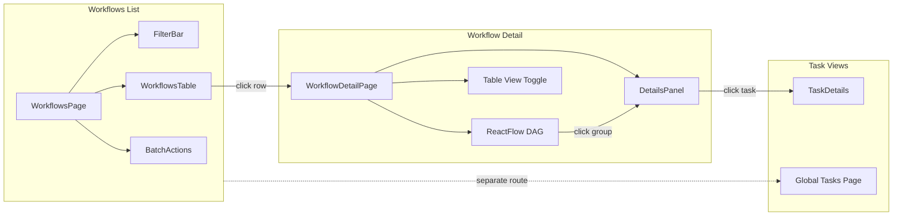

# Workflows Exploration Design Plan

## Architecture Overview

The workflows experience consists of three interconnected views:



---

## Backend API Reference

### Workflow List (`GET /api/workflow`)

| Parameter | Type | Description |
|-----------|------|-------------|
| `users` | string[] | Filter by submitters |
| `name` | string | Name search/prefix |
| `statuses` | WorkflowStatus[] | PENDING, RUNNING, WAITING, COMPLETED, FAILED, FAILED_* |
| `pools` | string[] | Filter by pool names |
| `tags` | string[] | Filter by workflow tags |
| `priority` | WorkflowPriority[] | HIGH, NORMAL, LOW |
| `submitted_before` | datetime | Date range filter |
| `submitted_after` | datetime | Date range filter |
| `app` | string | Filter by app name |
| `offset` / `limit` | int | Pagination |
| `order` | ASC/DESC | Sort order |
| `all_users` | bool | Include other users' workflows |
| `all_pools` | bool | Include all pools |

**Response Type**: `SrcServiceCoreWorkflowObjectsListResponse`

```typescript
interface WorkflowListEntry {
  name: string;            // Workflow name (unique ID)
  user: string;            // Submitted by
  workflow_uuid: string;   // UUID
  status: WorkflowStatus;  // 16 possible status values
  priority: string;        // HIGH/NORMAL/LOW
  pool?: string;           // Assigned pool
  submit_time: string;     // ISO timestamp
  start_time?: string;     // When execution started
  end_time?: string;       // When completed/failed
  queued_time: number;     // Seconds in queue
  duration?: number;       // Execution time in seconds
  overview: string;        // Workflow overview/description
  logs: string;            // Logs URL
  error_logs?: string;     // Error logs URL
  app_name?: string;       // App context (optional)
  app_owner?: string;      // App owner (optional)
  app_version?: number;    // App version (optional)
  dashboard_url?: string;  // Grafana dashboard link
  grafana_url?: string;    // Alternative Grafana link
}
```

### Workflow Detail (`GET /api/workflow/{name}`)

| Parameter | Type | Description |
|-----------|------|-------------|
| `verbose` | bool | Include full task details in groups |
| `skip_groups` | bool | Exclude group data (for header-only views) |

**Additional fields beyond list entry**:

```typescript
interface WorkflowQueryResponse extends WorkflowListEntry {
  uuid: string;
  submitted_by: string;
  cancelled_by?: string;
  spec: string;            // Workflow spec URL
  template_spec: string;   // Template spec
  events: string;          // Events URL
  parent_name?: string;    // Parent workflow (for retries)
  parent_job_id?: number;
  tags?: string[];
  exec_timeout?: number;
  queue_timeout?: number;
  outputs?: string;
  groups: GroupQueryResponse[];  // Task groups with dependencies
  backend?: string;
  plugins: WorkflowPlugins;
}
```

### Task List (`GET /api/task`)

| Parameter | Type | Description |
|-----------|------|-------------|
| `workflow_id` | string | Filter to single workflow |
| `statuses` | TaskGroupStatus[] | Task status filter |
| `nodes` | string[] | Filter by node name |
| `pools` | string[] | Filter by pool |
| `users` | string[] | Filter by workflow submitter |
| `started_after` | datetime | Task start time filter |
| `started_before` | datetime | Task start time filter |
| `aggregate_by_workflow` | bool | Group results by workflow |
| `summary` | bool | Return summary counts only |

### Status Enums

**WorkflowStatus** (16 values):
- Waiting: `PENDING`, `WAITING`
- Running: `RUNNING`
- Completed: `COMPLETED`
- Failed: `FAILED`, `FAILED_SUBMISSION`, `FAILED_SERVER_ERROR`, `FAILED_EXEC_TIMEOUT`, `FAILED_QUEUE_TIMEOUT`, `FAILED_CANCELED`, `FAILED_BACKEND_ERROR`, `FAILED_IMAGE_PULL`, `FAILED_EVICTED`, `FAILED_START_ERROR`, `FAILED_START_TIMEOUT`, `FAILED_PREEMPTED`

**TaskGroupStatus** (20 values):
- Waiting: `SUBMITTING`, `WAITING`, `PROCESSING`, `SCHEDULING`
- Running: `INITIALIZING`, `RUNNING`
- Completed: `COMPLETED`, `RESCHEDULED`
- Failed: `FAILED`, `FAILED_CANCELED`, `FAILED_SERVER_ERROR`, `FAILED_BACKEND_ERROR`, `FAILED_EXEC_TIMEOUT`, `FAILED_QUEUE_TIMEOUT`, `FAILED_IMAGE_PULL`, `FAILED_UPSTREAM`, `FAILED_EVICTED`, `FAILED_START_ERROR`, `FAILED_START_TIMEOUT`, `FAILED_PREEMPTED`

---

## Page 1: Workflows List (`/workflows`)

### Component Structure

```
/workflows/
├── page.tsx                           # Main page (follows pools pattern)
├── components/
│   ├── workflows-toolbar.tsx          # SmartSearch + batch actions
│   ├── table/
│   │   ├── workflows-data-table.tsx   # Virtualized table
│   │   └── workflow-column-defs.tsx   # TanStack column definitions
│   └── cells/
│       ├── status-cell.tsx            # Status badge (reuse DAG constants)
│       ├── duration-cell.tsx          # Live timer for RUNNING
│       ├── user-cell.tsx              # Avatar + name
│       ├── priority-cell.tsx          # Colored priority badge
│       └── time-cell.tsx              # Relative time with tooltip
├── lib/
│   ├── workflow-columns.ts            # Column config (like pool-columns.ts)
│   └── workflow-search-fields.ts      # SmartSearch field definitions
├── hooks/
│   ├── use-workflows-data.ts          # API + filtering (like use-pools-data)
│   └── use-workflow-polling.ts        # Optional real-time polling
└── stores/
    └── workflows-table-store.ts       # Zustand for table state
```

### Key Features

| Feature | Implementation |
|---------|----------------|
| **SmartSearch** | Chip-based filters with autocomplete for status, pool, user, priority, tags |
| **URL-synced state** | All filters in URL via nuqs for shareable deep links |
| **Virtualized table** | Handle 10k+ workflows efficiently |
| **Batch operations** | Select multiple → Cancel selected |
| **Real-time updates** | Polling with 5s/30s/manual toggle |
| **Quick actions** | Row hover: View Logs, Cancel, Retry, Copy Name |
| **Column customization** | Show/hide optional columns, reorder, resize |

### Column Definitions

| Column | Type | Sortable | Notes |
|--------|------|----------|-------|
| `name` | Link | ✓ | Navigate to detail, monospace |
| `status` | Badge | ✓ | Color-coded, 16 states → 4 categories |
| `user` | Text | ✓ | Avatar + username |
| `submit_time` | Relative | ✓ | "2h ago" with ISO tooltip |
| `duration` | Timer | ✓ | Live for RUNNING, formatted otherwise |
| `queue_time` | Duration | ✓ | Optional, shows wait time |
| `pool` | Text | ✓ | Pool name |
| `priority` | Badge | ✓ | HIGH (red), NORMAL, LOW (gray) |
| `app_name` | Text | ✗ | Optional column |
| `tags` | Chips | ✗ | Optional, scrollable if many |

### SmartSearch Fields

| Field | Syntax | Autocomplete Source |
|-------|--------|---------------------|
| `status` | `status:RUNNING` | WorkflowStatus enum |
| `pool` | `pool:my-pool` | Available pools |
| `user` | `user:john` | Workflow submitters |
| `priority` | `priority:HIGH` | HIGH, NORMAL, LOW |
| `tag` | `tag:training` | Workflow tags |
| `app` | `app:my-app` | App names |
| `name` | Free text | Recent workflow names |

---

## Page 2: Workflow Detail (`/workflows/[name]`)

### Component Structure

Leverages existing `reactflow-dag` components:

```
/workflows/[name]/
├── page.tsx                           # Detail page
├── components/
│   ├── workflow-header.tsx            # Name, status, actions
│   ├── view-toggle.tsx                # DAG | Table toggle
│   ├── workflow-dag.tsx               # Wraps ReactFlow DAG
│   └── workflow-table-view.tsx        # Collapsible grouped table
└── hooks/
    └── use-workflow-detail.ts         # Fetch single workflow
```

### Layout (DAG Primary)

```
┌─────────────────────────────────────────────────────────────────┐
│  [← Back] workflow-name-abc123    [●] RUNNING   [Cancel] [Logs] │
│                                                    [DAG │ Table] │
├─────────────────────────────────────────────────────────────────┤
│                                                                 │
│                         ReactFlow DAG                           │
│                  (click group to open panel)                    │
│                                                                 │
├─────────────────────────────────────────────────────────────────┤
│  ┌─────────────── Details Panel ──────────────┐                │
│  │  GroupDetails → TaskDetails navigation     │                │
│  │  (slides up/right on group/task click)     │                │
│  └────────────────────────────────────────────┘                │
└─────────────────────────────────────────────────────────────────┘
```

### Table View (Toggle)

When table view is active, show collapsible groups:

```
┌─────────────────────────────────────────────────────────────────┐
│ ▼ Group: fetch-data (3 tasks)                    [●] COMPLETED │
├─────────────────────────────────────────────────────────────────┤
│   Task Name   │ Status    │ Duration │ Node       │ Exit Code  │
│───────────────┼───────────┼──────────┼────────────┼────────────│
│   fetch-0     │ COMPLETED │ 2m 30s   │ dgx-a100-1 │ 0          │
│   fetch-1     │ COMPLETED │ 2m 45s   │ dgx-a100-2 │ 0          │
│   fetch-2     │ COMPLETED │ 2m 15s   │ dgx-a100-3 │ 0          │
├─────────────────────────────────────────────────────────────────┤
│ ▼ Group: train-model (8 tasks)                    [●] RUNNING  │
├─────────────────────────────────────────────────────────────────┤
│   Task Name      │ Status     │ Duration │ Node       │ ...    │
│──────────────────┼────────────┼──────────┼────────────┼────────│
│   train-shard-0  │ COMPLETED  │ 45m      │ dgx-h100-1 │ 0      │
│   train-shard-1  │ RUNNING    │ 32m...   │ dgx-h100-2 │ -      │
│   train-shard-2  │ WAITING    │ -        │ -          │ -      │
└─────────────────────────────────────────────────────────────────┘
```

### Reused Components from `reactflow-dag`

- `DAGProvider`, `useDAGState` - State management
- `GroupNode` - DAG node rendering
- `DetailsPanel` - Group/task details sidebar
- `GroupDetails`, `TaskDetails` - Panel content
- Status utilities, icons, styling from `constants.ts`

---

## Page 3: Global Tasks (`/tasks`)

### Use Cases

- "Show me all RUNNING tasks across my workflows"
- "Which tasks are on node dgx-a100-001?"
- "Filter by pool to see resource utilization"
- "Find all failed tasks in the last hour"

### Component Structure

```
/tasks/
├── page.tsx
├── components/
│   ├── tasks-toolbar.tsx
│   └── table/
│       ├── tasks-data-table.tsx
│       └── task-column-defs.tsx
├── lib/
│   └── task-columns.ts
└── hooks/
    └── use-tasks-data.ts
```

### Columns

| Column | Type | Notes |
|--------|------|-------|
| `task_name` | Text | Task name |
| `workflow_id` | Link | Navigate to workflow detail |
| `status` | Badge | Color-coded |
| `node` | Text | Filterable |
| `pool` | Text | Filterable |
| `start_time` | Relative | When task started |
| `duration` | Timer | Live for running |
| `resources` | Chips | GPU/CPU/Memory (if available) |

---

## Shared Components to Build

| Component | Location | Purpose |
|-----------|----------|---------|
| `StatusBadge` | `@/components/status-badge.tsx` | Unified status display for workflows/tasks |
| `DurationTimer` | `@/components/duration-timer.tsx` | Live-updating duration for running items |
| `WorkflowActions` | `@/components/workflow-actions.tsx` | Cancel, Retry, View Logs dropdown |
| `DateRangePicker` | `@/components/date-range-picker.tsx` | Date filter for SmartSearch |
| `BatchActionBar` | `@/components/batch-action-bar.tsx` | Floating bar for selected items |

---

## Implementation Phases

### Phase 1: Workflows List Page (Foundation)

- [ ] Create `/workflows/page.tsx` with basic table (replace stub)
- [ ] Implement `workflow-columns.ts` following `pool-columns.ts` pattern
- [ ] Create `use-workflows-data.ts` hook with API integration
- [ ] Add SmartSearch with status, pool, user filters
- [ ] Add pagination with URL sync via nuqs
- [ ] Implement status cell with color categories

### Phase 2: Workflow Detail Page

- [ ] Create `/workflows/[name]/page.tsx` route
- [ ] Build `workflow-header.tsx` with name, status, actions
- [ ] Integrate ReactFlow DAG from `reactflow-dag`
- [ ] Connect existing `DetailsPanel` for group/task navigation
- [ ] Add Cancel workflow action

### Phase 3: Table View + Advanced Features

- [ ] Add DAG/Table toggle button
- [ ] Build collapsible grouped table view
- [ ] Implement row selection for batch operations
- [ ] Add batch cancel action
- [ ] Add real-time polling with interval selector

### Phase 4: Global Tasks Page

- [ ] Create `/tasks/page.tsx`
- [ ] Implement cross-workflow task filtering
- [ ] Add node and pool filters
- [ ] Connect to workflow detail on click

---

## Files to Create/Modify

**New Files:**

```
external/ui-next/src/app/(dashboard)/workflows/
├── page.tsx                              # Replace existing stub
├── components/
│   ├── workflows-toolbar.tsx
│   ├── table/
│   │   ├── workflows-data-table.tsx
│   │   └── workflow-column-defs.tsx
│   └── cells/
│       ├── status-cell.tsx
│       ├── duration-cell.tsx
│       ├── priority-cell.tsx
│       └── time-cell.tsx
├── lib/
│   ├── workflow-columns.ts
│   └── workflow-search-fields.ts
├── hooks/
│   └── use-workflows-data.ts
└── stores/
    └── workflows-table-store.ts

external/ui-next/src/app/(dashboard)/workflows/[name]/
├── page.tsx
└── components/
    ├── workflow-header.tsx
    ├── view-toggle.tsx
    └── workflow-table-view.tsx

external/ui-next/src/app/(dashboard)/tasks/
├── page.tsx
├── components/
│   └── table/
│       └── tasks-data-table.tsx
├── lib/
│   └── task-columns.ts
└── hooks/
    └── use-tasks-data.ts

external/ui-next/src/components/
├── status-badge.tsx                      # Shared component
└── duration-timer.tsx                    # Shared component
```

**Reused from `reactflow-dag`:**

```
external/ui-next/src/app/(dashboard)/dev/workflow-explorer/reactflow-dag/
├── constants.ts                          # STATUS_STYLES, STATUS_CATEGORY_MAP
├── context.tsx                           # DAGProvider
├── hooks/
│   ├── use-dag-state.ts
│   └── use-resizable-panel.ts
├── components/
│   ├── GroupNode.tsx
│   ├── DetailsPanel/
│   │   ├── DetailsPanel.tsx
│   │   ├── GroupDetails.tsx
│   │   └── TaskDetails.tsx
│   └── GroupPanel/
│       ├── SmartSearch.tsx
│       └── TaskTable.tsx
└── utils/
    └── status.ts                         # getStatusCategory, getStatusIcon
```

---

## Design Decisions

### Why DAG-primary for detail view?

The DAG visualization provides:
1. **At-a-glance understanding** of workflow structure and progress
2. **Dependency awareness** - see which groups block others
3. **Quick failure identification** - red nodes stand out
4. **Familiar pattern** for workflow users

The table view toggle provides a denser view for:
1. **Bulk task inspection** - see all tasks without clicking each group
2. **Quick sorting/filtering** across all tasks
3. **Copy/paste** task details

### Why URL-synced filters?

- **Shareable links** - Send a colleague "all failed workflows in pool X"
- **Browser history** - Back button restores previous filter state
- **Bookmarkable views** - Save common filter combinations
- **Consistent with pools page** - Established pattern

### Why batch operations?

Common user need: "Cancel all my stuck workflows" requires:
1. Filter to status:RUNNING or status:PENDING
2. Select all visible
3. Cancel selected

Without batch: Click each workflow, Cancel, Confirm, Repeat 50 times.
