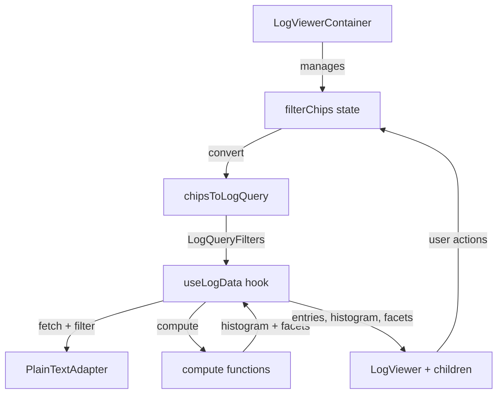

<!--
  Copyright (c) 2026, NVIDIA CORPORATION. All rights reserved.

  NVIDIA CORPORATION and its licensors retain all intellectual property
  and proprietary rights in and to this software, related documentation
  and any modifications thereto. Any use, reproduction, disclosure or
  distribution of this software and related documentation without an express
  license agreement from NVIDIA CORPORATION is strictly prohibited.
-->

# Log Viewer - Design & Implementation

> **Status**: Core implementation complete (W0-W4). This document tracks current state and remaining work.
> **Implementation**: `src/components/log-viewer/`, `src/lib/api/log-adapter/`

## Recent Design Changes (Jan 2026)

**Footer Redesign:**
1. ✅ **Button order updated:** Download → Wrap → Task (left-aligned), Refresh (right-aligned after entry count)
2. ✅ **Entry count added:** `M of N entries` display (right-aligned)
   - **M** = Filtered entries (after search + facets + levels + sources)
   - **N** = Total entries (after scope pre-filtering, before user filters)
   - Updates in real-time as filters change or logs stream
3. ✅ **Refresh button positioned:** Right side, after entry count

**Key principle:** Entry count provides context for how much of the log is visible after filtering.

---

## Table of Contents

1. [Current Implementation](#current-implementation)
2. [Outstanding Work](#outstanding-work-w5-production-integration)
3. [Timeline Features (Future)](#timeline-features-future)
4. [P1-P2 Features](#p1---should-have-not-started)
5. [Future Backend: Loki Migration](#future-backend-loki-migration)
6. [Testing Strategy](#testing-strategy)
7. [References](#references)

---

## Current Implementation

### Architecture Overview

The log viewer follows a **5-section vertical layout** with clear separation of concerns:

```
+------------------------------------------------------------------+
| [🔍 search logs...                                            ] | ← SearchBar
+------------------------------------------------------------------+
| [Level (1) ▾] [Task (2) ▾] [Source ▾]                            | ← FacetBar
+------------------------------------------------------------------+
|  ▃▅█▇▃▂▁▃▅▇█▆▄▂▃▅▇█▅▃▁▂▄▆█▇▄▂▃▅▇█▆▄▂▃▅▇█▅▃▁▂▄▆█▇▄▂▃▅             | ← Timeline
|  10:00        10:15        10:30        10:45                    |
+------------------------------------------------------------------+
| LogList (full width, virtualized)                                | ← Logs
|                                                                  |
+------------------------------------------------------------------+
| [⬇] [Wrap] [Task]                       [245 of 1,203 entries] [↻] | ← Footer
+------------------------------------------------------------------+
```

### Component Responsibilities

| Component | Purpose | Props | State |
|-----------|---------|-------|-------|
| **LogViewerContainer** | Data orchestration | workflowId, scope, devParams | Filter chips (local) |
| **LogViewer** | UI orchestration | entries, histogram, facets, chips | None (stateless) |
| **SearchBar** | Text search input | value, onChange | Local input (deferred) |
| **FacetBar** | Category filters | facets, selectedFilters, onFilterChange | None (controlled) |
| **TimelineHistogram** | Log density viz | buckets, intervalMs, onBucketClick | None (stateless) |
| **LogList** | Virtual log list | entries, isLiveMode, onScrollAway | Scroll position |
| **LogEntryRow** | Single entry | entry, isExpanded, wrapLines, showTask | None (controlled) |
| **Footer** | Actions + entry count | wrapLines, showTask, onDownload, onRefresh, filteredCount, totalCount | None (controlled) |
| **FacetDropdown** | Single facet UI | field, values, selected, onChange | Open state |

### Data Flow



**Flow explanation:**

1. **LogViewerContainer** manages filter chips in local state
2. **chipsToLogQuery()** converts chips to structured filters
3. **useLogData()** hook fetches all logs and applies filters:
   - Calls PlainTextAdapter to fetch raw logs
   - Calls filterEntries() with levels/tasks/sources/search
   - Calls computeHistogram() for timeline visualization
   - Calls computeFacets() for dropdown counts
4. **LogViewer** receives filtered data and renders UI sections
5. **User interactions** (SearchBar, FacetBar) update chips, triggering refetch

### Filtering Implementation

**Current approach:** Client-side filtering after fetching all logs.

```typescript
// 1. User types in SearchBar or selects facets
SearchBar: "error timeout" → chip { field: "text", value: "error timeout" }
FacetBar: selects Level=error → chip { field: "level", value: "error" }

// 2. Chips converted to filter params
chipsToLogQuery([...chips]) → {
  levels: ["error"],
  search: "error timeout"
}

// 3. useLogData applies filters
const { entries } = useLogData({
  workflowId,
  levels: ["error"],
  search: "error timeout"
});

// 4. PlainTextAdapter filters client-side
const allEntries = await fetchLogs(workflowId);
const filtered = filterEntries(allEntries, {
  levels: ["error"],
  search: "error timeout"
});
```

**Filter operators:**
- Same field, multiple values: **OR** (level=error OR level=warn)
- Different fields: **AND** (level=error AND search="timeout")

### Live Mode (Streaming)

**Current implementation:** Explicit `isLiveMode` boolean in Zustand store.

```typescript
// Store state
interface LogViewerState {
  isLiveMode: boolean;  // Explicit toggle
  // ...
}

// LogViewerContainer wires up streaming
const isLiveMode = useLogViewerStore((s) => s.isLiveMode);
const { entries: liveEntries } = useLogTail({
  workflowId,
  enabled: enableLiveMode && isLiveMode,  // Conditional streaming
});

// Merged with query data
const combinedEntries = useCombinedEntries(queryEntries, liveEntries);
```

**Behavior:**
- When `isLiveMode = true`: `useLogTail` establishes HTTP streaming connection
- New entries appended to list in real-time
- User scrolling away from bottom pauses live mode (sets `isLiveMode = false`)
- Auto-scroll when at bottom

**Alternative design (not implemented):** Implicit streaming from time range end.
See [Timeline Features](#timeline-features-future) for proposed approach.

### SearchBar

**Purpose:** Free-text search input for filtering logs.

```
+------------------------------------------------------------------+
| [🔍 search logs...                                            ] |
+------------------------------------------------------------------+
```

**Behavior:**
- **Input:** Text search with deferred value (useDeferredValue) to avoid blocking typing
- **Search conversion:** Text input becomes a filter chip with `field: "text"`

**Example flow:**
```typescript
// User types "error timeout"
SearchBar input: "error timeout"
  ↓
Creates chip: { field: "text", value: "error timeout" }
  ↓
Footer shows: [12 of 2,450 entries]
               ↑          ↑
               M (filtered)  N (total)
```

### Histogram

**Current state:** Visualization only, no time filtering.

```typescript
// TimelineHistogram displays data but doesn't control time range
<TimelineHistogram
  buckets={histogram.buckets}
  intervalMs={histogram.intervalMs}
  onBucketClick={(bucket) => {
    console.log("Bucket clicked:", bucket);
    // TODO: Implement time range filtering
  }}
  onRangeSelect={(start, end) => {
    // TODO: Not implemented - would set time range
  }}
/>
```

**What works:**
- Stacked bars colored by log level (error, warn, info, etc.)
- Tooltips showing counts per level
- Compact mode for small spaces
- Time axis labels

**What's missing:**
- No time range filtering
- No preset buttons (All, First 5m, Last 15m, Last 1h)
- No drag-to-select interaction
- No visual selection overlay

### Footer

**Purpose:** Action buttons and entry count display.

**Layout:** Left-aligned buttons, right-aligned entry count.

```
+------------------------------------------------------------------+
| [⬇] [Wrap] [Task]                       [245 of 1,203 entries] [↻] |
+------------------------------------------------------------------+
```

**Components:**

| Button | Icon | Action | Position | When Visible |
|--------|------|--------|----------|--------------|
| **Download** | ⬇ (Download) | Export filtered logs as text file | Left | Always |
| **Wrap** | Toggle | Enable/disable line wrapping | Left | Always |
| **Task** | Toggle | Show/hide task name suffix on entries | Left | Multi-task view only |
| **Refresh** | ↻ (RefreshCw) | Manually refetch logs from backend | Right (after count) | Always |

**Entry Count (right-aligned, before Refresh):**
- **Format:** `M of N entries` (with locale number formatting)
- **M** = Number of entries matching current filters (search + facets + levels + sources)
- **N** = Total number of entries in memory (after scope pre-filtering, before user filters)
- **Updates:** Real-time as filters change or new logs stream in

**Entry Count Logic:**

| Scenario | Display | Explanation |
|----------|---------|-------------|
| No filters active | `1,203 of 1,203 entries` | M = N (all entries visible) |
| Search active | `245 of 1,203 entries` | M = filtered count, N = total |
| Facet filters active | `89 of 1,203 entries` | M = filtered count, N = total |
| Search + facets | `12 of 1,203 entries` | M = combined filter result, N = total |
| Live streaming | Updates both M and N | Both increase as new logs arrive |
| Task scope | `450 of 450 entries` | N = only this task's logs (pre-filtered by scope) |
| Workflow scope | `1,203 of 1,203 entries` | N = all workflow logs (pre-filtered by scope) |

**Implementation notes:**
- `totalCount` (N) = Total entries after scope filtering but before user filters
- `filteredCount` (M) = Entries after applying all user filters (search, facets, levels, sources)
- Both counts update reactively when:
  - New logs stream in via live mode
  - User adds/removes filters
  - User changes scope (task vs workflow view)
- Format with `toLocaleString()` for readability (e.g., `1,203` not `1203`)

**Button behavior:**
1. **Download** (left): Exports only the filtered entries (M), respects active filters
2. **Wrap** (left): Toggles `wrapLines` in Zustand store, affects all LogEntryRow components
3. **Task** (left): Toggles `showTask` in Zustand store, shows/hides task suffix in log messages
4. **Refresh** (right): Clears cache and refetches from backend (useful when live mode is off)

### Directory Structure (Actual)

```
src/
├── lib/api/log-adapter/
│   ├── index.ts                              ✅ Exports, adapter factory
│   ├── types.ts                              ✅ LogEntry, LogQuery, etc.
│   ├── constants.ts                          ✅ Log levels, field configs
│   ├── query-keys.ts                         ✅ React Query key factory
│   ├── adapters/
│   │   ├── index.ts                          ✅
│   │   ├── plain-text-adapter.ts             ✅ Current backend
│   │   ├── log-parser.ts                     ✅ Parse OSMO log format
│   │   ├── compute.ts                        ✅ filterEntries, computeHistogram, computeFacets
│   │   └── loki-adapter.ts                   🔲 Future
│   └── hooks/
│       ├── index.ts                          ✅
│       ├── use-log-adapter.tsx               ✅ React context
│       ├── use-log-data.ts                   ✅ Unified data hook
│       └── use-log-tail.ts                   ✅ HTTP streaming
│
└── components/log-viewer/
    ├── index.ts                              ✅ Public exports
    ├── lib/
    │   ├── constants.ts                      ✅ UI constants (ROW_HEIGHT, etc.)
    │   ├── level-utils.ts                    ✅ Level badges/colors
    │   ├── chips-to-log-query.ts             ✅ Chip converter
    │   ├── use-combined-entries.ts           ✅ Merge query + live data
    │   └── use-incremental-flatten.ts        ✅ Date separators for virtual list
    ├── store/
    │   └── log-viewer-store.ts               ✅ Zustand (expandedEntryIds, isLiveMode, wrapLines, showTask)
    └── components/
        ├── LogViewer.tsx                     ✅ Main orchestrator (5 sections)
        ├── LogViewerContainer.tsx            ✅ Data fetching + filter state
        ├── LogList.tsx                       ✅ TanStack Virtual list with date separators
        ├── LogEntryRow.tsx                   ✅ Single entry with expand/collapse
        ├── SearchBar.tsx                     ✅ Text search with deferred value
        ├── FacetBar.tsx                      ✅ Renders FacetDropdown array
        ├── FacetDropdown.tsx                 ✅ Popover with checkboxes
        ├── TimelineHistogram.tsx             ✅ SVG bars + compact mode
        ├── Footer.tsx                        ✅ Display toggles + actions
        └── LogViewerSkeleton.tsx             ✅ Loading skeleton
```

### State Management

| State | Location | Persistence | Purpose |
|-------|----------|-------------|---------|
| **Filter chips** | LogViewerContainer (useState) | None | Current filters |
| **Expanded entries** | Zustand store (Set) | None | Which rows are expanded |
| **Live mode** | Zustand store (boolean) | None | Streaming on/off |
| **Wrap lines** | Zustand store (boolean) | None | Text wrapping toggle |
| **Show task** | Zustand store (boolean) | None | Task suffix visibility |
| **Log data** | React Query cache | 30s | entries, histogram, facets |

**Key insight:** No URL state yet. Filters could be synced to URL for sharing, but currently not needed.

### Performance Characteristics

**Current numbers** (tested with 50K entries):

| Operation | Time | Notes |
|-----------|------|-------|
| Initial fetch + parse | ~100ms | PlainTextAdapter parses plain text |
| Client-side filtering | ~5ms | filterEntries() with O(n) array filter |
| Histogram computation | ~3ms | computeHistogram() with 50 buckets |
| Facet computation | ~2ms | computeFacets() with 4 fields |
| Virtual list render | ~10ms | TanStack Virtual with 50K items |
| Filter change response | ~20ms | Recompute all derived data |

**Acceptable for <100K entries.** Loki backend will handle server-side filtering for larger volumes.

---

## Outstanding Work (W5: Production Integration)

### P0 - Must Complete

#### 1. Production Integration

**Files to modify:**

| File | Task | Description |
|------|------|-------------|
| `TaskDetails.tsx` | Add LogViewer to Logs tab | Replace placeholder with `<LogViewerContainer workflowId={...} scope="task" />` |
| `WorkflowDetails.tsx` | Add LogViewer to Logs tab | Add `<LogViewerContainer workflowId={...} scope="workflow" />` |

**Implementation notes:**
- Use `<LogViewerContainer>` (handles all data fetching)
- Pass appropriate `scope` prop
- Workflow scope shows all tasks; task scope shows single task only

#### 2. Keyboard Navigation

**Vim-style shortcuts to implement:**

| Key | Action | Scope |
|-----|--------|-------|
| `j` / `↓` | Next entry | List focused |
| `k` / `↑` | Previous entry | List focused |
| `Enter` | Expand/collapse entry | Entry selected |
| `/` | Focus search | Anywhere |
| `Escape` | Clear search / close expanded | Context-dependent |
| `G` | Jump to bottom (latest) | List focused |
| `g` `g` | Jump to top (oldest) | List focused |
| `c` | Copy selected entry | Entry selected |
| `l` | Copy link to entry | Entry selected |
| `t` | Toggle live mode | Anywhere |

**Implementation approach:**
- Add keyboard event handlers to `LogList.tsx`
- Track focused entry index in store
- Use roving tabindex pattern (accessibility requirement)
- Prevent conflicts with browser shortcuts

#### 3. Accessibility Improvements

**Required ARIA attributes:**

```tsx
// LogList.tsx
<div
  role="log"
  aria-label="Workflow logs"
  aria-live="polite"       // Announce new entries when in live mode
  aria-busy={isStreaming}
>
  {entries.map((entry, i) => (
    <div
      role="article"
      aria-posinset={i + 1}
      aria-setsize={entries.length}
      tabIndex={i === focusedIndex ? 0 : -1}  // Roving tabindex
      aria-expanded={expandedIds.has(entry.id)}
    >
      {/* entry content */}
    </div>
  ))}
</div>
```

**Screen reader announcements:**

```tsx
const { announcer } = useServices();

useEffect(() => {
  if (newEntriesCount > 0 && isLiveMode) {
    announcer.announce(`${newEntriesCount} new log entries`, 'polite');
  }
}, [newEntriesCount, isLiveMode, announcer]);
```

**Tasks:**
- Add proper ARIA labels to all interactive elements
- Implement roving tabindex for keyboard navigation
- Add screen reader announcements for dynamic updates
- Test with VoiceOver / NVDA
- Focus management on expand/collapse

#### 4. Performance Testing

**Benchmarks to establish:**

| Metric | Target | Test Scenario |
|--------|--------|---------------|
| Initial render | < 500ms | 100K entries |
| Filter response | < 500ms | Level filter on 100K entries |
| Scroll performance | 60fps | Virtualized scroll through 100K entries |
| Memory usage | < 100MB | 100K entries loaded |
| Live streaming | Smooth updates | 100 entries/sec incoming |

**Test implementation:**
- Create performance test suite in `log-viewer.perf.test.ts`
- Use `?log_scenario=high-volume` in experimental page
- Measure with Chrome DevTools Performance tab
- Profile memory with Heap Snapshots
- Document findings and optimizations

---

## Timeline Features (Future)

> **Status**: Design complete, partial implementation exists, UIcontrols and time filtering not implemented yet.

### Core Concept: Workflow-Bounded Logs

Unlike generic log viewers, our logs are **workflow-bounded**:

- Logs only exist after a workflow/task starts
- Logs end when the workflow/task terminates (or continue to NOW if running)
- There is no concept of "unbounded" time selection

This fundamentally shapes the UX: we don't need a generic date picker. We need a **workflow-aware time selector**.

### Workflow Lifecycle States

| State | start_time | end_time | Log Availability |
|-------|-----------|----------|------------------|
| Pending | undefined | undefined | No logs yet - show placeholder |
| Running | set | undefined | Logs from start_time to NOW |
| Terminated | set | set | Fixed log window: start_time to end_time |

**Safe bounds** (guaranteed to encompass all possible logs):
- **Lower bound**: `workflow.submit_time` (strictly before first log)
- **Upper bound**: `workflow.end_time ?? NOW` (strictly after last log)

### Backend Considerations

**Redis Stream Capping:**

Logs are stored in Redis Streams with `MAXLEN` (default: 10,000 lines). This means:
- For long-running workflows, early logs may be evicted
- `workflow.start_time` is not necessarily the earliest *available* log
- However, for time bounds, we use "safe bounds" not "available bounds"

**Log Streaming:**
- `useLogTail` streams new logs via HTTP SSE
- Receives `END_FLAG` when workflow terminates
- This provides real-time notification of workflow completion

### Proposed Timeline UI

**The histogram IS the time picker:**

Instead of a separate date/time picker popover, the histogram serves dual purposes:
1. **Visualization**: Shows log density over time
2. **Selection**: Drag to select time range directly on the visualization

```
[All] [First 5m] [Last 15m] [Last 1h]                       10:30 - NOW
+------------------------------------------------------------------------+
|    ▃▅█▇▃▂▁▃▅▇█▆▄▂▃▅▇█▅▃▁▂▄▆█▇▄▂▃▅▇█▆▄▂▃▅▇█▅▃▁▂▄▆█▇▄▂▃▅               |
|    |<-------------- [===========|=========] ----------------->| NOW    |
|  10:30                       selection                        11:45    |
+------------------------------------------------------------------------+
```

**Why this approach:**

1. **Context**: Users see log density while selecting - can target spikes/gaps
2. **Direct manipulation**: No abstraction layer between data and selection
3. **No modal interruption**: Inline, always-visible control
4. **Familiar pattern**: Similar to video timeline scrubbing
5. **Less UI**: No separate picker component needed

### Time Range Presets

**Presets are relative to workflow, not calendar:**

| Preset | Meaning |
|--------|---------|
| All | Full workflow duration |
| First 5m | First 5 minutes from start_time |
| Last 15m | Last 15 minutes (from NOW or end_time) |
| Last 1h | Last hour (from NOW or end_time) |

### Histogram Selection Behavior

**Selection overlay:**
- Semi-transparent highlight over selected range
- Bars outside selection are dimmed (opacity ~0.3), not hidden
- Visual drag handles at selection edges

**Interactions:**

| Action | Result |
|--------|--------|
| Drag handle | Adjust start/end of selection |
| Click bar | Zoom to that bucket's time range |
| Click preset | Apply preset range |

**Clamping:**
Selection is always clamped to workflow bounds:
- Cannot select before workflow.start_time
- Cannot select after workflow.end_time (or NOW if running)

### Implicit Streaming State (Proposed Design Conflict)

**Timeline design proposes:** Streaming is implicit from time range end.

| Time Range End | Streaming | Behavior |
|---------------|-----------|----------|
| `NOW` (undefined) | Active | New logs added to list |
| Fixed time | Inactive | Historical view |

**Current implementation:** Explicit `isLiveMode` toggle in store (see [Live Mode](#live-mode-streaming) section).

**Design conflict to resolve:**

| Aspect | Current (Explicit) | Proposed (Implicit) |
|--------|-------------------|---------------------|
| Control | `isLiveMode` boolean in store | Derived from `end` time parameter |
| User action | Toggle button or auto-pause on scroll | Select time range (historical = stop streaming) |
| State | Explicit store field | No explicit field needed |
| Clarity | Clear on/off state | Less obvious to users |

**Decision needed:**
- **Keep explicit** for clarity and current working state?
- **Migrate to implicit** for simplicity as timeline proposes?

**Recommendation:** Keep explicit `isLiveMode` initially. Timeline range selector can SET `isLiveMode` when user selects "NOW" vs historical time, but the state remains explicit internally.

### Implementation Plan

**What exists:**
- TimelineHistogram component (visualization ready)
- LogQuery supports start/end time parameters
- filterEntries() supports time range filtering

**What's needed:**

1. **Add TimeRangeBar component** above histogram:
   ```tsx
   <div className="flex items-center justify-between px-3 py-2">
     {/* Left: Presets */}
     <div className="flex gap-2">
       <Button variant={range === 'all' ? 'secondary' : 'ghost'} size="sm">All</Button>
       <Button variant={range === 'first-5m' ? 'secondary' : 'ghost'} size="sm">First 5m</Button>
       <Button variant={range === 'last-15m' ? 'secondary' : 'ghost'} size="sm">Last 15m</Button>
       <Button variant={range === 'last-1h' ? 'secondary' : 'ghost'} size="sm">Last 1h</Button>
     </div>
     {/* Right: Current range */}
     <span className="text-sm text-muted-foreground">
       {formatTime(start)} - {end ? formatTime(end) : 'NOW'}
     </span>
   </div>
   ```

2. **Wire up histogram selection:**
   - Implement onRangeSelect handler in TimelineHistogram
   - Add drag handles to bars
   - Add selection overlay with dimming
   - Pass selected range up to LogViewerContainer

3. **Add workflow metadata to LogViewerContainer:**
   ```tsx
   interface LogViewerContainerProps {
     workflowId: string;
     workflowStartTime?: Date;
     workflowEndTime?: Date;
     workflowStatus?: 'pending' | 'running' | 'terminated';
   }
   ```

4. **Manage time range state in LogViewerContainer:**
   ```tsx
   const [timeRange, setTimeRange] = useState<{ start?: Date; end?: Date }>({
     start: undefined, // Default: workflow start
     end: undefined,   // Default: NOW (streaming)
   });

   // Pass to useLogData
   const { entries } = useLogData({
     workflowId,
     start: timeRange.start,
     end: timeRange.end,
     // ... other filters
   });
   ```

5. **Coordinate with live mode:**
   ```tsx
   // When user selects historical time, disable streaming
   useEffect(() => {
     if (timeRange.end !== undefined) {
       setLiveMode(false); // Stop streaming
     } else {
       setLiveMode(true);  // Enable streaming (end = NOW)
     }
   }, [timeRange.end]);
   ```

---

## P1 - Should Have (Not Started)

### Context Expansion

**Feature:** Show N lines before/after a selected log entry for debugging context.

**Design:**

```
┌─────────────────────────────────────────────────────────┐
│ [▼] 10:00:03 ERROR Pod crashed: OOM killed              │
│     ┌───────────────────────────────────────────────┐   │
│     │ CONTEXT (±5 lines):                            │   │
│     │ 09:59:58 INFO  Checkpoint saved                │   │
│     │ 09:59:59 WARN  Memory pressure detected        │   │
│     │ 10:00:01 INFO  Allocating tensors...           │   │
│     │ 10:00:02 WARN  Memory usage at 95%             │   │
│     │ 10:00:03 ERROR Pod crashed: OOM killed    ← selected
│     │ 10:00:04 INFO  Restarting pod...               │   │
│     │ 10:00:05 INFO  Pod started                     │   │
│     └───────────────────────────────────────────────┘   │
│     [Show more context ▼]                              │
└─────────────────────────────────────────────────────────┘
```

**Implementation:**
- Add context controls to expanded `LogEntryRow`
- Fetch surrounding entries by timestamp range
- Cache context to avoid refetches
- Add "Show more" to expand context window

### Copy Shareable Link

**Feature:** Generate URL with entry ID for deep linking.

**Implementation:**
- Add `entry` param to URL schema: `?entry=<id>`
- On load, if `entry` param exists:
  - Scroll to that entry
  - Highlight it briefly
  - Focus it for keyboard nav
- Copy button generates full URL with current filters + entry ID

---

## P2 - Nice to Have (Future Enhancements)

### LogQL-Style Query Language

**Feature:** Support structured query syntax like Loki's LogQL.

**Examples:**
```
{level="error"} |= "timeout"
{task="data-prep"} | json | memory_usage > 90
{source="stderr"} !~ "deprecated warning"
```

**Implementation notes:**
- Parse query string into AST
- Convert to filters that adapter understands
- Provide autocomplete for field names and operators
- Show query syntax help in UI

**Depends on:** Loki backend (for full query power) or enhanced client-side filtering

### Saved Queries

**Feature:** Save frequently used filter combinations.

**Design:**
- Add "Save query" button in SearchBar
- Store in user preferences (backend API)
- Quick access dropdown: "Recent queries", "Saved queries"
- Share queries via URL or export JSON

### Pattern Detection

**Feature:** Automatically group similar log messages.

**Example:**
```
Pattern: "Pod {name} on node {node} failed with exit code {code}"
Instances: 127 occurrences
  - Pod train-worker-0 on node gpu-001 failed with exit code 137
  - Pod train-worker-1 on node gpu-002 failed with exit code 137
  - ...
```

**Implementation:**
- Run clustering algorithm on log messages
- Extract variable parts as parameters
- Show patterns in facets sidebar
- Click pattern to see all instances

**Complexity:** High - requires NLP/ML for good results

**Backend dependency:** Could run client-side or server-side, but works better with Loki's aggregated data at scale.

### Trace Correlation

**Feature:** Link logs to distributed traces when trace IDs are present.

**Requirements:**
- Logs must include trace ID in message or metadata
- Trace viewer must be available in UI
- Add "View trace" link in log entry actions

**Integration:**
- Parse trace IDs from log messages or labels
- Link to trace viewer page with trace ID
- Show trace timeline overlay on histogram

**Backend dependency:** None - works with any backend as long as trace IDs are in logs.

---

## Future Backend: Loki Migration

> **Status**: Design complete, implementation deferred until Loki is deployed.
> **Current**: PlainTextAdapter fetches all logs, filters client-side.
> **Future**: LokiAdapter uses LogQL for server-side filtering.

### Migration Path

**Phase 1: Enable Loki Adapter (when ready)**

1. Add `LokiAdapter` implementation:

```typescript
// src/lib/api/log-adapter/adapters/loki-adapter.ts

export class LokiAdapter implements LogAdapter {
  async query(query: LogQuery): Promise<LogQueryResult> {
    // Convert LogQuery to Loki query_range API call
    const logql = buildLogQL(query);
    const response = await fetch(`/api/loki/query_range`, {
      method: 'POST',
      body: JSON.stringify({ query: logql, start, end, limit }),
    });
    // Parse Loki response to LogEntry[]
    return parseLokiResponse(response);
  }

  async histogram(query: LogQuery): Promise<HistogramResult> {
    // Use Loki's instant query for metric aggregation
    const logql = `count_over_time(${buildLogQL(query)}[1m])`;
    // ... fetch and parse
  }

  async tail(query: LogQuery): AsyncIterable<LogEntry> {
    // WebSocket connection to Loki's tail endpoint
    const ws = new WebSocket(`/api/loki/tail?query=${encodeURIComponent(logql)}`);
    // Yield entries as they stream in
  }

  capabilities(): AdapterCapabilities {
    return {
      serverSideFiltering: true,
      fullTextSearch: true,
      regexSearch: true,
      streaming: true,
      histogram: true,
    };
  }
}
```

2. Update adapter factory:

```typescript
// src/lib/api/log-adapter/index.ts

export function createLogAdapter(): LogAdapter {
  // Check feature flag or environment
  if (process.env.NEXT_PUBLIC_LOKI_ENABLED === 'true') {
    return new LokiAdapter();
  }
  return new PlainTextAdapter();
}
```

3. **Zero UI changes required** - all components work with `LogAdapter` interface

**Phase 2: Progressive Enhancement**

Once Loki is available:
- Enable regex search (not supported by PlainTextAdapter)
- Add query language autocomplete (LogQL syntax)
- Improve histogram granularity (Loki has native aggregation)
- Faster filtering (server-side instead of client-side)

### Why This Architecture Works

| Aspect | Current (PlainText) | Future (Loki) | UI Impact |
|--------|---------------------|---------------|-----------|
| **Filtering** | Client-side in adapter | Server-side (LogQL) | None - same `LogQuery` |
| **Search** | String matching | Full-text + regex | Enable regex UI when capability detected |
| **Histogram** | Computed client-side | Native Loki metrics | None - same `HistogramResult` |
| **Tailing** | HTTP streaming | WebSocket | None - both yield `LogEntry` |

**Key insight:** UI components receive `LogEntry[]` and don't know/care about backend format.

---

## Key Decisions

| Decision | Choice | Rationale |
|----------|--------|-----------|
| Component type | Client component | Interactive, state-heavy |
| Virtual scroll | TanStack Virtual | Required for >50 items |
| Layout | 5-section vertical | SearchBar → FacetBar → Timeline → Logs → Footer |
| Backend (current) | Plain text HTTP streaming | Simple, works with existing API |
| Backend (future) | Loki | Scalable log aggregation |
| Filtering | Client-side (current) | Simple for <100K entries |
| Histogram | Always visible | Critical for time navigation |
| Histogram interaction | Click-to-zoom (basic) | Will add drag-to-select |
| Time filtering | Not exposed yet | Will add presets + workflow bounds |
| Streaming state | Explicit `isLiveMode` | Consider implicit from time range |
| Scope | Prop-based | Task panel → `scope="task"` shows task logs only |
| State persistence | None | Cheap to refetch |
| Navigation | Keyboard + mouse | Vim-style shortcuts for power users |

---

## Testing Strategy

### Unit Tests
- `level-utils.test.ts` ✅ Implemented
- `chips-to-log-query.test.ts` ✅ Implemented
- `use-incremental-flatten.test.ts` ✅ Implemented
- TODO: Add tests for keyboard navigation handlers
- TODO: Add tests for accessibility features

### Integration Tests
- TODO: Test LogViewerContainer data flow
- TODO: Test filter chip → query conversion
- TODO: Test live mode pause/resume
- TODO: Test error handling

### E2E Tests
- TODO: Workflow logs tab shows logs
- TODO: Task logs tab shows filtered logs
- TODO: Search and filter work together
- TODO: Keyboard navigation works
- TODO: Screen reader announces updates

### Performance Tests
- TODO: 100K entry rendering benchmark
- TODO: Filter response time
- TODO: Scroll FPS measurement
- TODO: Memory usage profiling

---

## Questions & Future Considerations

### Open Questions

1. **URL State:** Should filter state be synced to URL for shareability?
   - Pros: Deep linking, browser back/forward, sharing filtered views
   - Cons: Complexity, URL pollution
   - Decision: Defer until user feedback indicates it's needed

2. **Pagination:** Current design has no pagination (loads all logs).
   - Concern: What if workflow has 1M+ log entries?
   - Mitigation: Loki backend will handle this server-side
   - Current: Acceptable for typical workflows (<100K entries)

3. **Retention:** How long are logs kept?
   - Backend consideration, not UI concern
   - UI should handle "logs expired" gracefully

4. **Streaming State:** Explicit toggle vs implicit from time range?
   - Current: Explicit `isLiveMode` boolean
   - Timeline design: Implicit from `end === undefined`
   - Needs resolution: which approach is better?

### Future Features (Not Prioritized)

- Export to external log viewers (e.g., Datadog, Splunk)
- Log annotations (add notes to specific entries)
- Collaborative features (share highlighted entries with team)
- AI-powered error summarization
- Integration with alerting system
- Custom log formatters (e.g., JSON pretty-print)

---

## References

- **Implementation**: `src/components/log-viewer/`
- **Adapter**: `src/lib/api/log-adapter/`
- **Experimental Page**: `src/app/(dashboard)/experimental/log-viewer/`
- **Mock Scenarios**: MSW handlers for testing
- **UI Rules**: `.cursor/rules/ui.mdc`
