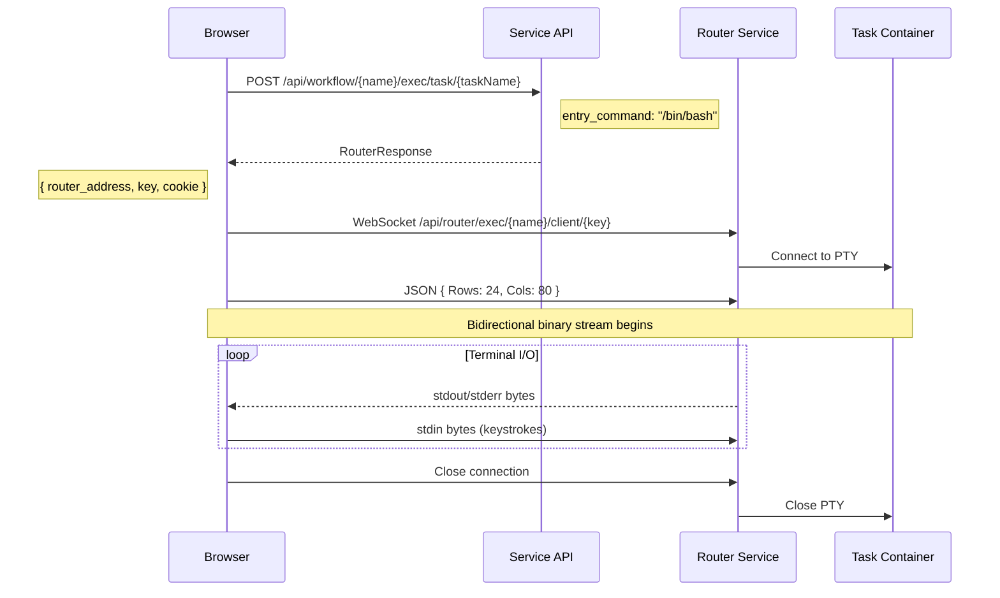
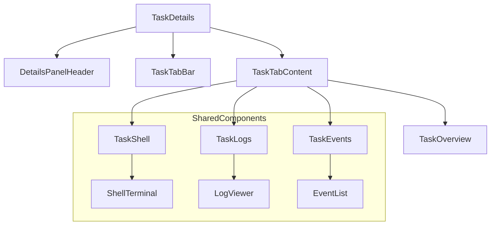
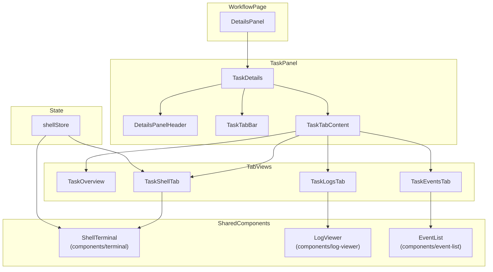

# Task Shell Experience - Design Document

> Interactive terminal access to running workflow tasks

## Status: Design Phase

---

## Confirmed Design Decisions

| Decision | Choice | Rationale |
|----------|--------|-----------|
| **Layout** | Integrated panel | Shell embedded in task details, maintains workflow context |
| **Session Model** | One shell per task | Multiple tasks can have shells simultaneously |
| **Default Shell** | `/bin/bash` | Quick-switch dropdown for sh, zsh, custom |
| **Session Lifecycle** | Page-bound | Warn user before navigation if sessions active |
| **Terminal Theme** | Always dark | Traditional terminal aesthetic, high contrast for readability |

---

## Visual Design

### Design Philosophy

The terminal should feel like a **professional tool embedded in a modern UI** - not a jarring retro throwback, but not sterile either. Think VS Code's integrated terminal: dark, focused, but harmonious with its surroundings.

### Terminal Container

```
┌─────────────────────────────────────────────────────────────────┐
│ ░░░░░░░░░░░░░░░░░░░░░░░░░░░░░░░░░░░░░░░░░░░░░░░░░░░░░░░░░░░░░░░ │  ← Subtle header bar
│ ▓▓▓▓▓▓▓▓▓▓▓▓▓▓▓▓▓▓▓▓▓▓▓▓▓▓▓▓▓▓▓▓▓▓▓▓▓▓▓▓▓▓▓▓▓▓▓▓▓▓▓▓▓▓▓▓▓▓▓▓▓▓▓ │
│ ▓  root@train-model:/workspace#                               ▓ │  ← Terminal area
│ ▓  $ nvidia-smi                                               ▓ │
│ ▓  GPU 0: A100-SXM4-80GB                                      ▓ │
│ ▓  Memory: 76542MiB / 81920MiB                                ▓ │
│ ▓  $ _                                                        ▓ │
│ ▓▓▓▓▓▓▓▓▓▓▓▓▓▓▓▓▓▓▓▓▓▓▓▓▓▓▓▓▓▓▓▓▓▓▓▓▓▓▓▓▓▓▓▓▓▓▓▓▓▓▓▓▓▓▓▓▓▓▓▓▓▓▓ │
│ ░░░░░░░░░░░░░░░░░░░░░░░░░░░░░░░░░░░░░░░░░░░░░░░░░░░░░░░░░░░░░░░ │  ← Status bar
└─────────────────────────────────────────────────────────────────┘
     │                                                         │
     └── 8px padding, rounded-md corners ──────────────────────┘
```

**Container Styling:**
- **Background**: `zinc-950` (#09090b) - matches sidebar/table dark surfaces
- **Border**: `1px solid zinc-800` - subtle definition without harsh edges
- **Border radius**: `--radius-md` (0.5rem) - consistent with card components
- **Shadow**: Subtle inset shadow to create depth
- **Focus ring**: `--dag-selection-ring` when terminal is focused

### Color Palette

**Always-dark terminal** (regardless of system theme):

```css
:root {
  /* Terminal Surface */
  --terminal-bg: #09090b;           /* zinc-950 */
  --terminal-bg-selection: #3f3f46; /* zinc-700 */

  /* Terminal Text */
  --terminal-fg: #e4e4e7;           /* zinc-200 */
  --terminal-fg-dim: #71717a;       /* zinc-500 */

  /* Cursor */
  --terminal-cursor: #76b900;       /* NVIDIA green */
  --terminal-cursor-accent: #9ed439; /* NVIDIA green light */
}
```

**ANSI Color Palette** (inspired by One Dark Pro with NVIDIA accent):

| Color | Normal | Bright | Usage |
|-------|--------|--------|-------|
| **Black** | `#18181b` | `#3f3f46` | Background variants |
| **Red** | `#f87171` | `#fca5a5` | Errors, failed status |
| **Green** | `#76b900` | `#9ed439` | Success, NVIDIA brand |
| **Yellow** | `#facc15` | `#fde047` | Warnings, prompts |
| **Blue** | `#60a5fa` | `#93c5fd` | Info, directories |
| **Magenta** | `#c084fc` | `#d8b4fe` | Executables |
| **Cyan** | `#22d3ee` | `#67e8f9` | Links, special |
| **White** | `#e4e4e7` | `#fafafa` | Default text |

### Typography

```css
.terminal {
  font-family: var(--font-geist-mono), "SF Mono", Consolas, monospace;
  font-size: 13px;
  line-height: 1.5;
  letter-spacing: 0;
  font-feature-settings: "liga" 1, "calt" 1; /* Enable ligatures */
}
```

**Why Geist Mono?**
- Matches the rest of the UI's monospace usage
- Excellent legibility at small sizes
- Optional ligatures for operators (`=>`, `!=`, etc.)
- Designed for terminal/code use

### xterm.js Theme Configuration

```typescript
const terminalTheme: ITheme = {
  // Background & Foreground
  background: '#09090b',
  foreground: '#e4e4e7',

  // Cursor
  cursor: '#76b900',
  cursorAccent: '#09090b',

  // Selection
  selectionBackground: '#3f3f4680', // 50% opacity
  selectionForeground: undefined,   // Keep text color
  selectionInactiveBackground: '#27272a80',

  // ANSI Colors (normal)
  black: '#18181b',
  red: '#f87171',
  green: '#76b900',
  yellow: '#facc15',
  blue: '#60a5fa',
  magenta: '#c084fc',
  cyan: '#22d3ee',
  white: '#e4e4e7',

  // ANSI Colors (bright)
  brightBlack: '#3f3f46',
  brightRed: '#fca5a5',
  brightGreen: '#9ed439',
  brightYellow: '#fde047',
  brightBlue: '#93c5fd',
  brightMagenta: '#d8b4fe',
  brightCyan: '#67e8f9',
  brightWhite: '#fafafa',
};
```

### Terminal Header Bar

Minimal header with essential controls:

```
┌──────────────────────────────────────────────────────────────┐
│  train-model         bash ▼           🔍  ⊟  ×              │
│  └─ task name        └─ shell         └─ search, minimize,  │
│                        selector           close             │
└──────────────────────────────────────────────────────────────┘
```

**Styling:**
- Height: 32px
- Background: `zinc-900` (#18181b)
- Border-bottom: `1px solid zinc-800`
- Text: `zinc-400` for labels, `zinc-200` for values
- Icons: 16x16, `zinc-500` default, `zinc-300` on hover

### Status Bar

Bottom bar showing connection state and shortcuts:

```
┌──────────────────────────────────────────────────────────────┐
│  ● Connected  ·  Ctrl+Shift+F: Search  ·  Ctrl+Shift+V: Paste│
└──────────────────────────────────────────────────────────────┘
```

**Connection Status Indicators:**

| State | Icon | Color | Animation |
|-------|------|-------|-----------|
| Connecting | `◐` | `amber-400` | Pulse 1s |
| Connected | `●` | `emerald-400` | Fade out after 2s |
| Reconnecting | `◐` | `amber-400` | Pulse 1s |
| Disconnected | `○` | `red-400` | None |
| Error | `✕` | `red-400` | None |

### Focus & Active States

```css
/* Terminal container focus */
.terminal-container:focus-within {
  outline: 2px solid var(--dag-selection-ring);
  outline-offset: 2px;
}

/* Subtle glow when active */
.terminal-container[data-active="true"] {
  box-shadow:
    0 0 0 1px rgba(118, 185, 0, 0.3),  /* NVIDIA green glow */
    inset 0 1px 2px rgba(0, 0, 0, 0.2);
}
```

### Micro-Interactions

1. **Shell Launch**
   - Container slides up from bottom (200ms ease-out)
   - Terminal fades in (150ms delay, 150ms duration)
   - Cursor blinks after 300ms

2. **Connection Status**
   - Connecting: Pulsing amber dot
   - Connected: Green dot fades out after 2s (stays in DOM but opacity: 0)
   - Disconnected: Red appears immediately, no fade

3. **Copy Feedback**
   - Selection highlight
   - Toast: "Copied to clipboard" (appears bottom-center, auto-dismiss 2s)

4. **Focus Transition**
   - Click terminal → focus ring appears (100ms)
   - Escape → focus returns to shell button (100ms)

### Responsive Behavior

| Panel Width | Terminal Behavior |
|-------------|-------------------|
| < 300px | Full width, minimal padding (4px) |
| 300-400px | Standard padding (8px), hide shortcuts in status bar |
| > 400px | Full experience |

### CSS Custom Properties

```css
:root {
  /* Terminal Layout */
  --terminal-header-height: 32px;
  --terminal-status-height: 24px;
  --terminal-padding: 8px;
  --terminal-border-radius: var(--radius-md);

  /* Terminal Colors */
  --terminal-bg: #09090b;
  --terminal-bg-header: #18181b;
  --terminal-bg-status: #18181b;
  --terminal-border: #27272a;
  --terminal-fg: #e4e4e7;
  --terminal-fg-dim: #71717a;

  /* Terminal Cursor */
  --terminal-cursor: #76b900;
  --terminal-cursor-blink-rate: 600ms;

  /* Terminal Focus */
  --terminal-focus-ring: var(--dag-selection-ring);
  --terminal-active-glow: rgba(118, 185, 0, 0.3);
}
```

---

## Technology Stack

| Package | Version | Purpose |
|---------|---------|---------|
| `@xterm/xterm` | ^5.5.0 | Core terminal emulator (powers VS Code) |
| `@xterm/addon-webgl` | ^0.18.0 | GPU-accelerated 60fps rendering |
| `@xterm/addon-fit` | ^0.10.0 | Auto-resize terminal to container |
| `@xterm/addon-search` | ^0.15.0 | Ctrl+F search within terminal |
| `@xterm/addon-web-links` | ^0.11.0 | Clickable URLs in output |

### Why xterm.js?

- **Industry standard**: Powers VS Code, Hyper, Theia, JupyterLab
- **Performance**: WebGL renderer for smooth scrolling
- **Ecosystem**: Rich addon system, active maintenance
- **TypeScript**: Full type support, zero core dependencies
- **Accessibility**: Screen reader support, IME/CJK input

---

## Backend Integration

### API Flow



### Generated API Hooks

```typescript
// Available from @/lib/api/generated
import {
  useExecIntoTaskApiWorkflowNameExecTaskTaskNamePost,
  type RouterResponse
} from "@/lib/api/generated";

// Usage
const { mutateAsync: createExecSession } = useExecIntoTaskApiWorkflowNameExecTaskTaskNamePost();

const session = await createExecSession({
  name: workflowName,
  taskName: taskName,
  params: { entry_command: '/bin/bash' }
});
// Returns: RouterResponse { router_address, key, cookie }
```

### WebSocket Protocol

```typescript
// 1. Create WebSocket connection
const ws = new WebSocket(
  `${session.router_address}/api/router/exec/${workflowName}/client/${session.key}`
);
ws.binaryType = 'arraybuffer';

// 2. Send terminal size as first message (JSON)
ws.onopen = () => {
  ws.send(JSON.stringify({ Rows: terminal.rows, Cols: terminal.cols }));
};

// 3. Handle incoming data (binary → terminal)
ws.onmessage = (event) => {
  const data = new Uint8Array(event.data);
  terminal.write(data);
};

// 4. Send keystrokes (terminal → binary)
terminal.onData((data) => {
  ws.send(new TextEncoder().encode(data));
});
```

---

## System Context: Where Does Terminal Fit?

### Current Task Panel Architecture

The TaskDetails panel currently has:
```
┌─────────────────────────────────────────┐
│ DetailsPanelHeader                      │  ← Breadcrumbs, title, status
├─────────────────────────────────────────┤
│ Content (scrollable)                    │
│  - Exit status (if error)               │
│  - Task metadata (UUID, Node, Pod)      │
│  - Action buttons:                      │
│    [View Logs] ← opens externally       │
│    [Shell] ← not implemented            │
└─────────────────────────────────────────┘
```

### The Problem

Currently, Logs opens in a **new tab**. But for a great UX:
- **Shell** needs to be **inline** (not a popup)
- **Logs** should also be viewable **inline** (not just external)
- **Events** should be viewable **inline**

### Proposed: Tabbed Content Model

Transform the task panel into a **multi-view panel** with tabs:

```
┌─────────────────────────────────────────┐
│ DetailsPanelHeader                      │
│  train-model  ● Running  2h 34m         │
├─────────────────────────────────────────┤
│ [Overview] [Shell] [Logs] [Events]      │  ← Tab bar
├─────────────────────────────────────────┤
│                                         │
│  Tab content area                       │
│  (scrollable, fills remaining space)    │
│                                         │
└─────────────────────────────────────────┘
```

### Tab Definitions

| Tab | Content | Availability |
|-----|---------|--------------|
| **Overview** | Task metadata, timeline, actions | Always |
| **Shell** | Interactive terminal | Running tasks only |
| **Logs** | Live-streaming log viewer | Always (may be empty) |
| **Events** | Kubernetes events | Always (may be empty) |

---

## Initial View: Loading Task Details

### Default Tab Selection

| Task State | Default Tab | Rationale |
|------------|-------------|-----------|
| **Running** | Overview | Safe default, user opts into shell |
| **Completed** | Overview | Shell not available anyway |
| **Failed** | Overview | Show failure details first |
| **Waiting** | Overview | Shell not available yet |

**URL override**: If URL has `?tab=shell`, respect it (for deep links).

### Tab Bar Visibility

**Option A: Always show all tabs, disable unavailable ones**
```
Running task:
[Overview] [Shell] [Logs] [Events]
            ↑ clickable

Completed task:
[Overview] [Shell] [Logs] [Events]
            ↑ grayed out, tooltip: "Shell only available for running tasks"
```

**Option B: Only show available tabs** ✅ Recommended
```
Running task:
[Overview] [Shell] [Logs] [Events]

Completed task:
[Overview] [Logs] [Events]
```

**Decision**: Option B - cleaner, no confusion about disabled tabs.

### Initial Load Sequence

```
1. User clicks task in DAG
   ↓
2. Panel shows loading skeleton
   ┌────┬─────────────────────────────┐
   │ ◀  │ ░░░░░░░░░░░░░░░░░░░░░       │
   │────│ ░░░░░░ · ░░░░░                │
   │    │ ─────────────────────────── │
   │    │ ░░░░░░░░░  ░░░░░░░░░░       │
   │    │                             │
   │    │ ░░░░░░░░░░░░░░░░░░░░░░░░   │
   │    │ ░░░░░░░░░░░░░░░░░░░░       │
   └────┴─────────────────────────────┘

3. Task data loads (~50-200ms)
   ↓
4. Panel renders with Overview tab
```

### Overview Tab: Initial State

```
┌────┬─────────────────────────────────────────┐
│ ◀  │ ◀ Workflow / training-group             │  ← Breadcrumbs
│────│ train-model                      [×]    │  ← Title + close
│    │ ● Running · 2h 34m · Retry #0          │  ← Status line
│    │─────────────────────────────────────────│
│    │ [Overview] [Shell] [Logs] [Events]     │  ← Tab bar
│    │─────────────────────────────────────────│
│    │                                         │
│    │  ┌─ Timeline ───────────────────────┐  │
│    │  │ ○ Scheduled    10:30:00          │  │
│    │  │ ● Started      10:30:15          │  │
│    │  │ ◐ Running      now               │  │
│    │  └──────────────────────────────────┘  │
│    │                                         │
│    │  UUID      abc123-def456-...    [copy] │
│    │  Node      dgx-a100-042         [copy] │
│    │  Pod       train-model-xyz      [copy] │
│    │  Pod IP    10.0.0.42            [copy] │
│    │                                         │
│    │  ┌─ Dependencies ───────────────────┐  │
│    │  │ ← preprocess    → evaluate       │  │
│    │  └──────────────────────────────────┘  │
│    │                                         │
└────┴─────────────────────────────────────────┘
```

### Shell Tab: Initial State (Before Starting)

When user clicks Shell tab but hasn't started a session:

```
┌────┬─────────────────────────────────────────┐
│ ◀  │ train-model                             │
│────│ ● Running · 2h 34m                      │
│    │─────────────────────────────────────────│
│    │ [Overview] [Shell] [Logs] [Events]     │
│    │─────────────────────────────────────────│
│    │                                         │
│    │         ┌─────────────────────┐         │
│    │         │                     │         │
│    │         │      >_             │         │
│    │         │                     │         │
│    │         │   Start Shell       │         │
│    │         │                     │         │
│    │         │   bash ▼            │         │
│    │         │                     │         │
│    │         └─────────────────────┘         │
│    │                                         │
│    │   Opens a terminal session to the      │
│    │   running container.                    │
│    │                                         │
└────┴─────────────────────────────────────────┘
```

**Start Shell button:**
- Primary action, prominent
- Shell selector dropdown (bash/sh/zsh)
- Brief description of what it does

### Shell Tab: Connecting State

```
┌────┬─────────────────────────────────────────┐
│ ◀  │ train-model                             │
│────│ ● Running · 2h 34m                      │
│>_ ◐│─────────────────────────────────────────│  ← Icon appears in strip
│    │ [Overview] [Shell ◐] [Logs] [Events]   │  ← Pulse on tab
│    │─────────────────────────────────────────│
│    │ ┌─────────────────────────────────────┐ │
│    │ │                                     │ │
│    │ │                                     │ │
│    │ │           Connecting...             │ │
│    │ │              ◐                      │ │
│    │ │                                     │ │
│    │ │                                     │ │
│    │ └─────────────────────────────────────┘ │
│    │ bash ▼                                  │
└────┴─────────────────────────────────────────┘
```

### Shell Tab: Connected State

```
┌────┬─────────────────────────────────────────┐
│ ◀  │ train-model                             │
│────│ ● Running · 2h 34m                      │
│>_ ●│─────────────────────────────────────────│  ← Green dot
│    │ [Overview] [Shell ●] [Logs] [Events]   │  ← Green dot on tab
│    │─────────────────────────────────────────│
│    │ ┌─────────────────────────────────────┐ │
│    │ │ root@train-model:/workspace#        │ │
│    │ │ $ _                                 │ │
│    │ │                                     │ │
│    │ │                                     │ │
│    │ │                                     │ │
│    │ │                                     │ │
│    │ └─────────────────────────────────────┘ │
│    │ bash ▼  ● Connected                     │
└────┴─────────────────────────────────────────┘
```

### Logs Tab: Empty State

```
┌────┬─────────────────────────────────────────┐
│ ◀  │ train-model                             │
│────│ ● Running · 2h 34m                      │
│    │─────────────────────────────────────────│
│    │ [Overview] [Shell] [Logs] [Events]     │
│    │─────────────────────────────────────────│
│    │                                         │
│    │         ┌─────────────────────┐         │
│    │         │                     │         │
│    │         │      📄             │         │
│    │         │                     │         │
│    │         │   No logs yet       │         │
│    │         │                     │         │
│    │         │   Logs will appear  │         │
│    │         │   as the task runs  │         │
│    │         │                     │         │
│    │         └─────────────────────┘         │
│    │                                         │
│    │             [Open External ↗]           │
│    │                                         │
└────┴─────────────────────────────────────────┘
```

### Completed Task: No Shell Tab

```
┌────┬─────────────────────────────────────────┐
│ ◀  │ train-model                             │
│────│ ✓ Completed · 2h 34m                    │
│    │─────────────────────────────────────────│
│    │ [Overview] [Logs] [Events]             │  ← No Shell tab
│    │─────────────────────────────────────────│
│    │                                         │
│    │  Exit Code: 0                          │
│    │                                         │
│    │  ┌─ Timeline ───────────────────────┐  │
│    │  │ ○ Scheduled    10:30:00          │  │
│    │  │ ○ Started      10:30:15          │  │
│    │  │ ● Completed    13:04:15          │  │
│    │  └──────────────────────────────────┘  │
│    │                                         │
│    │  UUID      abc123-def456-...           │
│    │  ...                                   │
│    │                                         │
└────┴─────────────────────────────────────────┘
```

### Failed Task: Error Prominence

```
┌────┬─────────────────────────────────────────┐
│ ◀  │ train-model                             │
│────│ ✕ Failed · 1h 12m                       │
│    │─────────────────────────────────────────│
│    │ [Overview] [Logs] [Events]             │
│    │─────────────────────────────────────────│
│    │                                         │
│    │  ┌─ Error ──────────────────────────┐  │
│    │  │ ✕ Exit Code: 137 (OOM Killed)    │  │
│    │  │                                  │  │
│    │  │ Container exceeded memory limit  │  │
│    │  │ (requested: 32Gi, used: 35Gi)    │  │
│    │  └──────────────────────────────────┘  │
│    │                                         │
│    │  ┌─ Timeline ───────────────────────┐  │
│    │  │ ○ Scheduled    10:30:00          │  │
│    │  │ ○ Started      10:30:15          │  │
│    │  │ ● Failed       11:42:15          │  │
│    │  └──────────────────────────────────┘  │
│    │                                         │
└────┴─────────────────────────────────────────┘
```

### Component Hierarchy



### URL State Integration

Use nuqs for tab state in URL:
```
/workflows/my-workflow?task=train-model&tab=shell
```

This enables:
- Deep linking to shell
- Browser back/forward navigation
- Shareable URLs

---

## Session Lifecycle & Navigation Behavior

### The Core Question

When do we **keep** the shell session vs **disconnect** it?

### Decision Matrix

| Navigation Action | Shell Behavior | Rationale |
|-------------------|----------------|-----------|
| **Tab switch** (Shell → Logs → Shell) | ✅ **Keep connected** | User is staying on same task |
| **Task switch** (Task A → Task B) | ✅ **Keep Task A's shell** | User may want to compare |
| **Click different group** | ✅ **Keep shell** | Still on workflow page |
| **Click workflow node** | ✅ **Keep shell** | Still on workflow page |
| **Panel collapse** | ✅ **Keep shell** | User may just want more DAG space |
| **Navigate to Dashboard** | ⚠️ **Warn, then disconnect** | Leaving workflow context |
| **Navigate to Pools** | ⚠️ **Warn, then disconnect** | Leaving workflow context |
| **Navigate to other Workflow** | ⚠️ **Warn, then disconnect** | Different workflow |
| **Browser refresh** | ❌ **Disconnect** | Expected, no warning needed |
| **Close tab/window** | ⚠️ **Browser handles** | beforeunload event |

### Visual Indicator: Activity Strip

**Key Insight**: The collapsed strip already exists - make it **always visible** as a thin activity bar on the left edge of the panel, even when expanded.

#### Layout Evolution

**Current Design** (strip only when collapsed):
```
Panel Collapsed:          Panel Expanded:
┌────┐                    ┌─────────────────────────────┐
│ ◀  │                    │ Task Details Content        │
│    │                    │                             │
│    │                    │                             │
└────┘                    └─────────────────────────────┘
```

**Proposed Design** (strip always present):
```
Panel Collapsed:          Panel Expanded:
┌────┐                    ┌────┬────────────────────────┐
│ ◀  │                    │ ◀  │ Task Details Content   │
│    │                    │────│                        │
│    │                    │ 🐚 │ train-model            │
│    │                    │ 🐚 │ ● Running              │
└────┘                    │    │                        │
                          └────┴────────────────────────┘
                            ↑
                         Activity Strip (32px wide)
```

#### Activity Strip Design

```
┌────┐
│ ◀  │  ← Collapse/expand panel
│────│  ← Divider
│>_ ●│  ← Active shell: train-model (connected)
│    │
│>_ ●│  ← Active shell: eval-model (connected)
│    │
│    │
│    │
│────│  ← Divider (bottom section)
│ ⚙  │  ← Settings/preferences (future)
└────┘
```

**Shell Session Icons** (Lucide `Terminal` icon + status dot):
```
  Connecting:     Connected:      Disconnected:
  ┌────┐          ┌────┐          ┌────┐
  │ >_ │ amber    │ >_ │ green    │ >_ │ red
  │ ◐  │ pulse    │ ●  │ dot      │ ○  │ outline
  └────┘          └────┘          └────┘
```

```tsx
// Implementation
import { Terminal } from "lucide-react";

<div className="relative">
  <Terminal className="size-4" />
  <span className={cn(
    "absolute -bottom-0.5 -right-0.5 size-2 rounded-full",
    status === 'connecting' && "animate-pulse bg-amber-400",
    status === 'connected' && "bg-emerald-400",
    status === 'disconnected' && "bg-red-400 ring-1 ring-red-400/50",
  )} />
</div>
```

#### Interaction Design

| Action | Behavior |
|--------|----------|
| **Hover icon** | Tooltip: "train-model shell" |
| **Click icon** | Navigate to task + switch to Shell tab |
| **Right-click** | Context menu: Disconnect, View Logs |
| **Middle-click** | Close/disconnect session |

#### Component Structure

```typescript
interface ActivityStripProps {
  isExpanded: boolean;
  onToggleExpand: () => void;
  shellSessions: ShellSession[];
  currentTaskName?: string;
  onSelectSession: (taskName: string) => void;
  onCloseSession: (taskName: string) => void;
}

// In the strip
<ActivityStrip>
  <ExpandButton />
  <Divider />

  {/* Shell sessions */}
  {shellSessions.map(session => (
    <SessionIcon
      key={session.taskName}
      session={session}
      isActive={session.taskName === currentTaskName}
      onClick={() => onSelectSession(session.taskName)}
    />
  ))}

  <Spacer />
  <Divider />
  <SettingsButton />
</ActivityStrip>
```

#### Visual States

**Same Task (current):**
```
┌────┬─────────────────────────────┐
│ ◀  │ train-model                 │
│────│ [Overview] [Shell ●] [Logs] │
│▓>_▓│ ← highlighted, you're here  │
│ ●  │                             │
└────┴─────────────────────────────┘
```

**Different Task:**
```
┌────┬─────────────────────────────┐
│ ◀  │ evaluate-model              │
│────│ [Overview] [Shell] [Logs]   │
│ >_ │ ← train-model shell running │
│ ●  │   (click to switch)         │
└────┴─────────────────────────────┘
```

**Multiple Sessions:**
```
┌────┬─────────────────────────────┐
│ ◀  │ preprocess                  │
│────│ [Overview] [Shell] [Logs]   │
│>_ ●│ ← train-model (connected)   │
│>_ ◐│ ← eval-model (connecting)   │
│>_ ●│ ← validate (connected)      │
└────┴─────────────────────────────┘
```

#### Benefits

1. **Always visible**: Never lose track of active sessions
2. **Quick switching**: One click to jump to any shell
3. **Status at a glance**: See connection state for all sessions
4. **Consistent with collapsed state**: Same strip, just more content
5. **Scalable**: Works for 1 or 10 sessions

---

## Session Management: Preventing Forgotten Shells

### The Problem

User starts shell → navigates away → forgets → shell sits idle

### Solution: Easy Close (MVP)

Keep it simple: make it easy to close sessions from multiple places.

#### Option 1: Close from Activity Strip

Hover reveals close button:
```
Normal:         On Hover:
┌────┐          ┌────┐
│ >_ │          │ >_×│  ← X appears on hover
│ ●  │          │ ●  │
└────┘          └────┘
```

Or right-click context menu:
```
┌────────────────────┐
│ train-model        │
├────────────────────┤
│ Switch to Shell    │
│ View Logs          │
│ ─────────────────  │
│ Disconnect         │  ← One click to close
└────────────────────┘
```

#### Option 2: Disconnect in Terminal Status Bar

When on the Shell tab:
```
┌─────────────────────────────────────────┐
│ bash ▼  ● Connected  [Disconnect]       │
└─────────────────────────────────────────┘
```

#### Option 3: Exit from Within Terminal

User types `exit` or presses Ctrl+D:
```
┌─────────────────────────────────────────┐
│ root@train-model:/workspace# exit       │
│ logout                                  │
│                                         │
│ ─────────────────────────────────────── │
│ Session ended                           │
│                                         │
│ [Reconnect]  [Close Tab]                │
└─────────────────────────────────────────┘
```

**What happens:**
1. Shell process exits → PTY closes → WebSocket closes
2. UI detects connection close (not an error)
3. Show "Session ended" message (not "Disconnected" error)
4. Offer to reconnect or close
5. Remove session from activity strip (or show as ended)

**Activity strip after exit:**
```
Before:         After exit:
┌────┐          ┌────┐
│ >_ │          │    │  ← Icon removed
│ ●  │          │    │    (session cleaned up)
└────┘          └────┘
```

### Behavior Summary (MVP)

| Scenario | Behavior | Icon in Strip |
|----------|----------|---------------|
| Type `exit` or Ctrl+D | Clean close, "Session ended" | Remove |
| Click Disconnect button | Clean close | Remove |
| Click X on activity strip | Clean close | Remove |
| Switch tasks | Keep active | Stay (green ●) |
| Switch tabs (same task) | Keep active | Stay (green ●) |
| **Navigate away** | Disconnect, keep icon | Stay (red ○) |
| **Page crash / refresh** | Connection lost | Stay (red ○) on reload |
| **Network disconnect** | Connection lost | Stay (red ○) |
| **Task completes/fails** | Auto-cleanup | **Remove** |
| Close browser tab | beforeunload warning | N/A |

### Disconnected State (Reconnectable)

When user navigates away or connection is unexpectedly lost:

**Activity strip shows disconnected icon:**
```
┌────┐
│ >_ │  ← Terminal icon
│ ○  │  ← Red outline = disconnected
└────┘
```

**Click to navigate back and reconnect:**
```
┌────┬─────────────────────────────────────┐
│ ◀  │ train-model                         │
│────│ ● Running · 2h 34m                  │
│ >_ │ [Overview] [Shell] [Logs]           │
│ ○  │─────────────────────────────────────│
│    │ ┌─────────────────────────────────┐ │
│    │ │ (previous session content)      │ │
│    │ │                                 │ │
│    │ │ ─────────────────────────────── │ │
│    │ │ Connection lost                 │ │
│    │ │                                 │ │
│    │ │ [Reconnect]  [Close]            │ │
│    │ └─────────────────────────────────┘ │
└────┴─────────────────────────────────────┘
```

**Tooltip on hover:**
```
┌────────────────────────────────┐
│ train-model                    │
│ ○ Disconnected                 │
│ Click to reconnect             │
└────────────────────────────────┘
```

### Task Terminal State (Auto-Cleanup)

When the task itself completes or fails, shells are no longer viable:

**Before task ends:**
```
┌────┐
│ >_ │  ← Active shell
│ ●  │
└────┘
```

**After task completes/fails:**
```
┌────┐
│    │  ← Icon removed automatically
│    │     (nothing to reconnect to)
└────┘
```

**If user was on Shell tab when task ended:**
```
┌─────────────────────────────────────┐
│ ┌─────────────────────────────────┐ │
│ │ $ python train.py               │ │
│ │ Training complete!              │ │
│ │                                 │ │
│ │ ─────────────────────────────── │ │
│ │ Task completed (exit code: 0)   │ │
│ │                                 │ │
│ │ [View Logs]                     │ │
│ └─────────────────────────────────┘ │
└─────────────────────────────────────┘
```

### Persistence with sessionStorage

Use **sessionStorage** (not localStorage) for session persistence:

| Behavior | sessionStorage |
|----------|----------------|
| Page refresh | ✅ Restored as disconnected |
| Navigate away → back | ✅ Restored as disconnected |
| Close tab | ❌ Cleared (perfect!) |
| New tab | ❌ Fresh start (no cross-tab conflicts) |
| Next day | ❌ Tab was closed, so cleared |

**Why sessionStorage?**
- Per-tab isolation: No cross-tab conflicts
- Auto-cleanup: Browser clears when tab closes
- Survives refresh: User can reconnect after accidental F5
- No stale data: Can't persist beyond tab lifetime

**Implementation:**

```typescript
// On shell connect
const sessions = JSON.parse(sessionStorage.getItem('shell-sessions') || '[]');
sessions.push({ taskName, shell, workflowName });
sessionStorage.setItem('shell-sessions', JSON.stringify(sessions));

// On shell disconnect (intentional)
const sessions = JSON.parse(sessionStorage.getItem('shell-sessions') || '[]');
const filtered = sessions.filter(s => s.taskName !== taskName);
sessionStorage.setItem('shell-sessions', JSON.stringify(filtered));

// On page load (e.g., after refresh)
const savedSessions = JSON.parse(sessionStorage.getItem('shell-sessions') || '[]');
for (const session of savedSessions) {
  // Add to strip as disconnected
  // Will verify task is still running when user clicks to reconnect
  shellStore.addDisconnectedSession(session);
}
```

**On reconnect click:**
1. Check if task is still running (API call)
2. If running → reconnect
3. If not running → remove icon, show "Task has ended"

### Multiple Browser Tabs (Same Workflow)

Each tab has its own sessionStorage, so tabs are **completely independent**:

```
Tab A                          Tab B
┌─────────────────┐            ┌─────────────────┐
│ Workflow: wf-1  │            │ Workflow: wf-1  │
│                 │            │                 │
│ [train-model]   │            │ [train-model]   │
│  >_ ● shell     │            │  >_ ● shell     │
└─────────────────┘            └─────────────────┘
   sessionStorage A               sessionStorage B
   (own session)                  (own session)
```

**This is intentional and fine:**
- Like having two terminal windows open
- Each tab can have its own shell to the same task
- No cross-tab conflicts or confusion
- Power users may want this (e.g., `top` in one, editing in another)

**What happens:**
- Tab A connects → Tab A has its own WebSocket
- Tab B connects → Tab B has its own WebSocket
- Both work independently
- Closing Tab A doesn't affect Tab B

**Backend supports this:**
- Each `/api/workflow/{name}/exec/task/{taskName}` call creates a new session
- Router creates separate PTY for each connection
- No session sharing at backend level

### Future Enhancements

These can be added later if users request them:
- Prompt when switching tasks: "Keep shell active?"
- Idle timeout with auto-disconnect
- Badge count in browser tab title

---

## Terminal Search

### Technology

xterm.js provides `@xterm/addon-search` for searching terminal content.

```typescript
import { SearchAddon } from '@xterm/addon-search';

const searchAddon = new SearchAddon();
terminal.loadAddon(searchAddon);

// Search API
searchAddon.findNext('pattern');     // Find next match
searchAddon.findPrevious('pattern'); // Find previous match
```

### Keyboard Shortcut

**Ctrl+Shift+F** (not Ctrl+F - that's browser find)

### Search UI

When search is activated:

```
┌─────────────────────────────────────────────────────────────┐
│ ┌─────────────────────────────────────────────────────────┐ │
│ │ root@train-model:/workspace# nvidia-smi                 │ │
│ │ GPU 0: A100                                             │ │
│ │ Memory: 76542MiB / 81920MiB   ← highlighted match       │ │
│ │ ...                                                     │ │
│ └─────────────────────────────────────────────────────────┘ │
├─────────────────────────────────────────────────────────────┤
│ 🔍 [memory          ] [↑][↓]  3 of 12    [×]               │
│    └─ search input    └─ prev/next       └─ close          │
└─────────────────────────────────────────────────────────────┘
```

**Search bar features:**
- Input field with placeholder "Search..."
- Previous/Next buttons (or ↑/↓ arrows)
- Match count: "3 of 12"
- Close button (or Escape to dismiss)
- Case sensitivity toggle (optional)
- Regex toggle (optional, future)

### Keyboard Navigation

| Key | Action |
|-----|--------|
| **Ctrl+Shift+F** | Open search bar |
| **Enter** | Find next |
| **Shift+Enter** | Find previous |
| **Escape** | Close search, return focus to terminal |
| **↑ / ↓** | Navigate matches (when in search input) |

### Match Highlighting

```css
/* Search match styling */
.xterm-find-result-decoration {
  background-color: rgba(250, 204, 21, 0.3); /* yellow-400/30 */
}

.xterm-find-active-result-decoration {
  background-color: rgba(250, 204, 21, 0.6); /* yellow-400/60 - current */
  outline: 1px solid #facc15;
}
```

### Implementation Note

The search addon searches the terminal's **scrollback buffer** - so users can search through all output, not just what's visible on screen.

Scrollback size: 10,000 lines (configurable in xterm options)

---

## Copy & Paste

### Design Principle

**Use standard behavior** - no surprises. Copy on selection is intrusive and unexpected.

### Keyboard Shortcuts

| Action | Shortcut | Notes |
|--------|----------|-------|
| **Copy** | Ctrl+Shift+C (or Cmd+C on Mac) | Only when text is selected |
| **Paste** | Ctrl+Shift+V (or Cmd+V on Mac) | Standard paste |
| **Select All** | Ctrl+Shift+A | Select entire scrollback |

**Why Ctrl+Shift+C instead of Ctrl+C?**
- Ctrl+C sends SIGINT to the running process (important!)
- Ctrl+Shift+C is the standard terminal convention (used by GNOME Terminal, VS Code, etc.)

### Right-Click Context Menu

```
┌─────────────────────┐
│ Copy           ⌘C   │  ← Only if text selected
│ Paste          ⌘V   │
│ ─────────────────── │
│ Select All     ⌘A   │
│ Clear Terminal      │
│ ─────────────────── │
│ Search         ⌘⇧F  │
└─────────────────────┘
```

### xterm.js Configuration

```typescript
const terminal = new Terminal({
  // Don't auto-copy on selection
  rightClickSelectsWord: true,  // Right-click selects word (optional)

  // Custom key handler for copy/paste
  customKeyEventHandler: (event) => {
    // Handle Ctrl+Shift+C for copy
    if (event.ctrlKey && event.shiftKey && event.key === 'C') {
      const selection = terminal.getSelection();
      if (selection) {
        navigator.clipboard.writeText(selection);
        // Optional: show toast "Copied"
      }
      return false; // Prevent default
    }

    // Handle Ctrl+Shift+V for paste
    if (event.ctrlKey && event.shiftKey && event.key === 'V') {
      navigator.clipboard.readText().then(text => {
        terminal.paste(text);
      });
      return false;
    }

    return true; // Let xterm handle other keys
  }
});
```

### Feedback

Optional toast on copy (subtle, non-blocking):
```
┌─────────────────────────────────────────┐
│ root@train-model:/workspace# ...        │
│                                         │
│                        ┌──────────────┐ │
│                        │ ✓ Copied     │ │
│                        └──────────────┘ │
└─────────────────────────────────────────┘
```
- Appears bottom-right of terminal
- Auto-dismiss after 1.5s
- No action required

---

## Terminal Resize

### Technology

xterm.js provides `@xterm/addon-fit` for automatic resizing.

```typescript
import { FitAddon } from '@xterm/addon-fit';

const fitAddon = new FitAddon();
terminal.loadAddon(fitAddon);

// Fit terminal to container
fitAddon.fit();

// Get new dimensions after fit
const { rows, cols } = fitAddon.proposeDimensions();
```

### When Does Resize Happen?

| Trigger | Action |
|---------|--------|
| Panel width change (drag resize) | Fit terminal, notify backend |
| Window resize | Fit terminal, notify backend |
| Tab switch (Overview → Shell) | Fit terminal on mount |
| Panel expand from collapsed | Fit terminal, notify backend |

### Communicating Size to Backend

The backend PTY needs to know the terminal size for proper line wrapping.

**Initial connection:**
```typescript
// First message after WebSocket opens
ws.send(JSON.stringify({ Rows: rows, Cols: cols }));
```

**On resize:**
```typescript
// Send resize message (same format)
ws.send(JSON.stringify({ Rows: newRows, Cols: newCols }));
```

The backend (router.py) forwards this to the PTY which calls `pty.setwinsize()`.

### Debouncing Resize Events

Resize events can fire rapidly during drag. Debounce to avoid flooding the backend:

```typescript
const debouncedResize = useDebouncedCallback(() => {
  fitAddon.fit();
  const { rows, cols } = fitAddon.proposeDimensions();

  if (ws.readyState === WebSocket.OPEN) {
    ws.send(JSON.stringify({ Rows: rows, Cols: cols }));
  }
}, 100); // 100ms debounce

// Listen for container resize
useResizeObserver(containerRef, debouncedResize);
```

### Minimum Size

Ensure terminal doesn't get too small to be usable:

```typescript
const MIN_COLS = 40;
const MIN_ROWS = 5;

// In fit logic
const { rows, cols } = fitAddon.proposeDimensions();
terminal.resize(
  Math.max(cols, MIN_COLS),
  Math.max(rows, MIN_ROWS)
);
```

### Visual Feedback During Resize

Optional: Show dimensions overlay during resize:

```
┌─────────────────────────────────────────┐
│                                         │
│              80 × 24                    │  ← Temporary overlay
│                                         │
│ root@train-model:/workspace# _          │
└─────────────────────────────────────────┘
```

Fades out 500ms after resize stops.

### Implementation: Shell Session Cache

Sessions are managed outside React using a module-scope cache with React integration
via `useSyncExternalStore`. This approach:
- Preserves terminal instances and WebSocket connections across React unmount/remount
- Enables reactive UI updates without Zustand overhead
- Prepares for future half-open connection support from the backend

```typescript
// In shell-session-cache.ts
interface ShellSession {
  key: string;           // taskId (UUID from backend)
  taskName: string;      // Display name
  workflowName: string;
  shell: string;
  terminal: SessionTerminal;    // xterm.js instance + addons
  connection: SessionConnection; // WebSocket + status
  reconnection: SessionReconnection; // Future: half-open support
}

// Functions for managing sessions:
export function openSession(params): boolean;      // Register new session
export function createSession(params): ShellSession; // Add terminal
export function disposeSession(key): void;         // Clean up
export function hasActiveConnection(key): boolean; // Check WebSocket state
export function updateSessionStatus(key, status): void;

// React integration (use-shell-sessions.ts)
export function useShellSessions(): {
  sessions: ShellSessionSnapshot[];
  hasActiveSessions: boolean;
  activeSessionCount: number;
}
```

### Navigation Guard Implementation

```typescript
// In workflow-detail-content.tsx or a dedicated hook
function useShellNavigationGuard() {
  const { hasActiveSessions, activeSessionCount } = useShellStore();
  const router = useRouter();

  // Browser close/refresh
  useEffect(() => {
    if (!hasActiveSessions) return;

    const handler = (e: BeforeUnloadEvent) => {
      e.preventDefault();
      e.returnValue = `You have ${activeSessionCount} active shell session(s).`;
    };

    window.addEventListener('beforeunload', handler);
    return () => window.removeEventListener('beforeunload', handler);
  }, [hasActiveSessions, activeSessionCount]);

  // In-app navigation (Next.js App Router)
  // Note: App Router doesn't have beforeRouteLeave, need custom solution
  const navigateAway = useCallback((href: string) => {
    if (hasActiveSessions) {
      const confirmed = window.confirm(
        `You have ${activeSessionCount} active shell session(s). ` +
        `Navigating away will disconnect them. Continue?`
      );
      if (!confirmed) return;
      closeAllSessions();
    }
    router.push(href);
  }, [hasActiveSessions, activeSessionCount, router]);

  return { navigateAway };
}
```

### Reconnection on Browser Back

If user navigates away and comes back:

```typescript
// On task shell tab mount
useEffect(() => {
  const session = shellStore.getSession(taskName);

  if (session && session.status === 'connected') {
    // Session still active, just re-attach terminal to DOM
    terminalRef.current?.appendChild(session.terminal.element);
    session.terminal.focus();
  } else if (session && session.status === 'disconnected') {
    // Session was lost, show reconnect UI
    setShowReconnect(true);
  } else {
    // No session, show "Start Shell" button
    setShowStartButton(true);
  }
}, [taskName]);
```

### Edge Case: Task Stops Running

What if user has shell open and task completes/fails?

```
┌─────────────────────────────────────────┐
│ ┌─────────────────────────────────────┐ │
│ │ root@train-model:/workspace# exit   │ │
│ │                                     │ │
│ │ ──────────────────────────────────  │ │
│ │ Session ended: Task completed       │ │
│ │                                     │ │
│ │ [View Logs] [Close]                 │ │
│ └─────────────────────────────────────┘ │
└─────────────────────────────────────────┘
```

The terminal stays visible with the last output, plus a banner explaining what happened.

### Shared Component Strategy

These components should be **reusable beyond TaskDetails**:

| Component | Location | Consumers |
|-----------|----------|-----------|
| `ShellTerminal` | `@/components/terminal/` | TaskDetails, future: standalone page |
| `LogViewer` | `@/components/log-viewer/` | TaskDetails, WorkflowDetails, standalone |
| `EventList` | `@/components/event-list/` | TaskDetails, WorkflowDetails |

### Design Principles

1. **Progressive disclosure**: Overview tab is default, shell/logs are opt-in
2. **Contextual availability**: Shell tab only shows for running tasks
3. **Graceful degradation**: If shell disconnects, show reconnect UI
4. **State preservation**: Switching tabs doesn't kill shell session
5. **External fallback**: Each tab has "Open in new tab" option

---

## UI Layout

### Full Page Layout with Tabbed Panel

```
┌─────────────────────────────────────────────────────────────────────────┐
│ Workflow DAG                              │ Task Details Panel          │
│                                           │                             │
│   ┌─────┐     ┌─────┐     ┌─────┐        │ ◀ Workflow / Group          │
│   │  A  │────▶│  B  │────▶│  C  │        │ train-model                 │
│   └─────┘     └─────┘     └─────┘        │ ● Running · 2h 34m          │
│       │                       │           ├─────────────────────────────┤
│       ▼                       ▼           │ [Overview][Shell][Logs]     │
│   ┌─────┐                 ┌─────┐        ├─────────────────────────────┤
│   │  D  │                 │  E  │        │                             │
│   └─────┘                 └─────┘        │  (Tab content area)         │
│                                           │                             │
│                                           │  Shell tab:                 │
│                                           │  ┌───────────────────────┐  │
│                                           │  │ root@train-model:~#   │  │
│                                           │  │ $ nvidia-smi          │  │
│                                           │  │ GPU 0: A100 80GB      │  │
│                                           │  │ $ _                   │  │
│                                           │  └───────────────────────┘  │
│                                           │  bash ▼  ● Connected        │
└───────────────────────────────────────────┴─────────────────────────────┘
```

### Tab States

```
Overview Tab (default)
┌─────────────────────────────────────────┐
│ [Overview] [Shell] [Logs]               │
├─────────────────────────────────────────┤
│                                         │
│  UUID: abc123...                        │
│  Node: dgx-a100-042                     │
│  Pod:  train-model-xyz                  │
│  Pod IP: 10.0.0.42                      │
│                                         │
│  Timeline                               │
│  ├─ Scheduled: 10:30:00                 │
│  └─ Started: 10:30:15                   │
│                                         │
│  Dependencies                           │
│  ← preprocess  → evaluate               │
│                                         │
└─────────────────────────────────────────┘

Shell Tab (running tasks only)
┌─────────────────────────────────────────┐
│ [Overview] [Shell] [Logs]               │
├─────────────────────────────────────────┤
│ ┌─────────────────────────────────────┐ │
│ │ root@train-model:/workspace#        │ │
│ │ $ nvidia-smi                        │ │
│ │ +-------------+                     │ │
│ │ | GPU 0: A100 |                     │ │
│ │ +-------------+                     │ │
│ │ $ _                                 │ │
│ │                                     │ │
│ │                                     │ │
│ └─────────────────────────────────────┘ │
│ bash ▼  ● Connected  │ 🔍 Ctrl+Shift+F │
└─────────────────────────────────────────┘

Logs Tab
┌─────────────────────────────────────────┐
│ [Overview] [Shell] [Logs]               │
├─────────────────────────────────────────┤
│ ┌─────────────────────────────────────┐ │
│ │ 10:30:15 Starting training...       │ │
│ │ 10:30:16 Loading model llama-7b     │ │
│ │ 10:30:45 Epoch 1/10                 │ │
│ │ 10:31:22 Loss: 2.345                │ │
│ │ 10:32:01 Epoch 2/10                 │ │
│ │ ...                                 │ │
│ └─────────────────────────────────────┘ │
│ ↻ Live  │ 🔍 Search  │ ↗ Open External │
└─────────────────────────────────────────┘
```

### Connection States

| State | Visual | Behavior |
|-------|--------|----------|
| **Idle** | No indicator | Shell button visible in task actions |
| **Connecting** | `◐` Pulsing amber | "Connecting..." overlay on terminal |
| **Connected** | `●` Green dot (fades after 2s) | Terminal active and focused |
| **Reconnecting** | `◐` Pulsing amber | "Reconnecting..." overlay, auto-retry |
| **Disconnected** | `○` Red outline | "Disconnected" with retry button |
| **Error** | `✕` Red | Error message with details |

---

## Component Architecture

### File Structure

**Shared Components** (reusable across features):

```
src/components/shell/              # THIS COMPONENT
├── DESIGN.md                      # This document
├── index.ts                       # Public exports
├── ShellTerminal.tsx              # xterm.js wrapper (core)
├── ShellActivityStrip.tsx         # Session icons in panel strip
├── ShellSessionIcon.tsx           # Individual session icon
├── ShellConnecting.tsx            # Connecting overlay
├── ShellReconnectButton.tsx       # Reconnect button
├── ShellSearch.tsx                # Search overlay (Ctrl+Shift+F)
├── ConnectionStatus.tsx           # Status indicator component
├── types.ts                       # TypeScript interfaces
├── shell.css                      # Terminal-specific styles
├── shell-session-cache.ts         # Module-scope session cache
├── use-shell.ts                   # xterm.js lifecycle hook
├── use-websocket-shell.ts         # WebSocket connection hook
├── use-shell-sessions.ts          # React hook for session state
└── use-shell-navigation-guard.ts  # beforeunload warning

src/components/log-viewer/         # FUTURE: Inline log viewing
├── index.ts
├── LogViewer.tsx
├── LogLine.tsx
└── use-log-stream.ts

src/components/event-list/         # FUTURE: Kubernetes events
├── index.ts
├── EventList.tsx
└── EventItem.tsx
```

**Feature Integration** (workflow-specific):

```
src/app/(dashboard)/workflows/[name]/
├── components/
│   ├── panel/
│   │   └── task/
│   │       ├── TaskDetails.tsx    # Tab system, shell connect
│   │       └── TaskShell.tsx      # Shell tab wrapper
│   └── shell/
│       ├── ShellContainer.tsx     # Renders all sessions (portal)
│       └── ShellPortalContext.tsx # Portal target management
└── stores/
    └── task-table-store.ts        # (shell-store removed)
```

### Component Hierarchy



### Separation of Concerns

| Layer | Responsibility | Location |
|-------|---------------|----------|
| **Shared Component** | xterm.js lifecycle, rendering, resize | `components/terminal/` |
| **Feature Integration** | WebSocket to backend, session mgmt | `workflows/[name]/hooks/` |
| **State Management** | Multi-session tracking, nav guard | `workflows/[name]/stores/` |
| **UI Orchestration** | Tab switching, layout | `workflows/[name]/components/` |

### Key Components

#### TaskShell.tsx
Main container that orchestrates the shell experience.

```typescript
interface TaskShellProps {
  workflowName: string;
  taskName: string;
  isTaskRunning: boolean;
  className?: string;
}
```

- Renders ShellTerminal when shell is open
- Manages shell selector and connection status
- Handles open/close lifecycle

#### ShellTerminal.tsx
xterm.js wrapper with WebGL acceleration.

```typescript
interface ShellTerminalProps {
  workflowName: string;
  taskName: string;
  shell: string;
  onConnected?: () => void;
  onDisconnected?: () => void;
  onError?: (error: Error) => void;
}
```

- Initializes xterm.js with WebGL addon
- Uses FitAddon for auto-resize
- Handles WebSocket connection
- Exposes search functionality

---

## State Management

### Unified Session Cache

Shell sessions are managed in a module-scope cache (`shell-session-cache.ts`) with
React integration via `useSyncExternalStore`. This replaces the previous Zustand store
approach with a simpler, more direct solution.

**Why module-scope cache instead of Zustand?**
- Terminal instances and WebSockets need to survive React unmount/remount
- Single source of truth for both UI state and connection state
- Simpler mental model: cache owns everything, React just subscribes
- Prepares for half-open connection support (backend can keep PTY alive)

```typescript
// shell-session-cache.ts (module scope)
const sessionCache = new Map<string, ShellSession>();
const subscribers = new Set<() => void>();

// React hook for subscribing to changes
export function useShellSessions() {
  const sessions = useSyncExternalStore(
    subscribe,
    getSessionsSnapshot,
    getSessionsSnapshot
  );

  return {
    sessions,
    hasActiveSessions: sessions.some(s => s.status === 'connected'),
    activeSessionCount: sessions.filter(s => s.status === 'connected').length,
  };
}
```

### Navigation Guard

```typescript
// use-shell-navigation-guard.ts
export function useShellNavigationGuard() {
  const { hasActiveSessions, activeSessionCount } = useShellSessions();

  useEffect(() => {
    if (!hasActiveSessions) return;

    const handleBeforeUnload = (e: BeforeUnloadEvent) => {
      e.preventDefault();
      e.returnValue = `You have ${activeSessionCount} active shell session(s).`;
    };

    window.addEventListener('beforeunload', handleBeforeUnload);
    return () => window.removeEventListener('beforeunload', handleBeforeUnload);
  }, [hasActiveSessions, activeSessionCount]);
}
```

---

## Implementation Phases

### Phase 1: Core Shell (MVP)

- [ ] Install xterm.js dependencies
- [ ] Create ShellTerminal with WebGL
- [ ] Implement useTaskShell hook
- [ ] Create shell-store
- [ ] Build ConnectionStatus component
- [ ] Wire into TaskDetails panel
- [ ] Add navigation guard
- [ ] Update mock handlers

### Phase 2: Enhanced UX

- [ ] Shell selector dropdown (bash/sh/zsh/custom)
- [ ] Search addon integration (Ctrl+Shift+F)
- [ ] Copy/paste support (standard Ctrl+C/V behavior)
- [ ] Reconnection with exponential backoff
- [ ] Terminal resize on panel resize

### Phase 3: Power Features

- [ ] Multi-task shell tabs
- [ ] Web links addon (clickable URLs)
- [ ] Command history persistence
- [ ] Popout to window option
- [ ] Keyboard shortcuts overlay

---

## Accessibility

| Requirement | Implementation |
|-------------|----------------|
| Screen reader | xterm.js screenReaderMode option |
| Focus management | Focus trap when terminal active, Escape to exit |
| Keyboard nav | All actions keyboard accessible |
| Announcements | Status changes announced via live region |
| High contrast | Respect prefers-contrast media query |

---

## Error Handling

### Error Categories

| Category | Examples | User Action |
|----------|----------|-------------|
| **Permission** | No exec access to pool | Contact admin |
| **Not Available** | Task not running, workflow finished | Wait or give up |
| **Connection** | Network error, timeout, disconnect | Manual reconnect |
| **Session Ended** | User typed `exit`, task completed | Close or reconnect |

### Error by Stage

**1. Session Creation (POST `/api/workflow/{name}/exec/task/{taskName}`)**

| Error | HTTP | User Message |
|-------|------|--------------|
| Workflow not found | 404 | "Workflow not found" |
| Task not found | 404 | "Task not found" |
| Workflow not running | 400 | "Workflow is not running" |
| Task not running | 400 | "Task is not running yet" |
| Permission denied | 403 | "You don't have permission to exec into this task" |
| Backend unavailable | 500 | "Unable to connect to task" |

**2. WebSocket Connection**

| Error | Close Code | User Message |
|-------|------------|--------------|
| Session expired | 4000 | "Session expired" |
| Connection timeout | 4000 | "Connection timed out" |
| Network error | 1006 | "Connection failed" |

**3. During Session**

| Error | User Message |
|-------|--------------|
| Connection dropped | "Connection lost" |
| Task terminates | "Task completed" / "Task failed" |
| User exits | "Session ended" |

### Error UI States

**Permission Denied** (terminal - can't recover):
```
┌─────────────────────────────────────────┐
│                                         │
│              🔒                         │
│                                         │
│   You don't have permission to          │
│   exec into this task.                  │
│                                         │
│   Contact your pool administrator       │
│   for access.                           │
│                                         │
└─────────────────────────────────────────┘
```

**Task Not Running** (temporary - may become available):
```
┌─────────────────────────────────────────┐
│                                         │
│              ⏳                         │
│                                         │
│   Task is not running yet.              │
│                                         │
│   Shell will be available once          │
│   the task starts.                      │
│                                         │
└─────────────────────────────────────────┘
```

**Connection Failed / Lost** (same UI, manual reconnect):
```
┌─────────────────────────────────────────┐
│ root@train-model:/workspace# nvidia-smi │
│ GPU 0: A100                             │
│ ─────────────────────────────────────── │
│                                         │
│ ⚠️ Connection lost                      │
│                                         │
│ [Reconnect]  [Close]                    │
│                                         │
└─────────────────────────────────────────┘
```

No auto-reconnect. User clicks [Reconnect] to try again.

**Task Ended** (clean termination):
```
┌─────────────────────────────────────────┐
│ root@train-model:/workspace# exit       │
│ logout                                  │
│ ─────────────────────────────────────── │
│                                         │
│ ✓ Session ended                         │
│                                         │
│ [Start New Session]  [Close]            │
│                                         │
└─────────────────────────────────────────┘
```

**Task Completed/Failed** (task itself terminated):
```
┌─────────────────────────────────────────┐
│ $ python train.py                       │
│ Training complete!                      │
│ ─────────────────────────────────────── │
│                                         │
│ ✓ Task completed (exit code: 0)         │
│                                         │
│ [View Logs]                             │
│                                         │
└─────────────────────────────────────────┘
```

### WebGL Fallback

If WebGL is unavailable, xterm.js automatically falls back to Canvas2D renderer. No user-facing error needed.

```typescript
// Try WebGL, fall back gracefully
try {
  terminal.loadAddon(new WebglAddon());
} catch (e) {
  console.warn('WebGL not available, using canvas renderer');
  // Canvas renderer is the default, no action needed
}
```

---

## Open Questions

1. ~~**Terminal Theme**: Should terminal match system light/dark, or always be dark?~~
   - ✅ **Resolved**: Always dark (traditional terminal aesthetic, better contrast)

2. ~~**Search UX**: Ctrl+F conflicts with browser find. Use Ctrl+Shift+F?~~
   - ✅ **Resolved**: Ctrl+Shift+F for terminal search

3. ~~**Session Timeout**: Should idle sessions auto-close?~~
   - ✅ **Resolved**: No auto-close, backend handles timeout

4. ~~**Error Recovery**: What errors are recoverable vs terminal?~~
   - ✅ **Resolved**: See Error Handling section above

5. ~~**Cursor Style**: Block, underline, or bar cursor?~~
   - ✅ **Resolved**: Block cursor (traditional, high visibility)

6. ~~**Scrollback Buffer**: How many lines to keep?~~
   - ✅ **Resolved**: 10,000 lines

---

## References

- [xterm.js Documentation](https://xtermjs.org/)
- [xterm.js GitHub](https://github.com/xtermjs/xterm.js)
- Backend: `external/src/service/router/router.py`
- Legacy UI: `external/ui/src/app/workflows/components/ExecTerminal.tsx`
